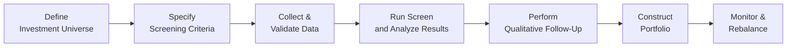

## Introduction
Screening and defining investment styles are at the heart of many equity-based strategies. You know, it's sort of like walking into a bookstore with a specific genre in mind: you want to find something that suits your taste quickly. In equity markets, “taste” might translate to favorable metrics such as a low price-to-earnings (P/E) ratio or a strong dividend yield, depending on the style you’re pursuing. But careful: relying too heavily on just a single screen or a single style can backfire if we miss key qualitative details or changes in market conditions.

This section explores how to employ screening—and how these efforts align with the broad universe of investment styles, from classic value investing to fast-paced momentum strategies. We’ll define these styles, explain how screening criteria can evolve to suit each one, and walk through the best practices (and pitfalls) of implementing screenings in your portfolio management process.

## Understanding Stock Screening

### The Rationale Behind Fundamental Screens
Screening is a systematic method of filtering a large universe of stocks based on either fundamental or technical criteria—or both. In fundamental analysis, common screening metrics include:

• P/E ratio (price-to-earnings)  
• Dividend yield  
• Debt-to-equity (D/E) ratio  
• Price-to-book (P/B) ratio  
• Return on equity (ROE)  

A fundamental-themed screen is often the first step in narrowing down thousands of possible stocks into something more manageable. If you’re a value-oriented investor, you might say: “Show me companies with a P/E below 12, a P/B below 1.5, and a stable or growing dividend yield.” If you lean toward growth, you might search for above-average revenue and earnings growth rates. 

Whatever the approach, one big lesson I’ve learned (the hard way, mind you) is that “garbage in, garbage out” applies just as strongly in screening as in any data-driven process. If the underlying data is flawed, or if it’s delayed or incomplete, the screener’s output won’t help you make a good decision. So data integrity is a must, and that sometimes means verifying data from multiple sources, ensuring up-to-date financial statements, and paying attention to how each data point is defined.

### Incorporating Technical Indicators
While fundamental ratios focus on financial statements and corporate performance, technical indicators look at historical price and trading volume. It surprises some folks to learn that countless portfolio managers combine both fundamental and technical screening criteria. For example:

• 200-day moving average: Checking if a stock is trading above or below its long-term trend.  
• Relative Strength Index (RSI): Identifying overbought or oversold conditions.  
• Volume spikes: Detecting unusual volume to spot potential breakouts or trend reversals.  

Mixing fundamental and technical criteria may allow you to uncover interesting opportunities you might otherwise miss. A growth stock with strong fundamentals might also display favorable trends in RSI or consistently trade above its 200-day moving average, increasing your confidence in the investment thesis. 

### A Quick Flow of the Screening Process



• “Define Investment Universe”: Decide if you are looking at U.S. large caps, global emerging markets, or any other domain.  
• “Specify Screening Criteria”: Choose fundamental, technical, or hybrid filter sets.  
• “Collect & Validate Data”: Ensure the data is recent and accurate.  
• “Run Screen & Analyze Results”: Use software or spreadsheets to identify matches.  
• “Perform Qualitative Follow-Up”: Confirm that findings hold up beyond the data.  
• “Construct Portfolio”: Implement your picks with appropriate weighting.  
• “Monitor & Rebalance”: Re-run the screen regularly and adjust.  

## Investment Style Approaches

### Value Investing
Value investors focus on securities perceived to be underpriced relative to their intrinsic value. Among the hallmark metrics:

• Low P/E, low P/B ratios  
• High dividend yields relative to peers  
• Solid balance sheets with modest debt  

A typical screen for a value investor might look for P/E less than 12, P/B under 1.5, and a minimum 2% dividend yield. The philosophy here is: if you buy a company at a discount, you position yourself for potential gains as the market realizes the stock’s intrinsic worth. From personal experience, flipping through a screen of so-called “cheap stocks” can be exciting—like rummaging through the clearance bin at a store, looking for that hidden gem. 

But pay attention to the “value trap,” where a stock looks cheap due to fundamental business declines or structural issues (like a shrinking industry). The screener won't always catch these issues directly, so a bit of detective work on future growth drivers or new competitor threats is a must.

### Growth Investing
Growth investors seek companies that demonstrate strong earnings growth, revenue expansion, and sometimes a track record of reinvesting profits into the business. A common screen might focus on:

• Revenue growth > 15% (annualized)  
• Earnings per share (EPS) growth trajectory  
• High return on equity (ROE)  

The premise here is that the market will reward companies that expand faster than their peers, even if the current valuation looks a bit steep. Because many growth stocks trade at high multiples, a conventional fundamental screen might exclude them. So you see how the style itself dictates which criteria you emphasize or ignore. Growth investors also have to keep an eye on whether the “high growth” company is financed too heavily by debt—especially relevant in rising interest rate environments.

### Momentum Investing
Momentum strategies hinge on the idea that recent winners tend to keep winning, at least for a while, and recent losers may continue to underperform. Key screening indicators might be:

• Positive price momentum over 6 or 12 months  
• 50-day or 200-day moving average crossovers  
• RSI or other trend indicators  

Momentum screens can be combined with basic fundamental filters, but many pure momentum traders rely heavily on technical signals. Be sure to note that momentum can reverse sharply. One of my earliest kinks with momentum investing was that I once hopped onto a stock near its peak after a long uptrend—only to watch it come down just as fast. So keep risk management tools in place.

### Growth at a Reasonable Price (GARP)
GARP (Growth at a Reasonable Price) merges aspects of value and growth. A GARP investor wants a company with solid growth prospects but at a valuation that isn’t too expensive. One popular GARP metric is the PEG ratio (price/earnings to growth rate). For instance, a PEG ratio below 1 or 1.5 can signal that a company’s growth outlook is not fully reflected in its stock price. 

If the PEG ratio is significantly above 2 or 3, some GARP practitioners might say the stock is overpriced relative to its growth rate. GARP screens often combine growth metrics (like above-average revenue expansion) with moderate valuations (like P/E below a certain threshold).

## Practical Implementation and Best Practices

### Ensuring Data Integrity
Imagine you’ve set up the perfect screen for your chosen style, but the data feed is patchy or unverified. That wonderful short-list of “buy candidates” might be littered with errors. Double-check the following:

• Timeliness: Are you using the latest quarterly financial statements?  
• Consistency: Are P/E ratios calculated the same way across your data sources?  
• Adjustments: Are earnings heavily impacted by one-time events, making the P/E ratio misleading?

Sometimes I’ll cross-verify a critical metric from at least two independent data vendors or do a quick “sanity check” by reading the company’s latest earnings release. The more your style hinges on a specific ratio, the more crucial it is to confirm that ratio’s correctness.

### The Rebalancing or “Re-Run the Screen” Approach
Markets change every day, so a stock meeting your criteria today might not meet it a month from now, or a once-overlooked name might come up next quarter as conditions shift. Re-running the screen with updated data is important. Best practices:

• Decide on a frequency (monthly, quarterly, or semi-annually).  
• Keep track of changes in membership—new entrants and stocks that fall out.  
• Evaluate trades carefully to avoid excessive transaction costs.  

For instance, a quarterly re-screen might be enough for a mid- to long-term value strategy. Momentum investors, on the other hand, might refresh data weekly or even daily. 

### Qualitative Follow-Up
Screening narrows the field, but it seldom completes the due diligence. After you have a short list, do a deep dive: read annual reports, parse management commentary, assess competitive positioning, and consider macroeconomic influences. I remember stumbling on a specialty retailer that looked amazing on the screen—low P/E ratio, zero debt, stable dividend. But a quick conversation with an industry insider revealed that the retailer’s core product was losing favor with consumers. The moral: Don’t skip the interviews or skip the bigger picture, or you might get stuck with a business in a slow decline.

### Risks of Over-Reliance on Backward-Looking Screens
Most screening metrics are inherently historical. A stock’s P/E ratio or revenue growth is a reflection of past performance. If the future looks different—maybe a competitor enters, or the sector experiences a cyclical downturn—these backward-looking metrics can fail to capture forward risks. A robust approach might incorporate:

• Analysts’ consensus forecasts for earnings or revenue  
• Scenario analysis for cyclical sectors (like energy or airlines)  
• Qualitative insights into product pipelines, R&D, or regulatory changes  

Sure, we do occasionally see forward P/E or forward PEG ratios. Yet even forward estimates rely on analysts’ best guesses. Combine these with your own forward insight. And keep your eyes on that bigger narrative.

## Additional Tools and Platforms
Many investment research portals and brokerages offer built-in screeners. For instance, the American Association of Individual Investors (AAII) provides pre-made screens that replicate famous gurus’ strategies (like Warren Buffett, Benjamin Graham, etc.). Third-party tools like FactSet or Bloomberg also have sophisticated screening capabilities, letting you create custom formulas that combine both fundamentals and technicals.

Or, if you’re a data geek, you might roll your own script in Python:

```python
import pandas as pd


filtered_stocks = stocks[
    (stocks['pe_ratio'] < 15) &
    (stocks['dividend_yield'] > 2.0) &
    (stocks['debt_to_equity'] < 0.5)
]

print(filtered_stocks)
```

This snippet is a straightforward example of how we can combine multiple criteria. You can expand it to incorporate market cap, growth rates, or even technical indicators—just import more data columns and build your logic.

## Conclusion
Screening is a powerful starting point for zeroing in on potential investment candidates. By clearly defining your style (value, growth, momentum, or GARP), you can tailor your screens to match your strategy. And once you generate a candidate list, keep doing your homework: examine the data integrity, perform qualitative checks, and remain open to forward-looking considerations.

Used wisely, screening saves time, fosters discipline, and helps you avoid emotional biases—love for a stock’s story might overshadow poor fundamentals, but a purely data-driven approach can keep you honest. At the same time, watch out for over-reliance on screens; they don’t replace in-depth research. Re-run them regularly, factor in changes in market conditions, and always do that gut check. 

---

## Glossary
• Growth at a Reasonable Price (GARP): Strategy merging value and growth ideas, often focusing on the PEG ratio.  
• Screening Criteria: Specific metrics or conditions (fundamental or technical) used to narrow a large stock universe.  
• Technical Indicator: Calculations based on price and volume data that signal potential price movements or trends.  

## References for Further Reading
• Graham, B. (1949). The Intelligent Investor.  
• AAII Stock Screeners: https://www.aaii.com/stock-screens  

If you’re looking to expand your screening insights even more, you might also consult academic resources on factor investing or data analytics, as well as specialized texts on valuation and advanced technical analysis.

---

## Test Your Knowledge: Screening and Investment Style Quiz



### Which of the following fundamental metrics is most commonly used by value investors for equity screening?
- [x] Price-to-Earnings (P/E) ratio
- [ ] Price Momentum
- [ ] Relative Strength Index (RSI)
- [ ] 200-day moving average

> **Explanation:** Value investors typically look at fundamental metrics like P/E or P/B. Technical indicators are typically not the starting point for value-driven approaches.

### A portfolio manager wants to find companies with above-average revenue growth while avoiding extremely high valuations. Which style best matches this goal?
- [ ] Pure Value
- [ ] Pure Growth
- [x] Growth at a Reasonable Price (GARP)
- [ ] Momentum

> **Explanation:** GARP strategies seek growth but watch out for overvaluation, often using metrics like PEG ratios.

### What is a common risk in solely using backward-looking screening metrics?
- [x] Future changes in market or industry conditions may not be captured.
- [ ] It guarantees superior returns only in bear markets.
- [ ] No risk is encountered if the data is recent.
- [ ] It can be used to perfectly time the market.

> **Explanation:** Historical metrics often overlook forward-oriented changes (e.g., new competition, shifting consumer preferences). Blindly relying on them can be risky.

### An investor uses a screener based on 12-month price momentum and RSI. This approach is most consistent with:
- [ ] Value investing
- [ ] Growth at a Reasonable Price (GARP)
- [x] Momentum investing
- [ ] Index investing

> **Explanation:** Price momentum and RSI are primary technical signals used by momentum investors.

### When combining fundamental and technical screening criteria, which of the following would be an appropriate example?
- [x] Selecting low P/E stocks that also trade above their 200-day moving average
- [ ] Selecting stocks strictly based on P/E below 10
- [ ] Using only the RSI to find overbought stocks
- [ ] Buying stocks with negative earnings regardless of price performance

> **Explanation:** Mixing fundamental and technical criteria means you look at items like a low P/E (fundamental) alongside a technical indicator such as the 200-day moving average.

### Why is data integrity so critical for effective screening?
- [x] Inaccurate data leads to misleading results that can undermine the entire investment process.
- [ ] It only matters for high-frequency trading strategies.
- [ ] It matters only when screening for technical indicators.
- [ ] Data integrity is not relevant if you screen frequently.

> **Explanation:** If the underlying data is flawed, your screen’s output will be unreliable, regardless of strategy or frequency.

### Which statement accurately describes GARP (Growth at a Reasonable Price)?
- [x] It blends growth metrics with moderate valuation levels.
- [ ] It focuses exclusively on low P/E stocks.
- [x] Commonly uses the PEG ratio to assess a company’s valuation relative to growth.
- [ ] It excludes all technical indicators.

> **Explanation:** GARP merges the concepts of growth and value, often relying on the PEG ratio. GARP screens might occasionally incorporate other technical or fundamental data.

### When might a manager re-run a screening process more frequently (e.g., weekly rather than quarterly)?
- [x] When implementing a short-term momentum or technical strategy.
- [ ] When the portfolio is strictly value-oriented with a long-term horizon.
- [ ] When the investor does not worry about market volatility.
- [ ] When the investment mandates a buy-and-hold approach for years.

> **Explanation:** Momentum or short-term technical strategies rely on rapidly changing data, so weekly or even daily screening could be more appropriate.

### In a fundamental screen, which of the following should an investor be cautious about when interpreting a low P/E ratio?
- [x] It may be a sign of a value trap if earnings are in decline.
- [ ] It guarantees the stock is undervalued.
- [ ] P/E ratio has no correlation with valuation.
- [ ] It always indicates strong momentum.

> **Explanation:** A low P/E might reflect genuine undervaluation, or it might occur because the company’s earnings are threatened. Investors must investigate further.

### True or False: Qualitative follow-up is unnecessary once you identify a stock through rigorous quantitative screens.
- [x] True
- [ ] False

> **Explanation:** While screening is powerful, it does not replace qualitative due diligence such as management assessment, industry trends, and future outlook.


