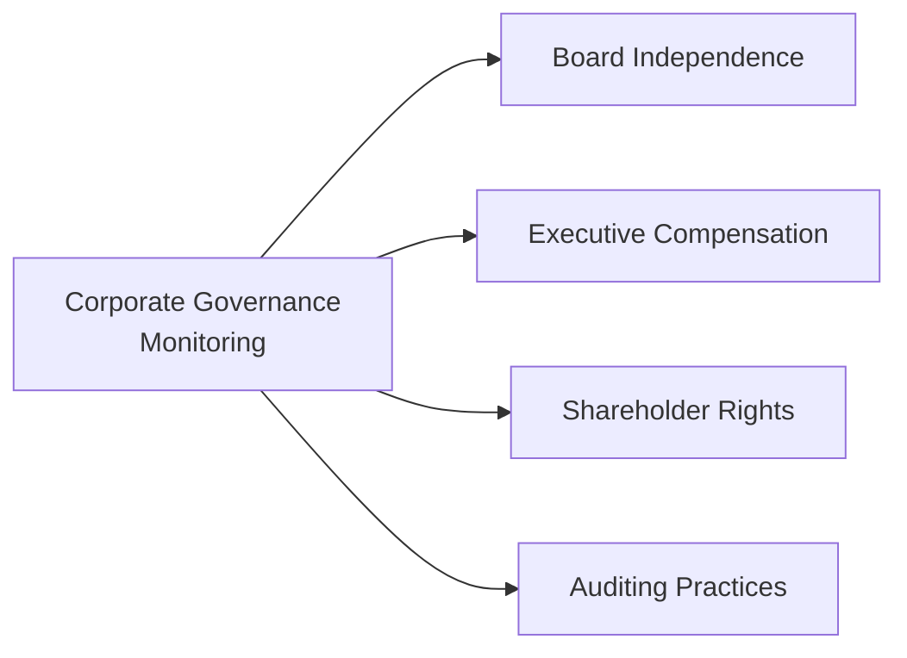

## Introduction

Corporate governance can seem a tad abstract at first, right? I remember when I started analyzing stocks years ago, I mostly cared about the usual stuff—like earnings growth and price multiples—and I sort of shrugged at governance. But then, I realized something: the way a company is directed and controlled has a huge influence on whether it stays profitable and transparent over time. Good corporate governance shapes everything from how conflicts of interest get handled to how big strategic decisions are made. And, ultimately, that matters to us as investors aiming for long-term returns.

In this section, we'll talk about what corporate governance means, why it matters for your equity portfolios, and how you can monitor it on an ongoing basis. Along the way, we’ll look at the typical governance factors, the “G” in ESG, and even some activism strategies large investors use to push for changes in company policies.

## Corporate Governance: The Big Picture

Corporate governance is essentially the system of rules, processes, and controls by which a company is directed. Think of it as the guardrails that keep a firm focused on creating shareholder value in a responsible and sustainable way. It encompasses:

• How decisions get made in the boardroom.  
• How executives are compensated and evaluated.  
• How shareholders can influence important company policies.  

Strong corporate governance aims to balance the interests of all a firm’s stakeholders—shareholders, management, customers, suppliers, financiers, government, and the community at large. Now, we’re focusing primarily on shareholders here, but keep in mind that a holistic perspective also includes employees and society at large.

Good governance practices lower the risk of management entrenchment (like CEOs surrounding themselves with “yes-men”), reduce the likelihood of fraud, and help foster stability. Over the long haul, companies with robust governance structures tend to show more consistent operating performance, because they’re more disciplined with their strategic choices and more transparent in their financial reporting.

## Key Factors in Governance Reviews

For equity investors, there are a few critical governance factors you usually want to keep an eye on. Each factor helps you gauge just how shareholder-friendly (or unfriendly) a company’s environment might be:

• Board Independence: You want directors who can make decisions in the best interest of shareholders, rather than simply deferring to management. A high proportion of outside (or independent) directors, including a chair who isn’t the CEO, can be a good sign.  
• Executive Compensation: Is executive pay aligned with the firm’s long-term performance? Check whether bonuses and stock options encourage risky short-term behavior, or if they truly reflect management’s ability to grow value sustainably.  
• Shareholder Rights: This includes voting rights, the presence (or absence) of anti-takeover provisions, and how easily shareholders can bring proposals to the annual meeting. Dual-class share structures often raise questions about whether management and certain insider groups hold disproportionate power.  
• Auditing Practices: Independent external auditors and strong internal audit functions serve as a check on financial misstatements. Look for red flags like frequent changes in audit firms, qualified audit opinions, or limited disclosures about how the auditing process is overseen by the board’s audit committee.

Below is a simple diagram illustrating these core pillars:

If you find that any of these pillars are weak or misaligned with shareholder interests, you might want to apply a higher risk premium to the company or engage with management to address concerns.

## Linking Governance to Performance and Risk

You might ask, “Does all this board stuff really affect returns?” In fact, plenty of academic and industry research points to a relationship between strong governance practices and long-term investment performance. One classic study by Gompers, Ishii, and Metrick found that firms with robust governance standards had higher equity valuations, better profits, and lower cost of capital over time compared to those with governance concerns.

From a risk perspective, poor governance can lead to conflicts of interest, opportunistic behavior by management, and eventually a decline in market confidence. Companies with insufficient governance structures may also be more prone to reputational harm if controversies arise (e.g., large-scale accounting fraud). By contrast, firms with strong governance are typically more transparent and better at managing economic or regulatory headwinds.

## Framework for Ongoing Governance Monitoring

Let’s say you’ve decided a company’s governance looks good enough to invest. Fantastic. The story doesn’t end there, though—ongoing monitoring is crucial. Generally, this process involves the following steps:

• Reviewing Proxy Statements: Shareholders use proxy voting to express their preferences on board appointments, compensation policies, or major strategic moves, like mergers and acquisitions. Thoroughly review proxy materials and vote in ways that support robust governance.  
• Engagement with Management: Sometimes, a simple conversation can resolve minor governance concerns. Large institutional investors often schedule meetings with board members or executive teams to discuss issues ranging from compensation to environmental disclosures.  
• Activism (If Necessary): If engagement fails, significant shareholders may step up the pressure. Activism can include filing shareholder proposals, nominating alternative directors, or publicly campaigning for strategic changes.  
• Continuous Data Updates: Keep track of governance ratings from external providers (e.g., ISS, Glass Lewis) or any material changes, such as board refreshment, new CEO appointments, or revised compensation policies.

Although activism is often perceived as combative, many institutional investors prefer more collaborative engagement if it yields improvements in company policies without sowing conflict. 

## ESG Integration and the “G” Factor

In ESG (Environmental, Social, and Governance) analysis, the “G” typically stands out as the most directly measurable. For instance, you might quantify governance using:

• Proportion of independent board members.  
• Frequency of board meetings and attendance.  
• Clarity and structure of compensation packages.  
• Existence of shareholder-friendly voting rights.  

Because governance metrics are often more transparent, they’re relatively easier to incorporate into models. A firm might have to elaborate on board structures and voting procedures in regulatory filings, which empowers investors to do side-by-side comparisons.

Moreover, the presence of strong governance can amplify or mitigate E and S issues as well. Companies with a culture of transparency are more likely to proactively address environmental or social challenges and to disclose relevant data to investors.

## The Role of Stewardship Codes

Now, I still remember reading the UK Stewardship Code for the first time and thinking, “Wow, this is basically telling institutions they have to be responsible owners.” Stewardship codes encourage institutional investors—like pension funds and mutual funds—to monitor investee companies actively. They also nudge investors to disclose how they integrate stewardship into their approach. While the UK code is particularly well-known, other jurisdictions (such as Japan, Canada, and many European countries) have introduced their own versions.

For large institutions, aligning with a stewardship code can elevate their governance oversight. The code often recommends engagement with portfolio companies on strategy, risk, and capital allocation. It also discourages “box-ticking” (where you just mindlessly follow governance ratings) and promotes deeper understanding of each company’s unique situation.

## Corporate Governance Research Providers

If all this monitoring starts to feel overwhelming—and trust me, it can be for large portfolios—institutions often rely on specialized research providers and rating agencies. Some well-known examples include:

• Institutional Shareholder Services (ISS)  
• Glass Lewis  
• MSCI ESG Research  
• Sustainalytics  

They provide quantitative governance scores, proxy voting recommendations, or qualitative reports that highlight potential red flags. While these services can be invaluable, it’s always good to remember that no third-party rating is perfect. These providers use their own methodologies, which might not align perfectly with your portfolio objectives. So, use their services as a complement to your own analysis, not a substitute.

## Shareholder Activism Tactics

Activism is like turning up the heat when a company’s governance just doesn’t meet investor standards—or if the market is undervaluing the company due to fixable issues. Activist investors push boards to make changes. This can range from mild to more aggressive tactics:

• “Engage behind closed doors” with management to discuss concerns.  
• Propose shareholder resolutions for a vote at the annual meeting on issues like board diversity, compensation, or strategic pivots.  
• Launch proxy contests to replace board members who resist reforms.  
• Use media campaigns or open letters to gain greater public support.  

Activism often grabs headlines when led by prominent figures (e.g., Carl Icahn, Third Point, or Elliott Management), but it’s not exclusive to hedge funds or ultra-wealthy individuals. Asset managers, pension funds, and even smaller institutional investors can band together or articulate their concerns if they feel strongly about major governance lapses.

## Practical Example: A Hypothetical Board Overhaul

Imagine you’re holding a significant stake in a mid-cap manufacturing firm that’s been underperforming relative to peers. A quick governance check reveals:

• The same CEO has served as the Chair of the board for a decade.  
• The firm has only two independent directors out of seven.  
• Executive compensation continues to climb despite lackluster returns.  
• The firm hasn’t been forthcoming about potential conflicts of interest.

If gentle engagement does not bring about any changes, you might consider a more public form of activism. You could propose adding more independent directors with relevant industry experience, call for splitting the CEO and Chair roles, and push for a compensation plan benchmarked to long-term financial metrics. Over time, if these changes are implemented, you might see improvements in company performance and trust from the capital markets.

## Best Practices and Common Pitfalls

• Maintain Consistency: Align your governance assessment with your investment philosophy. If your strategy is oriented toward sustainable returns, don’t ignore glaring governance issues just because a firm shows near-term profit growth.  
• Avoid Box-Ticking: Governance is not a one-size-fits-all procedure. Relying solely on external rating agencies can miss nuances in a company’s culture and long-term strategy.  
• Monitor Changes: A passing governance grade today could deteriorate if the board or management slacks off tomorrow.  
• Watch for Window-Dressing: Some firms adopt superficial governance measures (like forming committees) just to boast about them, even though they don’t empower these committees to make real changes.

## Exam Tips and Strategies

When tackling corporate governance questions in the CFA exam context, remember to:

• Analyze the scenario thoroughly: Identify the red flags (e.g., Board Chair also being the CEO, excessive compensation).  
• Connect governance to risks and potential impact on equity valuations.  
• Propose recommended actions (like activist strategies or improved practices).  
• Substantiate your answers with references to how governance oversight can enhance company-specific performance.

## Glossary

Corporate Governance  
→ The system of rules, practices, and processes by which a firm is directed and controlled.

Board Independence  
→ The extent to which directors on a corporate board are free from conflicts of interest and can act in shareholders’ best interest.

Proxy Voting  
→ Process by which shareholders vote on corporate matters without being physically present at the meeting.

## References

• CFA Institute, “Environmental, Social, and Governance Issues,” CFA Program Curriculum (2025).  
• Gompers, P., Ishii, J., & Metrick, A. (2003). “Corporate Governance and Equity Prices.” The Quarterly Journal of Economics.  
• UK Stewardship Code: www.frc.org.uk/investors/uk-stewardship-code  

## Test Your Knowledge: Corporate Governance Monitoring in Equity Investments



### Which of the following is a key indicator of strong board independence?

- [ ] The CEO holding both the CEO and Chair roles
- [ ] A board comprised entirely of company insiders
- [x] A significant proportion of outside directors with no conflicts of interest
- [ ] A purely token audit committee

> **Explanation:** Board independence means having outside directors who can provide unbiased oversight. A high proportion of such directors typically aligns with stronger corporate governance.

### Which of the following best describes shareholder activism?

- [x] Investors pushing boards for strategic or governance changes
- [ ] Auditors refusing to sign off on a company’s financial statements
- [ ] A company CEO filing a lawsuit against shareholders
- [ ] Regulators imposing fines for environmental misdeeds

> **Explanation:** Shareholder activism occurs when investors mobilize to effect changes in the company’s governance or operational strategies, often through proposals, proxy contests, or direct engagement.

### Why is “G” often considered the most directly measurable component of ESG?

- [ ] Firms must provide quarterly updates on environmental issues.
- [x] Governance data, such as board composition and voting structures, is typically public and quantifiable.
- [ ] Social initiatives are uniformly reported across all jurisdictions.
- [ ] Auditors disclose their opinions on sustainability metrics.

> **Explanation:** Factors such as board composition, executive pay, and shareholder rights are generally disclosed in filings and are relatively easier to quantify.

### A company that frequently changes its independent audit firm without clear justification may raise concerns regarding:

- [x] Auditing practices and financial transparency
- [ ] Overly empowering external directors
- [ ] Executive compensation aligned with shareholders
- [ ] Excessive board independence

> **Explanation:** Unjustified auditor turnover can be a red flag, suggesting potentially compromised financial reporting or hidden governance issues.

### Which action does NOT typically fall under a corporate governance monitoring framework?

- [x] Buying shares based solely on chart patterns
- [ ] Reviewing proxy statements for major proposals
- [x] Collaborating with other shareholders to file resolutions
- [ ] Engaging in discussions with the board regarding compensation policies

> **Explanation:** A governance monitoring framework involves regular review of governance factors (through proxies, engagement) and activism if necessary. Buying shares on chart patterns alone doesn’t relate to governance.

### Suppose you conducted a governance review of a firm and found that its CEO also serves as Chair of an insufficiently independent board. What approach might an activist shareholder adopt first?

- [x] Engage privately with the board to encourage splitting the CEO and Chair roles
- [ ] Immediately initiate a hostile takeover
- [ ] Call for a boycott of the company’s products
- [ ] File a lawsuit against all board members

> **Explanation:** Many activist shareholders attempt private engagement first, proposing changes before becoming more confrontational.

### Which of the following is a valid rationale for incorporating governance metrics into equity valuation?

- [x] Strong governance often correlates with better risk management and potentially lower cost of capital
- [ ] Governance metrics rarely influence a firm’s cost structure
- [x] Weak governance automatically leads to short-term outperformance
- [ ] Companies with independent boards have higher short interest

> **Explanation:** Strong governance can reduce a company’s risk and enhance investor confidence, potentially lowering its cost of capital and supporting valuation. 

### Stewardship codes mainly aim to:

- [ ] Impose uniform compensation structures across all firms.
- [x] Encourage institutional investors to actively monitor and engage with investee companies.
- [ ] Shift fiduciary duties away from the investor toward regulators.
- [ ] Eliminate the need for independent auditors altogether.

> **Explanation:** Stewardship codes encourage responsible long-term ownership by prompting institutional investors to engage with companies on governance and strategy.

### Which statement about proxy voting is correct?

- [x] It allows shareholders to vote on corporate matters without physically attending the meeting.
- [ ] It is mandatory only when a company issues new shares.
- [ ] It replaces the role of independent directors.
- [ ] It nullifies any board decisions made before the proxy vote date.

> **Explanation:** Proxy voting is a mechanism for shareholders to formally cast votes on board appointments, compensation, or other proposals if they cannot attend the meeting in person.

### True or False: High board independence generally reduces the risk of management entrenchment.

- [x] True
- [ ] False

> **Explanation:** Boards composed of genuinely independent directors are better positioned to provide oversight and challenge management, thereby reducing the potential for entrenchment.


