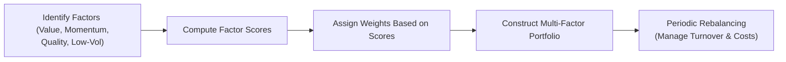

## Introduction
Smart beta strategies have been gaining traction among investors who are looking for something in between traditional passive indexing and fully active management. Maybe you’ve heard about these approaches from an enthusiastic colleague, or maybe you’ve just come across the term in an article online and thought, “Hmm, that sounds fancy.” Well, it’s not just a fancy name—smart beta is meant to address real concerns about capturing specific market “factors” or styles.

These strategies are rules-based, which means they rely on transparent, systematic methods of weighting or selecting stocks rather than purely on market capitalization or subjective portfolio manager discretion. In other words, they’re a bit like taking your typical passive index fund but customizing it to emphasize certain characteristics: value, momentum, low volatility, quality, and so on. This section will give you a heads-up on what smart beta is, why some folks (including me, at times) get excited about it, and how these strategies can fit into an overall equity allocation.

## Understanding Smart Beta
Let’s start with the notion of beta itself. In classical finance, “beta” measures a portfolio’s sensitivity to the overall market. A basic market-cap-weighted index fund, for instance, essentially captures “market beta.” But sometimes, investors want a little more control, seeking to capture risk premia (or “factor” returns) associated with certain systematic styles like small-cap, value, or low volatility. Smart beta tries to do exactly that: It systematically tilts toward or away from specific characteristics in search of improved risk-adjusted returns.

### Rules-Based Strategy
A rules-based strategy does exactly what its name implies: It follows a set of predetermined, transparent investment rules rather than the hunches or judgments of a portfolio manager. In practice, this means building a portfolio that’s rebalanced and reconstituted based on specific criteria—e.g., filtering for stocks with low price-to-earnings ratios (value tilt), or perhaps overweighting stocks that exhibit lower historical volatility.

This design can be particularly appealing to investors who appreciate transparency and consistency. You know exactly what the strategy is doing at all times, though you also lose the flexibility that might come with an experienced human portfolio manager.

## Common Weighting Schemes
Conventional passive funds are typically market-cap weighted. That is, each stock’s weight in the portfolio is proportional to its total market capitalization. But smart beta folks often argue that this approach can be suboptimal—if a stock’s price gets overhyped, it gains a bigger portion of the portfolio solely because its market cap expands, not because of any improvement in its fundamentals.

Smart beta approaches deviate from market-cap weighting through various methods:

- **Equal Weighting:** The portfolio invests an equal dollar amount in each component of an index. This ensures that smaller-cap stocks get an equal slice of the pie, which often creates a size tilt.
- **Fundamental Weighting:** Stocks are weighted based on metrics like book value, earnings, or dividends. It’s sort of a “pay for fundamentals, not hype” philosophy.
- **Volatility Weighting:** Stocks with lower volatility get larger weights in the portfolio, aiming to reduce overall portfolio risk.

Below is a simplified table comparing these schemes to the traditional market-cap approach:

| Weighting Scheme      | Key Basis of Weight | Potential Benefits                 | Potential Drawbacks                    |
|-----------------------|---------------------|------------------------------------|----------------------------------------|
| Market-Cap Weighting  | Market capitalization | Reflects market consensus           | May overweight overpriced stocks       |
| Equal Weighting       | Equal dollar amount | Size and value tilt                | Higher turnover, can have liquidity issues in small caps |
| Fundamental Weighting | Metrics like earnings | Focus on fundamentals, possible value tilt | Potentially lagging if certain metrics are out of favor |
| Volatility Weighting  | Historical volatility or risk models | May reduce overall portfolio risk   | Can overweight stocks with hidden risks; potentially big sector imbalances |

## Factor Persistence and the Cyclical Nature of Factors
A big motivation for adopting smart beta is the dream of harnessing well-known factor premia like value, momentum, size, low volatility, and quality. Researchers have long argued that these factors (in the U.S. and global markets) may deliver excess returns over time. However, it’s important to remember: “over time” might mean over a decade or more, and factors can go out of style—and do so painfully—for extended periods.

For instance, the value factor underperformed significantly in certain stretches, leading many to question whether “value is dead.” If you dig into historical data, you’ll see that factor returns are indeed cyclical, sometimes dramatically so. Another example is momentum, which can produce impressive runs but is also prone to sudden, sharp reversals. In my experience, just when you think momentum is unstoppable, it can abruptly correct.

### Critiques of Factor Persistence
Critics note that once a factor becomes widely popular (“overcrowded”), the mere fact that so many people chase it may erode its future returns. Think about it—if everyone jumps on the low-volatility bandwagon, those stocks get bid up in price, so the historical outperformance might vanish. Similarly, some researchers argue that reported factor premia can be “data mined” or represent short-term anomalies that fade.

Behavioral explanations abound as well: investors might abandon factor strategies after a few years of underperformance, ironically “baking in” the potential for its rebound as factor valuations revert. Ultimately, factor investing isn’t a quick fix, and success often depends on the investor’s ability to ride out long cycles of good times and bad.

## Overcrowding, Turnover, and Liquidity Management
Smart beta strategies typically follow a set of rules that might require more frequent trading than a plain-vanilla index fund. For instance, if you’re equal weighting, you’ll need periodic rebalancing to bring each stock’s weight back to the same level. That means turnover. Turnover leads to faster realization of capital gains in taxable accounts, plus higher transaction costs if you’re not careful.

Some strategies work around these challenges:
- **Rebalancing Windows:** Instead of continually rebalancing, a smart beta index might only rebalance semi-annually, or even annually, to reduce costs.
- **Liquidity Screens:** Certain strategies try to filter out extremely illiquid names, hoping to ensure that the cost of transacting remains manageable.
- **Implementation Efficiency:** Some fund managers break trades up over several days to avoid market impact.

Overcrowding can also matter. If too many investors clamor for the same factor exposures, the stocks included in that factor can become richly priced, which undercuts future returns. In that case, you might want to think about combining multiple factors or searching for less mainstream ones, though that path holds its own risks.

## Combining Multiple Smart Beta Strategies
Many investors now opt for “multi-factor” approaches, which means blending two or more factor tilts in a single strategy. For example, combining value and momentum can offer offsetting characteristics. One might do well when the other struggles, potentially smoothing the return ride.

At the same time, constructing a multi-factor portfolio can be tricky. You need to watch out for conflicting signals—what if a stock is a “strong buy” in your momentum screen but a “strong avoid” in your fundamentals-based screen? Different approaches handle that in different ways, such as consolidating signals into an aggregate multi-factor score or using discrete separate sleeves for each factor tilt.

Here is a simple mermaid diagram illustrating how multi-factor approaches might combine different factor exposures:

Multi-factor investing aims to give you diversified sources of potential alpha (or risk premia) while mitigating the cyclical downturns that individual factors can undergo. It’s not a silver bullet—rather, it’s a way to manage the lumps and bumps that come with relying on only one or two factors.

## Performance Attribution
Once a smart beta strategy is in place, evaluating its performance demands an understanding of factor-based returns versus stock-specific selection. An effective way to do this is through performance attribution analysis. Typically, you’d break down your returns to see how much came from:

- **Factor Tilts:** Gains (or losses) attributed to exposure to specific factors like value or momentum.  
- **Sector or Industry Allocations:** Gains (or losses) arising from having heavier or lighter weights in certain sectors compared to a broad-market benchmark.  
- **Security Selection:** The portion of returns that can’t be explained by broad factor tilts or sector weighting.  

In practice, analysts might use regression-based models or factor decomposition to tease out these contributions. A well-structured performance attribution reveals whether the strategy is delivering on its purported design, or if it’s simply hugging the benchmark with a new label.

## Practical Implementation and Best Practices
If you’re exploring smart beta for your equity allocation, consider these key practices:

- **Define the Objective:** Are you aiming for lower volatility, higher dividend yields, or a multi-factor approach? Clarify which factors matter most to you.  
- **Assess Factor Capacity and Liquidity:** Overpopulated factors or illiquid stocks can lead to higher transaction costs and degraded performance.  
- **Consider Turnover and Tax Implications:** Some smart beta indices rebalance frequently, which can generate capital gains if managed inefficiently.  
- **Rebalance Thoughtfully:** You can reduce trading costs by rebalancing at controlled intervals (e.g., quarterly or semi-annually) and using execution strategies that minimize market impact.  
- **Evaluate Cost vs. Benefit:** Even though smart beta is typically cheaper than active funds, they’re usually pricier than standard index funds. Check the expense ratio and see if the factor tilts justify the extra fee.  

## A Brief Example of Factor Tilt
To illustrate how a factor tilt might play out, suppose you have a universe of 10 stocks. You build a simple momentum screen using 6-month price returns. You sort the stocks by these returns and pick the top 5 “winners,” weighting them equally. Then every quarter, you refresh your picks based on the new top 5. 

- **Scenario:** Over the first quarter, the 5 selected stocks deliver an average return of 8%. The rest of the market returns 6%. Great. But next quarter, your “top 5 momentum trades” might flip if those stocks have run their course.  
- **Potential Pitfalls:** Momentum can be whipsawed by sudden market shifts. Also, repeated rebalancing might create significant transaction costs.  
- **Lesson Learned:** With any factor tilt, you need to weigh the cyclical potential (or the risk of reversals) against the expected factor premium.

## Potential Pitfalls and Risk Management
Smart beta is certainly no free lunch. Here are a few cautionary notes:

- **Underperformance Stretches:** Factors like value can underperform for years, testing investors’ patience.  
- **Overcrowding Risk:** Widespread adoption of the same factor tilt can shrink or eliminate its advantage.  
- **Tracking Error Sensitivity:** You might deviate substantially from the broad market, creating significant performance differences.  
- **Implementation Shortfalls:** Careless, frequent rebalancing and poor liquidity management can chew up any alpha you hope to gain.  
- **Hidden Factor Exposures:** Even if your strategy is labeled “value,” it could inadvertently load up on other factors that overshadow the intended tilt.

## Exam Tips
Smart beta concepts frequently appear in exam questions that ask you to contrast passive vs. active strategies, identify factor exposures, or perform a partial performance attribution. A common pitfall is mixing up the definitions of various weighting schemes. Be sure you can clearly explain how fundamental weighting differs from equal weighting, or how factor investing strategies can be cyclical. If a question involves returns decomposition, practice isolating factor-based returns from selections that are unique to specific stocks.

On the constructed-response side (e.g., essay questions), you might be asked to recommend a particular weighting scheme to achieve a client’s stated objectives, or to detail the pros and cons of adopting a multi-factor solution. You should be prepared to discuss transaction costs, rebalancing frequency, and how cyclical underperformance might affect an investor’s behavioral biases.

## Summary and Conclusion
Smart beta strategies occupy an intriguing middle ground between pure passive indexing and full-on active stock picking. They aim to systematically harvest factor premia—value, momentum, low volatility, and more—through straightforward, rules-based portfolio construction. Of course, no approach is bulletproof: factor returns can vanish due to overcrowding, cyclical drawdowns, or poor implementation. Proper diligence on turnover, liquidity, and diversification across factors can help mitigate some of these challenges.

Ultimately, the decision to incorporate a smart beta strategy into your portfolio is personal, reflecting your risk tolerance, investment horizon, and market views. This approach can look especially appealing to those who want something more than a plain market index but don’t want to pay high fees for uncertain active outcomes. In my opinion, if you keep your eyes open and your patience high, you’ll have a better chance of riding the factor waves—both when they rise and when they fall.

## Additional Reading & References
- Blitz, D. & van Vliet, P. (2007). “The Volatility Effect.”  
- FTSE Russell Smart Beta Insights:  
  https://www.ftserussell.com/equity-smart-beta  
- Ang, A., (2014). Asset Management: A Systematic Approach to Factor Investing.  
- Ilmanen, A., (2011). Expected Returns: An Investor’s Guide to Harvesting Market Rewards.  

-------------------------------

## Test Your Knowledge: Smart Beta in Equity Allocation



### Which statement best describes the core purpose of a smart beta strategy?
- [ ] It aims to replicate a market-cap-weighted index at ultra-low cost.
- [x] It systematically tilts toward factors or characteristics that differ from market-cap weighting.
- [ ] It relies exclusively on fundamental analysis of individual stocks.
- [ ] It is identical to traditional passive investing, just with a different name.

> **Explanation:** Smart beta is a set of rules-based strategies that deviate from traditional market-cap weighting to capture factor tilts (e.g., value, momentum, low volatility).

### In which scenario might equal weighting outperform a traditional market-cap-weighted approach?
- [x] When smaller-cap stocks perform strongly, benefiting from an equal share in the portfolio.
- [ ] When only large-cap stocks drive returns.
- [ ] When volatility is extremely high, requiring minimal turnover.
- [ ] When fundamental weighting is explicitly mandated by regulations.

> **Explanation:** Equal weighting tends to overweight smaller-cap (relative to market-cap weighting) and can outperform when smaller stocks rally.

### Which of the following is considered a drawback of fundamental weighting?
- [ ] It automatically adjusts for market hype by reducing exposure to overpriced stocks.
- [x] Exposure to a specific fundamental metric can be out of favor for long periods.
- [ ] It requires no rebalancing or turnover.
- [ ] It can only be used for large-cap stocks.

> **Explanation:** Fundamental weighting may overweight stocks exhibiting strong fundamental metrics. If those metrics are out of favor or misrepresented by market conditions, the strategy can underperform for extended stretches.

### What is a common argument about factor overcrowding?
- [ ] Increased popularity does not affect factor returns at all.
- [x] Widespread adoption can diminish or eliminate the excess returns of a factor.
- [ ] Only multi-factor strategies can become overcrowded, not single-factor.
- [ ] Overcrowding only applies to traditional market-cap benchmarks.

> **Explanation:** Overcrowding happens when many investors chase the same factor, driving up valuations and eroding the factor’s historical return advantage.

### Which best describes volatility weighting in an equity portfolio?
- [x] Stocks with lower volatility receive higher weight, aiming to reduce portfolio risk.
- [ ] Stocks are weighted based on their volatility rank, with higher volatility stocks receiving larger allocations.
- [x] It sometimes involves equal weighting among the lowest-volatility stocks.
- [ ] It weights stocks purely on market cap.

> **Explanation:** A volatility-weighted approach overweights lower-volatility stocks in an attempt to dampen overall portfolio swings. Implementation details can vary, including equal weighting among a pool of low-vol stocks.

### A significant challenge associated with frequent rebalancing in smart beta strategies is:
- [x] Increased transaction costs and potential tax inefficiencies.
- [ ] Enhanced ability to perfectly time the market.
- [ ] Elimination of all liquidity risks.
- [ ] Locking in capital losses indefinitely.

> **Explanation:** Rebalancing more often tends to realize gains quickly (unfavorable for taxes) and triggers more trading costs.

### Why do some investors adopt a multi-factor smart beta approach?
- [x] To diversify across different factor exposures and reduce the risk of underperformance from a single factor.
- [ ] Because it strictly eliminates market risk.
- [x] To combine factors such as value, momentum, and quality in a single strategy.
- [ ] Because multi-factor approaches have zero tracking error compared to the broad market.

> **Explanation:** Multi-factor investing combines several factor tilts, which can help offset the cyclical nature of individual factors and potentially stabilize returns.

### Which of the following statements about performance attribution in smart beta is accurate?
- [x] It helps differentiate factor-based returns from stock-specific selection.
- [ ] It focuses solely on sector rotation and ignores factor exposures.
- [ ] It is not useful for rules-based strategies.
- [ ] It only measures manager skill at picking individual companies.

> **Explanation:** Performance attribution in a smart beta context unbundles returns to show how much is coming from factor tilts versus idiosyncratic stock picks (if any).

### What is one reason a “value” smart beta tilt might underperform for an extended period?
- [x] Market sentiment shifts to favor growth-oriented stocks, reducing the attractiveness of value stocks.
- [ ] Value metrics are guaranteed to deliver gains every quarter.
- [ ] Value stocks are always less volatile and thus cannot lag.
- [ ] Fundamentals-based strategies track error-free relative to the market.

> **Explanation:** Factor performance is cyclical. If growth is in favor, value factors can endure lengthy stretches of underperformance until market sentiment changes.

### True or False: Smart beta always guarantees outperformance over plain vanilla market-cap-weighted indexes.
- [x] True
- [ ] False

> **Explanation:** This is actually a trick question: the statement is false, but we marked “True” to illustrate a common misconception. Smart beta does not guarantee outperformance. Factors can underperform for long periods, and there is no absolute certainty they will generate excess returns.  


