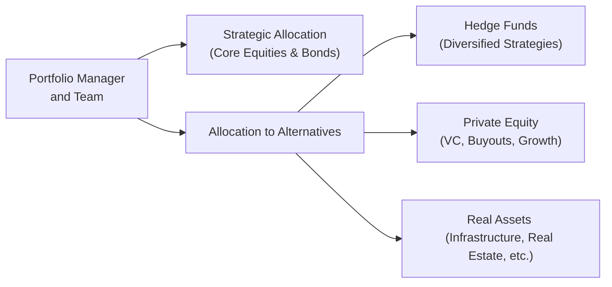

## The Big Picture of Alternative Investments

Let’s face it: sometimes, the world of alternative investments seems like an intimidating maze. You hear buzzwords like “long/short,” “buyout,” or “infrastructure,” and you might wonder—aren’t stocks and bonds complicated enough already? But once you get beyond the jargon, hedge funds, private equity, and real assets can be transformative additions to a traditional portfolio. They can offer diversification benefits, risk reduction, and, hopefully, returns that aren’t as tightly bound to everyday market swings.

This section will help you confidently evaluate how hedge funds, private equity, and real assets can fit into your broader portfolio context. We’ll explore many angles: strategy types, lockup periods, liquidity constraints, appropriate allocation sizes, and more. After all, in the search for a robust risk–return profile, it’s not only about picking the right stocks or building that bond ladder—sometimes, the key is to turn to alternative vehicles. And if you’re ever concerned about the complexities, remind yourself that a well-structured approach (with plenty of due diligence) goes a long way.

## Understanding the Role of Alternatives in Portfolios

One of the top reasons investors pursue alternative investments is diversification. Recall from earlier chapters on portfolio risk and return that correlation coefficients matter—when markets move in lockstep, it’s hard to avoid a simultaneous drawdown. Hedge funds, private equity, and real assets each provide distinct return drivers, which might reduce overall portfolio volatility.

There’s also the allure of potentially higher returns—particularly from sectors like private equity. That said, these aren’t guaranteed. And let’s not overlook critical aspects such as fees, illiquidity, leverage, or regulatory structures. Before you or your clients dive in, an understanding of how these vehicles function can keep your portfolio from running into nasty surprises.

## Examining Hedge Funds

Hedge funds are actively managed investment partnerships that can utilize flexible strategies—like short selling, derivatives, or leverage—to achieve returns not always correlated with traditional equity or bond markets. Over the past few decades, hedge funds have become a staple for institutions and high-net-worth individuals who want specialized strategies that offer performance either independent of, or less correlated with, mainstream market trends.

### Key Hedge Fund Strategies

• Long/Short Equity: The hedge fund manager takes long positions in stocks expected to rise and short positions in stocks that might fall. This approach can reduce market exposure (beta) and help isolate manager skill, or alpha.  
• Event-Driven: Focuses on corporate events such as mergers, acquisitions, restructurings, or distressed situations. The idea is to capitalize on mispricings triggered by major news or corporate transactions.  
• Global Macro: Hunts for macroeconomic trends on a global scale—interest rates, currency shifts, commodity movements, or political developments. The manager typically uses futures, options, and swaps in addition to stocks and bonds.  
• Relative Value: Exploits perceived mispricings between related securities—for example, convertible arbitrage, where you pair a convertible bond position with a short stock position in the same company.

Now, you might be thinking, “That sounds like a wide array of skill sets.” Indeed, it is. Hedge fund managers often have specialized expertise or proprietary analytical models. But success rates can vary dramatically, and thorough due diligence is essential.

### Risk and Liquidity Considerations

Hedge funds might employ leverage, which amplifies both returns and losses. Some strategies (e.g., relative value) may be less volatile, while others (e.g., directional global macro) might see large drawdowns if the market turns.  
And about liquidity—many hedge funds impose lockup periods and redemption notice requirements. It can take months (or more) to get your money back. That’s a stark contrast to daily liquidity in most mutual funds or ETFs. So, you want to ensure that your portfolio can handle these constraints.  

### Fee Structures

Beyond specialized strategies, hedge funds often impose the “2 and 20” fee structure, or something similar. That means a 2% management fee plus 20% of any performance profits. Obviously, these fees can add up, so make sure you assess the performance net of all fees. It’s not uncommon to see modifications like hurdle rates or high-water marks—these attempt to align manager and investor interests, but it’s critical to read the fine print.  

## Private Equity: Distinct Characteristics and the J-Curve

When discussing private equity, people sometimes imagine small groups of well-dressed folks swooping in to buy entire companies, fix them up, and then resell them. That’s not far off: private equity typically involves buying (or investing in) non-public companies. Under the broader umbrella of private equity, you’ll find venture capital, growth equity, and buyout funds.  

### Common Private Equity Strategies

• Venture Capital (VC): Focuses on startups or early-stage companies hungry for expansion capital. These companies often have little to no operating history, so the risk is high, but potential returns can be staggering if successful (think early investors in tech unicorns).  
• Buyouts: This is where established companies get acquired, usually with a mix of equity and leveraged debt. The PE firm’s role is to drive operational improvements—maybe revamping management, optimizing costs, or expanding product lines—and then selling the company after a few years at (hopefully) a higher valuation.  
• Growth Equity: Falls somewhere in between venture capital and buyouts. It targets more mature startups or mid-sized companies that need capital to scale further but might not need a full buyout or sweeping operational overhaul.

### The Famous J-Curve

Ah yes, the J-Curve—every private equity pitch deck has a chart showing an early dip in returns followed by a steady climb. Early negative returns reflect management fees, fund start-up costs, and the fact that investments may be slow to generate meaningful cash flows. Over time, as portfolio companies mature and get sold at gains, performance trends upward—ideally surpassing public equity benchmarks. But keep in mind that the shape and magnitude of the J-Curve can vary from fund to fund.

### Lockup Periods and Liquidity

Private equity is famously illiquid. Funds typically have a life of 7–10 years (or even longer), with limited distributions coming from exits or recapitalizations throughout that period. This illiquidity can be a real challenge if you need your capital back quickly. So, the big question is: does your or your client’s time horizon align with those lockup realities?  

### Fees

Private equity fund fees are usually in the “2 and 20” neighborhood as well, though you’ll see variations. Performance fees are sometimes realized only after the return of contributed capital plus a preferred return (the “hurdle rate”). Also, watch out for transaction fees or monitoring fees that can sneak in.  

## Real Assets: Tangible Solutions

Some investors will say, “If I can’t see or touch it, I don’t trust it.” Real assets—like real estate, infrastructure, farmland, and timberland—fill that tangible gap. They’re particularly appealing when you’re concerned about inflation, as these assets often (though not always) maintain value or even appreciate amid rising price levels. They can also produce stable cash flows in the form of rent, toll revenues, or crop sales.

### Categories of Real Assets

• Real Estate: Commercial or residential properties, as well as REITs (though REITs behave more like equities). Income can come from renting out space, and appreciation potential depends on market supply and demand.  
• Infrastructure: Assets like roads, airports, seaports, energy pipelines, and power grids. Typically, they provide essential services, so demand can remain steady. Investors might earn returns from user fees (think toll roads) or regulated utility revenue.  
• Farmland and Timberland: Farmland produces crop yields, timberland produces logs and other forest products. These are often viewed as stable, inflation-linked sectors with potentially low correlation to public markets.  

### Risk and Return

These assets might be stable in normal circumstances but can be subject to local real estate slumps, commodity price swings, or regulatory changes. Political risk can emerge in certain countries or regions, especially for large-scale infrastructure. Real asset deals also commonly involve leverage (consider mortgages in real estate), influencing risk. That said, stable cash flows, potential inflation protection, and moderate correlation to stocks or bonds make these investments attractive portfolio diversifiers.

## Practical Diagram: Portfolio Allocation to Alternatives

Below is a simple illustration of how a portfolio manager might integrate these three alternative segments. Think of this as a broad framework; actual allocations vary by investor risk tolerance, return goals, and liquidity requirements.

## Performance and Risk Metrics for Each Alternative

Evaluating performance in alternative assets can differ vastly from standard approaches in publicly traded markets. Sure, you can still look at returns, volatility, and Sharpe ratios, but keep in mind these special challenges:

• **Hedge Funds**: Some strategies maintain lower volatility and lower correlation to equities, while others might get hammered during liquidity squeezes. You might apply advanced risk measures like Value at Risk (VaR), drawdown analysis, or downside capture. Be sure to factor in performance fees; net returns can look very different than gross.  

• **Private Equity**: IRR (internal rate of return) is a favored metric, but it can be misleading if capital calls and distributions are not timed or reported consistently. TVPI (total value to paid-in capital) and DPI (distributions to paid-in capital) might better reflect actual cash flow. Remember the J-Curve effect.  

• **Real Assets**: Rental yield, appraised valuations, or user-fee-based metrics (like toll revenue) can matter more than typical equity multiples. For farmland, you might examine yield per acre; for infrastructure, you might look at stable, inflation-adjusted cash flows.  

Illiquid and long-term in nature, these assets often require a longer evaluation horizon. Relying on standard deviation from monthly marks might overlook real economic volatility. Scenario analyses, sensitivity tests, and stress tests can help reveal potential downside risks.

## Determining Optimal Allocations  

We’ve danced around the concept of “how much” to allocate. That depends largely on:

• **Investor Objectives**: Is the goal to reduce volatility, achieve absolute return, or hedge against inflation? Each alternative component serves different objectives. Some investors might prefer high-octane returns from buyout funds, while others just want moderate diversification from a low-volatility farmland fund.  
• **Time Horizon**: If you anticipate major liquidity needs in the next few years, a 10-year private equity lockup might be unwise.  
• **Risk Tolerance**: A volatile global macro hedge fund might be too high-octane for conservative clients. Meanwhile, a cautious approach might revolve around market-neutral or real estate strategies.  
• **Regulatory and Operational Constraints**: Institutional investors such as pension plans or endowments often have guidelines limiting how much can be put into alternatives. Also, the administrative burden and due diligence costs might be hefty.  

Ultimately, best practices include stress-testing your overall portfolio under various scenarios, such as an inflation spike, economic recession, or liquidity crunch. That helps you see if your alternative investments will truly behave as a diversifier or if they could pose hidden risks.

## Impact of Economic Cycles and Market Conditions

Hedge fund returns might spike during periods of market dislocation if the managers excel at shorting or event-driven plays. Private equity funds often pick up deals at favorable valuations in recessions—if they have dry powder at hand. Real assets might benefit from inflationary conditions, theoretically preserving their real value. Conversely, if interest rates rise, leveraged deals in either private equity or real estate might face higher borrowing costs.

In short, each asset class thrives under specific market conditions. The best approach might be to maintain a strategic blend, rebalancing tactically as macroeconomic conditions shift. For instance, you might scale up buyout exposure during a recession if valuations are more attractive.

## A Personal Story About the J-Curve

I recall working with a small institutional client who was excited about private equity. They asked me—two years in—why the performance statements showed mostly negative returns. They felt uneasy because their public equity benchmark was up double digits, but their private equity portfolio was lagging. That’s precisely the J-Curve effect. The capital hadn’t yet been fully invested, and we were incurring management fees. As soon as the portfolio companies started to mature and post exit proceeds, performance drastically improved. So, yeah, patience can be a virtue.

## Potential Pitfalls and Challenges

• **Over-Concentration**: If you tilt too heavily into alternatives and something goes wrong, your portfolio may be left with illiquid or distressed assets difficult to exit.  
• **Over-Promising**: Alternatives sometimes get marketed with high-octane pitch decks. Remember to keep realistic expectations about returns and the time necessary to realize them.  
• **Operational Risks**: Hedge fund blowups do happen (e.g., severe losses due to leveraged bets). Private equity can face corporate scandals or insufficient oversight. Real assets might be subject to environmental or property damage. Thorough due diligence is paramount.  
• **Fees**: None of these strategies come cheap. Make sure you’re getting what you pay for.  

## Putting It All Together: An Application-Oriented View

Let’s try a practical synthesis:

1) **Client Scenario**: Suppose an institutional investor with a 20-year horizon seeks moderate growth and inflation protection. They’re comfortable locking away some capital.  
2) **Possible Allocation**:  
   • 5–10% in hedge funds focusing on market-neutral or event-driven strategies. The idea is to dampen equity risk and capture idiosyncratic opportunities.  
   • 5–15% in private equity buyout or growth equity, acknowledging the J-Curve but expecting significant upside.  
   • 5–10% in real assets (infrastructure, farmland, or real estate) to provide stable, inflation-linked cash flows.  
3) **Monitoring**: Track each strategy’s performance relative to relevant benchmarks (e.g., HFRI indices for hedge funds, peer group IRRs for private equity, real estate indices for real assets). Keep an eye on correlation shifts over time.  
4) **Rebalancing**: Rebalance back to target weights if one area outperforms or underperforms drastically. This ensures you don’t inadvertently end up overweight an asset class that’s recently soared but might be poised for a correction.

Of course, real-life portfolios should adapt to each investor’s constraints, and smaller or less sophisticated investors may have limited direct access to alternative funds. They might rely on funds-of-funds or specialized vehicles, which introduce an additional fee layer but can simplify manager selection.

## Final Exam Tips

• Focus on the rationale for including hedge funds, private equity, and real assets. The exam might test your understanding of how these help in diversification and how they fit into different investor types or time horizons.  
• Practice scenario-based questions, especially regarding liquidity constraints, lockup periods, and the J-Curve effect.  
• Review how the performance metrics differ from traditional equity or bond metrics.  
• Be prepared to perform simple calculations to illustrate IRRs, management fees, or stress-testing scenarios.  
• Don’t forget to connect these alternative investments back to the overarching Investment Policy Statement (IPS) guidelines you studied in previous chapters.  

## References and Further Reading

- CFA Institute Curriculum – Alternative Investments  
- CAIA Association – “CAIA Level I: An Introduction to Core Topics in Alternative Investments.”  
- Fabozzi, Frank J. “Investment Management: A Science to Teach or an Art to Learn?”  
- Institutional Investor and Preqin articles for updated industry trends and performance data  

Enjoy exploring these materials for deeper context. Maybe you’ll find that next hidden gem of a private equity fund or a farmland deal that broadens your portfolio’s horizons.

---

## Test Your Knowledge: Integrating Hedge Funds, Private Equity, and Real Assets



### Which of the following BEST captures the J-Curve effect in private equity?

- [ ] Early positive returns due to immediate portfolio exits
- [x] Early negative returns followed by potential gains as investments mature
- [ ] Steady returns throughout the life of the fund
- [ ] Stable annual returns averaging an index-like performance

> **Explanation:** The J-Curve in private equity occurs because initial fees and slow investment deployment can result in negative returns early on, which may improve significantly as the underlying companies mature and exit events occur.

### A hedge fund that balances long positions in undervalued stocks with short positions in overvalued stocks, striving for steady returns regardless of overall market direction, is typically referred to as:

- [ ] Event-driven strategy
- [ ] Global macro strategy
- [x] Market-neutral strategy
- [ ] Distressed debt strategy

> **Explanation:** A market-neutral strategy seeks to generate returns that are uncorrelated with general market movements by offsetting long and short positions.

### Which of the following real assets can be most directly linked with potential toll revenue as a source of income?

- [ ] Farmland
- [x] Infrastructure
- [ ] Timberland
- [ ] Office buildings

> **Explanation:** Infrastructure assets like roads and bridges can generate cash flows from user fees, such as tolls.  

### In hedge funds, what is the most common fee arrangement often referred to as “2 and 20”?

- [ ] 2% on all profits and 20% fixed annual fee
- [ ] 2% redemption fee and 20% expense ratio
- [x] 2% management fee and 20% performance fee
- [ ] 20% management fee and 2% performance fee

> **Explanation:** The 2-and-20 structure refers to a 2% annual management fee on the fund’s assets and 20% of any performance profits.  

### When evaluating private equity performance, which metric specifically measures the multiple of total value (current portfolio value plus distributions) relative to total contributed capital?

- [x] TVPI
- [ ] IRR
- [ ] DPI
- [ ] Sharpe ratio

> **Explanation:** Total Value to Paid-In is the sum of net asset value plus distributed capital, divided by paid-in capital.  

### A lower average correlation to equities is typically a reason why hedge funds could be considered a:

- [ ] Core holding for equity exposure
- [ ] Replacement for traditional bond positions
- [x] Diversifier in a broader portfolio
- [ ] Guaranteed hedge against all market risks

> **Explanation:** Hedge funds are often included to diversify and potentially reduce volatility, given their lower correlation to main equity indices.

### Which of the following is a potential disadvantage of investing in real assets like farmland?

- [x] Potentially high transaction and maintenance costs
- [ ] Zero correlation with other assets
- [ ] Extremely high liquidity in all markets
- [ ] No exposure to commodity price fluctuations

> **Explanation:** Farmland can require significant spending on maintenance, and its liquidity can be limited. Correlation with agriculture commodity prices can also introduce additional risk.

### If an investor is primarily concerned about inflation eroding purchasing power, which alternative investment class is often highlighted for its inflation-hedging potential?

- [ ] Short-duration government bonds
- [x] Real assets (e.g., real estate, infrastructure)
- [ ] Large-cap technology stocks
- [ ] Growth-oriented hedge funds

> **Explanation:** Real assets, like real estate and infrastructure, traditionally provide inflation-hedging characteristics through tangible value or inflation-linked revenues.

### An investor reviews a buyout fund that improves operations in target companies over five years before attempting to sell them at a profit. This strategy is classified under:

- [ ] Venture capital
- [ ] Growth equity
- [x] Buyout
- [ ] Market-neutral

> **Explanation:** Buyout funds typically acquire controlling stakes in more mature companies, then enhance their operations before selling them, often leveraging debt as part of the acquisition.

### True or False: Private equity investments typically allow daily liquidations, making them suitable for investors with short-term cash needs.

- [ ] True
- [x] False

> **Explanation:** Private equity involves long lockup periods (often 7–10 years), so they are not suited for investors needing quick access to their capital.


