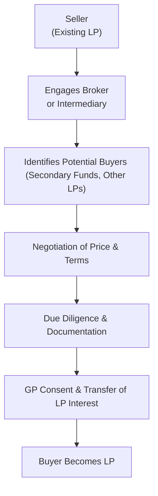

## Introduction
Sometimes life (and investing) throws curveballs. Perhaps you’ve committed to a private equity (PE) fund that locks up your money for 10 years. Then, 4 years in, you suddenly need cash for another opportunity—or, honestly, you just need the liquidity. In the old days, you might have had to wait for the fund to wind down or for a distant liquidity event like a portfolio company going public. But guess what? You don’t have to be so patient anymore. That’s where secondary markets for private equity interests come in. These markets give you—an existing limited partner (LP)—the option to sell your stake in a PE or hedge fund to another investor. And for buyers, it offers a chance to pick up a stake in an established fund without the dreaded “blind pool risk.”

Secondary markets have boomed over the past few decades. The concept is straightforward but the practicalities can be complex. Prices might reflect net asset value (NAV) plus or minus some discount or premium, dependent on supply and demand, perceived risk, the track record of the general partner (GP), and seriously, anything else the participants deem important. In this article, we’ll walk through how these secondary transactions work, who’s typically involved, the pros and cons for both buyers and sellers, and how they can fit into broader portfolio management strategies. We’ll also touch on specialized funds that stand ready to help with these transactions. If you’re prepping for your CFA, this topic hits the sweet spot between theoretical frameworks and real-world investing.

## The Rise of Secondary Markets
It might feel like secondary markets for PE interests have always been around, but the reality is they’ve matured relatively recently. Back in the day, private equity was super illiquid. That illiquidity was almost part of its allure: think patient capital, locked up for years, offering risk-bearing investors the potential for outsize gains.

But as the private equity universe expanded—both in the number of funds and the sheer amount of capital involved—there was greater demand for liquidity possibilities. A limited partner who was “stuck” had only a few low-key channels: maybe find a friendly buyer in the shadows or entreat the GP for an early redemption. Yikes, not ideal. As more institutional investors piled in, the market needed a more standardized, transparent means to buy and sell LP interests. And so, the secondary market blossomed, accelerating in the 2000s and continuing to evolve today.

## Motivations for Buyers and Sellers
The fundamental driver of any market is the combination of motivations from both buyers and sellers.

### Sellers’ Perspective
• Liquidity Needs: Sellers often need immediate cash due to shifts in organizational priorities, rebalancing mandates, or unforeseen capital requirements.  
• Portfolio Rebalancing: Large institutions might aim to reduce overexposure to certain strategies, vintages, or sectors.  
• Regulatory Requirements: Some LPs, such as banks or pension funds, might have new constraints placed on them that make continuing to hold illiquid assets less feasible or more expensive from a capital charge perspective.

Imagine an endowment fund that has seen major inflows into private equity over the last five years. Its allocation policy states that private equity shouldn’t exceed 25% of the total portfolio. If the rest of the portfolio underperforms or if the private equity portion spikes in valuation, the endowment might choose to sell some of these stakes. By selling on the secondary market, they can quickly reduce their allocation.

### Buyers’ Perspective
• Reduced Blind Pool Risk: By purchasing a stake in a more seasoned private equity fund, you can analyze the existing portfolio companies rather than blindly committing to future unknown deals. This effectively reduces—though doesn’t eliminate—you know, that intangible sense of uncertainty.  
• Access to Mature Portfolios: If the fund is a few years in, it might be at the stage where value creation is accelerating. A buyer could potentially step into a near-term liquidity event.  
• Potential Pricing Advantage: Secondary interests can trade at a discount (or premium) to net asset value. Buyers might see these discounts as an opportunity to acquire assets at less than their intrinsic value, especially if the seller is motivated.

## Pricing Dynamics
Pricing in secondary transactions can be tricky. Everybody’s heard the phrase “NAV discount,” which references the difference between a fund’s stated net asset value and the actual price a secondary buyer is willing to pay. If a seller seems desperate or if the market is quite flooded with folks trying to sell, the discount can be large. Conversely, if a fund is performing extremely well, or if supply is thin, premiums above NAV are possible—though historically it’s more common to see trades at a discount.

Let’s highlight a notional approach to pricing:


\text{Price} = \text{NAV} \times (1 - \text{Discount\%}) 


If the NAV is $100 million and the market discount is 10%, the purchase price might be $90 million. That difference, in principle, factors in potential future capital calls, projected distributions, and the risk of the underlying portfolio. But keep in mind: many intangible factors—like the GP’s credibility, the level of fund diversification, or even macro trends—affect the final negotiated price. One buyer’s 10% discount might be another buyer’s 15%.

## Transaction Mechanics and Key Steps
It’s not like buying shares of Apple on an exchange—there’s no big electronic marketplace for private equity interests that’s publicly accessible. Many deals are negotiated privately, facilitated by specialized brokers, or matched through online platforms that cater to institutional investors. Let’s break down the main stages:

• Initial Market Outreach: A prospective seller sounds out potential buyers, typically through an intermediary or broker. Confidentiality is crucial because the GP and the portfolio’s sensitive information are at stake.  
• Buyer Due Diligence: The buyer examines the fund’s documentation, existing assets, distribution history, remaining unfunded commitments, and any side letter provisions.  
• Negotiation of Price and Terms: The buyer and seller converge on a price, typically referencing the last quarterly NAV plus or minus a discount, with adjustments for subsequent capital calls or distributions.  
• GP Consent: Most limited partnership agreements (LPAs) require the general partner’s consent to transfer LP interests. GPs might block a sale or impose conditions if it contravenes fund guidelines.  
• Legal Documentation: After finalizing the purchase agreements, the transfer closes, and the buyer steps into the seller’s shoes as an LP.  

In short, it can be an intricate dance. I once saw a secondary negotiation that took six months solely because the seller was a public pension plan facing some legislative constraints. The buyer ended up with a decent discount, but the complexity was immense.

## Mermaid Diagram: A Typical Secondary Transaction Flow

## Specialized Secondary Funds
The development of secondary markets has spurred the growth of specialized secondary funds. These funds are set up to exclusively purchase existing LP interests or orchestrate GP restructurings. Some strategies include:

• Stapled Secondary: A scenario in which a buyer purchases existing interests while also committing to the GP’s new fund. This can sweeten the deal for the GP, who is eager to launch a follow-on vehicle.  
• GP Restructuring: Sometimes, a GP wants to extend an older fund that hasn’t fully realized its investments. They might strike a deal with a secondary buyer, providing an option for existing LPs to cash out, while the fund continues with fresh capital.  
• Fund Liquidation: If a fund is in wind-down mode, a secondary buyer may acquire the remaining assets, effectively speeding up the distribution timeline for legacy LPs.

These specialized funds have become sophisticated, using advanced valuation models and employing teams of analysts to price deals properly. From the buyer’s perspective, it’s a chance to build a highly diversified secondaries portfolio and, in many cases, earn returns that can rival primary private equity strategies—often with a shorter time to exit.

## Addressing Lockup and Duration Challenges
One major advantage of secondary transactions is the flexibility they can bring to an investor’s portfolio. Traditional PE vehicles are known for long durations—often 10+ years—during which the LP’s capital is largely locked up. For some investors, that’s fine. But for others, it poses a big problem, especially when market conditions or organizational priorities shift.

Secondary deals mitigate some of that lock-in by creating an avenue for liquidity:

• Sellers can exit early, freeing up capital for other projects or to maintain target allocations.  
• Potential buyers gain exposure to “mid-life” or “late-life” funds, reducing wait times for distributions.  

This shorter holding period can especially appeal to older or more risk-averse investors who may not want to tie up capital for a decade. Plus, for GPs, facilitating a secondary market can help keep existing LPs happy, which indirectly boosts the GP’s reputation.

## The Importance of Confidentiality
We’re not talking about publicly traded securities, so confidentiality is huge. Funds often contain privileged details about private companies, debt structures, or strategic moves that must not leak to the general public. Sellers and buyers typically sign non-disclosure agreements (NDAs) before any information exchange. The GP, in turn, must ensure that any new LP passes certain checks and does not conflict with either compliance restrictions or the fund’s strategic direction.

The negotiation complexity—hey, it’s not a quick chat—stems from all the disclaimers. If a buyer is evaluating a portfolio with 15 or 20 privately held companies, that’s extensive. There may be multiple rounds of data room reviews, management calls, and projections analyses. Factor in that some GPs prefer minimal disruption, and you can see that confidentiality is as critical as oxygen in these deals.

## Operational and Legal Due Diligence
Aside from the standard commercial and financial due diligence, secondary deals call for a thorough operational and legal review. Potential pitfalls include:

• Past or Future Capital Calls: The buyer must understand any unfunded commitments that come with the interest.  
• Side Letters and Special Rights: Some LPs have negotiated unique fee structures or distribution preferences that a buyer might have to assume.  
• Fund Extensions: The GP might have the right to unilaterally extend the fund’s life, effectively lengthening the buyer’s horizon.  
• Legal and Tax Structures: Each fund has its own legal entity structure. Some have multiple jurisdictions with distinct tax regimes, so you want to confirm compliance.  

This is not for the faint of heart. A group of experienced attorneys, accountants, and operational consultants typically rummage through all relevant documentation to verify the stake’s authenticity and economic rights. You definitely don’t want to accidentally inherit a big liability or discover your newly purchased LP interest has hidden constraints.

## Brokers and Matching Platforms
In the early days, these transactions were purely relationship-based. You had to know someone who knew someone. But now, there are reputable brokers—some of whom spin out from investment banks—and dedicated matching platforms. They operate more or less like a marketplace, albeit a private and heavily curated one.

• Brokers: They typically handle everything from marketing the stake, collecting interest from buyers, setting up a data room, to structuring the final deal. They charge a fee based on the transaction’s value.  
• Online Platforms: These “marketplace” platforms allow potential sellers to list their stakes anonymously. Buyers can then indicate interest, subject to NDA. It’s a more transparent approach that fosters competition and potentially yields better pricing for sellers.  

## Case Study: A Mid-Life Private Equity Fund
Let’s take an example. Suppose an insurance firm invests $50 million in a private equity buyout fund with a 10-year term. At the six-year mark, the GP has mostly completed capital deployment. The NAV stands at $80 million for the insurance firm’s stake, and the portfolio has had some early exits that returned part of the capital. Then, new solvency regulations come into play, requiring the insurance firm to reduce its allocation to PE. Rather than wait four more years, the insurer looks to the secondary market.

A specialized secondary fund expresses interest. After analyzing the underlying companies—most of which are in their growth or exit stage—it offers 95% of NAV, or $76 million, subject to final negotiation. The insurance firm accepts, deciding that the minor discount is worth the near-term liquidity and compliance benefits. The GP consents to the transfer, and the secondary fund steps in as the new LP. Voilà—both parties achieve strategic goals.

## Best Practices, Pitfalls, and Strategies
• Thorough Due Diligence: Just as with any private equity investment, it’s crucial to understand the portfolio. Blind pool risk is reduced for buyers, but you still need to verify each company’s fundamentals.  
• Clarity on Unfunded Commitments: The last thing you want is a surprise capital call. Make sure to factor future commitments into your pricing.  
• Negotiation of Transfer Fees: Some partnership agreements require transfer fees. Clarify who’s on the hook—buyer, seller, or both.  
• Timely Communication with GPs: Without GP consent, a deal can die on the vine. Cultivate a positive relationship with the GP early in the process.  
• Market Timing: Secondary market supply and demand can be cyclical. Sellers might aim to offload stakes when demand is stronger, thus reducing the discount. Buyers often look for periods of market stress, hoping to snag larger discounts.

## Exam Tips
When this topic shows up on an exam, remember to focus on:
• Key drivers of secondary market pricing and the interplay between supply, demand, and NAV.  
• The motivations for both buyers and sellers—particularly liquidity, rebalancing, and specialized strategies.  
• The structural aspects of a secondary transaction, including the role of GPs and the need for consent.  
• The difference between direct secondaries (buying LP interests outright) and structured deals like stapled secondaries or GP-led restructurings.  
• Common pitfalls in due diligence related to capital calls, side letters, and extended lockups.

One last tip: Don’t forget to mention how secondary transactions reduce the typical PE lockup risk, thus providing more flexible liquidity management across a total portfolio.

## References and Further Reading
• “Secondary Markets in Private Equity: A Guide” by Preqin.  
• Research from academic journals on private equity liquidity trends.  
• CFA Institute, Official Curriculum, Alternative Investments and Private Equity.  

--------------------------------------------------------------------------------

## Test Your Knowledge: Secondary Private Equity Markets



### Which of the following is a primary motivation for an LP to sell a private equity interest on the secondary market?

- [ ] To immediately boost the GP’s carry
- [x] To gain early liquidity or rebalance the portfolio
- [ ] To avoid paying management fees for the remainder of the fund’s term
- [ ] To fulfill the GP’s redemption requirements

> **Explanation:** Investors often sell on the secondary market to meet liquidity needs, manage allocation targets, or respond to regulatory changes.

### How is the purchase price for a secondary private equity stake commonly determined?

- [ ] As a fixed multiple of the original investment  
- [ ] By the stated management fee schedule  
- [x] As a discount or premium to the fund’s net asset value  
- [ ] Using the risk-free rate plus a spread

> **Explanation:** Secondary prices often reference the most recent NAV, adjusted for subsequent cash flows, and might trade at a discount (or on occasion, a premium).

### Which factor most commonly drives a discount to NAV on a secondary market transaction?

- [ ] The fund’s strong historical performance  
- [x] High supply of secondary interests and perceived uncertainty  
- [ ] Low investor demand for private equity  
- [ ] Inability to calculate the fund’s internal rate of return

> **Explanation:** If too many LPs are selling or buyers view the assets as risky, it pushes the price down relative to NAV.  

### One problem for a buyer in a secondary transaction is:

- [x] Potential for ongoing capital calls, since not all commitments may have been called yet  
- [ ] Immediate always-on liquidity along the lines of public equity  
- [ ] Lack of any due diligence on underlying portfolio companies  
- [ ] Unwillingness of GPs to grant distribution waterfalls

> **Explanation:** Secondary buyers inherit any unfunded capital commitments. They also become responsible for future calls as per the original LP agreement.

### What is “blind pool risk” in the context of private equity?

- [ ] The difficulty of auditing the GP’s financial statements  
- [ ] The risk that the fund will not invest at all  
- [ ] The inability to exit the fund without GP consent  
- [x] The uncertainty of investing in an unidentified portfolio of future investments

> **Explanation:** “Blind pool risk” arises because, at a fund’s inception, many or all investments have not yet been identified. Secondaries reduce this risk by providing a portfolio of existing investments.

### When a GP seeks to extend the life of an older fund and offers existing LPs a chance to exit while bringing in a secondary buyer, this is typically referred to as:

- [ ] Deal syndication  
- [x] GP restructuring  
- [ ] Stapled secondary  
- [ ] Fund liquidation

> **Explanation:** In a GP restructuring, the GP often restructures or extends a fund, allowing LPs to exit while new capital from secondary buyers supports continued operations.

### What is the primary advantage a specialized secondary fund offers to its limited partners?

- [ ] Guaranteed returns above the hurdle rate  
- [ ] Zero lock-up period for all investments  
- [x] Access to a diversified pool of late-stage or mid-stage private equity interests  
- [ ] Exemption from future capital calls

> **Explanation:** Specialized secondary funds usually acquire a variety of existing or mature PE fund interests, which can help diversify risk and potentially shorten the time horizon.

### In the secondary market, which party typically facilitates transaction introductions, handles negotiations, and provides marketing for LP interests?

- [ ] The GP exclusively  
- [ ] Centralized government agencies  
- [x] Brokers or intermediaries  
- [ ] The existing LPs’ internal team only

> **Explanation:** Brokers and intermediaries help match sellers with buyers, coordinate due diligence, and streamline transactions.

### Which of the following best describes a “stapled secondary”?

- [x] A transaction where a buyer purchases existing interests and commits to a new fund from the same GP  
- [ ] A method of distributing all fund assets upon liquidation  
- [ ] A structure where no discounts to NAV are allowed  
- [ ] The same as a top-up vehicle used to extend a fund

> **Explanation:** A stapled secondary “staples” an investment in the current vehicle to a commitment in the GP’s succeeding fund.

### True or False: A secondary buyer of a PE interest generally requires the GP’s consent to become a new limited partner.

- [x] True
- [ ] False

> **Explanation:** Most limited partnership agreements require GP approval for the transfer of LP interests to ensure the buyer meets the fund’s standards and does not conflict with existing relationships.


