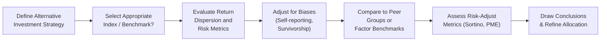

## Introduction
Alternative investments—like hedge funds, private equity, real estate, and even more exotic strategies—can have wildly different risk and return profiles compared to traditional assets such as public equities or bonds. I remember chatting with a friend who invested in a private equity fund that promised stellar returns. A few years later, she realized that not only was she locked in for a while, but the returns her fund posted were vastly different from what another seemingly similar fund produced. That’s the nature of alternatives: what you see in one fund might not match what you get in another, even if both funds claim to operate under the same broad category.  

So, in this section, we’re going to explore why these types of investments often exhibit wide return dispersion and how we can benchmark them effectively. We’ll dive into commonly used indices for hedge funds and private equity, talk about biases (it’s a big one!), and discuss how vintage year analysis, risk-adjusted metrics, and custom benchmarks can help tell a more complete performance story.

## Why Return Dispersion Is So High

Alternative investments, by their very nature, can involve a lot of strategy-specific elements. One hedge fund might specialize in distressed debt, while another hunts for statistical arbitrage opportunities. Two private equity funds might invest in completely different sectors or countries and at different stages of the business lifecycle (venture vs. buyout).

• Strategy Differentiation: Because these funds can do almost anything from short-selling to specialized derivatives structuring, performance can vary a ton.  
• Manager Skill: In alternatives, manager skill is consistently cited as a primary edge—some managers truly outperform due to unique insights, networks, or processes, while others lag or even shut down.  
• Timing: Alternatives can be cyclical. If a manager invests aggressively at the wrong time or locks into a deal that sours, the average return can take a serious hit. On the flip side, a well-timed acquisition or short position can produce eye-popping returns.

These factors contribute to a wide range of outcomes among funds that might, at first glance, appear similar to an outsider.

## Challenges in Benchmarking
A key part of performance evaluation is comparing results to a benchmark. But with alternatives, things get complicated. For instance, a long-short equity hedge fund is not entirely comparable to the S&P 500 or a global bond index. Here’s why:

• Lack of Transparency: Hedge funds often keep their holdings private. Private equity funds don’t have to disclose deals in real-time. You know how it goes—managers want to protect their “secret sauce.” That’s great for them, but it makes constructing a transparent benchmark difficult.  
• Heterogeneity: One hedge fund’s “event-driven” strategy could differ from another’s “event-driven” approach in surprising ways. Meanwhile, private equity funds even within the same “buyout” label may differ in region, sector focus, or typical deal size.  
• Data Availability: Real estate valuations can be notoriously tricky and reliant on appraisals. Private equity only updates valuations and distributions periodically, leading to lags. Hedge funds might self-report data to certain index providers but not others, or they might cease reporting if they’re shutting down.

All of these quirks make standard benchmarks (like the S&P 500 or Bloomberg Aggregate Bond Index) less meaningful for alternatives, prompting the industry to adopt specialized indices and, in many cases, more customized solutions.

## Commonly Used Indices
To try to deal with this messy reality, investors, consultants, and academics have developed alternative investment indices. While useful, keep in mind each has strengths and flaws.

### Private Equity
• Cambridge Associates: They collect private equity and venture capital fund data globally, but it often relies on self-reporting.  
• Burgiss: Another widely cited database that aggregates fund-level data on a net-of-fees basis, attempting to provide more granularity.

### Hedge Funds
• HFR (Hedge Fund Research): One of the largest hedge fund index providers; organizes funds by strategy (e.g., Equity Hedge, Event-Driven).  
• Credit Suisse Hedge Fund Index: Tracks a broad cross-section of hedge fund strategies, but fund inclusion is subject to selection criteria.  
• Eurekahedge: A global database that covers hedge fund performance across a variety of geographies and strategies.

We rely on these indices to get a rough idea about how hedge funds or private equity in a particular strategy or vintage have performed. However, you might notice that each index often has a slightly different performance figure for “essentially” the same strategy. Why? Because they rely on different data, different weighting methodologies, and different fund inclusion criteria.

## Biases in Index Data
Let’s talk about biases. This is huge in alternatives because the data is not as regulated or transparent as with public securities.

• Self-Reporting Bias: Funds that have strong returns might be more enthusiastic about reporting them, while underperformers might stay under the radar longer, or only report sporadically.  
• Survivorship Bias: Funds that perform poorly often shut down or stop reporting. That can tilt an index upward, since it includes only the “survivors.”  

So, if you see a database claiming the average hedge fund earned double-digit returns for years, you might wonder: Is that all the funds that started out, or just the ones still standing?

## Peer-Group Comparisons and Factor Benchmarks
Given the complexities of benchmarking, one approach is to compare a fund against its peer group—other funds employing a similar strategy, region, or style. Peer-group comparisons can still be messy, but at least you’re looking at apples-to-apples (or at least a variety of apples, not apples and oranges).

Alternatively, folks sometimes use factor-based benchmarks. For example, you might break down a hedge fund’s returns into exposures to market beta, factor tilts (like momentum or value), or credit spreads. The idea is to see how much of the fund’s return can be explained by these factors. If a manager claims they’re delivering “alpha,” you want to see if that remains after controlling for known systematic factors.

Another approach used by some alternative funds is an absolute return target—like aiming to exceed short-term interest rates by 5%. This is more of a self-defined goal than a market-based comparison, but some funds prefer it to highlight that they’re trying to generate positive returns regardless of market direction.

## Vintage Year Benchmarking in Private Equity
Private equity has a special characteristic: the vintage year. That’s the year the fund effectively starts investing. Because market cycles heavily influence private equity performance, it’s best to compare a 2020 vintage fund with other funds that also launched in 2020. After all, the general economic conditions, credit environment, and valuation norms in 2020 are different from those in 2015 or 2023.  

So, a timeless piece of advice: always compare apples to apples in private equity by grouping funds by their vintage.  

## Risk-Adjusted Metrics: Sharpe, Sortino, and PME
In evaluating alternative investments, raw returns can be misleading (especially if those returns are based on irregular or infrequent valuations).

### Sharpe Ratio
The Sharpe ratio is a classic measure of risk-adjusted performance. It calculates the excess return of a portfolio (over the risk-free rate) per unit of volatility (standard deviation).


\text{Sharpe Ratio} = \frac{(R_{p} - R_{f})}{\sigma_{p}}


Where:  
• \\(R_{p}\\) is the portfolio return,  
• \\(R_{f}\\) is the risk-free rate, and  
• \\(\sigma_{p}\\) is the standard deviation of portfolio returns.

### Sortino Ratio
Sortino ratio refines the Sharpe ratio by focusing only on downside volatility, particularly relevant for alternative strategies that might experience infrequent but large drawdowns, or that attempt to deliver stable returns with less frequent sharp drops.

### Public Market Equivalent (PME)
For private equity, the Public Market Equivalent (PME) concept attempts to compare the cash flows of a private equity fund to a hypothetical investment in a public market index (like the S&P 500) over the same timeline. If the’s fund IRR is 15%, but the corresponding public index would have delivered 17% under the same cash-flow schedule, then the private equity fund arguably underperformed by 2% in a simplified sense.  

**Small Example — PME**  
Imagine a private equity fund calls \$1 million at inception (Year 0), returns \$500,000 in Year 3, and then finally returns \$1.2 million in Year 6. We could replicate these same inflows and outflows in a public market index and see if the final public market investment is greater or less than \$1.2 million. If it’s more, the fund underperformed. If it’s less, the fund outperformed.  

## Custom Benchmarks and Style Alignment
Finally, some institutions build custom benchmarks that align with a particular hedge fund or private equity fund’s style and constraints. You might see a combination of indices—like 60% in a high-yield bond index, 20% in a small-cap equity index, and 20% in a commodity index—if that’s what the manager’s strategy invests in.  

The key principle is alignment: a custom benchmark should reflect the same risk exposures, leverage, liquidity constraints, and regional focuses as the underlying fund. Otherwise, the manager can claim “great results” while you’re comparing them to an irrelevant baseline.

## Practical Example: Simple Python Illustration
Let’s do a tiny practical example. Suppose we have a hypothetical private equity fund with the following cash flows (CFs) in US dollars:  

• Year 0: –\$1,000,000 (capital is called)  
• Year 3: +\$300,000 (partial distribution)  
• Year 4: –\$200,000 (additional capital call)  
• Year 8: +\$2,000,000 (final distribution)  

We can quickly estimate an IRR with Python. This code snippet uses the numpy_financial library (originally part of NumPy’s “Financial” module):

```python
import numpy_financial as nf

cash_flows = [-1000000, 0, 0, 300000, -200000, 0, 0, 0, 2000000]
irr = nf.irr(cash_flows)

print("Estimated IRR: {:.2%}".format(irr))
```

Though this is just a simplified example, it illustrates how managers and investors might approach measuring performance, especially for illiquid asset classes where you don’t have daily NAVs.

## Visualizing the Benchmarking Process
Below is a simple flowchart showing the high-level process for analyzing return dispersion and benchmarking in alternatives:



## Best Practices and Common Pitfalls
• Consistency in Data: Always confirm the frequency and methodology behind reported returns.  
• Peer Groups and Vintage: For private equity, use vintage-year comparisons. For hedge funds, look at strategies.  
• Beware of Hidden Biases: Ask how the data was collected. If a database uses manager self-reporting, survivorship bias may significantly inflate returns.  
• Use Risk-Adjusted Metrics: Especially for hedge funds, it’s often more telling to look at Sharpe, Sortino, or maximum drawdown than raw returns alone.  
• Don’t Rely on a Single Benchmark: Often, a blend of indices or a custom approach is the best route.  
• Stay Current: Alternatives are constantly evolving. Update your benchmarks and performance assessment frameworks regularly.

## Glossary
• Survivorship Bias: The overestimation of average performance by including only funds that remain operational, ignoring those that have closed.  
• Public Market Equivalent (PME): A tool to compare private equity and venture capital returns to an equivalent investment in public markets with matching cash flows and timing.  
• Sortino Ratio: A measure of risk-adjusted performance focusing only on downside volatility, rather than total volatility.  
• Peer Group Benchmarking: Measuring performance relative to a select group of funds that share the same strategy or region.  
• Net-of-Fees Return: The actual investor return after subtracting management fees, performance fees, and other fund expenses.  
• Vintage-Based Analysis: Benchmarking private equity funds against others that started investing in the same year.  
• Conservative Appraisal: Accounting practice in alternatives (especially real estate) designed to avoid overstating valuations.  
• Tracking Error (Alternatives): The volatility of a fund’s returns versus its benchmark or custom index.

## Conclusion
Return dispersion in alternatives is normal—frankly, it’s central to why many folks seek (or fear) alternative strategies in the first place. Understanding how to benchmark these investments helps you see whether performance stems from genuine skill or simply from being in the right place at the right time. By blending indices, peer groups, vintage-year analyses, and risk-adjusted metrics, investors can piece together a truer view of how each alternative investment is really doing.

## Final Exam Tips
• Carefully read any question describing an alternative investment strategy. Determine whether the question wants you to identify appropriate benchmarks, illustrate the impact of biases, or calculate a relevant risk-adjusted metric.  
• For private equity or venture capital questions, pay attention to the timing of cash flows and how the exam might expect you to interpret IRR, vintage year, or PME.  
• In essay (constructed response) sections, clearly articulate how and why you’re adjusting for biases or selecting a certain benchmark. Don’t just say “the Sharpe ratio is high,” explain the context.  
• Blend conceptual understanding with calculations. In some item sets, you might get data about multiple funds. Don’t forget to check if the question suggests survivorship bias or self-reporting issues.  
• Time management is crucial. Benchmarking questions can be data heavy. Have a neat approach ready: identify the type of alternative investment, discuss potential biases, choose an appropriate benchmark, and interpret the results.  

## References
• Kaplan, S. & Schoar, A. (2005). “Private Equity Performance: Returns, Persistence, and Capital Flows.” Journal of Finance.  
• Global Hedge Fund Database resources from HFR, Eurekahedge, and Credit Suisse.  
• Cambridge Associates and Burgiss reports on Private Equity Performance.  

## Test Your Knowledge: Return Dispersion and Benchmarking in Alternatives



### Which of the following is a primary cause of wide return dispersion among alternative investments?  
- [ ] Standardized strategies and transparency  
- [x] Manager skill, strategy, and timing differences  
- [ ] Uniform fee structures  
- [ ] Government-imposed return thresholds  

> **Explanation:** Alternatives have widely varying manager strategies and deal timing, which leads to high dispersion in returns.

### What is one major challenge when benchmarking a hedge fund?  
- [ ] The existence of too many perfect benchmarks  
- [ ] Unlimited public disclosure of positions  
- [x] Limited transparency and heterogeneity of strategies  
- [ ] Standard daily performance reporting  

> **Explanation:** Hedge funds often keep their strategies, positions, and exposures private, making it difficult to find a perfect benchmark.

### Why is survivorship bias a concern in alternative investment indices?  
- [ ] It reduces the bias by correcting for inflation  
- [ ] It is unique only to equity market indices  
- [x] It overestimates performance by excluding defunct or underperforming funds  
- [ ] It includes only poorly performing funds  

> **Explanation:** Funds that shut down or stop reporting usually have poor results, so excluding them inflates the average performance in the index.

### How does vintage year benchmarking improve private equity comparisons?  
- [x] It adjusts for economic and market conditions when the fund was launched  
- [ ] It ignores changes in market cycles  
- [ ] It focuses solely on short-term returns  
- [ ] It removes all impact of fees  

> **Explanation:** Private equity returns vary based on economic conditions and valuations prevalent at inception, so comparing same-vintage funds is more meaningful.

### Which of the following best describes the Public Market Equivalent (PME)?  
- [ ] An adjustment factor for inflation in real estate  
- [x] A method to compare private equity returns with equivalent public market returns  
- [ ] A ratio measuring downside volatility  
- [ ] A credit spread used to benchmark hedge funds  

> **Explanation:** PME matches private equity fund cash flows to a hypothetical public market investment to gauge relative performance.

### What is one potential benefit of factor-based benchmarking for a hedge fund?  
- [x] Identifying how much return stems from systematic exposures  
- [ ] Eliminating all transparency concerns  
- [ ] Guaranteeing higher absolute returns  
- [ ] Removing the need for peer group comparisons  

> **Explanation:** Factor-based benchmarking helps isolate whether the manager’s returns are due to alpha or exposure to known risk factors.

### How do custom benchmarks typically address the unique risk exposures of alternative strategies?  
- [ ] They rely on standard market-cap weighted indices  
- [x] They blend indices or metrics that reflect the fund’s specific style and leverage  
- [ ] They only use absolute return measures  
- [ ] They require daily disclosures of positions  

> **Explanation:** Custom benchmarks can incorporate multiple indices or factors that reflect a particular fund’s geographic focus, use of leverage, and other strategy elements.

### Which is a valid reason to use peer-group comparisons for hedge funds?  
- [ ] It ensures perfect comparability across all strategies  
- [x] It groups funds with similar strategies or mandates  
- [ ] It guarantees removal of survivorship bias  
- [ ] It avoids the need for net-of-fees return data  

> **Explanation:** Peer-group comparisons aim to match funds with similar strategic objectives or styles, though it doesn’t eliminate biases entirely.

### Which term describes the latter portion of an alternative fund’s returns when appraised conservatively?  
- [ ] Survivorship bias  
- [ ] Public Market Equivalent  
- [ ] Sortino ratio  
- [x] Conservative appraisal  

> **Explanation:** Conservative appraisal is a practice sometimes used in private equity or real estate to avoid overstating asset valuations.

### True or False: The Sortino ratio focuses on overall volatility rather than downside volatility.  
- [ ] True  
- [x] False  

> **Explanation:** The Sortino ratio zeroes in on downside volatility while ignoring upside variation.


