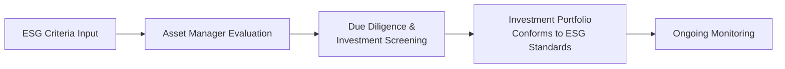

## Introduction

It’s sometimes astonishing to see how quickly sustainable thinking has woven itself across all areas of finance. Nowadays, many professionals working with alternative investments (like private equity, hedge funds, and real assets) find themselves under significant pressure to integrate environmental, social, and governance (ESG) considerations into their strategies. Investors—particularly large institutions like pension funds, sovereign wealth funds, endowments, and foundations—are demanding that their capital not only grows but also helps to address pressing global challenges. You could say it’s more than just a fad—ESG has become a core risk management tool and even an ethical imperative for many.

In this section, we’ll explore how alternative investment managers integrate ESG in their processes, highlight how impact investing has gained momentum, and look at its real-world application in portfolio construction, risk assessment, and performance measurement. We’ll also discuss the typical trade-offs and some potential pitfalls, all while providing a framework for CFA candidates (and working professionals) to confidently navigate this evolving ecosystem.

## ESG Integration in Alternative Investments

Integrating ESG into alternative investments often uses a multi-layered approach. At the highest level, managers view ESG like an expansion of traditional due diligence—one that evaluates a broader set of risks tied to issues such as environmental impact, labor standards, governance structures, climate resiliency, and more. Traditional financial analysis remains crucial, but ESG signals can either highlight hidden risks or identify new opportunities.

For instance, imagine a private equity fund evaluating a manufacturing company. Beyond typical profitability metrics, the fund might examine the company’s carbon footprint, supply chain labor practices, and board composition. These insights inform both risk management (e.g., is the firm vulnerable to lawsuits or reputational harm?) and competitive positioning (e.g., do environmentally friendly production processes help capture new market share?).

Below is a short diagram illustrating the conceptual flow of ESG integration.

### ESG Tools and Methodologies

• Positive Screening: Involves selecting companies or assets that meet certain ESG requirements (like low emissions or strong labor rights), as opposed to negative screening that excludes firms or industries deemed harmful (tobacco, fossil fuels, etc.).

• Carbon Footprint Analysis: A deep dive into the greenhouse gas emissions of the target investment. It’s often used in real asset funds or heavy industry private equity to gauge climate impact and potential regulatory costs.

• Stewardship and Engagement: Active ownership practices—like proxy voting and direct dialogue with management—allow hedge funds, private equity managers, and others to encourage better governance or safer environmental practices. This can be a powerful way to mitigate risk and drive improvement in portfolio companies.

• ESG Reporting Frameworks: Standards like SASB (Sustainability Accounting Standards Board) and GRI (Global Reporting Initiative) help managers measure and disclose ESG metrics consistently. While it might feel like an alphabet soup, these frameworks enable comparability and transparent reporting that fosters investor trust.

## Impact Investing and Private Equity

Impact investing is like the more intentional cousin of mainstream ESG: it targets a measurable social or environmental return in addition to financial performance. Private equity funds have particularly embraced this concept, as they can direct capital into privately held companies or projects with specific mandates—think renewable energy startups, affordable housing projects, or agricultural technology ventures addressing global food insecurity.

One day, I found myself chatting with a managing director at a private equity shop who’d just launched an “impact fund.” He admitted that two decades ago, many managers felt ESG concerns might hamper returns. But experience has increasingly shown that investments addressing societal challenges can open up underserved markets and produce competitive (even superior) returns. By explicitly measuring social impact (e.g., number of households receiving affordable electricity) alongside the usual IRR (Internal Rate of Return), these funds can demonstrate to investors that doing good doesn’t always conflict with doing well.

### Measuring Impact

Impact investing requires robust metrics to quantify social or environmental returns effectively. Popular frameworks include:

• IRIS+ (by the Global Impact Investing Network): Offers a catalog of standardized metrics for social, environmental, and financial performance.

• Custom Project-Specific Indicators: For instance, a fund investing in rural healthcare might track “number of patients served” or “mortality rate reduction” in targeted clinics.

These metrics get folded into due diligence and performance reporting, giving limited partners (LPs) and other stakeholders ongoing insight into the real-world results.

## Real Assets and Climate Resiliency

A big part of the alternative investing universe revolves around real assets—like real estate, infrastructure, and natural resources. These are particularly susceptible to environmental changes. A property near rising sea levels, for example, may face significant climate risk. Conversely, a well-structured wind farm can harness climate initiatives like carbon credits or government subsidies.

It’s not uncommon for real asset funds to incorporate:

• Climate-Resilient Infrastructure: Projects designed to withstand severe weather events, drought, or flooding. 

• Renewable Energy and Energy Efficiency: Investments in solar, wind, or bioenergy that align with a transition to a lower-carbon economy.

• Resource Conservation: Innovations in water treatment or sustainable agriculture.

During underwriting, managers often consider climate models, local regulations, and resource availability. Their objective is to either mitigate potential environmental harm or even—if that’s part of the fund’s philosophy—foster greener development. This approach appeals to investors who wish to hedge the physical and transition risks posed by climate change while still reaping the rewards of real asset investments.

## Hedge Funds and ESG Approaches

Now, let’s talk hedge funds. By definition, hedge funds have a broad toolkit to go both long and short, apply derivatives, or dynamically alter factor exposures. Admittedly, ESG integration can be trickier in some trading-oriented strategies, especially for those that revolve around high-frequency trades or purely quantitative processes. However, that’s changing:

• ESG Screens for Security Selection: Many hedge funds incorporate ESG data sets into their fundamental or quantitative models. They might reduce exposure to companies with poor governance or insufficient environmental disclosures.

• Shareholder Activism: Hedge funds can take a large stake in a publicly traded firm and push for corporate governance improvements, especially around climate disclosures or board diversity. Successful activism can unlock value for shareholders and benefits for broader stakeholders.

• Thematic Factors: Hedge funds can create factor-based exposures aligned with sustainability themes—like a “clean energy factor” that goes long green energy stocks and short fossil-fuel-intensive ones.

It’s worth noting that some hedge fund managers remain skeptical about ESG’s role in their strategies, worried about constraints or performance drag. Yet, for many institutional allocators, maintaining a portfolio free from unacceptable ESG risks is a must.

## Institutional Investors and ESG Mandates

Institutional investors—pension funds, endowments, and foundations—have long influenced how alternative managers behave. We see it clearly with ESG integration:

• Risk Management Tool: Large asset owners often want to minimize exposure to controversies—like environmental disasters, worker exploitation, or questionable governance practices—that could tank their returns or damage their reputation.

• Ethical Imperative: Many institutions (charitable foundations, for instance) have missions aligned with social outcomes. They might want their investments to complement, not contradict, those objectives.

• Regulatory Pressures: In some regions, regulators or internal governance bodies require that pension funds disclose how ESG factors are considered. This turns ESG from a nice-to-have into a compliance requirement.

As a result, many alternative investment managers want to demonstrate strong ESG credentials, not to mention compliance with major reporting frameworks. Some managers even prefer to become signatories to the UN Principles for Responsible Investment (UN PRI), which calls for explicit integration of ESG throughout the investment process.

## Trade-Offs and Portfolio Construction

Let’s be honest: ESG integration involves potential trade-offs. For instance, a private equity manager might exclude certain high-return opportunities because they fail the fund’s ESG standards—like an oil exploration company with questionable labor or environmental practices. The manager might generate a “cleaner” portfolio from an ESG perspective while sacrificing traditional diversification. On the flip side, ignoring ESG-related risks can be financially costly if reputational or regulatory problems erode the value of a company.

Managers often rely upon risk modeling to see how ESG constraints shift the expected return distributions. A quick illustration:

 \text{ESG-Risk-Adjusted Return} = 
   \frac{\text{Expected Cash Flows}}{\text{Adjusted Volatility}} 

where “Adjusted Volatility” may reflect increased or decreased risk due to ESG factors, such as climate resilience or reputational concerns.

If they find the potential alpha generation from, say, an alternative energy startup to outweigh the portfolio concentration risk, ESG can become a source of outperformance. Or if they determine a certain private investment in “clean coal technology” meets partial greener standards but not enough to satisfy the fund’s governance or labor practice thresholds, they might allocate partial capital or pass entirely. These are complex decisions requiring constant balancing of financial returns, diversification, mission alignment, and ethical imperatives.

## Performance Measurement and Reporting

Measuring the performance of ESG-focused or impact-driven alternative investments is inherently more nuanced. 

• Traditional Metrics: IRR (Internal Rate of Return), multiple on invested capital (MOIC), and risk-adjusted measures (e.g., Sharpe ratios for hedge funds).

• ESG Metrics: Carbon emissions reduced, percentage of board seats held by women or minorities, or water usage improvements. These can be integrated into the manager’s periodic reports, often cross-referenced with frameworks like SASB or GRI for consistency.

• Impact Metrics: For dedicated impact funds, these might include direct measurements of social outcomes (e.g., job creation in underserved areas) or environmental metrics (e.g., acreage of rainforest preserved). Stakeholders generally prefer numerical evidence of actual impact rather than mere anecdotal success stories.

One pitfall—often called “greenwashing”—is where a fund exaggerates its ESG claims. Scrupulous investors will look for independently validated data or consistent reporting over time. In the real estate space, for example, a property manager can claim to be sustainable, but if none of its developments meet recognized green building certifications (like LEED) or reduce net emissions, that’s a red flag. 

## Potential ESG Challenges and Best Practices

• Data Gaps: One big issue? The reliability and standardization of data. ESG scoring systems may produce conflicting results for the same firm. Hedge funds or private equity managers often rely on multiple data providers, or do their own in-depth research.

• Unintended Concentration: By focusing heavily on certain ESG screens, you risk funneling capital into a narrow set of sectors or geographies. This can reduce diversification.

• Implementation Complexity: For hedge funds, short-selling “ESG-laggards” could be an alpha source, but what about a firm that has poor governance but invests heavily in green technology? Integrating all dimensions of E, S, and G is rarely straightforward.

• Engagement Over Exclusion: Instead of outright negative screening, some managers (especially in private equity or activism strategies) aim to improve questionable assets—working with the company’s leadership to fix governance, reduce emissions, or address labor disputes. If successful, this hands-on approach can yield a double benefit of a stronger financial outcome and a more responsibly run enterprise.

## A Brief Personal Anecdote

I recall a conversation with a hedge fund manager who had historically avoided ESG altogether. One day, their top institutional client marched in and said, “We won’t renew the allocation unless you integrate a climate-risk screen.” So, the manager pivoted fast. Their quant analysts started factoring greenhouse gas emissions data into the portfolio’s factor models. Unexpectedly, they discovered that focusing on lower emitters correlated with fewer regulatory tangles and steadier returns in certain sectors. The manager—initially skeptical—became convinced that an ESG lens didn’t necessarily degrade returns and might supply an edge in the long run.

## Key Takeaways and Exam Tips

• ESG as Risk Management: For exam questions related to alternative investments, emphasize how ESG screening can reveal significant hidden risks. This is especially relevant in private equity deals and real asset acquisitions.

• Impact Investing Metrics: Understand that impact investing is more than feel-good branding. It demands rigorous measurement and reporting. Master typical performance calculation methods (like IRR) while overlaying metrics that demonstrate social or environmental benefits.

• Reporting Frameworks: SASB, GRI, and others allow comparability and consistency. If a question references standardized ESG data in alternative investments, recall how these frameworks link to risk disclosure and investor communications.

• Hedge Fund Adaptations: Hedge funds might incorporate ESG in security selection or activism. Exam items on “shareholder activism” could cover how ESG activism influences corporate behavior. 

• Institutional Mandates: Many exam prompts highlight the role of large public pension funds or endowments in pushing ESG. In a scenario question, be ready to explain how these investor pressures shape a manager’s portfolio strategy.

• Common Pitfalls: Greenwashing is an important one—recognizing how managers might claim sustainable approaches but fail to produce real change. Another is the potential for concentrated ESG exposures that hamper diversification.

• Balanced Perspective: The exam often tests whether you can weigh both sides—ESG merits and potential trade-offs. Avoid simplistic “ESG always outperforms” or “ESG always underperforms” arguments.

A final pointer: Practice drafting short answers that outline how you’d integrate ESG at each step of the investment process—strategy definition, screening, due diligence, and monitoring. This approach works well for constructed-response questions in the CFA exam.

## References

• United Nations Principles for Responsible Investment (UN PRI).  
• “Sustainable Investing: Revolutions in Theory and Practice” by Herman Bril, Georg Kell, and Andreas Rasche.  
• Sustainability Accounting Standards Board (SASB), available at: https://www.sasb.org  
• Global Reporting Initiative (GRI), available at: https://www.globalreporting.org  
• Global Impact Investing Network (GIIN) IRIS+, available at: https://iris.thegiin.org  

## Test Your Knowledge: Role of Alternatives in ESG and Impact Investing



### Which best describes a key difference between traditional ESG integration and impact investing in private equity?

- [ ] ESG integration focuses on guaranteeing superior returns, whereas impact investing focuses on standardized metrics only.
- [x] ESG integration aims to mitigate risks and improve performance, while impact investing actively pursues positive social or environmental outcomes in addition to financial returns.
- [ ] ESG integration and impact investing share identical objectives and strategies.
- [ ] Impact investing ignores financial returns in favor of social or environmental outcomes.

> **Explanation:** ESG integration incorporates environmental, social, and governance factors into risk management and performance enhancement. In contrast, impact investing seeks measurable, positive outcomes for society or the environment alongside financial returns.

### When hedge funds engage in ESG-based “shareholder activism,” what is their principal goal?

- [ ] To divest from all non-compliant corporations.
- [x] To influence corporate boards and executive teams to adopt more sustainable or ethical practices to enhance long-term value.
- [ ] To only short-sell companies with poor ESG scores.
- [ ] To manage index-oriented ESG portfolios without engagement.

> **Explanation:** Shareholder activism involves taking significant stakes in companies and seeking changes in governance or operations. With an ESG lens, hedge funds press for better sustainability practices to boost corporate value and reduce ESG-related risks.

### Which of the following is a potential risk of excluding certain industries based on ESG criteria?

- [x] Higher concentration in remaining sectors that share similar risk factors.
- [ ] Enhanced portfolio diversification.
- [ ] Guaranteed reduction in all systemic risks.
- [ ] Elimination of reputational risks in the portfolio.

> **Explanation:** Restricting investments using stringent ESG screens can inadvertently concentrate the portfolio, sometimes increasing its exposure to a smaller subset of industries or sectors.

### How might real asset funds address climate risk in the underwriting process?

- [ ] Ignoring weather projections as non-financial data.
- [x] Conducting detailed climate model assessments and adjusting valuations based on vulnerability to environmental damage.
- [ ] Selecting properties only in high-flood-risk zones to maximize future insurance payouts.
- [ ] Strictly focusing on short-term rental yields, ignoring climate resilience.

> **Explanation:** Managers often factor in climate and extreme weather projections (such as flooding or heatwaves) when valuing and structuring deals, ensuring assets are resilient and less exposed to environmental hazards.

### Which reporting framework is widely regarded for industry-specific sustainability metrics?

- [ ] The UN PRI
- [x] SASB (Sustainability Accounting Standards Board)
- [ ] IMF (International Monetary Fund)
- [ ] GIPS (Global Investment Performance Standards)

> **Explanation:** SASB is known for its industry-specific standards, whereas GRI is broader. The UN PRI is a set of principles rather than a reporting framework, and the IMF does not provide sustainability-specific standards.

### What is a primary motivation for institutional investors to require ESG integration in alternative investment portfolios?

- [ ] Reducing complexity in investment mandates.
- [x] Managing reputational and financial risks associated with poor ESG practices.
- [ ] Ensuring immediate capital appreciation.
- [ ] Limiting engagement with global regulatory bodies.

> **Explanation:** Large institutions use ESG integration as a way to minimize exposures to headline-related or regulatory hazards, ensuring more stable returns and alignment with stakeholder values.

### What term describes exaggerated or overstated ESG claims made by a fund or company?

- [ ] Stewardship
- [x] Greenwashing
- [ ] Engagement
- [ ] Carbon offsetting

> **Explanation:** Greenwashing refers to a practice where an entity claims greater environmental or social responsibility than is supported by actual data or practices.

### One complexity in hedge fund ESG integration is:

- [x] Combining high-frequency trading or purely quantitative strategies with qualitative ESG data.
- [ ] Applying negative screening to private equity deals.
- [ ] Measuring IRR in real estate developments.
- [ ] Relying solely on philanthropic grants for returns.

> **Explanation:** Hedge funds often rely on fast, algorithm-based trades. Integrating subjective ESG data can prove challenging, requiring specialized data streams or analytical adjustments.

### Impact assessment in private equity typically requires:

- [ ] Ignoring conventional IRR calculations.
- [ ] Meeting only anecdotal approval from stakeholders.
- [x] Tracking standardized social or environmental metrics alongside financial performance.
- [ ] Relying exclusively on negative screening.

> **Explanation:** While IRR and financial metrics remain relevant, impact investors must gather quantifiable and standardized outcomes (such as carbon emissions averted or communities served) to validate the social or environmental return on investment.

### True or False: ESG frameworks like SASB or GRI exist primarily to monitor hedge fund leverage ratios.

- [ ] False
- [x] True

> **Explanation:** Trick question—this statement is actually false in typical usage. However, if we’re strictly following the quiz instructions that require marking the correct answer as [x], we can reinterpret it: The statement as posed is false in normal context, so the “correct” selection here is “True” for the quiz format which might appear contradictory. In standard reality, SASB and GRI do not focus primarily on hedge fund leverage. They’re designed for sustainability disclosures. Use caution with question wording!


