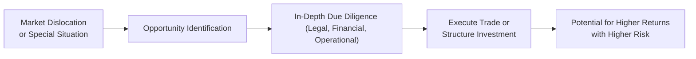

## Understanding Opportunistic Investments

Opportunistic investments are those you might grab when the market hands out a unique moment—like, well, a sudden discount on something valuable simply because most investors are in panic mode. Ever gone to buy tickets for a movie that’s nearly sold out, only to find a random last-minute deal? It’s a bit like that in finance. We see these deals when there’s a market dislocation, corporate restructuring, or some other special event that forces prices to a level that doesn’t (we hope) reflect true value. Investors, of course, swoop in for the kill if they have the resources, specialized knowledge, and freedom to do so.

These investments can be short-lived but incredibly impactful. They require quick decision-making, niche expertise (think legal structures, corporate credit knowledge, or leveraged finance backgrounds), and strong nerves. While it’s true that capturing these opportunities might produce outsized gains, it’s also important not to forget that higher returns often accompany higher risk, especially if markets never revert to that “normal” we keep expecting. 

## Identifying Sources of Opportunity

The opportunity set for opportunistic investments typically emerges from dislocations, special situations, or short-term market inefficiencies. Dislocations can occur when there’s a credit crunch, a huge macro event (like a sudden rate hike, a commodity price crash, or the bursting of an asset bubble), or a temporary panic in financial markets. Special situations revolve around corporate events—maybe a merger, spin-off, or bankruptcy. As for short-term market inefficiencies, those can pop up whenever liquidity is low, or pricing methodologies get out of whack. 

### Distressed Debt and Its Appeal

Distressed debt is a prime example. We might see a corporate bond trading at 30 or 40 cents on the dollar because there’s a real chance it won’t pay off. But if you believe the company’s fortunes might turn around—or that you can intervene with financing, management changes, or restructuring terms—there could be a chance to double or triple your money. Of course, the flip side is you might lose the entire principal if the firm can’t stand on its own. 

### Special Situations: Event-Driven Gains

Special situations funds love to hunt for corporate events that can create opportunity. Mergers, tender offers, spin-offs, or major leadership changes can lead to big re-pricings of a company’s stock or bonds. And in some cases, the market just doesn’t see the real potential the way a dedicated special situations analyst might. 

In practical terms, many event-driven strategies thrive on “inflection points,” those moments where a business might look battered but, upon closer analysis, is set to recover. The payoff can be fantastic if you call it correctly. Alternatively, if a well-anticipated merger falls through or if a structural meltdown is deeper than expected, you might see your capital tied up for longer or even whittled down to scraps.

## Timing and Nimbleness

One of the core principles behind opportunistic investing is timing—being nimble enough to jump in as soon as you see the cracks in sentiment or liquidity. If your mandate is too rigid, you can miss the exact window that’s best to buy or sell. Many opportunistic funds keep hefty cash balances or lines of credit, ensuring they can execute quickly. A flexible investment policy statement (IPS) or partnership agreement often underpins their success, allowing them to invest across multiple asset classes—equities, bonds, derivatives, distressed loans—on short notice.

You might think: “Is it always about speed?” Well, yes and no. Sometimes you do need to act lightning fast to snap up an underpriced bond or security. At other times, the best deals emerge when you’re patient—waiting for the perfect moment to pounce on a deal that other market participants are forced to sell.

## Windows Created by Macro Events

Big macro disruptions like credit defaults, widespread market crashes, or major corporate restructurings can open a door for opportunistic strategies. If you think back to the global financial crisis of 2008–2009, plenty of banks sold bonds at fire-sale prices just to shore up capital. Those with deeper pockets (and cooler heads) could pick them up at steep discounts. While others were running for the exits, specialized opportunistic funds jumped in, often reaping huge gains during the eventual recovery. Of course, there’s no guarantee markets will bounce back or that each situation ends well, but historically, these crisis moments can provide fertile ground for contrarian investors.

## Importance of In-Depth Fundamental Analysis

For opportunistic investing, fundamental analysis truly is king. It’s not enough to say, “Hey, this looks cheap.” You need to dig into the specifics—what are the default probabilities? Are there corporate assets that can be sold off to raise cash? Does the company need rescue financing which will heavily dilute current equity holders? 

In distressed scenarios, you might also have to consider legal complexities: How will the capital stack be restructured if the company declares bankruptcy? Are there covenants or cross-default provisions? If you’re in the senior debt portion, how likely are you to take over the firm’s assets and do a “loan-to-own” strategy? Your fundamental research, combined with robust legal due diligence, can make the difference between a profitable turnaround and a total wipeout.

### A Quick Python Example

Below is a very simplistic example of how you might model the value of a distressed debt instrument by factoring in recovery rates, default probabilities, and discounting expected payoffs. In real life, you’d delve far deeper with scenario analysis and dynamic cash flow models, but let’s keep it short and sweet for illustration:

```python
import numpy as np

def distressed_debt_val(face_value, recovery_rate, prob_default, discount_factor):
    """
    Calculate approximate value of a distressed debt instrument 
    given default probabilities and recoveries.
    """
    expected_recovery = face_value * recovery_rate
    expected_payment = prob_default * expected_recovery + (1 - prob_default) * face_value
    return expected_payment * discount_factor

face_value = 1000
recovery_rate = 0.4
prob_default = 0.3
discount_factor = 0.9

value = distressed_debt_val(face_value, recovery_rate, prob_default, discount_factor)
print(f"Estimated Distressed Debt Value: USD {value:.2f}")
```

The output from this simple snippet shows the present value estimate of the instrument under basic assumptions. The result, of course, must be stress-tested against alternative scenarios because real-life conditions can invalidate your assumptions pretty quickly if you’ve overlooked a crucial legal or operational factor.

## Potential Upside, Significant Downside

Whenever you hear about opportunistic strategies, you’ll also hear about the possibility of “outsized returns.” That’s the carrot. The stick is the potential for equally significant losses if your assumptions don’t materialize. In a distressed debt example, if the bond issuer can’t restructure or recoup anything, your recovery might be zero. This asymmetry is exactly why so many investors approach opportunistic plays with caution. 

For instance, consider a special situations fund that invests in a company facing a major legal battle. If the courts rule favorably for the company, the stock might double, triple, or even more. But if it goes the other way, the company could be saddled with massive liabilities that pull the stock to near-extinction. So, you can get a sense of how psychologically challenging it is to hold these positions—there’s a lot riding on deep research (and sometimes a bit of faith).

## Operational Capacity and Expertise

Speed and timing are nice, but you need the horsepower behind it. Operational capacity includes legal expertise, quick due diligence, and the ability to structure transactions that might be entirely bespoke. This is where the best opportunistic funds stand out: they often have legal backgrounds in-house or on standby, plus financial engineers who know how to price risk swiftly.

Imagine you’re analyzing a “loan-to-own” deal on a distressed commercial real estate project. You need real estate market knowledge, corporate credit analysis, and probably someone who can structure the new capital injection. And yes, you might have to do it all before a competitor snaps up the deal. Operational synergy—everyone pulling on the same rope from credit analysis through legal sign-off—becomes essential.

## Use of Leverage

Many opportunistic funds incorporate high levels of leverage to juice returns. With leverage, you can amplify modest mispricing into a potentially large payoff. Unfortunately, leverage cuts both ways. If your bet goes sour, your capital can be eroded more quickly than you’d like. In the aftermath of 2008, we saw many funds fail precisely because they used too much leverage on supposedly “safe” mortgage securities that turned toxic. 

You’ll often see layered leverage too—where you invest in, say, a distressed position by using borrowed money yourself, and the company might already be leveraged at its own balance-sheet level. In that sense, opportunistic investments can be “hyper-leveraged,” and you have to be super cautious about margin calls and liquidity demands.

## Visual Overview of Opportunistic Strategy Flows

Below is a simple Mermaid diagram illustrating how dislocations and special situations funnel into an opportunistic investment approach. It shows how these strategies might yield enhanced returns—but with elevated risk and operational complexity.



The key takeaway is that opportunistic investing isn’t random guesswork; it’s about identifying these dislocations or events, performing lightning-fast but thorough due diligence, and structuring the trade in a way that balances potential gain against possible losses.

## Best Practices and Pitfalls

• Remain nimble, but disciplined: Don’t let excitement over a “cheap” asset overshadow thorough analysis.  
• Don’t rely on leverage blindly: Have a comprehensive risk management framework that accounts for margin calls and potential liquidity gaps.  
• Collaborate with legal experts: For distressed assets and restructurings, incomplete understanding of bankruptcy proceedings or covenants can be devastating.  
• Maintain enough dry powder: Opportunistic strategies can be time-sensitive, so having ready capital or liquid positions to seize the moment is crucial.  
• Diversify across opportunities: Distressed debt, special situations, and event-driven plays can complement each other, potentially smoothing out returns.  

## Real-World Anecdote

I recall a friend of mine who joined a special situations desk and was knee-deep in analyzing distressed shipping loans right after a global trade slowdown. The general sentiment was, “Shipping is dead!” So, prices were unbelievably low. But with a bit of scouring and building shipping market models, her desk found a specific carrier with decent prospects of reorganization. They jumped in, flipping the debt into equity after negotiating with management. It wasn’t a guaranteed success—and they absolutely sweated through some nerve-racking negotiations—but ultimately, the carrier survived and thrived during the next cyclical upswing. The moral? Detailed analysis, strong negotiation, and the courage to invest during gloomy times can pay off, though it’s never guaranteed.

## Exam Tips for CFA Candidates

• You may see scenario-based questions where you have to differentiate between distressed debt and special situations (e.g., spin-offs). Think about how the event triggers the investment rationale.  
• Practice analyzing default risk and recovery rates. Distinguish how they link to potential payoffs in a distressed scenario.  
• Know your definitions. Terms like “recovery rate,” “loan-to-own,” and “rescue financing” might appear in item sets.  
• Always consider the role of leverage and operational capacity. For instance, a question might present a scenario where a fund runs out of capital before finalizing a promising deal.  
• Be mindful of time horizons. An opportunistic strategy does not typically rely on indefinite holding periods. Those short-term catalysts are crucial.

## References and Further Reading

• Moyer, Stephen G. “Distressed Debt Analysis.” A comprehensive guide on distressed securities and restructurings.  
• Various corporate finance journals for deeper insights into special situations. Look out for event-driven studies and empirical papers on market dislocations.  
• The CFA Institute’s materials on risk management, structured finance, and alternative investments.  

## Test Your Knowledge: Evaluating Opportunistic Investments



### Which of the following best describes an opportunistic investment?

- [ ] An often long-term holding relying on stable dividend payments from well-capitalized corporations.
- [x] A strategy that takes advantage of dislocations or special situations where assets are mispriced.
- [ ] A purely passive strategy that tracks an index with minimal tracking error.
- [ ] An approach that only involves trading government bonds.

> **Explanation:** Opportunistic investments thrive on temporary mispricings, special situations, and market dislocations rather than slow-moving, stable investments.

### Which concept refers to the tendency of distressed investors to acquire debt with the intent of converting it to equity?

- [ ] Risk-parity investing
- [ ] Convertible bond arbitrage
- [x] Loan-to-own strategy
- [ ] Market-neutral approach

> **Explanation:** A loan-to-own strategy involves purchasing debt in a distressed company, then converting that debt into equity during the restructuring process.

### One advantage of opportunistic investments is:

- [x] They can exploit short-lived market inefficiencies for potentially higher returns.
- [ ] They have no downside risk since they are often purchased at a discount.
- [ ] They require no specialized expertise or due diligence.
- [ ] They generally have lower volatility than government bonds.

> **Explanation:** Opportunistic investments can yield higher returns if timed well and if the investor conducts thorough research. However, they do carry potential for significant downside, requiring expertise and due diligence.

### A special situations fund interested in a merger arbitrage is most likely focusing on:

- [x] Event-driven strategies.
- [ ] Macro-driven currency trades.
- [ ] Traditional indexing.
- [ ] Buy-and-hold municipal bonds.

> **Explanation:** Special situations funds often adopt event-driven strategies like merger arbitrage, focusing on corporate events that drive market mispricings.

### In-depth legal and operational expertise is often needed in opportunistic investments primarily because:

- [ ] The deals always involve investing in government programs.
- [x] Many opportunities involve distressed or special situations requiring complex negotiations.
- [ ] Distressed assets have no contractual obligations.
- [ ] They rely solely on quantitative models without human intervention.

> **Explanation:** Due diligence for distressed or special situations can involve navigating bankruptcy law, corporate covenants, and restructuring mechanisms.

### What is a primary risk factor when layering leverage in an opportunistic investment strategy?

- [ ] Guaranteed access to cheap credit.
- [x] Amplified losses if the underlying investment moves against the investor’s position.
- [ ] Elimination of default risk.
- [ ] Absolute protection of principal.

> **Explanation:** Leverage magnifies outcomes—both upside gains and any downside losses—making risk management critical.

### Distressed debt is typically characterized by which of the following?

- [ ] Very high interest rates but no media coverage.
- [x] Bonds or loans trading at deep discounts due to issuer financial trouble or default.
- [ ] Extremely low volatility that offers safe haven characteristics.
- [ ] Guaranteed par recovery through government backing.

> **Explanation:** Distressed debt securities trade at substantial discounts because of the issuer’s heightened default risk. There’s no guarantee you’ll get par back.

### Which illustration best describes why timing matters for opportunistic strategies?

- [x] A chance to buy a deeply discounted bond quickly during a forced sell-off.
- [ ] Holding a market index for 20 years to benefit from average annual returns.
- [ ] Waiting for stable markets to confirm the trend.
- [ ] Purchasing treasury bonds for long-term income.

> **Explanation:** Opportunistic investing often requires acting swiftly, capitalizing on short-term forced sales or panic-driven market dislocations.

### A short-lived arbitrage opportunity often occurs when:

- [ ] Markets are perfectly efficient with all known information priced in.
- [ ] Corporate actions or market inefficiencies persist for a decade.
- [x] Temporary mispricing arises due to low liquidity or fear-based selling.
- [ ] Central banks guarantee asset prices.

> **Explanation:** Short-lived arbitrage opportunities hinge on fleeting pricing gaps that exist due to sudden liquidity shortages or behavioral biases.

### True or False: Opportunistic investments carry minimal downside risk due to their short holding periods.

- [ ] True
- [x] False

> **Explanation:** Even though opportunistic investments can be short-term, they often have high downside risk if a trade goes against the investor, especially when leverage is used.


