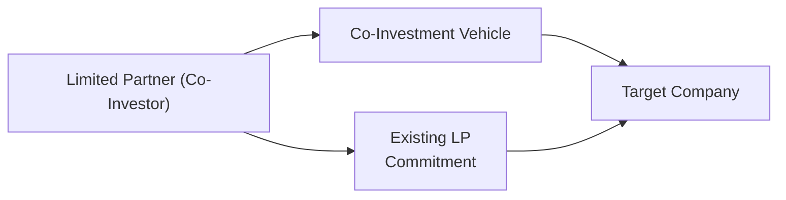

## Introduction  
Well, co-investments and direct investments are two alternative investment strategies that have become pretty popular among institutional and high-net-worth investors. You’ve probably heard folks in the industry talking about them like they’re some untapped gold mine or, in some cases, a complicated puzzle. Truth is, both approaches can be powerful ways to enhance returns and reduce fees—but they also carry some unique risks, complexities, and operational hurdles.  
  
Remember how in traditional private equity or hedge fund setups you have a General Partner (GP) making investment decisions and a bunch of Limited Partners (LPs) passively funneling in capital? Co-investments and direct investments basically shake up that structure a bit, giving investors a chance to participate more actively—usually at lower or even zero incremental fees. However, with that comes a need for rapid decision-making, thorough due diligence, and specialized expertise. You're sort of stepping onto the GP’s playing field.  
  
Below, we’ll dissect the specifics of co-investments, then compare them to direct investments. We’ll look at the pros, cons, operational needs, and a bunch of real-world considerations to help you navigate your own or your firm’s foray into these strategies.  

## Co-Investments: The Basics  
Co-investments commonly allow an LP to invest side by side with a private equity (PE) or hedge fund on a particular deal rather than putting money into an entire fund. For instance, imagine that a PE fund invests in a fast-growing technology startup. If you’re an LP in that fund, you might get the chance for an additional investment—outside of the main fund structure—in that same deal with better economic terms.  

### How Co-Investment Deals Typically Arise  
1. A private equity or hedge fund (the GP) identifies an appealing investment opportunity.  
2. Because of fund size constraints or risk constraints, the GP might not want to—or be able to—fund the entire amount.  
3. The GP offers select investors (usually existing LPs in that fund) the opportunity to co-invest in that same deal.  
4. The LP invests additional capital directly in the single company (through a special purpose vehicle or direct equity stake) rather than through the broader fund.  

Co-investment rights (sometimes spelled out in side letters) give certain LPs the ability to participate in these deals with minimal or no management fees and carried interest. Because the GP remains heavily involved in deal sourcing, due diligence, and ongoing oversight, co-investors leverage the GP’s expertise. However, these offers usually come with an execution window that demands swift decisions—often a matter of days or weeks.  

### Key Advantages of Co-Investments  
• Lower Overall Fees: By working on a specific transaction outside of the main fund, the LP typically pays reduced management fees and possibly no carried interest.  

• Enhanced Returns Potential: There’s often a robust return expectancy here because co-investment deals are selected from the GP’s pipeline, which presumably has been evaluated thoroughly.  

• GP Expertise: Co-investors benefit from the GP’s diligent research, negotiation skills, and operational guidance without having to replicate the entire scrutiny process on their own.  

• Strategic Influence: In certain cases, co-investors can negotiate board seats or observer roles, giving them more say in driving strategic or governance decisions for the target investment.  

### Possible Drawbacks of Co-Investments  
• Concentration Risk: A co-investment sometimes involves a significant investment in a single company or project. If this investment goes downhill, it can inflict a pretty big impact on the investor’s portfolio.  

• Due Diligence Pressure: Despite leaning on the GP, co-investors must still conduct their own analysis to confirm the deal’s suitability. This must be done fast—sometimes faster than an investor’s typical decision timeline.  

• Uneven Allocations: Not all GPs share their top deals across the entire investor base. Some might prefer bigger or more strategic LPs, or they may only share “leftover” deal capacity.  

• Liquidity Constraints: Co-investment deals often share the same illiquid nature as private equity: your capital can be locked up for many years, potentially affecting your overall portfolio liquidity.  

## Direct Investments: The Essentials  
While co-investments are done alongside a GP, direct investments mean you skip the external fund manager altogether and invest directly in a company, real estate asset, or infrastructure project. Essentially, you become your own mini-GP. You might structure the deal purely on your own or you could partner with other institutional investors who share the same interest.  

### Key Motivations for Direct Investing  
• Full Control: You make the decisions, from sourcing to negotiations, from capital structure to exit strategy.  

• Fee Savings: There’s no second layer of management fees or carried interest because you’re not relying on a fund manager.  

• Strategic Alignment: If you’re big on a certain sector or geography, you can target direct investments that align perfectly with your strategic or policy objectives.  

### Major Risks and Challenges  
• Resource Intensiveness: To do direct investing effectively, you need a specialized team—think in-house investment professionals, legal/corporate staff, maybe even sector experts. And that can be pricey to maintain.  

• Operational Complexity: Managing the portfolio company, ensuring compliance, dealing with unexpected operational hurdles—these tasks require significant time and attention.  

• Limited Diversification: Allocating big sums in direct deals can hamper your portfolio’s diversification. If you put all your eggs in one basket—say a big direct investment in a single real estate project—and the market slumps, that can be quite painful.  

## Comparing Co-Investments and Direct Investments  
Though both approaches break away from traditional fund investments, the big difference is the involvement of a GP:

- In co-investments, the GP still drives the investment thesis, due diligence, and oversight, though the LP invests directly into the target company.  
- In direct investments, the investor (often an institutional LP) handles everything from start to finish—no GP is present.  

If you’re an investor weighing one versus the other, it comes down to your internal capabilities and how fast you need to move. Some LPs prefer to cut their teeth on co-investment deals first, gleaning operational insights from the GP. Others, usually large pension funds or sovereign wealth funds, have the internal muscle to go fully direct.  

It’s also worth noting how each channel affects your negotiation leverage. In direct investing, you typically hold a bigger stake and might wield greater control over the board, the terms, and the exit plan. But with co-investments, you usually rely on the GP’s existing structure and network, which can be an advantage if you lack that in-house muscle.  

## Institutional Teams: Building Capacity for Direct Investments  
Large institutional investors—pension funds, endowments, insurance companies—often build specialized in-house teams for direct deal sourcing, valuation, and management. That might include:  
• Sector Specialists: Individuals with deep knowledge of technology, healthcare, renewable energy, or other areas.  
• Legal & Compliance Experts: Direct deals introduce new regulatory and legal complexities.  
• Operational Consultants: Professionals who help portfolio companies restructure or implement best practices.  
• Risk Management Analysts: Overseeing concentration risk and scenario modeling.  

In many ways, building out these capabilities is like creating a private equity firm within your own institution. And, well, that’s neither cheap nor quick. It’s why smaller or mid-sized LPs often can’t—or don’t want to—go full direct.  

## Alignment of Interest and Fee Considerations  
One of the more exciting aspects of co-investments and direct investments is the reduced layering of fees—at least relative to investing through standard private equity fund structures. With co-investments, management fees can be waived or drastically cut, and the carried interest might be minimal or zero. That obviously helps the net returns for LPs.  

However, it’s wise to keep in mind that some GPs may not evenly distribute their “best” deals. There can be real conflicts of interest:  
- What if the GP invests across multiple funds and wants each fund to have the best deals?  
- Could the GP use co-investment allocations to placate larger or more influential investors?  

Regulators and industry organizations like the Institutional Limited Partners Association (ILPA) put out best-practice guidelines urging better transparency around deal allocation. But it’s essential for LPs to confirm how these policies work in practice, not just on paper.  

## Liquidity and Portfolio Implications  
At a glance, co-investments and direct investments can shift your portfolio’s liquidity profile—often making it less liquid. If, for instance, you decide to plow $50 million into a single infrastructure project, you’re tying up that capital for an extended timeline. This can be absolutely fine if your overall investment policy statement (IPS) and liability profile permit illiquidity. On the other hand, if you need the flexibility to exit your positions or rebalance, being locked in might cause real headaches.  

Some institutional investors handle this by creating separate liquidity pools, ensuring they have enough liquid assets to cover short-term liabilities even if their direct or co-investment holdings are locked up. Others use an approach that sets a firm cap on the total percentage of illiquid holdings.  

## Governance, Conflicts of Interest, and Best Practices  
When it comes to co-investments, you’re reliant on the GP’s due diligence, but you still need your own governance framework to validate deals, terms, and allocations. Just because you’re getting a “great deal” from a GP doesn’t mean you can skip the legwork.  

For direct investments, expect an even more robust governance structure. That means having an internal investment committee, a risk oversight committee, and possibly external advisors. Why? Because you no longer can rely on an external GP’s infrastructure and processes. You become both the investor and, in part, the manager.  

Moreover, conflict-of-interest policies must be crystal clear. Consider, for example, cross-fund investments. If a GP manages multiple funds, invests them all in the same company, and then offers co-investments to certain LPs, how do you ensure that no group of investors is unfairly disadvantaged? Similar questions arise when an LP invests directly in a company in which one of its GPs also invests, raising the potential for double-dealing or misaligned priorities.  

## Practical Example: Pension Fund’s Co-Investment Strategy  
Let’s say Redwood State Pension (RSP) is a large public pension plan with billions under management. They invest in various private equity funds but are looking to reduce overall fees. They decide to accept a GP’s invitation to co-invest in a European software firm.  

• Step 1 – Evaluate GP’s Diligence: The GP has already performed vendor due diligence and built a financial model. RSP’s in-house team reviews these materials but also runs their own scenario tests, focusing on worst-case outcomes.  

• Step 2 – Deal Terms: RSP negotiates co-investment rights through a side letter, which includes zero management fees and no carry. That’s quite a cost saving.  

• Step 3 – Execution Window: The GP demands a quick decision—two weeks. RSP’s internal investment committee (including external advisors) convenes an emergency meeting, reviews the proposed structure, and asks clarifying questions to the GP.  

• Step 4 – Decision and Allocations: RSP invests an additional €30 million, which sits outside of the pension’s main commitment in the GP’s broader fund. Over the next five years, the investment either outperforms or underperforms, but the net return stands a good chance of beating what it would have been if RSP only had exposure via the main PE fund.  

The moral of the story: RSP leverages the GP’s expertise, pays fewer fees, but takes on extra diligence and a narrower exposure risk.  

## A Quick Mermaid Diagram on Co-Investment Structure  
Below is a simple schematic that shows how co-investors, GPs, and target companies often interconnect:

In this diagram:  
• The co-investment vehicle (sometimes just a special-purpose entity) channels the LP’s additional capital directly into the target company.  
• The GP invests through its main fund.  
• The co-investor has a separate direct exposure, albeit still relying partly on the GP’s expertise.  

## Liquidity and Risk Management Considerations  
If you recall from earlier chapters, especially in risk management discussions (see Chapter 6: Introduction to Risk Management), illiquidity can hamper your ability to weather unexpected cash flow needs. So it’s crucial to:  

• Set Hard Limits on Illiquid Investments: For example, a policy might say, “No more than 20% of total assets in co-investments or direct deals.”  

• Monitor Potential Concentration Buildup: Because co-investments or direct investments are typically larger lumps of capital in single assets, you might exceed your internal guidelines if you’re not paying attention.  

• Stress Testing: Evaluate how these positions would behave under extreme market conditions. Possibly use advanced scenario analysis or VaR-like metrics to gauge worst-case capital drawdowns.  

## Best Practices and Keys to Success  
1. Establish Clear Decision Processes: Co-investments usually come with tight deadlines. Ensure you have an investment committee that can move quickly.  
2. Retain Legal Expertise: Don’t rely solely on GP documents—hire external counsel if needed. Contract language can be tricky, especially for cross-border deals.  
3. Build Internal or External Networks for Due Diligence: If you’re direct investing, you want a network of industry experts. If you’re co-investing, you still want your own second opinion.  
4. Align Co-Investment Opportunities With Overall Strategy: Don’t just chase a low-fee opportunity. It should fit your strategic asset allocation and risk budget.  
5. Transparent Governance: Have robust conflict-of-interest policies. Document all co-investment allocations.  
6. Have an Exit Plan: Private equity investments eventually need an exit—merger, IPO, or sale to another PE. The same is true for direct deals. Know your timeline and evaluate it regularly.  

## Quick Math Example: Estimating Return on a Co-Investment  
Sometimes, it’s helpful to compare the net return of a co-investment to what you might get if you only invested through the main fund.  

Let’s say the GP’s main fund charges a 1.5% management fee per year and 20% carry after crossing an 8% hurdle. Your co-investment, on the other hand, charges 0% management fee and 5% carry. For simplicity, assume a 5-year horizon and a gross IRR of 15%.  

• Under the main fund structure, net IRR might drop to around 12% (because of the management fee drag and 20% carry).  
• Under the co-investment terms, net IRR might stay closer to 14% or so (minimal fees reduce the drag).  

The difference of ~2% annualized might not sound enormous, but over five years, that can translate into a significant boost in final cash flows.  

In KaTeX form, if we let \\( IRR_{gross} \\) be the gross internal rate of return, and \\( f \\) be the fee drag plus carried interest impact, then:


IRR_{net} = IRR_{gross} - f


Under co-investment terms, \\( f \\) is typically smaller (less or zero management fee, lower carry), so \\( IRR_{net} \\) can be substantially higher compared to standard fund terms.  

## Final Exam Tips (Managing Co-Investment & Direct Investment Questions)  
• Data Interpretation: In scenario-based questions, watch for small details like fee structures, time horizon, and liquidity constraints.  
• Risk vs. Return: The exam might test your ability to weigh the risk of concentration versus the benefit of lower fees in a co-investment scenario.  
• Decision Timing: Be ready to describe how you’d handle compressed deal windows—these items pop up in both item sets and essay questions.  
• Governance: Emphasize the need for oversight committees, conflict-of-interest disclosures, and robust due diligence.  

## Glossary  
• **GP (General Partner):** The managing entity of a private equity or hedge fund, responsible for key decisions and daily operations.  
• **Co-Investment Rights:** Formal or informal arrangements that permit LPs to invest additional money into specific deals beyond their original fund commitment.  
• **Concentration Risk:** A hazard resulting from placing a large portion of capital into a single deal or asset.  
• **Side Letter:** An agreement offering specialized terms to an investor, often covering co-investment rights or fee concessions.  
• **Execution Window:** The narrow timeframe an LP has to decide on a co-investment deal.  
• **Direct Deal Flow:** The pipeline of potential direct investment targets, typically sourced by an in-house team or third-party networks.  
• **Cross-Fund Investment:** When multiple funds controlled by the same GP invest in the same company, prompting potential oversight issues.  
• **Fee Specials:** Customized fee terms for large or strategically significant investors (e.g., no management fees on co-investments).  

## References and Further Reading  
- ILPA (Institutional Limited Partners Association) Guidelines for Co-Investments.  
- Preqin: “Private Equity Co-Investment: An Overview.”  
- CFA Institute Publications on Private Equity Investments (particularly relevant if you want more thorough coverage of the GP/LP relationship and co-investment structures).  
- Chapter 6 in this Volume for more on risk management frameworks and analyzing illiquid investments.  
- Chapter 4 for deeper discussions on how co-investments may affect your strategic asset allocation and investment policy statement.

--------------------------------------------------------------------------------

## Practice Questions: Co-Investments and Direct Investments



### Assessing Concentration Risk in a Co-Investment

- [x] Co-investment deals can raise concentration risk because of larger allocations to one company.
- [ ] Co-investment deals automatically lower overall portfolio risk by avoiding management fees.
- [ ] Concentration risk is smaller with co-investments than with managed fund positions.
- [ ] Limited partners cannot adjust co-investment amounts to manage concentration risk.

> **Explanation:** Co-investments involve investing a significant sum in a single deal, thus boosting exposure to that asset—potentially increasing concentration risk. Management fees (or the lack thereof) do not directly reduce fundamental portfolio risk.

### Direct Investments vs. Co-Investments

- [ ] Direct investments and co-investments are identical in their fee structures.
- [x] Direct investments often require larger in-house teams compared to co-investments.
- [ ] Co-investments eliminate the need for GP involvement entirely.
- [ ] Direct investments always have lower risk than co-investments.

> **Explanation:** Direct investments require the investor to assume the GP’s role entirely, including sourcing deals, negotiation, and ongoing management, necessitating substantial in-house capabilities. Co-investments, by contrast, rely on the GP’s expertise, though they still bring certain complexities.

### Common Benefits of Co-Investments

- [x] Reduced or eliminated management fees.
- [x] Leverage the GP’s due diligence process.
- [ ] Unlimited liquidity from day one.
- [ ] Guaranteed priority access to the GP’s best deals.

> **Explanation:** Co-investments often come with lower fees and the benefit of relying on a GP’s analysis. However, they can be quite illiquid and there is no guarantee that the GP allocates its top deals fairly to all investors.

### Governance in Direct Investments

- [x] Requires a robust internal investment committee structure.
- [ ] Is generally simpler than standard fund investments.
- [ ] Eliminates all conflicts of interest.
- [ ] Only needs external legal counsel for cross-border deals.

> **Explanation:** Direct deals demand thorough internal processes (committees, risk policies). While direct investing can reduce fees, it seldom eliminates complexity or conflicts of interest and often needs broader counsel beyond cross-border considerations.

### Timeline Constraints for Co-Investments

- [x] Execution windows can be very tight, sometimes a matter of weeks.
- [ ] LPs are generally offered indefinite time to decide on a co-investment.
- [ ] The co-investment opportunity will always remain available through the life of the fund.
- [ ] GPs wait for all LPs to complete due diligence, regardless of how long it takes.

> **Explanation:** Co-investments are often time-sensitive, requiring quick turnarounds from the LP. A lagging LP can miss out if they can’t finalize decisions within that window.

### Conflict-of-Interest Policies

- [x] Help ensure equitable deal allocation.
- [ ] Are unnecessary if the GP discloses co-investment deals.
- [ ] Only apply when multiple GPs are involved.
- [ ] Do not affect cross-fund investments.

> **Explanation:** Conflict-of-interest policies specify how GPs and LPs allocate deals, handle cross-fund situations, and ensure fairness. They remain crucial even when only one GP is involved.

### Partitioning Liquid vs. Illiquid Holdings

- [x] Some investors place a cap on how much capital can be tied up in illiquid deals.
- [ ] Illiquid co-investments never exceed 5% of total assets by regulation.
- [x] Additional side liquidity pools can help meet near-term cash needs.
- [ ] Illiquidity is irrelevant if the fund horizon is under one year.

> **Explanation:** Many institutional investors manage illiquidity risk by limiting total allocations and maintaining liquidity pools to handle near-term obligations. There’s no universal 5% regulatory limit; strategies vary by institution.

### Direct Investments and Specialized Teams

- [x] Institutional investors might build in-house deal teams for sourcing and oversight.
- [ ] Investors can skip legal expertise and rely solely on public documents.
- [ ] Specialized teams generally reduce the cost of direct investing to zero.
- [ ] No external consultants are needed once an in-house team is established.

> **Explanation:** Direct investing drives the need for specialized in-house professionals and potentially external consultants. While larger institutions can spread these expenses effectively, it is by no means costless or risk-free.

### Fee Differences Between Co-Investments and Fund-Only Investments

- [x] Co-investments often come with reduced or zero carry.
- [ ] Main fund investments usually have lower management fees compared to co-investments.
- [ ] Co-investors typically pay double carried interest.
- [ ] Fee concessions have no impact on overall return potential.

> **Explanation:** Reduced fees are a central appeal of co-investments (e.g., zero management fee, lower carried interest). These concessions directly boost net returns for LPs.

### True or False:  
Co-investments are always beneficial for limited partners because they guarantee higher returns than the main fund investment.

- [ ] True
- [x] False

> **Explanation:** While co-investments often come with reduced fees, there is no absolute guarantee they will outperform. They also carry additional concentration risk and require rapid, sophisticated due diligence.


