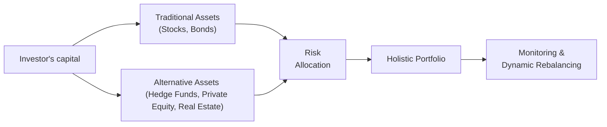

## Introduction and Rationale

Let’s start by thinking about a friend of mine—someone who was quite nervous about stepping into the realm of alternative investments. He had always been comfortable with the good old 60/40 stock-bond split, but after experiencing a few market drawdowns, he felt that maybe, just maybe, there was more to portfolio stability than large-cap equities and Treasury bills. That’s where blending traditional and alternative assets comes in. 

Yes, we’re talking about hedge funds, private equity, real estate, infrastructure, and commodities—those fancy-sounding things that often feel mysterious, if not downright intimidating. The aim of combining these with traditional investments is to build something akin to an “all-weather portfolio.” Sound fancy? It’s basically a portfolio designed to perform reasonably well under diverse market conditions. This approach tries to smooth out the big dips and spikes that can happen when you’re fully concentrated in one market theme or asset class.

We’ll explore how to blend these assets in a way that supports your risk tolerance, time horizon, liquidity needs, and return objectives. By the end of this reading, you’ll see how factor exposures, scenario testing, and dynamic rebalancing all fit together to create a portfolio that—hopefully—keeps you sleeping well at night, no matter how rough the market seas get.

## Strategic Asset Allocation with Alternatives

When we say “strategic asset allocation,” we’re referring to that higher-level plan for dividing up your capital into major asset categories. You decide, for example, how much to put in equities, fixed income, real estate, or private equity. If you’re short on liquidity, you probably won’t want to allocate too much to alternatives with lengthy lockups. But if you have a long time horizon—maybe a big pension plan or an endowment that can ride out illiquidity—then bigger allocations to private equity or infrastructure might be just the ticket.

A big driver for including alternatives is the quest for diversification. Ideally, these new allocations add return streams that aren’t tightly correlated with stocks and bonds. In reality, during crisis periods, correlations can spike, but over a long cycle, alternatives often offer exposure to different economic drivers. They might earn returns from, say, credit spreads, property cash flows, commodity price movements, or specialized hedge fund strategies.

Think about it in terms of risk budgeting. You only have so much risk you can tolerate. By adding alternatives, you’re aiming to reallocate your risk in a way that suits your goals. Traditional assets might give stable returns in some scenarios but can take a beating in market downturns (like a sudden equity crash). Alternatives can help cushion that blow—though be mindful that every alternative asset has its own complexities, fees, and manager-specific risks.

### Proportioning the Mix

How much to allocate? Well, that depends on a few factors:  
• Your liquidity constraints (private equity and real estate typically have capital calls and multi-year lockups).  
• Your personal or institutional risk tolerance.  
• Your time horizon (longer horizons often benefit from illiquid alternatives).  
• Your target returns.  

Some investors might do a modest 10%–20% in alternatives. Others (like big endowments) might go 40% or more. The big rule of thumb is: Don’t just chase returns without fully understanding the nature of each alternative strategy.

## Factor-Based Integration

Many practitioners now talk about factor-based approaches. Rather than seeing the world as “public equity vs. private equity” or “investment-grade bonds vs. alternative credit,” factor-based allocation tries to unify these exposures around common risk premia, like:

• Value (buying assets deemed cheap relative to fundamentals)  
• Momentum (buying assets with recent upward price trends, shorting those with downward trends)  
• Carry (seeking yield differentials)  
• Low volatility (favoring assets that historically exhibit smaller price moves)  
• Quality (holding firms with strong balance sheets, stable cash flows)  
• Credit risk (earning spreads from corporate or structured credit)  

If a private equity manager invests in undervalued companies, that might be akin to a “value” or “quality” factor. A macro hedge fund employing trend-following strategies might overlap with “momentum.” By identifying the factor exposures across both traditional and alternative allocations, you can see if your portfolio is inadvertently overexposed to certain risks. 

Why does this matter? Because blending factors is often more stable than placing giant bets on a single style. The synergy from adding complementary factors can lead to a smoother overall return path. Plus, you can spot areas of duplication: a real estate fund relying on credit spread carry might behave similarly to certain high-yield bond strategies in your conventional fixed income portfolio.

To illustrate the notion of factor-based design, you can think about a multi-factor model:


R_{portfolio} = \alpha + \beta_{Mkt} \cdot R_{Mkt} + \beta_{Value}\cdot F_{Value} + \beta_{Size}\cdot F_{Size} + \beta_{Credit}\cdot F_{Credit} + \cdots + \epsilon


Here, each \\( \beta \\) represents how sensitive the portfolio is to each factor or risk premium. Whether it’s a publicly traded equity factor or a private credit factor, the underlying idea remains the same: you’re measuring exposure to systematic drivers of return.

## Scenario Analysis and Stress Testing

So how do these portfolios hold up when markets get nasty? Scenario analysis is your friend. Think of it as running hypothetical “what if” events on your portfolio to see how it might fare in, say, a 2008-style credit meltdown, a burst of inflation, or an abrupt spike in interest rates.

Scenario analysis typically includes:  

• Historical scenarios: Rewinding the clock to replicate conditions like the Dot-Com Bust, the Global Financial Crisis, or the COVID-19 shock.  
• Forward-looking scenarios: Using macroeconomic assumptions to imagine new events (e.g., sustained stagflation, a big wave of geopolitical turmoil, or the rapid adoption of alternative energy displacing oil demand).  

In constructing these scenarios, pay special attention to your alternatives. Private funds might have “capital calls” at inopportune times—just when your public assets have dropped in value and you’re tight on spare cash. Stress testing reveals that liquidity risk. Real estate might take a while to mark to market, which can mask the true extent of losses in your portfolio. Commodity exposures might be hammered by certain supply shocks. By running all-weather scenario tests, you gain insights into how each building block reacts and determine if your portfolio can handle a rough environment.

A simple Python snippet could illustrate a forward-looking scenario for bond yield spikes:

```python
import numpy as np

traditional_bonds = np.random.normal(-5, 1, 10000)   # -5% average
stocks = np.random.normal(-2, 3, 10000)              # -2% average
private_equity = np.random.normal(-4, 5, 10000)      # -4% average
hedge_fund = np.random.normal(1, 4, 10000)           # +1% average

w_bonds     = 0.30
w_stocks    = 0.40
w_privEq    = 0.15
w_hedge     = 0.15

portfolio_returns = (w_bonds*traditional_bonds +
                     w_stocks*stocks +
                     w_privEq*private_equity +
                     w_hedge*hedge_fund)

print(f"Estimated mean portfolio return under +200 bps shock: {portfolio_returns.mean():.2f}%")
print(f"Estimated worst 5% percentile return: {np.percentile(portfolio_returns, 5):.2f}%")
```

The results (while hypothetical) highlight how the combined portfolio might respond to a big interest rate move—some parts might lose more, while a certain hedge fund strategy might eke out a positive return if it’s prepared.

## Ongoing Monitoring and Dynamic Rebalancing

Traditional assets are typically easy to rebalance. In contrast, with alternatives, you can’t just “push a button” and instantly buy or sell. As private equity funds identify new deals, they issue capital calls to investors to bring in new capital. Then, after several years or when an investment is sold, they return that capital—known as a distribution. These calls and distributions force you to think carefully about your liquidity and your ongoing exposures.

Dynamic rebalancing describes the periodic shifting of allocations to keep them in line with target weights. But trust me, it can get tricky with illiquid alternatives. Suppose your alternatives perform very well over two years; your target might say you only want 20% in alternatives, but now you’re at 30% because the underlying valuation soared. Your rebalancing approach must factor in whether you can trim that position (maybe you can’t) or if you should reduce your public equities or bonds to offset it. The interplay is more complex than rebalancing a purely liquid stock-bond portfolio.

In a “Holistic Portfolio View,” everything—traditional and alternative—must be considered together. You might maintain a liquidity bucket of short-term fixed income or cash to handle capital calls and avoid being forced to sell equity at a bad time. This approach ensures that your entire risk budget is allocated exactly where you want it.

Below is a simple Mermaid diagram depicting how capital flows and rebalancing might occur:



## Performance Measurement and Style Drift

Measuring overall performance in a combined portfolio is more than just checking your public market returns. You want to see how the alternatives contribute relative to their stated objectives. If a hedge fund is supposed to provide downside protection in equity bear markets, test its performance in those down periods. If a private equity manager promised outperformance over the public equity market, compare results with a public market equivalent (PME) measure. 

Another key issue is style drift—when, for example, a hedge fund that claims to be market-neutral starts taking directional bets on technology stocks. This drift might increase the overall risk profile of the portfolio without you realizing it. Ongoing oversight is crucial, typically with monthly or quarterly reports that identify any drift from the manager’s stated style.

One concept you’ll hear about is alpha pooling—aggregating all the skill-based returns across different managers to see if, collectively, those idiosyncratic alpha sources are adding up or cancelling out. By evaluating each alternative manager’s performance net of fees, you can see if you’re truly capturing alpha, or merely paying for market beta exposures you could get more cheaply in public markets.

## Governance and Transparency

Whenever you mix a bunch of different asset classes, risk acceptance levels, and managers, you need a solid governance structure. We’re talking about robust investment committees, carefully spelled-out Investment Policy Statements (IPS), and documented processes for approving new managers or strategies. These committees are often tasked with ensuring everything aligns with your strategic asset allocation and risk budget. They also serve to keep you accountable—no sneaking huge bets into the portfolio that the committee hasn’t approved.

Governance also helps with transparency, making sure that fees are clear and that risk exposures are well-understood. In some alternatives, especially private equity and hedge funds, fee structures can be complicated (think management fees, performance fees, hurdle rates, clawbacks, and so forth). A well-defined governance process ensures you’re not caught off guard by unplanned costs, style drift, or liquidity demands.

## The Role of Manager Selection

I remember someone joking that in alternative investing, “Manager selection is 80% of the job.” Is that an exaggeration? Maybe a bit. But it’s undeniably significant. Hedge funds, private equity, and real estate managers can have widely varying performance. The difference between a first-quartile and a third-quartile private equity fund can be massive—and that difference dwarfs what we usually see with large-cap equity managers.

Due diligence is essential. You might examine:  
• The manager’s track record and the environment in which it was achieved.  
• The strategy’s business cycle sensitivity.  
• The depth and stability of the team.  
• Operational and compliance frameworks (you don’t want to discover a surprise scandal).  

Idiosyncratic alpha is what investors hope for—a manager’s unique edge. Maybe they have specialized knowledge in certain industries or use signals that aren’t widely followed. However, capturing this alpha often involves paying higher fees, which must be justified by net returns. Repeating the due diligence process and ensuring that new managers added to the portfolio truly add diversification or alpha, rather than crowd you into the same old beta exposures, is an ongoing responsibility.

## Putting It All Together

The heart of combining traditional and alternative strategies lies in forging a balanced, risk-conscious approach. By using factor-based frameworks, scenario testing, and dynamic rebalancing, investors can position themselves to weather a variety of market climates. Yes, there’ll be times—it’s almost inevitable—when these fancy alternative allocations might disappoint. Meanwhile, there might be years when they shine, especially if equity markets are in turmoil or if interest rates are rising quickly.

Still, the real magic is in maintaining discipline. You want to keep an eye on style drift, measure true alpha net of fees, and keep a governance framework that ensures everyone is on the same page. It’s the difference between a random “shotgun approach” to investing in alternatives versus a carefully cultivated orchard of well-chosen strategies.

## Exam Tips for CFA® Candidates

• Make sure you can articulate how and why alternative assets can diversify a traditional portfolio.  
• Understand the nuances of liquidity and lockup periods, especially how capital calls and distributions affect rebalancing.  
• Be comfortable with factor-based approaches and how they integrate across public and private markets.  
• Be ready to discuss scenario testing rationale and outcomes.  
• Governance and manager selection can show up as scenario-based questions—know the best practices.  
• Practice calculating net returns for private equity or hedge funds and measure them against a relevant benchmark.  

## References

• CFA Institute: Portfolio Management – The Big Picture.  
• Gibson, R.C. (2013). Asset Allocation, Balancing Financial Risk.  
• Bridgewater Associates materials on all-weather and risk-parity portfolios.  

## Test Your Knowledge: Combining Traditional and Alternative Strategies Quiz



### Which of the following best describes an "all-weather portfolio"?  
- [ ] A portfolio focused strictly on safety assets, such as short-term Treasuries.  
- [x] An investment approach aimed at performing across diverse economic and market conditions.  
- [ ] A portfolio limited exclusively to private equity investments in all economic climates.  
- [ ] A fully passive portfolio that tracks a global equity index.  

> **Explanation:** The term “all-weather portfolio” generally refers to a strategy designed to remain resilient through multiple market environments.  

### In risk budgeting, which of the following is most accurate?  
- [x] It distributes allowable risk exposures across asset classes or managers to meet return objectives.  
- [ ] It involves borrowing at low rates and investing at higher rates to secure arbitrage profits.  
- [ ] It reduces total portfolio risk to zero.  
- [ ] It mandates equal investment in all asset classes.  

> **Explanation:** Risk budgeting deals with how much risk can be allocated to each strategy or asset class within a set tolerance.  

### Dynamic rebalancing is particularly challenging with which type of investment?  
- [ ] Large-cap equity ETFs.  
- [x] Illiquid alternative investments with capital calls.  
- [ ] Short-duration government bonds.  
- [ ] Money market funds.  

> **Explanation:** Illiquid alternatives often cannot be quickly rebalanced due to contractual lockups and sporadic capital calls/distributions.  

### A factor-based approach to combining traditional and alternative investments focuses on:  
- [ ] Switching all asset classes into index funds.  
- [ ] Allocating only to high-yield bonds.  
- [x] Identifying shared risk premia like value, momentum, or credit.  
- [ ] Eliminating any correlation across portfolio assets.  

> **Explanation:** Factor-based techniques unify exposures by examining risk premia rather than simply labeling assets as “traditional” or “alternative.”  

### Which statement about manager selection in alternative investing is correct?  
- [x] Manager selection can dramatically influence outcomes due to significant performance dispersion.  
- [ ] Manager selection always has a negligible impact, as beta dominates.  
- [ ] Operational due diligence is not needed for established hedge funds.  
- [ ] Private equity managers cannot generate alpha over a public benchmark.  

> **Explanation:** The spread between top-quartile and bottom-quartile managers in alternatives is often large, making thorough due diligence crucial.  

### What is a capital call in the context of private equity?  
- [x] A request from the private fund to its investors to provide previously committed capital.  
- [ ] Money automatically provided by the government in financial crises.  
- [ ] The final step before distributing returns to investors.  
- [ ] A mandatory quarterly distribution from the private equity fund to the investor.  

> **Explanation:** Capital calls occur when the fund has an investment opportunity and calls upon the pledged commitments from its investors.  

### Under scenario analysis, a “forward-looking scenario” typically does what?  
- [ ] It strictly uses historical data from past recessions.  
- [x] It hypothesizes potential future economic events that haven’t yet occurred.  
- [ ] It only measures interest rate sensitivity and ignores other factors.  
- [ ] It is identical to a backtest of hedge fund performance.  

> **Explanation:** Forward-looking scenarios explore how a portfolio might react under hypothetical future conditions, such as a novel stagflation event.  

### If a hedge fund experiences style drift, which of the following is the most likely outcome?  
- [ ] It becomes more transparent and easy to analyze.  
- [ ] It reduces the possibility of losing money in down markets.  
- [x] It may take on new risk exposures outside its originally stated mandate.  
- [ ] It automatically improves alpha generation.  

> **Explanation:** Style drift can compromise the original investment thesis by exposing the fund to unapproved or unexpected risks.  

### Which best defines “idiosyncratic alpha”?  
- [x] Returns a manager generates through unique skill or specialized insight, beyond market-driven beta.  
- [ ] The risk-free rate of return plus a liquidity premium.  
- [ ] The required return on public equity.  
- [ ] The standard systematic risk premium associated with broad markets.  

> **Explanation:** Idiosyncratic alpha is manager-specific skill-based return, distinct from general market fluctuations.  

### True or False: In an all-weather portfolio, ongoing governance and oversight are less critical since alternative managers make most decisions.  
- [x] True  
- [ ] False  

> **Explanation:** Actually, this statement is tricky—ongoing governance and oversight remain extremely important, even in an all-weather context. Relying too heavily on manager decisions without oversight can lead to unmonitored risk and style drift.  


