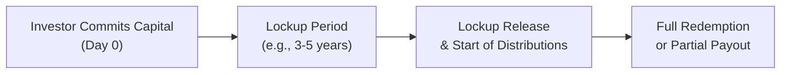

## Introduction

Illiquidity can feel like a scary concept—basically, when you can’t freely buy or sell an investment as quickly as you’d like without affecting its price too much. When we chat about alternative assets in a portfolio, this idea of being “stuck” with certain securities or fund structures for a while comes right up. Why do people do it then? Well, it might be because holding a not-so-liquid asset class—whether that’s a private equity fund, hedge fund with redemption restrictions, or a real estate partnership—can lead to greater returns or better diversification. Of course, it’s not guaranteed.

Anyway, we’ll walk through the essentials of illiquidity, highlight how lockup periods in alternative funds operate, and discuss how everything fits into your overall portfolio planning. In other words, how do we juggle the positives (potential for higher returns or unique exposures) with the potential negatives (inability to get your money out fast if the unexpected happens)? Along the way, we’ll tie these concepts to risk management, scenario testing, and good old-fashioned exam tips.

## The Risk–Return Trade-Off of Illiquid Investments

You know how some of our friends say, “Why would I ever invest in something I can’t sell tomorrow if I need the money?” That’s the main question. The short answer is that there might be a higher reward for giving up liquidity. Investors usually demand a premium—often called the “liquidity premium”—to park their capital in assets that cannot be easily turned into cash. If you think of the typical return difference between a public equity investment and a private equity fund, part of that difference might (in theory) come from investors demanding extra compensation for tying up their capital over years.

In financial terms, you can conceptualize it like:

$$
\text{Liquidity Premium} = r_{\text{Illiquid Asset}} - r_{\text{Liquid Asset}}
$$

If you’re setting up a portfolio, you might say, “Alright, I’ll accept a 3–5% higher annualized expected return to invest in a private equity fund, but I know I can’t just snap my fingers to rebalance if the stock market does something crazy.” In a typical scenario, the liquidity premium is meant to offset:

• The potential cost if you need to exit prematurely.  
• The inability to capture short-term rebalancing opportunities.  
• The discomfort and risk of not having daily or weekly liquidity.

Many alternative investments—like venture capital or real estate development—actually need plenty of time to play out. For instance, a real estate manager invests in an office building, redevelops it, then sells it a few years later. If you forced them to give your money back next month, that would hamper their entire strategy. Thus, there’s often a synergy: the investor’s willingness to accept longer lockups (in exchange for a hopefully higher return) aligns with a manager’s desire for a stable capital base.

## The Role of Lockup Periods in Alternative Funds

Lockup periods are exactly what they sound like: a set timeframe during which you, as the investor, can’t withdraw your capital. Think private equity, hedge funds with side pockets, or certain specialized real asset funds. You might see a hedge fund that says, “Your capital is locked up for at least a year, and after that, you can only redeem quarterly with 60 days’ notice.” That means if you have a sudden cash flow need—maybe there’s a large tax bill or property purchase—pulling out the funds quickly isn’t an option.

To visualize this, let’s look at a small mermaid diagram that outlines different timelines in a hypothetical private equity setup:



During that lockup, the fund may call capital in stages to invest in deals (for instance, a leveraged buyout or venture financing round). Once the lockup ends, distributions slowly get returned to you based on how those deals pan out. 

• Shorter lockup periods can be found in certain alternative strategies, like some hedge funds with monthly liquidity, but they might charge higher performance fees or have a slower redemption schedule with gating features.  
• Longer lockups, like in private equity or real estate, can stretch for several years or more.  

For investors, the lockup arrangement should fit your overall liquidity needs. If you’re investing on behalf of a long-term institution—like a university endowment (remember the famous Endowment Model championing high allocations to alternatives)—you might feel comfortable locking up those funds for extended periods.

## Matching Liquidity Requirements with Redemption Schedules

A big aha moment for many folks is realizing that liquidity is fundamental to building a robust portfolio plan. One of my friends (who invests on behalf of a small foundation) learned this the hard way. They wanted the foundation’s capital to grow, so they invested heavily in a hedge fund with a one-year lockup. But then a large operational expense cropped up six months later, and guess what? They couldn’t redeem. The result: they had to raise cash from other sources at unfavorable times.

That’s precisely why we emphasize linking portfolio liquidity with an investor’s actual or potential cash flow needs. For any alternative investment with limited redemption opportunities, be sure to ask:

• How often can I redeem? Monthly, quarterly, or annually? Is there a redemption notice period (e.g., 90 days)?  
• Is there a gate—meaning the fund can limit how much can be redeemed during times of high withdrawal requests?  
• Is there a lockup extension clause that allows the manager to hold on for another year or two?

You need to plan for worst-case scenarios. If markets are turbulent, or if your foundation/pension/endowment must cover certain liabilities (like a pension payout), you might face real heartbreak if most of your fund is locked up. So it’s critical to structure your portfolio so the illiquid piece is sized appropriately, and the rest of your liquid portion can handle typical (and atypical) cash needs.

## Extended Investment Horizons and Manager Strategies

Why do some managers ask for long lockups? They want to implement multi-year strategies. That’s especially true in private equity: a buyout fund may acquire a company, revamp management, pivot the business model, and expect to exit five or seven years down the road. Private equity managers argue that the waiting game is crucial to unlock value.

It’s not exclusive to private equity. Even certain hedge funds—like distressed debt or event-driven strategies—thrive on longer lockups because they might buy slightly illiquid securities, wait out a legal process, or need the manager’s expertise for operational turnarounds. If you’re an investor with a sufficiently long horizon, you can benefit from these inefficiencies. And that’s part of the argument behind the so-called Endowment Model: large institutions with a near-perpetual horizon can ride out the ups and downs of illiquid strategies, capturing that extra premium.

Of course, this can backfire if managers are ill-prepared, if the macro environment shifts dramatically, or if the underlying investments turn sour. That’s where robust due diligence and risk analysis come into play.

## Liquidity Constraints: Pricing, Valuations, and the Secondary Market

Another important dimension is that illiquid securities often don’t have daily or even monthly price quotes. Valuations might be updated quarterly or semi-annually, and occasionally through appraisal-based methods. That can dampen short-term volatility, at least on paper, because you’re not seeing minute-by-minute price swings. But it also means you might not know the real market value of your position until a new round of fundraising or an actual transaction sets a new pricing benchmark.

There is a secondary market for private fund interests, but it’s typically less efficient than the public markets. For example, you could attempt to sell your private equity partnership stake on a secondary platform—but you might need to accept a discount. Depending on market conditions, that discount might be modest or extremely steep. Part of the reason for that discount is that the buyer is taking on the same lockup risk and uncertain exit timeline.

Similarly, side pockets in hedge funds can hold truly illiquid or hard-to-value assets (like thinly traded securities). These can’t simply be redeemed on standard liquidity terms. In times of crisis, side pockets can balloon if market liquidity evaporates—limiting how much an investor can withdraw right away.

## Stress Testing and Scenario Planning

When forecasting your portfolio’s cash flows, especially for illiquid holdings, stress testing and scenario analysis aren’t optional—they’re essential. Specifically, you need to think about:

• Capital Call Timelines: Private equity funds may call capital at irregular intervals. Are you projecting different scenarios where calls come faster (or slower) than expected?  
• Distribution Delays: The fund might plan to exit positions in year five, but a poor market environment might push that to year seven or eight.  
• Secondary Market Pricing: During a downturn, can you realistically sell your stake at a decent price, or will you need to accept a deep discount?

Stress testing can be as simple as building “worst-case,” “base-case,” and “best-case” scenarios in a spreadsheet or, if you’re feeling more advanced, coding a quick simulation. For instance, a small Python snippet might look like this:

```python
import numpy as np

distribution_years = [4, 5, 6, 7, 8]  
probabilities = [0.2, 0.4, 0.2, 0.1, 0.1]  # Example probabilities

np.random.seed(42)
random_draws = np.random.choice(distribution_years, size=10000, p=probabilities)

late_distribution_pct = np.mean(random_draws > 5) * 100
print(f"Percentage of times distributions come after year 5: {late_distribution_pct:.2f}%")
```

A silly snippet, sure, but it helps highlight how often you might face a more extended lockup. If that’s 40% of the time, you must account for it in your liquidity planning.

## Aligning Portfolio Liquidity with Client Profiles

Throughout your CFA studies, you’ll hear over and over that “Investor objectives and constraints” are the cornerstone of portfolio planning (refer back to Chapter 4 on “The Investment Policy Statement (IPS) – Purpose and Components”). Liquidity is a constraint that’s intimately tied to your investor’s type and profile. For example:

• A pension fund paying regular benefits: They can handle some illiquid positions, but they still need enough liquidity to meet monthly outflows.  
• A sovereign wealth fund with a near-infinite horizon: They might be more tolerant of multi-year lockups.  
• A family office: If the family wants quick access or if they have unpredictable capital needs, they might want to limit illiquid allocations.  
• An endowment: Often used to multi-year capital commitments, but they still need to ensure they can make the annual spending draw for scholarships or federal grant matches.

In practice, you might combine a modest slice (say 20%) of illiquid alternatives with a healthy chunk of more liquid bond and equity investments to manage day-to-day (or year-to-year) demands. Stress testing ensures you’re not forced to sell illiquid assets at a discount under time pressure.

## Managing Illiquid Positions in Overall Portfolio Risk

Exam questions on illiquidity sometimes emphasize how these positions affect risk metrics like Value at Risk (VaR) or standard deviation. Because illiquid assets are not frequently marked to market, you might understate short-term volatility. On the flipside, if you measure risk using scenario-based approaches (like we recommended earlier), you’ll see the potential problem if you need capital at an inopportune moment.

Additionally, the locked-in capital can hamper your ability to quickly rebalance when markets shift. If equity markets plunge and you’d like to buy more stocks at a discount, you can’t free up the locked portion of your alternative assets for that reallocation. That rebalancing friction can be a big performance drag or an opportunity cost realized when markets turn.

## Concluding Thoughts

Illiquidity and lockup periods come with a wide range of implications—from returns to risk measurement to rebalancing constraints. In many ways, they are the “double-edged sword” of portfolio management. Let’s face it, you might hear alternative managers raving about these big, multi-year IRRs. But before you commit your capital (or your client’s capital), drive home the question: “Does this line up with our cash flow needs, risk tolerance, and strategic goals?”

Remember: illiquidity can be an opportunity if it suits your horizon. But always match these choices to the client’s actual present and future needs. If your client can’t pay tomorrow’s bills, that promised future gain won’t help them much in a pinch.

## Best Practices for the Exam

• Carefully consider the ability and willingness to bear illiquidity when drafting or evaluating an Investment Policy Statement (IPS).  
• Be prepared for item-set questions that detail a hypothetical pension or endowment’s liquidity requirements—especially if they mention large upcoming payouts or changing market conditions.  
• Show how you would apply scenario analysis to test if illiquid allocations might cause liquidity shortfalls.  
• In constructed-response (essay) questions, don’t forget to highlight both the benefits (diversification, potential higher returns) and the hazards (cash flow mismatch, rebalancing constraints) of illiquid positions.  

## Glossary

• Liquid vs. Illiquid Markets: Liquid markets allow you to rapidly buy/sell with minimal price impact (e.g., large-cap stocks). Illiquid markets might involve significant price swings or wide bid–ask spreads if you try to sell quickly (e.g., private equity stakes).  
• Redemption Notice Period: The advance notice you must give a fund before redemption. For instance, a 90-day notice period means you can’t redeem until three months after requesting it.  
• Secondary Market: An avenue to buy or sell pre-existing positions in alternative funds. It’s usually less liquid and can involve discounts.  
• Side Pocket: A pool within a hedge fund that separates illiquid holdings, limiting redemptions from those particular assets.  
• Endowment Model: A strategic approach, often associated with large university endowments, emphasizing heavy allocations to long-term illiquid alternatives.  
• Cash Flow Forecasting: Estimating inflows and outflows including capital calls, distributions, or forced redemptions.  
• Lockup Release: The end date of the lockup period, after which redemption or partial withdrawals become possible.  
• Liquidity Premium: The extra expected return an investor demands for tying up capital in illiquid assets.

## References and Further Reading

• CFA Program Curriculum – “Institutional Investors and Asset Allocation” sections  
• “Managing Illiquid Assets,” TIAA Institute research  
• Preqin’s quarterly reports on private capital markets  

---

## Test Your Knowledge: Illiquidity and Lockup Periods in Portfolio Planning



### Which concept best describes the extra return investors demand for holding assets that cannot be quickly converted to cash?

- [ ] Redemption Notice
- [ ] Secondary Market
- [x] Liquidity Premium
- [ ] Side Pocket

> **Explanation:** The extra yield required by investors to compensate for holding less liquid assets is referred to as the liquidity premium.

### Which of the following is a potential disadvantage of holding higher levels of illiquid alternative assets?

- [x] Difficulty in rebalancing promptly
- [ ] Lower expected returns than public equities
- [ ] Reduced diversification potential
- [ ] No alignment with long-term objectives

> **Explanation:** A major drawback of illiquid alternatives is that you might be unable to rebalance when market conditions change, possibly missing out on market opportunities.

### An endowment fund with a perpetual time horizon can often benefit from illiquidity because:

- [x] It can afford to lock up capital for longer periods.
- [ ] It relies on high-frequency trading strategies.
- [x] It may capture higher returns through long-term investments.
- [ ] It needs daily liquidity for operational costs.

> **Explanation:** Such endowments typically have fewer short-term cash flow needs, allowing them to harness lockup periods for long-term growth.

### A hedge fund that separates hard-to-value assets so that redemptions do not affect their valuation is utilizing:

- [ ] Redemption Notice Period
- [ ] Lockup Release
- [ ] Gate Provision
- [x] Side Pocket

> **Explanation:** Side pockets are a mechanism that segregates illiquid or hard-to-value assets within a hedge fund, ensuring fair treatment of remaining and redeeming investors.

### Which of the following statements about lockup periods is correct?

- [x] They limit investor withdrawals for a predefined time.
- [ ] They guarantee no net asset value (NAV) fluctuations.
- [x] They help managers implement long-term strategies.
- [ ] They automatically reduce volatility in the portfolio’s reported returns.

> **Explanation:** Lockup periods restrain investors from pulling out money in the short run, allowing the manager to execute strategies that thrive on steady capital. While they may smooth reported returns, that’s not guaranteed in all market environments.

### In times of market stress, investors in an illiquid fund:

- [x] May find it difficult or expensive to redeem quickly.
- [ ] Will typically see a daily closing price for their shares.
- [ ] Can easily sell positions in high-volume exchanges.
- [ ] Are guaranteed to avoid losses.

> **Explanation:** By definition, illiquid funds can’t be readily sold in a pinch, and any secondary market sale might come at a steep discount.

### What is one primary risk of “side pockets” in hedge funds?

- [x] Investors may not be able to fully redeem at their preferred time.
- [ ] They completely eliminate manager discretion over illiquid assets.
- [x] They are always offered at a premium price on secondary markets.
- [ ] They lead to indefinite lockups for all fund assets.

> **Explanation:** Side pockets can lock up a portion of the fund and make it inaccessible until the illiquid assets are sold or valued fairly, delaying full redemption.

### When planning liquidity needs, a pension fund must particularly consider:

- [x] Ongoing benefit payments.
- [ ] Intraday margin calls.
- [ ] Daily employee lunch allowances.
- [ ] Guaranteed immediate redemption from alternative funds.

> **Explanation:** Pension funds typically pay out benefits on a regular schedule. Having enough liquidity in the portfolio to meet these obligations is crucial.

### Which method might help an investor gauge worst-case scenarios regarding lockup extensions or delayed distributions?

- [ ] Adjusting the nominal GDP forecasts
- [ ] Reading only historical fund performance reports
- [x] Conducting stress tests or scenario analysis
- [ ] Decreasing the risk premium

> **Explanation:** Stress testing and scenario analysis allow investors to anticipate potential problems—such as delayed distributions or extended lockups—under adverse market conditions.

### During a lockup period, an investor:

- [x] True
- [ ] False

> **Explanation:** True. The investor typically cannot redeem their investment or may face significant restrictions during the lockup period.


