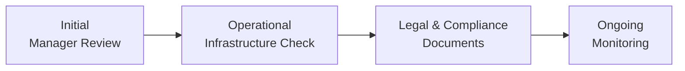

## Introduction
If you’ve ever had a friend who made a big investment decision based purely on a flashy marketing pitch—well, that’s exactly the kind of situation we want to avoid when discussing due diligence in the context of alternative investments. No one wants to be that person who invests first and asks questions later! Thoroughly investigating an alternative fund or manager is essential for protecting your portfolio from hidden risks and nasty surprises down the road.

In the realm of alternative investments—hedge funds, private equity, real estate, infrastructure, venture capital—the stakes are often high, transparency can be lower, and complexity is frequently off the charts. So in this section, we’ll walk through the essential components of a robust operational due diligence process. We’ll also look at how to assess a fund’s governance practices, review legal and regulatory documents, evaluate the firm’s technology and cybersecurity posture, and explore the importance of ongoing monitoring.

## Rationale for Due Diligence
You might be wondering: why spend so much time combing through documents, references, and management credentials? Isn’t it enough to just look at a historic return chart and decide if it meets our target? Well, maybe not. Alternative investment strategies can be less transparent than traditional equity or fixed-income portfolios. They might employ complex structures, use leverage, or operate in markets that are less regulated. Plus, even if a track record looks great, that performance might be the result of excessive risk-taking or, in the worst case, fraudulent activity.

Taking the time to conduct thorough operational due diligence helps ensure that:
• The fund’s performance claims are verifiable and in line with established benchmarks such as GIPS (Global Investment Performance Standards).  
• The managers running the fund have the right experience, integrity, and governance structure to steer it responsibly.  
• Adequate internal controls and compliance frameworks are in place to prevent operational mistakes and misconduct.  
• The investment strategy truly fits your objectives, risk tolerance, and broader portfolio context.

## Preliminary Background Checks and Manager Evaluation
### Manager Track Record and Strategy Consistency
One of the first steps is examining the manager’s performance history. And I mean more than just scanning a fancy chart in a pitch deck. You want to verify records with an external party, see if there is an independent audit, and confirm that the stated returns line up with typical market behavior for the chosen strategy.

• Look for consistency: Has the manager delivered returns consistent with the stated strategy, or is there evidence of style drift?  
• Check the length of the track record: Many managers can have a few lucky years. You want to see performance across multiple market cycles if possible.  
• Evaluate performance relative to peers and indexes: Ask yourself if strong returns are coming from skill or just from taking on more risk.

### Management Team Stability and Governance
Key-person risk should not be underestimated. Suppose an alternative fund revolves around a single star portfolio manager—and that star manager leaves for another firm, retires, or experiences prolonged health issues. The entire strategy might lose its edge overnight.

• Identify whether there is a stable team in place. A robust organization typically has multiple portfolio managers, analysts, and risk managers contributing to decisions.  
• Check how responsibilities are divided between “front office” (portfolio management) and “back office” (operations, compliance). Strong segregation helps with checks and balances.  
• Examine the fund’s governance structure. Does it have a board of directors, advisory committees, or external oversight with real authority?

### Verifying Credentials and Past Litigation
Sometimes we forget the simplest step—actually verifying the manager’s credentials. Yes, it’s tedious, but it’s important to confirm:
• Educational degrees.  
• Professional qualifications (like CFA charter, CAIA, etc.).  
• Past roles held at other firms.  
• Any litigation or regulatory actions that the manager or key personnel might have experienced.

A comprehensive background check, done across various databases and regulatory registrations, can help you spot red flags before investing a cent.

## Assessing Operational Infrastructure
### Compliance Systems and Controls
When I think about compliance, I picture a friendly guard at the front gate, politely making sure no one shady gets through. But effectively, compliance is a continuous process of ensuring that internal policies and external regulations are followed every day.

• Confirm that the manager has a dedicated compliance officer or compliance team (rather than assigning it as a side job to someone in finance).  
• Inquire about written policies and procedures. Do they have a compliance manual? Are staff thoroughly trained on anti-money-laundering rules, securities regulations, and ethical standards?  
• Evaluate how compliance incidents are reported and addressed. A transparent track record of swift remediation indicates a proactive culture.

### Underwriting Standards and Risk Management
For private equity or real estate funds, underwriting standards are especially critical. You want to see that they have clear guidelines for evaluating potential investments and that they apply these standards consistently.

• Ask for sample underwriting memos or a summary of the due diligence steps performed on prospective portfolio companies or properties.  
• Review the firm’s risk management framework. Does it use scenario analysis, stress tests, or other risk forecasting tools?  
• Determine how the manager deals with deviations from their expected risk parameters.

### Back-Office Operations
Almost every day, I’ll hear a colleague say something like, “We love the front office strategy, but is their back office set up to handle it?” The best investment strategy in the world can fail if the operational support—execution, trade settlement, record-keeping—is faulty.

• Check who is responsible for trade settlements, collateral management, and reconciliations. Do they have a well-trained operations team and effective systems in place?  
• Confirm whether they use reputable third-party administrators for accounting and valuation.  
• Investigate whether they have robust processes for verifying the prices of illiquid assets (e.g., real estate, private equity stakes).

## Internal Controls: Preventing Fraud and Misconduct
### Segregation of Duties
A classic control measure is ensuring that the person placing a trade is not the same person reconciling or settling it. A proper segregation of duties is crucial for detecting errors or anomalies. If a single person controls too many steps in the cycle, it opens the door to unauthorized trading or misappropriation of assets.

### Internal Audit and External Oversight
Many firms rely on internal auditors who periodically review controls and produce reports for senior management. However, external oversight can be equally essential. For hedge funds, prime brokers serve as a checkpoint for trade execution, financing, and securities lending. Third-party administrators monitor net asset value (NAV) calculations and handle routine communications with investors.

• Check the roles and reputation of any prime brokers, custodians, and auditors that the fund works with.  
• Consider verifying that the fund’s auditor is accredited, well-known, and truly independent.  
• Evaluate the frequency and depth of these external audits and how promptly the fund addresses any findings.

### Avoiding Conflicts of Interest
Conflicts of interest can show up in subtle ways. Maybe a manager is steering trades through a related brokerage at favorable rates, or a general partner in a private equity fund invests personal capital in a competing venture. By examining compliance policies and partner disclosures, you can get a sense of how conflicts are reported and mitigated.

## Reviewing Key Documents
### Subscription Documents and Offering Memoranda
It might sound less than thrilling to read these legal documents cover to cover, but it’s important to confirm the following:
• The manager’s stated investment objectives and strategies align with your expectations.  
• Fees (management fees, incentive fees, redemption fees) are clearly spelled out.  
• Restrictions or lock-up periods are not more stringent than you realized.

### Partnership Agreements
In the case of private equity or similar closed-end structures, the Limited Partnership Agreement (LPA) sets out the relationship between the general partner (GP) and limited partners (LPs). Make sure you note:
• GP’s powers to call capital and invest.  
• Distribution waterfall and carried interest.  
• Conditions under which the fund can be extended, changed, or terminated.  
• Dispute resolution mechanisms.

### Financial Statement Audits
Ideally, a robust audit from a reputable firm should confirm that the fund’s financial statements are prepared according to recognized standards (e.g., IFRS or US GAAP). Ask about any disclaimers or qualified opinions in those audits. And yes, it’s okay to get a second opinion if you see something that feels off.

## Regulatory Oversight and Industry Standards
### Role of Regulators
Depending on the jurisdiction, funds might be subject to securities regulators (like the SEC in the U.S. or the FCA in the UK). Regulatory filings can provide insight into any disciplinary actions or required disclosures. For instance:
• Form PF in the U.S. for hedge funds reveals details around leverage, liquidity, and risk exposures.  
• AIFMD (Alternative Investment Fund Managers Directive) in the EU introduces reporting requirements on risk and portfolio holdings.

### GIPS and Other Voluntary Frameworks
Some alternative managers opt to comply with the Global Investment Performance Standards (GIPS), even though it’s not always required. This demonstrates a willingness to provide transparent, standardized performance measurement. While GIPS compliance does not guarantee success, it indicates a higher level of commitment to accuracy in reporting.

## Key-Person Risk and Team Analysis
So let’s say you walk into a meeting and the lead portfolio manager lights up the room. She’s charismatic, super knowledgeable, and you feel good vibes all around. That’s wonderful, but you still need to do a deeper analysis. Is there enough bench strength to keep the fund afloat if she decides to step down?

• Confirm if the fund documents specify what happens if key personnel leave.  
• Evaluate the succession plan: Are other team members ready and able to take over?  
• Look at compensation mechanisms and retention strategies for key individuals.

## Technology, Cybersecurity, and Data Analytics
It’s impossible to ignore technology in modern hedge funds and private equity shops. Big data, AI-driven screening, algorithmic trading—these are now part of the everyday norm for many managers.

• Ask about the cybersecurity framework: Are the systems tested for vulnerabilities? Is there a culture of security awareness among employees?  
• Explore the data management process and find out whether the firm has robust data backups and disaster recovery plans.  
• For automated trading strategies, confirm that thorough testing and ongoing monitoring are in place to manage model risk.

## Ongoing Monitoring and Periodic Re-Evaluation
### Why Revisit Due Diligence?
Due diligence doesn’t end the moment you commit capital. Strategies evolve, key personnel might retire, and market conditions can shift drastically. Without a regular check-in, you might miss subtle signs of style drift or changes in risk profile.

• Maintain an ongoing schedule: At least annually, review the fund’s performance, compliance records, and major operational updates.  
• Check for changes in third-party service providers. Sometimes a transition to a less reputable auditor or prime broker could be a red flag.  
• Evaluate whether the fund’s strategy is still relevant and aligned with your portfolio goals.

### Style Drift and Red Flags
Keep your antenna up for signs that the manager is straying from the original strategy. Maybe they’re investing in new asset classes or employing more leverage than usual—such changes can significantly alter risk and potential returns.

• Look for unusual changes in portfolio turnover, concentration, or asset type.  
• Check if risk exposures (e.g., sector or geographic allocations) have shifted dramatically.  
• Monitor how the manager communicates these changes and whether they have the approval of clients or boards.

## Practical Example: Identifying a Potential Red Flag
Picture this scenario: A colleague of mine once invested in a hedge fund where the manager had a solid five-year track record trading convertible bonds. Then after a couple of quarters with lackluster returns, we learned (through an industry contact) that the manager started dabbling in emerging market debt—without making an official announcement to investors! This was a classic case of style drift, and it raised real concerns about whether the manager was chasing returns where they lacked expertise. After further reviews and discussions with the back office, my colleague decided to redeem the position. Moral of the story? Even solid historical performance doesn’t guarantee the manager won’t pivot into unknown territory.

## Diagram: Operational Due Diligence Workflow

This diagram highlights a simplified workflow often followed in operational due diligence. You start with an initial manager review (track record, strategy, key individuals), then proceed to an in-depth check of operational systems, next verify and cross-reference all legal and compliance aspects, and finally keep monitoring the investment to spot any changes or misalignments over time.

## Best Practices and Common Pitfalls
• Best Practice: Set up a checklist-based approach and ensure it’s consistent across all managers being reviewed.  
• Best Practice: Involve legal, accounting, and compliance experts early in the process.  
• Pitfall: Overreliance on a single data source or single performance metric.  
• Pitfall: Failing to follow up on red flags or unresolved concerns from prior audits.  
• Pitfall: Inadequate monitoring after investing, leading to unpleasant surprises if the manager drifts or personnel changes occur.

## Conclusion and Exam Tips
Due diligence for alternative investments is not a “one-and-done” process. It involves comprehensive initial screening, a deep dive into operational structures, ongoing scrutiny of governance and compliance, plus continuous verification that the investment strategy remains consistent with your objectives. In exam settings, you might see questions on how to prioritize different due diligence steps, identify key-person risk, or interpret the implications of style drift.

As you prepare for exam questions (particularly in item set or scenario-based formats), remember to:
• Connect operational due diligence concepts to real-world examples—like inadequate back-office systems or questionable management credentials.  
• Show understanding of how governance structures and compliance frameworks factor into controlling operational risk.  
• Demonstrate awareness of how changes in key personnel or strategy can fundamentally alter risk-return dynamics.

Being able to outline a thorough approach to due diligence, and to articulate why each step matters, is a clear sign you’ve grasped the big picture of risk management in alternative investments.

## References and Further Reading
• Scharfman, Jason. “Operational Due Diligence: Hedge Funds and Private Equity.” Wiley, 2018.  
• Alternative Investment Management Association (AIMA). “Guide to Sound Practices for Hedge Fund Administrators.”  
• CFA Institute. “Global Investment Performance Standards (GIPS).”  
• CAIA Association. “CAIA Level II: Current and Integrated Topics on Alternative Investments.”  

## Glossary
• Key-Person Risk: Heavy dependence on one or few individuals for investment decisions, making the fund vulnerable if those individuals depart.  
• Style Drift: A shift away from the manager’s original investment style or strategy, potentially altering the risk/return characteristics.  
• GIPS (Global Investment Performance Standards): Voluntary performance reporting guidelines to ensure consistency and comparability across managers.  
• Compliance Framework: A set of internal policies and procedures ensuring adherence to regulations and ethical standards.  
• Third-Party Administrator: An external provider handling fund accounting, financial reporting, and investor communications to improve transparency.  
• Prime Broker: A brokerage offering essential services (e.g., trade execution, financing, securities lending) to hedge funds or large institutions.  
• Front Office / Back Office: “Front office” typically includes portfolio management and trading; “back office” refers to operations, settlements, record-keeping, and compliance.  
• Fund Auditor: An independent accounting firm responsible for verifying the fund’s financial statements and ensuring accuracy of disclosures.

---

## Test Your Knowledge: Due Diligence & Operational Considerations Quiz



### Which of the following best describes operational due diligence for an alternative fund manager?
- [ ] A one-time review of the manager's financial statements.
- [ ] An informal conversation with the portfolio manager about their trading strategy.
- [x] A thorough and ongoing evaluation of back-office processes, compliance, and governance structures.
- [ ] A subjective review of marketing materials prepared by the fund.

> **Explanation:** Operational due diligence goes beyond a single review of statements or a casual conversation. It involves a comprehensive look at the manager’s infrastructure, governance, compliance, and more, monitored over time.

### When assessing style drift, which factor is most indicative that a manager may be shifting away from their stated investment approach?
- [ ] Consistently matching sector allocations to a benchmark.
- [ ] A longer-than-usual lock-up period.
- [ ] Stable fee arrangements.
- [x] Significant change in asset exposures compared to historical norms.

> **Explanation:** Style drift becomes evident when there are noticeable changes in the manager's holdings or exposures that don’t align with the original strategy. Lock-up periods, fee structures, or sector allocations matching a benchmark are less direct indicators of drift.

### What is the primary role of a third-party administrator in the context of hedge funds?
- [ ] Hiring and firing investment managers.
- [x] Handling fund accounting and valuation while providing investor reporting.
- [ ] Providing leverage to investors.
- [ ] Determining overall investment strategy.

> **Explanation:** Third-party administrators are typically responsible for fund accounting, investor communications, and valuation services, helping ensure transparency and reducing conflicts of interest.

### Which scenario might raise concerns about key-person risk in a private equity fund?
- [ ] A fund that has a well-defined succession plan in place.
- [ ] A general partner who is bound by non-compete agreements.
- [ ] A senior partner leaving, but multiple partners remain highly experienced.
- [x] A single star manager controlling all investment decisions with no succession plan.

> **Explanation:** If a fund relies heavily on a single individual with no backup structure, key-person risk is significantly elevated.

### An investor reviewing a hedge fund’s back-office operations should be particularly concerned if:
- [x] Trade settlement and portfolio reconciliation are performed by the same individual.
- [ ] The fund’s prime broker is a reputable firm with a strong track record.
- [x] The compliance team reports directly to the board of directors.
- [ ] The fund uses a well-known third-party administrator.

> **Explanation:** When one individual handles multiple critical tasks like trade settlement and reconciliation, there is inadequate segregation of duties. This is a classic operational risk vulnerability.

### What is the best reason for periodic re-evaluation of an alternative fund manager?
- [x] Strategies and market conditions evolve, and personnel changes can affect risk profiles.
- [ ] Managers usually prefer to update documents frequently.
- [ ] Investors need to confirm fee structures have increased.
- [ ] Regulatory requirements expire after a set timeframe.

> **Explanation:** Continuous monitoring is key because managers, strategies, and market conditions can change over time, raising new risks or concerns.

### Which of the following documents typically defines the relationship between general and limited partners in a private equity fund?
- [ ] Offering memorandum
- [x] Limited Partnership Agreement (LPA)
- [ ] Annual letter to investors
- [ ] Audit opinion letter

> **Explanation:** The LPA spells out the terms and responsibilities for both the GP and LPs, including capital calls, distributions, fees, and so forth.

### Which of these red flags could indicate operational control issues at a hedge fund?
- [x] Frequent changes in third-party auditors and administrators.
- [ ] Expanding the compliance team as the fund grows.
- [ ] Offering memoranda that clearly define risk tolerances.
- [ ] Consistent style of reporting and net asset valuation processes.

> **Explanation:** Frequent turnover of auditors or administrators can be a sign of deeper operational or financial issues, making it a potential red flag.

### How does GIPS compliance benefit investors who are evaluating alternative investment managers?
- [x] It fosters comparability and transparency in performance reporting across managers.
- [ ] It guarantees that the fund’s investment strategy will never change.
- [ ] It assures that all funds must use the same lock-up periods.
- [ ] It eliminates the risk of fraud in performance reporting.

> **Explanation:** GIPS compliance helps create a standardized way of measuring and presenting performance, enhancing comparability and transparency. However, it doesn’t eliminate all risks such as fraud or strategy shifts.

### True or False: A prime broker’s role includes guaranteeing that all fund trades comply with local regulations.
- [ ] True
- [x] False

> **Explanation:** A prime broker provides services like securities lending, trade execution, and financing. They do not inherently guarantee regulatory compliance—that responsibility ultimately rests with the fund’s management and compliance infrastructure.


