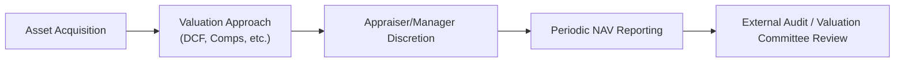

## Introduction

Valuing alternative investments can sometimes feel like one of those mysterious recipes passed down through generations—everyone tweaked their own secret ingredient, and no one sees exactly what’s going on in the kitchen. Whether we’re dealing with private equity, hedge funds with offbeat strategies, or that gorgeous commercial real estate property a buddy insists will “double in a few years,” the truth is that measuring fair value is rarely straightforward in these asset classes. If you’ve ever looked at a private fund’s quarterly statement and wondered, “Is this number really accurate?”—you’re already familiar with the challenges at hand.

This section explores the nuances—and occasional pitfalls—of valuing alternative investments. We’ll look at the processes, the illusions (like “stale pricing”), and the best practices for navigating them with confidence. We’ll also sprinkle in some personal anecdotes and cautionary tales along the way, because, well, you know, theory can only take us so far before real-world complexities kick in.

## Why Valuation Is So Challenging in Alternatives

Learning about alternative asset valuation can be a wake-up call compared to traditional equities or bonds. With public stocks, there’s (usually) a constant stream of traded prices. For private equity, real estate, venture capital, distressed debt, or certain hedge fund positions, you may have:

• Scarce market data: Limited comparables, few transactions, or none at all.  
• Manager discretion: Sometimes, the same asset might be assigned different values by different fund managers.  
• Illiquidity: If there’s no active market, how do you pin down a price?  

When you’ve got so many moving parts—and so little transparency—things can get messy. But it’s not all gloom and doom: a solid understanding of valuation processes can help ensure you’re not flying blind.

## Common Valuation Methods

### Discounted Cash Flow (DCF) Analysis
DCF is that friend who tries to rationalize future outcomes with precise equations. It projects an asset’s future cash flows and discounts them back to the present using a required rate of return. 

• Strengths: Thorough, forward-looking, flexible in modeling different scenarios.  
• Weaknesses: Highly sensitive to assumptions about growth rates, discount rates, and terminal values.

### Comparable Multiples
Comparable multiples (or “comps”) is a go-to approach, especially in private equity. You estimate value by looking at similar companies that trade on public exchanges or have been acquired at certain multiples of EBITDA, revenue, or net income.

• Strengths: Easier to apply if good “peers” exist.  
• Weaknesses: If you pick the wrong comps—or the comps themselves are overpriced or underpriced—you can end up with a skewed view.

### Net Asset Value (NAV)
Many funds use NAV to present an estimate of the market value of their holdings. Typically updated on a monthly or quarterly basis, NAV aggregates the fair values of all underlying assets.

• Strengths: Straightforward in concept.  
• Weaknesses: Relies heavily on manager judgments and can lag behind real market conditions, leading to “stale pricing.”

## Manager Discretion and Conflict of Interest

In some real estate partnerships or private equity shops, a manager might choose an appraisal-based valuation method that keeps things stable over time. That might sound good—nobody likes red ink on their statements—but it can mask genuine fluctuations in the underlying market. If managers earn performance fees, they may (hopefully a minority) choose assumptions that inflate or smooth out returns. Conflicts of interest are precisely why independent valuations matter. 

I recall an instance where I was reviewing a private real estate fund’s annual report—the manager was showing unbelievably steady returns, quarter after quarter, despite a pretty volatile real estate market. Turned out they were using a year-old appraisal even though the market had clearly deteriorated. That’s a classic example of how old or “stale” pricing can creep into official numbers.

## Stale Pricing and Smoothing Effects

### Stale Pricing
One of the hallmark terms you’ll hear is “stale pricing”—it occurs when the reported valuation of an asset does not reflect recent market movements. Why does that happen? Infrequent trading, occasional external appraisals, or lengthy intervals between transaction events.  
• Example: A private equity stake in a startup valued at $10 million (based on last year’s funding round). Meanwhile, the macro environment changes drastically, but the official valuation remains stuck for months.

### Smoothing Effect
Illiquid or appraisal-based valuations can result in artificially low volatility in performance reports. When there’s no rapid-fire exchange of buy and sell orders, daily price swings don’t show up, so the standard deviation of returns appears smaller. This phenomenon can mask the true risk profile of a portfolio and distort metrics like Sharpe ratios.

## The Role of External Appraisers and Valuation Committees

Many institutional investors require third-party valuations for illiquid assets, especially in private equity, commercial real estate, or infrastructure. Valuation committees (often part of a fund’s governance) might convene to review these appraisals and ensure they align with fair market principles. Ideally, these committees reduce the risk of one person’s bias dominating the numbers.

Still, it’s worth noting that external appraisers typically use the same approaches (DCF, comparables, or net asset-based analyses). If the data they receive from the fund manager is incomplete or biased, the final number might not be as “independent” as we’d hope.

Below is a simplistic diagram of a typical valuation process flow in alternative investments:

## Regulatory and Accounting Frameworks 

### IFRS and US GAAP
Both IFRS (International Financial Reporting Standards) and US GAAP (Generally Accepted Accounting Principles) provide guidelines for fair value measurement of illiquid investments. IFRS 13, for example, outlines a framework that includes three “levels” of inputs:

• Level 1: Quoted market prices in active markets.  
• Level 2: Observable market data (like reference to comparable assets).  
• Level 3: Unobservable inputs (like internal estimates or models).

In the context of alternatives, we often see a lot of Level 3 valuations, which rely more on assumptions or manager estimates than on direct market quotes.

### Audit Adjustments
Auditors review the evidence behind a fund’s valuations. If they find the manager’s assumptions too optimistic or insufficiently supported, they might propose adjustments. In certain hedge fund structures, the manager’s share of performance fees can hinge on these final valuations, adding another layer of complexity for the auditor to make a truly independent assessment.

## The Concept of Beta to Public Markets

One fascinating aspect of alternative investments, especially private equity, is that the reported returns often have a lower correlation with public markets—on paper, at least. However, part of that phenomenon can be due to delayed or stale valuation data, rather than genuine insulation from market cycles. If we adjust for infrequent or lagged valuations, we often discover that these investments are more sensitive (and more correlated) to broader public markets than their official track records suggest.

In other words, the “true” beta may be higher than the reported beta, and the “true” volatility may be greater than the official published figures. That discrepancy can lead to suboptimal portfolio choices if an investor treats alternative assets as if they have minimal correlation to equities or other core holdings.

## Discounts for Lack of Liquidity (DLOM)

When performing fair value measurements for illiquid assets, many professionals apply a “Discount for Lack of Liquidity” or “Discount for Lack of Marketability.” This discount accounts for the fact that, if you want to sell the asset quickly, you might have to accept a significantly lower price. 

For example, consider a stake in a private company that’s generating stable cash flows but isn’t anywhere near going public. A typical discount might range from 10% to 30% off a “fully marketable” price, depending on the unique circumstances. Selecting the right discount can be more art than science, though. Overly large discounts can hurt valuations; undervaluation might cost you in transactions, subsequent financing rounds, or investor confidence.

## Real-World Example: Private Real Estate Fund

Let’s say we have a private real estate fund that invests in niche commercial properties. The manager claims an annual return of 12%, providing smooth quarterly returns with minimal volatility. An external valuation firm does appraisals twice a year using an income approach (essentially, a DCF on expected rental income).  

• Observed Problem: By the time an appraisal is done, local market conditions might have shifted. If a big employer suddenly closes down in the surrounding area, property values might tumble, but the official valuations might take months to reflect it.  

• Manager Incentives: The manager might prefer a stable or gradually rising valuation trend to keep investors happy.  

• Distorted Reality: The volatility is understated, and the correlation with public REIT (Real Estate Investment Trust) markets appears artificially low.  

## Mark-to-Market vs. Mark-to-Model

### Mark-to-Market
This approach is used when there is an observable market price or a close proxy. It’s straightforward: you check the last trade, or the quoted price, and that’s your asset’s fair value. 

• Pros: Reflects real-time conditions, minimal subjectivity.  
• Cons: Not always available for illiquid or complex securities.

### Mark-to-Model
In illiquid or complex markets, mark-to-model is often the only feasible method. When you rely heavily on assumptions (discount rates, growth projections, or even hypothetical comparables), it creates opportunities for subjectivity—and potential conflicts of interest.

• Pros: Allows you to estimate value when no direct market price exists.  
• Cons: Unobservable inputs can be prone to error or manipulation.

## Appraisal-Based Valuation and Mid-Market Pricing

Appraisal-based valuation can also use “mid-market pricing.” The idea is to estimate a price roughly between what a buyer would pay (bid) and what a seller would accept (ask). This midpoint sometimes helps standardize valuations, but it’s still reliant on assumptions about the bid-ask spread in an illiquid market. In real-world practice, mid-market pricing often uses references to historical trades in similar assets, which can turn stale if the data is outdated.

## Strategies to Address Valuation Challenges

• Conduct frequent and independent appraisals: Don’t rely on a single internal model.  
• Standardize methodology: Ensure all alternative assets across a portfolio use consistent approaches.  
• Increase disclosure: Encourage managers to reveal the assumptions driving valuations.  
• Adjust for smoothing: Use statistical techniques or lookback periods to estimate “true” volatility.  
• Maintain healthy skepticism: If a fund’s volatility is suspiciously low, ask questions about the methodology.  

One peer of mine—who invests in venture capital funds—makes a point to chat with the CFO or auditing firm to get a sense of how valuation updates are performed. This helps them sense if the investments are truly robust or just “smooth on paper.”

## Exam Relevance and Final Tips

• **Conceptual Understanding**: Practice recognizing differences between mark-to-market and mark-to-model approaches, especially in illiquid contexts.  
• **Calculations**: Be ready to test or adjust valuations with a DCF approach or comparables. Understand how assumptions in discount rates, growth rates, or comparables can drastically change figures.  
• **Risk Assessment**: Evaluate how stale pricing might understate volatility. Be prepared to adjust for real risk in a performance measurement context.  
• **Ethical and Professional Standards**: Spot potential conflicts where managers might be incentivized to tweak valuations. Think about how you’d maintain independence and integrity in such situations.  
• **Time Management**: In the exam’s item sets or constructed-response questions, focus on the most critical data (like whether the manager used an outdated appraisal). Provide concise commentary on inherent valuation conflicts.  

If you see a question about calculating the NAV of a fund that invests in illiquid deals, carefully note which valuations are current and which are based on older data. The same logic applies if you’re asked to evaluate the correlation of a private equity portfolio to public equities—consider the potential for concealed systematic risk.

## References and Further Reading

• IFRS 13: Fair Value Measurement – Official IFRS materials provide a robust framework for dealing with illiquid assets.  
• US GAAP Topic 820: Similar to IFRS 13, used in the United States.  
• CAIA Level I & II – Detailed breakdown of alternative assets and commonly used valuation approaches.  
• GARP (Global Association of Risk Professionals) – Articles on operational risk and valuation in hedge funds.  

---

## Test Your Knowledge of Valuation Challenges for Alternatives



### Which of the following is a key reason why alternative assets often exhibit "stale pricing"?

- [ ] They are heavily traded in secondary markets.  
- [x] Their valuations are typically updated infrequently or only after external appraisals.  
- [ ] They have very high liquidity compared to public equities.  
- [ ] They rely primarily on automated trading platforms.  

> **Explanation:** Illiquid nature and reliance on infrequent appraisals cause pricing lags, resulting in stale valuations.

### What is the primary drawback of relying on comparable multiples for valuing private equity investments?

- [ ] They consider both historical and projected cash flows.  
- [x] The chosen comparables may be mispriced or not truly comparable.  
- [ ] The approach is too forward-looking.  
- [ ] They are strictly regulated by accountants.  

> **Explanation:** If comparables are not closely aligned with the subject company or if their own prices are distorted, multiples-based valuations can be misleading.

### How can “smoothing effects” distort the perceived risk profile of an alternative investment portfolio?

- [x] By understating volatility due to infrequent pricing updates.  
- [ ] By inflating volatility based on real-time market prices.  
- [ ] By ensuring valuations always track public equity indexes.  
- [ ] By creating a daily mark-to-market environment.  

> **Explanation:** Less frequent or appraisal-based valuations can result in artificially stable or “smoothed” return streams, masking true volatility.

### When might Level 3 inputs under IFRS 13 be used in valuing alternative assets?

- [ ] When there is a liquid market with continuous pricing data.  
- [ ] When there are identical assets with reliable market prices.  
- [x] When observable market data is unavailable, requiring internal models and assumptions.  
- [ ] When the manager suspects fraud in the investment.  

> **Explanation:** Level 3 inputs are unobservable and rely on internal estimates, exactly the scenario for illiquid alternatives.

### Which statement best describes a “Discount for Lack of Liquidity” (DLOM)?

- [x] It is a downward adjustment reflecting difficulty in selling an illiquid asset quickly.  
- [ ] It is an upward adjustment that accounts for potential future growth.  
- [ ] It is an increase in reported returns due to market inefficiencies.  
- [ ] It is only used when valuing publicly traded securities.  

> **Explanation:** A DLOM reduces the asset’s value to account for the risk and cost of not being able to readily sell the asset.

### What is a primary conflict of interest that may arise with fund managers conducting their own valuations?

- [ ] They are legally prohibited from valuing assets.  
- [ ] They often inflate interest rates in DCF models.  
- [x] They may be incentivized to show higher or more stable valuations to increase fees.  
- [ ] They must report valuations to regulators daily.  

> **Explanation:** Managers with performance-based fees may have a direct incentive to present favorable valuations.

### Which of the following strategies can help mitigate valuation risks in alternative investments?

- [ ] Avoid using any external auditors.  
- [x] Use independent third-party appraisals and standardized methods.  
- [ ] Disclose as few assumptions as possible to maintain confidentiality.  
- [ ] Stick to a single internal model for consistency.  

> **Explanation:** Independent and standardized assessments with transparent assumptions help reduce bias and improve reliability.

### What might be a reason for auditing firms to propose valuation adjustments in private funds?

- [ ] Ensuring a higher return for investors.  
- [x] Addressing overly optimistic assumptions made by fund managers.  
- [ ] Guaranteeing that all valuations move in line with public markets.  
- [ ] Eliminating any discount factors applied to the model.  

> **Explanation:** Auditors often adjust valuations if the assumptions or inputs used by managers are not adequately supported by market-based evidence.

### Which approach is typically NOT used for valuing illiquid alternative assets?

- [x] Mark-to-Official-Exchange  
- [ ] Discounted Cash Flow (DCF)  
- [ ] Comparable Multiples  
- [ ] Appraisal-Based Valuation  

> **Explanation:** Illiquid alternatives generally do not have readily available “official exchange” prices; thus mark-to-official-exchange is impractical.

### True or False: A private asset’s low correlation to public markets might sometimes be misleading because the correlation is calculated using stale or infrequent valuations.

- [x] True  
- [ ] False  

> **Explanation:** The correlation may appear low only because the valuations lag public market movements and do not capture actual volatility or price shocks in real-time.


