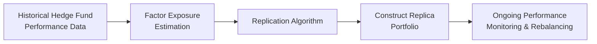

## Introduction and Background

Many investors admire the mystique of hedge funds: dynamic strategies, nimble moves in multiple markets, and that tempting hope of market-beating returns (alpha). But truth be told, hedge funds can be super pricey, lock up your money for extended periods, and come with a layer of complexity that’s enough to intimidate even seasoned professionals. Enter hedge fund replication strategies. Think of these as a carefully designed “recipe” intended to bake a cake that tastes a lot like a hedge fund—but usually at a lower cost and with fewer liquidity constraints.

I remember (this was years ago) chatting with a friend who had a chunk of savings tied up in a big-name hedge fund. He was excited—until he realized the hidden costs and the tough redemption rules. With replication approaches, we can attempt to deliver some of the same payoffs using exchange-traded instruments and systematic rules, effectively mimicking hedge-fund-style exposures. Let’s explore how these strategies work, why they’re popular, and when they might (or might not) be a substitute for investing in an “actual” hedge fund.

## Conceptual Overview

Hedge Fund Replication Strategies are designed to emulate or mimic the return profile of hedge funds by breaking down the hedge fund’s performance into a set of systematic risk factors. These factors can be equity market risk, credit spreads, interest rate exposures, currency moves, or even volatility-based factors. Once these exposures (collectively referred to as “hedge fund beta”) are understood, a replication vehicle—often a liquid fund or an ETF—tries to mirror these exposures using standard market instruments.

Instead of paying “2 and 20” (2% management fee and 20% of profits) to a hedge fund manager, replication may let you pay a significantly lower fee. But, as with any attempt to replicate something complex, you risk losing out on idiosyncratic or “special sauce” alpha. Let’s dig in and see how this differs from typical alternative investments that we discuss throughout other sections, like in “13.4 Risk and Return Profiles of Alternative Investments.”

## Key Motivations for Replication

• Lower Fees: Hedge funds often charge steep fees. Replication can offer an alternative at a fraction of the cost.  
• Enhanced Liquidity: Instead of waiting for monthly or quarterly redemption windows, replication vehicles—structured as UCITS, ETFs, or other mutual fund structures—often provide daily liquidity.  
• Transparency: Traditional hedge funds can be secretive, whereas replication strategies (particularly index-based ones) often must disclose holdings or factor exposures.  
• Customization: Some replication methods let you fine-tune factor exposures to suit specific objectives, like controlling beta to certain asset classes or scaling volatility risk.

In the next sections, we’ll explore how to actually build these replicators, covering factor-based decomposition models, mechanical regression approaches, dynamic strategies that recalibrate over time, and all the practicalities that come along for the ride.

## Factor-Based Replication Approaches

Factor-based replication, or factor decomposition, is the bread and butter of the replication world. The core idea is: Instead of analyzing every trade a hedge fund makes (which is usually impossible), we try to figure out which broad risk-factor “buckets” drive the fund’s returns.

### Building the Factor Model

A typical factor model for hedge fund replication might look like this:


R_{HF}(t) \approx \alpha + \beta_1 R_{\text{Equity}}(t) + \beta_2 R_{\text{Credit}}(t) + \beta_3 R_{\text{Volatility}}(t) + \dots + \epsilon(t)


Where:  
• \\( R_{HF}(t) \\) = hedge fund or hedge fund index returns at time t  
• \\( R_{\text{Equity}}(t) \\) = returns on an equity market proxy  
• \\( R_{\text{Credit}}(t) \\) = returns on a corporate bond or credit spread proxy  
• \\( R_{\text{Volatility}}(t) \\) = returns on a volatility index or volatility-related trading strategy  
• \\(\beta_1, \beta_2, \beta_3\\) = factor loadings (the “weights” of each factor)  
• \\(\alpha\\) = residual return not explained by the factors (the so-called alpha piece)  
• \\(\epsilon(t)\\) = error term  

Once you estimate these betas—often by applying regression techniques over historical windows—you replicate the hedge fund by constructing a portfolio:


W_{\text{equity}} = \beta_1, \quad W_{\text{credit}} = \beta_2, \quad W_{\text{volatility}} = \beta_3


These weights, \\(W\\), guide how much capital you allocate to each factor exposure. In typical practice, you’ll regularly rebalance these weights as new data comes in—maybe monthly or quarterly—to keep your replication portfolio aligned with the hedge fund’s evolving factor tilt.

### Practical Example

Let’s imagine that your analysis reveals a Long/Short Equity hedge fund with the following factor exposures:

• \\(\beta_1 = 0.35\\) for an equity factor (S&P 500)  
• \\(\beta_2 = 0.10\\) for a credit spread factor  
• \\(\beta_3 = –0.05\\) for a volatility factor  

In practical terms, you’d invest 35% of your replication portfolio in an S&P 500 ETF, 10% in a corporate bond ETF (or a credit spread product), and maybe hold a short position equivalent to 5% notional in a volatility index or futures instrument. This arrangement is intended to deliver returns similar to the Long/Short Equity hedge fund’s factor-driven portion.  

One caveat is that you might not be capturing all those times the fund manager does something unusual—like a one-off distressed debt play or a specialized option strategy. Those are alpha-driven trades, and replication might not fully capture them. That’s sometimes okay, because not all hedge fund alpha is actually alpha. A chunk of it might just be hidden or complex forms of systematic factor exposure.

## Mechanical (Regression-Based) vs. Dynamic (Adaptive) Replication

### Mechanical or Static Replication

Mechanical replication models (often called “static” or “regression-based” approaches) assume that once you identify the factor exposures, you basically stick to them for some set period. You rely entirely on historical relationships, as though those betas are carved in stone. While easy to implement (and definitely more transparent), this approach can quickly fall apart if the hedge fund’s strategy changes or market conditions shift drastically.

### Dynamic Replication

Dynamic strategies recognize that hedge funds aren’t static. They rotate exposures with changing market conditions. A dynamic model tries to do the same—recalibrating factor exposures on the go. Maybe you run a rolling window regression every month, or you incorporate big macro signals (like changes in volatility regimes). This definitely can help you stay in step with the hedge fund’s evolving game plan but can also lead to higher transaction costs and more complexity.

### Diagram for the Replication Process

Below is a simple Mermaid diagram illustrating how an investor feeds data into a replication algorithm, obtains factor exposures, and constructs a replication portfolio:

The cyclical nature is evident: you gather data, estimate exposures, build or adjust your portfolio, and keep monitoring performance. If the factor exposures shift, the replication algorithm (especially in dynamic methods) adjusts the portfolio accordingly.

## Cost-Saving Potential and Efficiency

One of the major selling points of hedge fund replication is cost savings. Let’s face it—traditional hedge funds can be pricey. If your replication strategy manages to capture most of the systematic beta, you may end up paying a fraction of what a hedge fund investor would. The savings come from:

• Lower management fees (often reminiscent of standard ETF expense ratios).  
• No performance fees (or significantly reduced ones).  
• Reduced administrative overhead for complex structures.  

In addition, because most replication vehicles typically invest in exchange-traded or regulated products, the cost of leverage or shorting might be more predictable. You also may gain daily liquidity—handy when you want quick access to your money.

Still, you can’t replicate the intangible value of a legendary portfolio manager’s ability to see around corners or exploit small market inefficiencies. Many times, the portion of hedge fund returns not readily captured by replication strategies can be the result of genuine skill (alpha) or less transparent market bets.

## Limitations of Hedge Fund Replication

If you’re hoping to replicate all the best ideas from a star manager, you might be disappointed. Here’s why:

• Alpha vs. Beta: By definition, replication is typically capturing the “hedge fund beta.” True alpha is elusive and usually unique to the manager’s secret recipe.  
• Idiosyncratic Trades: Hedge funds can do everything from activism in small-cap stocks to distressed debt. These posture-specific tactics are almost impossible to replicate from broad market factors.  
• Liquidity Mismatch: Some part of a hedge fund’s returns might be from illiquid assets. You can’t mimic illiquid assets precisely using only liquid exchange-traded products.  
• Tracking Error: Even if you do everything “right,” your replication method has measurement timing differences and rebalancing costs that can cause performance to drift from the hedge fund.  

In short, hedge fund replication might get you 60%–80% of the way there (some might say 90%, others 50%, it depends on the strategy). For many investors, that might be enough—especially if they’re looking for broad market exposures and a certain style of return. But if you absolutely desire that elusive alpha or specialized strategy, a replication tool alone probably won’t meet all your needs.

## Real-World Performance and Drawdown Behaviors

In practice, some replication products do impressively well, particularly when the hedge fund strategies in question rely heavily on systematic exposures (like global macro funds that trade futures or “long-only plus hedges” approaches). Their correlation with the underlying hedge fund index may be high, and the tracking error might remain modest.

But when markets enter crisis mode, or the hedge fund manager executes a rapid pivot (perhaps they drastically reduce exposure to a certain currency, or they decide to short an obscure emerging-market asset), the replication might lag. This is particularly noticeable in drawdown periods, as real hedge funds could be making complex trades that your factor-based replication simply fails to catch in time. Always be sure to examine how these replication products performed—especially in downturns—before concluding that they’re just as safe or as nimble.

## Data Quality and Risk Model Considerations

Hedge fund replication is fundamentally a data-driven pursuit. If your data is poor, incomplete, or subject to serious lags, you’ll be building your factor model on shaky foundations. Some points to remember:

• Hedge Fund Returns Often Self-Reported: Many hedge fund indices rely on manager self-reporting, which can introduce biases (survivorship bias, backfill bias).  
• Factor Data Requirements: You need clean, timely data for all relevant factors (equity, credit, etc.), often on a daily or weekly basis.  
• Model Risk: A big chunk of your success depends on how well your model is specified. Miss the right factor, or use an overly simplistic approach, and your replication can suffer.  

On the other hand, if you’re careful with data cleaning, you have robust risk modeling, and you systematically test for factor exposures, you can achieve fairly stable replication results, at least with respect to the strategies that are predominantly driven by systematic risks.

## Regulatory Implications

Traditional hedge funds typically only accept accredited investors and operate with fewer constraints on leverage or short selling. By contrast, many replication strategies are structured to be accessible to a broader investor base. For instance:

• Some are offered as UCITS funds in Europe, subject to UCITS regulatory guidelines and restrictions.  
• Others exist as SEC-registered mutual funds or ETFs in the U.S., with daily liquidity, diversification constraints, and mandated disclosures.  
• Minimum investment amounts are often much lower than direct hedge funds, making them more approachable.  

This shift in structure and regulatory oversight has both advantages (transparency, liquidity, investor protection) and disadvantages (limits on permissible leverage or concentrated positions). Investors hoping to replicate a “wild and free” hedge fund may find the regulation dampens some of the extremes in return—but often, that’s the point of a more retail-friendly vehicle.

## Case Study: Index-Based Replication of HFRI

Consider an index-based approach to replicate a broad hedge fund index, such as the HFRI Fund Weighted Composite Index. A replication manager might:

1. Break the index’s historical returns into exposures to the S&P 500, a global bond index, a commodity index, and a volatility factor.  
2. Perform a rolling regression each month to determine updated factor weights.  
3. Allocate a replication portfolio across a global equity ETF, a bond ETF, a commodities ETF, and perhaps short VIX futures.  
4. Rebalance monthly to keep the factor exposures aligned with the index changes.  

In a good scenario, the correlation between the replication portfolio and the HFRI index might be quite high—say 0.70 to 0.85. But in extreme market stress, differences emerge as the actual hedge funds might pivot or hold illiquid positions that the replicator cannot. The replicator might see a somewhat different reward/risk profile in those windows.

## Best Practices and Pitfalls

• Frequent Recalibration: The hedge fund’s factor exposures aren’t static. If you only calibrate once a year, you risk missing key shifts.  
• Manage Transaction Costs: Dynamic replication can lead to higher turnover, so weigh the benefits of more accurate replication versus the costs of frequent trading.  
• Monitor Liquidity: Even though replication typically relies on exchange-traded assets, make sure those assets are sufficiently liquid to handle your rebalancing needs, especially if assets under management grow large.  
• Be Realistic: Hedge fund replication is no silver bullet. It won’t magically beat the hedge fund or guarantee a perfect correlation. Set reasonable expectations about the “beta-like” returns you can achieve.

## Linking to Broader Portfolio Management Topics

In “Chapter 4: Portfolio Planning and Construction,” we talk about strategic asset allocation and the possibility of including alternative investments. Hedge fund replication is one route to gaining “alternative-like” exposures without some of the operational headaches. In “Chapter 6: Introduction to Risk Management,” we address how to measure and monitor performance risk. Replication strategies share many of the same risk metrics—like Value at Risk (VaR), stress testing, and scenario analysis—to ensure the replication portfolio behaves as intended.

And, from a “Behavioral Biases” perspective (see Chapter 5), it’s good to watch out for overconfidence in your replication model design. Sometimes we get enamored with the idea that “every manager’s alpha is just disguised beta,” but let’s not discount the possibility of genuine alpha or underappreciated risk exposures.

## Glossary

• Hedge Fund Beta: The portion of hedge fund returns explained by systematic market factors—rather than active management skill (alpha).  
• Replication Algorithm: A quantitative process that uses historical returns or factor exposures to simulate a hedge fund’s strategy in a liquid portfolio.  
• Tracking Error: The deviation between the performance of a replicated strategy and its target hedge fund (or hedge fund index).  
• Index-Based Replication: An approach aimed at replicating a broad hedge fund index by matching the identified risk factor exposures of that index.  
• Partial Replication: Focuses on mimicking selected elements (often the systematic portion) of a hedge fund’s returns, ignoring highly idiosyncratic or complex tactics.  
• Alpha Capture: The effort to generate returns above those explained by systematic risk exposures, often referencing the portion of returns we can’t replicate easily.  
• Liquid Alternatives: Mutual funds or ETFs pursuing hedge fund-like strategies with daily liquidity and regulatory constraints, serving as a more transparent alternative to hedge funds.  
• Factor Decomposition: The technique of breaking down a portfolio’s return sources into underlying systematic influences (factors) such as equity risk, credit risk, or volatility risk.

## Practical Exam Tips

• Remember to emphasize the difference between capturing systematic exposures (“hedge fund beta”) and seeking alpha. Replication tries to replicate systematic and widely accessible exposures, not unique manager skill.  
• Know how to do a simple linear regression to estimate factor loadings, and be mindful of how rolling windows or time-varying betas affect the stability of your replication model.  
• Be ready for an item set question presenting you with historical returns for a hedge fund and a few factor proxies, asking you to identify factor weights or compute correlation measures.  
• Don’t forget the real-world frictions: transaction costs, rebalancing frequency, liquidity constraints, etc., and how they might create tracking error.  
• Always link the concept of hedge fund replication to broader topics such as portfolio construction, liquidity management, and investment policy statements.  
• Keep an eye out for question prompts on regulatory structures—like UCITS or ETF wrappers—and how that affects risk, leverage, and redemption terms.

## References

• Jaeger, R. (2003). “The Risk in Hedge Fund Strategies: Alternative Alphas and Alternative Betas.”  
• Fung, W., & Hsieh, D. (2007). “Hedge Fund Replication Strategies: Review of the Literature and Empirical Findings,” Journal of Investment Management.  
• Additional readings on factor investing and replication techniques can be found in academic journals, the CFA Institute publications, and vendor white papers from major asset management firms.

--------------------------------------------------------------------------------

## Test Your Knowledge: Hedge Fund Replication Strategies Quiz



### Which of the following best describes a core objective of hedge fund replication?

- [ ] To directly copy all hedge fund trades in real time.
- [x] To emulate hedge fund-like risk exposures using systematic factors.
- [ ] To fully eliminate drawdowns in any market cycle.
- [ ] To guarantee identical returns with zero tracking error.

> **Explanation:** Hedge fund replication aims to recreate the bulk of hedge fund returns by matching exposures to key systematic factors. It does not literally copy every single hedge fund trade, nor can it guarantee identical returns without any tracking error.

### What is the primary distinction between static (mechanical) and dynamic replication methods?

- [ ] Static replication always uses only one factor, while dynamic uses multiple.
- [ ] Dynamic replication is only used for fixed income strategies.
- [x] Static replication uses historical exposures that remain constant, while dynamic replication adjusts factor exposures over time.
- [ ] Dynamic replication cannot be implemented using regression techniques.

> **Explanation:** Mechanical (static) approaches apply factor loadings estimated from historical windows without frequent adjustments. In contrast, dynamic models adapt to changing market conditions and strategy shifts.

### Which of the following best explains alpha capture in the context of hedge fund replication?

- [x] It represents returns beyond what is explained by systematic market exposures.
- [ ] It refers to capturing the entire systematic component of returns.
- [ ] It indicates how well the replication strategy tracks an index.
- [ ] It’s the portion of returns that is easiest to replicate using liquid instruments.

> **Explanation:** Alpha capture is about isolating and replicating manager skill or unique strategies that go above and beyond common beta factors. Most replication strategies focus on hedge fund beta, leaving genuinely idiosyncratic alpha as a challenge.

### An investor is disappointed that their hedge fund replication strategy underperformed the target hedge fund during an extreme market selloff. Which of the following is the most likely explanation?

- [ ] Replication often outperforms during crises.
- [x] The hedge fund may have utilized complex, idiosyncratic strategies that the replicator didn’t capture.
- [ ] Replication funds typically use higher leverage in down markets.
- [ ] The hedge fund had zero factor exposure in a selloff.

> **Explanation:** Hedge funds can shift exposures or take advantage of niche opportunities during market stress. A replication strategy anchored to static or broad factors might not adjust quickly enough to capture these special insights.

### In factor-based hedge fund replication, which factor is least likely to be a primary driver?

- [x] Very narrow, idiosyncratic positions in an illiquid microcap stock.
- [ ] Equity market returns (e.g., S&P 500).
- [ ] Credit spreads.
- [ ] Volatility-related exposures (VIX).

> **Explanation:** Idiosyncratic trades in illiquid microcap stocks are generally not captured in broad, systematic factor exposures like equity market indices or credit spreads.

### One advantage of dynamic replication is:

- [ ] Lower transaction costs due to fewer trades.
- [x] Greater ability to adapt to changing hedge fund exposures over time.
- [ ] It guarantees a perfect correlation with hedge fund returns.
- [ ] It avoids the need for historical data.

> **Explanation:** Dynamic replication updates factor exposures more frequently, improving alignment with the actual hedge fund’s evolving strategy. However, it can increase transaction costs.

### Tracking error in a hedge fund replication strategy is generally defined as:

- [ ] The result of incorrectly labeling factor exposures as alpha.
- [ ] The standard deviation of the replicator’s alpha component.
- [x] The performance deviation between the replication strategy and the targeted hedge fund or index.
- [ ] The correlation between returns of the replicator and the hedge fund.

> **Explanation:** Tracking error is the difference in returns between the replicator and the hedge fund (or hedge fund index) and is typically measured by the standard deviation of those return differentials.

### Which statement is true regarding the regulatory status of hedge fund replication funds structured as ETFs or UCITS?

- [ ] They must mirror all hedge fund leverage strategies.
- [x] They often have stricter liquidity and transparency requirements than traditional hedge funds.
- [ ] They are exempt from diversification rules.
- [ ] They typically require a minimum 5-year lockup period.

> **Explanation:** Funds offered under UCITS or as ETFs generally need to follow stricter liquidity rules, provide higher transparency, and meet various regulatory constraints compared to private hedge funds.

### What is the core benefit of factor decomposition in building a hedge fund replication strategy?

- [ ] It eliminates the need to hold any real assets in the replicator.
- [x] It helps identify systematic exposures responsible for hedge fund returns.
- [ ] It makes it impossible for the hedge fund to change strategies.
- [ ] It ignores transaction costs in volatile markets.

> **Explanation:** Factor decomposition breaks down hedge fund returns into systematic exposures. This understanding allows replication portfolios to invest in those factors and capture a similar return profile.

### True or False: If a hedge fund replication model consistently explains 100% of the hedge fund’s returns, it implies that no residual alpha or manager skill exists.

- [x] True
- [ ] False

> **Explanation:** If 100% of returns can be attributed to systematic factors, it implies there is no remaining alpha. However, in practice, a perfect 100% explanation is rarely observed, indicating potential alpha or model limitations.


