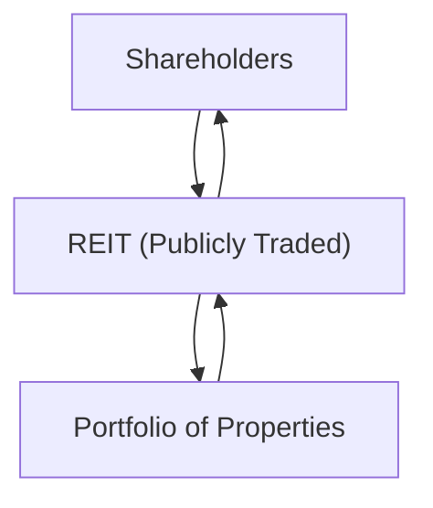

## Introduction and Core Concepts

Real estate can be a fascinating asset class. Not only does it provide the potential for steady income and capital appreciation, but real estate is often considered a strong diversifier because of its historically low correlation with stocks and bonds. Yet, for many investors—myself included when I first started—figuring out exactly how to invest in real estate can feel a bit daunting. You can choose to buy a property directly, maybe a small apartment building or a single-family rental, or you can hop into something indirectly, like a Real Estate Investment Trust (REIT) or a private real estate fund. Each structure introduces its own set of benefits, challenges, tax implications, and risk-return trade-offs.

Below, we’ll walk through several ways to invest in real estate, along with key considerations such as liquidity, control, leverage, property management, and the role of real estate in a broader portfolio context. If you’ve ever wondered whether you should borrow heavily to buy a building or just buy some REIT shares, we aim to simplify those comparisons.

## Direct vs. Indirect Real Estate Investments

When we say “direct” real estate investment, we're typically talking about owning physical property—like a building, land, or a piece of commercial space—in your own name or via a structure you control (e.g., a single-member LLC). “Indirect” real estate investment involves buying into a vehicle or company that then holds real property. Examples include REITs (public or private), limited partnerships, and other pooled vehicles.

### Direct Ownership

• Liquidity: Direct ownership is less liquid. If you choose to exit, you have to list the property, potentially wait for months, negotiate price, and handle the usual complexities of real estate transactions.  
• Control: You have high operational control—decisions about tenants, repairs, improvements, and when to refinance the mortgage are all yours. This can be fantastic if you have the know-how and commitment.  
• Risk Profile: Direct ownership can be riskier if you don’t diversify (often people own one or two properties, which means large exposure to a specific region or tenant type). Also, you might rely on leverage, which magnifies returns (and losses).  
• Capital Requirements: Purchasing an entire property requires a substantial outlay of capital (plus potential maintenance and management costs).  

### Indirect Ownership

• Liquidity: Publicly traded REITs or listed real estate companies offer considerably higher liquidity—just place a trade and you can buy or sell shares. Private real estate funds, however, might lock up your capital for years.  
• Control: Indirect structures mean limited (or zero) day-to-day control. You’re trusting a management team or general partner to make all major decisions.  
• Risk Profile: Broader diversification is typically easier. For instance, a single REIT might invest in hundreds (or thousands) of properties across different regions or sectors. Still, the success depends on how well the management team operates.  
• Capital Requirements: You can start with relatively small amounts of money, especially with publicly traded vehicles.  

I remember the first time I contemplated buying a small multi-family property—my big hesitation was the maintenance risk. You know, the worry that a major repair bill would crush my cash flow. One advantage of indirect structures is how maintenance costs and property management are usually handled by professionals. You pay for it in fees, but it relieves you of direct operational headaches.

## Legal Structures for Pooling Capital

Real estate, especially large commercial developments, often requires significant capital that exceeds the capacity of any single investor. This has given rise to structures like limited partnerships, limited liability companies (LLCs), and real estate investment trusts (REITs). Although these differ in governance and regulatory requirements, they share a common goal: pooling capital from multiple investors to access and operate a portfolio of real estate assets.

### Limited Partnerships (LPs)

An LP typically consists of one or more general partners (GPs) responsible for the fund’s operations and multiple limited partners who provide capital but aren’t involved in day-to-day management. LPs fit well with private real estate funds—where:

• The GP raises capital.  
• Investors commit their funds for a set period (fund lifecycle).  
• The GP acquires, manages, or improves properties.  
• Eventually, properties are sold (or refinanced) and proceeds are distributed back to investors.  

Investors can benefit from pass-through taxation, but they can also face illiquidity, limited control, and dependence on the GP’s expertise.

### Limited Liability Companies (LLCs)

LLCs are flexible, often used by smaller-scale real estate investors or smaller groups of partners. They “pass through” income and losses to members for tax purposes, and members have limited liability. If you and a partner buy a small office building or a residential rental block, forming an LLC can be a way to protect personal assets while sharing management responsibilities, assuming you define each partner’s role clearly—because trust me, it’s no fun having legal disputes with your co-investors over who’s paying for the new roof.

### Real Estate Investment Trusts (REITs)

REITs are special-purpose entities that invest primarily in real estate or real estate–related assets (like mortgages). By meeting specific requirements—primarily high levels of income distribution to shareholders and certain asset/income thresholds—they receive favorable tax treatment. In many jurisdictions, REITs must distribute 90% or more of their taxable income as dividends, thereby offering attractive yields for investors.

#### Basic REIT Structure Diagram

Below is a simple Mermaid diagram illustrating a typical publicly traded equity REIT structure. The REIT holds properties, collects rental income, and distributes dividends to shareholders.

In this structure, the REIT is essentially a pass-through: it collects rents from its portfolio of properties, covers expenses, and pays out the bulk of net income to shareholders.

## Tax Transparency and Distribution Requirements of REITs

REITs operate under tax rules that help them avoid corporate income tax at the entity level, provided they distribute the majority of their taxable income to shareholders. This tax transparency is a big reason why income-oriented investors—especially retirees—are drawn to them. Frequent dividends can be stable and (despite some volatility) often comparatively higher than many common stocks.

Be aware, though, that these distributions are typically taxed as ordinary income for the investor, which might be a disadvantage if you’re in a high tax bracket. Some jurisdictions also impose specific regulatory tests to ensure the entity remains qualified as a REIT (asset tests, distribution tests, income tests, etc.). Failing any of these can lead to heavy penalties or a loss of REIT status.

## Property Selection and Its Impact on Risk-Return Profiles

Your real estate investment’s performance is influenced by the property’s characteristics—whether it’s an office building in a bustling financial district or a suburban multifamily complex. The following factors play a significant role in determining risk and potential returns:

• Property Type: Residential, commercial, industrial, or retail each has distinct demand patterns and cycles. Think about how coworking trends might be impacting office space, or how e-commerce is influencing industrial warehouse demand.  
• Geographic Location: Urban markets might have higher roll-forward demand but also stricter regulations and higher prices. Suburban or rural markets might be less volatile but can be slower to grow.  
• Asset Quality and Age: Newer properties or those in prime locations often come with lower operational risks but also lower cap rates. Older or more distressed properties can generate higher returns if successfully renovated or repositioned.  
• Lease Structure: Short-term leases (like multifamily) provide frequent rent adjustments but can lead to higher turnover. Long-term leases (like offices or industrial) add income stability but might lag the market if rents rise quickly.  

### Example: Calculating a Cap Rate (Capitalization Rate)

The capitalization rate (cap rate) is a commonly used metric to evaluate comparative property valuations:


\text{Cap Rate} = \frac{\text{Net Operating Income (NOI)}}{\text{Property Purchase Price}}


If a small commercial property costs \$1,000,000 and generates an annual NOI of \$80,000, the cap rate is:


\text{Cap Rate} = \frac{\$80,000}{\$1,000,000} = 8\%


Higher cap rates suggest (on the surface) higher potential returns but often correlate with higher risk or more challenging properties.

## Diversification Benefits

From a portfolio management viewpoint, real estate can serve as a diversification tool, as returns often aren’t perfectly correlated with public equity or fixed income markets. Over the long run, real estate performance can be influenced by unique supply-demand factors in local property markets, demographic shifts, and changes in borrowing costs.

That said, correlation patterns can shift during market crises—when leverage, liquidity constraints, or broader economic factors spill over into real estate. During the global financial crisis of 2008, for example, many REIT shares lost significant value in tandem with equities. Direct real estate, by contrast, reported valuations more slowly (due to less frequent marking to market) but eventually faced substantial declines as well.

## Cyclical Behavior of Real Estate Valuations

Interest rates, economic growth, job creation, and real estate supply-demand imbalances heavily shape real estate’s cyclical nature. Typically:

• Low Interest Rates: Incentivize borrowing for property purchases, potentially driving up prices.  
• Economic Growth: Boosts consumer or business demand for space, increasing occupancy and, ultimately, property values.  
• Overbuilding: If developers flood the market with new properties, vacancy rates can rise and rents can decline.  

Just as a side note, I once invested in a real estate fund that acquired several office towers right as a regional economy was peaking. They paid top dollar. Then the local job market softened, vacancies rose, and our distributions took a significant dip. It was a real reminder of timing and cyclical risk.

## Property Management, Maintenance Costs, and Capital Expenditure

Real estate isn’t a “set it and forget it” asset—someone must handle repairs, respond to tenant requests, manage lease renewals, and plan for capital improvements (like renovating lobbies or upgrading HVAC systems). Whether you manage yourself, hire a third-party property manager, or invest in a pooled vehicle that hires professionals, these factors can significantly affect net returns.

• Maintenance Reserves: Setting aside funds for unexpected repairs is crucial.  
• Active Management: Negotiating leases, finding new tenants, and controlling operational costs requires specialized knowledge.  
• Capital Expenditure (CapEx) Planning: Aging roofs, parking lot resurfacing, or interior refurbishments can eat into free cash flow.  

In direct ownership, you handle these issues personally (which can be stressful or rewarding, depending on your perspective). In indirect ownership, you rely on professional teams, but you pay fees and have less control over decisions.

## Leverage Amplification

Leverage is a double-edged sword. Borrowed money can magnify gains if property values and rents rise, but it also multiplies losses if the property’s income declines. In times of rising vacancy or falling rent, debt service can become a heavy burden, potentially forcing the sale of the asset at unfavorable prices. Understanding a property’s debt structure—interest rates, loan-to-value ratios, and covenants—is critical for evaluating risk.

To illustrate, suppose you buy a property for \$1,000,000, financed with \$300,000 equity and \$700,000 debt. If the property’s value rises 20% to \$1,200,000, your equity portion (ignoring transaction costs) might effectively jump from \$300,000 to \$500,000—a 67% increase. But if the property falls 20% in value, your equity might drop to \$100,000, a 67% loss. That’s the joy—and terror—of leverage.

## Best Practices and Potential Pitfalls

• Market Research: Thoroughly assess local economic conditions, supply-demand trends, and property-specific factors (like building condition).  
• Due Diligence: Conduct inspections, review historical financial statements, and understand lease terms (especially for commercial properties).  
• Sensitivity Analyses: Stress-test different vacancy rates, interest rate moves, and rent growth assumptions.  
• Prudent Leverage: Avoid overly aggressive loan structures with minimal equity cushions.  
• Contingency Planning: Maintain adequate liquidity or contingency funds for unforeseen events.  

## Practical Example: Direct vs. REIT Investment

Let’s walk through a simplistic scenario. Suppose you have \$100,000 to invest.

1. Direct Ownership: You might use \$80,000 as a down payment on a \$400,000 rental condo (with \$320,000 mortgage). Each month, you collect rent, pay mortgage, property taxes, and condo fees. You keep a small cushion for repairs. If the condo appreciates or if rent grows, you can build equity over time, but you’ll also handle the “fun stuff” like clogged drains at midnight.  
2. Public REIT Shares: You might take \$100,000 and buy shares of a diversified REIT that owns hundreds of properties—maybe shopping malls, office buildings, and apartments. You get quarterly dividends, typically at a decent yield, and can trade in and out with ease. However, you have no direct say in the REIT’s specific acquisitions or management decisions, and the share price might move in tandem with overall market sentiment.  

It’s not that one approach is better universally—it depends on your appetite for management, capital availability, liquidity preferences, tax situation, and desired role in the property’s day-to-day operations.

## Larger-Scale Real Estate Fund Lifecycle

Private real estate funds usually follow a lifecycle:

• Fundraising: Manager (GP) markets the fund to institutional or high-net-worth investors (the LPs).  
• Investment Period: Fund deploys the committed capital into properties or development projects.  
• Holding/Value Creation: Properties are managed, improved, or repositioned. Some funds focus on stabilized, low-risk “core” assets, while others do “value-add” or “opportunistic” projects, which can range from property rehabilitations to large-scale developments.  
• Exit Strategy: Funds aim to sell or recapitalize properties at a profit, returning capital plus gains to investors.  

The nature of this lifecycle means investors should be prepared for extended lockup periods—often 5–10 years or more.

## Exam Tips and Time Management Strategies

• Familiarize yourself with key metrics (Cap Rate, NOI, Loan-to-Value) and how to apply them in quick calculations.  
• Practice scenario-based questions: How does rising interest rates affect a levered real estate portfolio? What happens if occupancy drops below a certain threshold?  
• Understand both direct and indirect approaches. If you see a question referencing property-level risk, it might be focusing on direct ownership issues. If a question references a “dividend yield” or “dividend coverage,” that’s likely a REIT angle.  
• Be able to articulate the pros/cons of each investment structure—liquidity, control, and tax ramifications are common exam question themes.  
• Real estate can overlap with many parts of the curriculum—like portfolio diversification, risk management, or alternative investment strategies. Keep your knowledge integrated, not siloed.

## Glossary Highlights

• REIT (Real Estate Investment Trust): A special entity investing in income-producing real estate, distributing most of its income and enjoying tax transparency.  
• Cap Rate (Capitalization Rate): NOI ÷ Purchase Price, used to compare different property investments.  
• Core vs. Value-Add vs. Opportunistic Strategies: A scale reflecting the risk-return profile of real estate projects, from low-risk to high-risk.  
• Fund Lifecycle: The multi-year process from fundraising through to capital deployment, property management, and asset exits.  
• Net Operating Income (NOI): Revenues minus operating expenses (excluding taxes, interest, and capital expenditures).  
• Green Building: Real estate that adheres to environmentally responsible design and operating standards (e.g., LEED certification).  
• Vacancy Risk: Potential loss of rent due to tenants vacating or defaulting.  
• Lease Structure: Contracts that define rents, rent escalations, and duration.  

## References and Further Reading

• National Association of Real Estate Investment Trusts (NAREIT): https://www.reit.com – Research and industry data on REIT performance.  
• Brueggeman, W. & Fisher, J. (2011). “Real Estate Finance and Investments.” McGraw-Hill Education.  
• Geltner, D., Miller, N., Clayton, J., & Eichholtz, P. (2013). “Commercial Real Estate Analysis and Investments.” Cengage Learning.  

---

## Master Your Knowledge: Real Estate Investment Structures Quiz



### Which of the following is a key distinction between direct and indirect real estate investments?

- [x] Liquidity differences and control over property management
- [ ] Use of leverage is not allowed in direct investments
- [ ] Direct investments only refer to commercial properties
- [ ] Indirect investments are never publicly traded

> **Explanation:** Direct investments offer greater control but are less liquid; indirect investments (e.g., REITs) are often more liquid but involve less control and the use of professional managers.

### A Real Estate Investment Trust (REIT) generally must distribute what percentage of its taxable income?

- [ ] 50% or more
- [ ] 75% or more
- [x] 90% or more
- [ ] 100%

> **Explanation:** REIT status typically requires distributing at least 90% of taxable income to shareholders for favorable tax treatment.

### Which of the following best describes a cap rate?

- [x] The ratio of a property’s NOI to its purchase price  
- [ ] A measure of the total debt on the property  
- [ ] A metric used only for private real estate partnerships  
- [ ] Another name for the property’s annual rental yield  

> **Explanation:** The cap rate is the net operating income (NOI) divided by purchase price and is commonly used to value property.

### In a limited partnership real estate fund structure, which role manages the fund’s daily operations?

- [ ] Limited partner
- [x] General partner
- [ ] Passive investor
- [ ] Corporate trustee

> **Explanation:** In an LP, the general partner (GP) manages the fund, while the limited partners typically provide capital but do not take part in day-to-day operations.

### Which of the following is most affected by a property's local supply-demand conditions?

- [x] Vacancy risk
- [ ] The overall structure of a REIT
- [x] Capital expenditures required for green building certification are often discretionary
- [ ] The limited partner’s control

> **Explanation:** Vacancy risk is directly influenced by local supply-demand dynamics. Also, capital expenditures for improvements like green building features can be discretionary decisions that depend on the strategic goals of management.

### When interest rates rise, which of the following generally occurs in highly leveraged real estate investments?

- [x] Debt service costs increase, reducing potential returns
- [ ] Property values appreciate automatically
- [ ] Lower required returns for investors
- [ ] No changes in net operating income

> **Explanation:** Higher interest rates increase borrowing costs, often reducing net income and exerting downward pressure on property values.

### Which factor typically distinguishes core real estate strategies from opportunistic ones?

- [x] The level of stabilization and risk inherent in the properties
- [ ] The requirement to distribute 100% of annual income
- [x] The use of third-party property managers in all cases
- [ ] Complete lack of leverage

> **Explanation:** Core investments focus on stabilized, lower-risk assets with steady cash flows; opportunistic strategies involve higher-risk properties with significant potential upside (e.g., redevelopment projects).

### What is a typical characteristic of investing in a private real estate fund?

- [ ] Daily liquidity on an exchange
- [x] Multi-year lockup of invested capital
- [ ] Guaranteed government backing for principal
- [ ] No management fees

> **Explanation:** Private real estate funds typically lock up invested capital for multiple years and charge management as well as performance fees.

### If a property’s purchase price is \$2 million and its net operating income is \$150,000, the cap rate is:

- [ ] 5.5%
- [ ] 7%
- [ ] 8.5%
- [x] 7.5%

> **Explanation:** Cap Rate = 150,000 / 2,000,000 = 0.075 = 7.5%.

### True or False: Real estate can be an effective diversification tool, but correlations may increase during market crises.

- [x] True
- [ ] False

> **Explanation:** Real estate can indeed diversify a portfolio, but in crisis periods, correlations with other asset classes can rise, reducing the diversification benefit.


