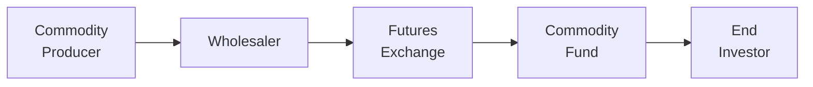
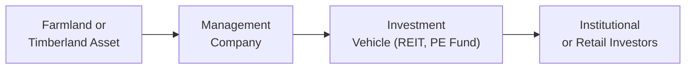

### Introduction
So, I’ll never forget the time many years ago when a friend phoned in absolute excitement after buying farmland in the Midwest. He thought he’d struck gold—except, you know, with corn instead of gold. The farmland produced steady rental income from a tenant farmer, while land values were also (hopefully) on the rise. That was my first real look at how natural resource investments—everything from farmland to timber to raw materials—could help diversify my portfolio (and maybe yours, too).

Natural resources and commodities are often touted for two main reasons: diversification and inflation hedging. They behave differently than most traditional stocks and bonds and can help smooth out portfolio returns. However, they come with their own complexities—storage costs, transportation issues, rollover risk, basis risk, weather disruptions, geopolitical tensions. We’ll explore all that here, and hopefully by the end, you’ll feel a bit more comfortable with the topic than you did when you started.

### The Rationale for Commodity and Natural Resource Investments
Commodities—such as crude oil, gold, copper, and agricultural produce—tend to have low or even negative correlations with traditional asset classes. When inflation rises, commodity prices often increase because raw inputs become more expensive, leading many investors to consider them a natural inflation hedge. Meanwhile, natural resource assets like timberland and farmland capture both the potential for recurring income (e.g., renting the farmland or harvesting wood) and capital appreciation (e.g., land value growth, carbon credit opportunities).

From a portfolio management perspective, adding commodities or natural resources can:
- Enhance diversification.  
- Provide a partial hedge against unexpectedly high inflation.  
- Offer alternative return drivers that differ from equity or bond market cycles.

### Physical vs. Commodity Futures
Now, we can’t talk about commodities without noting the difference between investing directly in physical assets (like storing barrels of oil or owning farmland) versus gaining exposure through commodity futures or funds.

#### Physical Asset Ownership
Physically holding commodities means bearing the costs (and headaches) of storage, transportation, and insurance. For instance, storing grain or precious metals can be expensive, and you might need to ensure quality preservation over time (nobody wants to discover moldy wheat!). Similarly, farmland ownership requires ongoing maintenance and operational oversight, or at least having a tenant farmer to handle operations.

#### Commodity Futures and Related Risks
Many investors prefer using futures to get commodity exposure. Futures contracts can be liquid and easy to trade, but they come with:
- Rollover Risk: You need to ensure that when one contract nears expiration, you “roll” into the next contract. The price difference can be favorable or unfavorable, resulting in a roll yield (gain or loss).  
- Basis Risk: The futures price may not perfectly track the spot price, creating the possibility of unexpected deviations.  
- Contango vs. Backwardation: In a contango market, futures prices are higher than the spot price, typically creating a negative roll yield over time. In backwardation, futures prices are lower than the spot price, theoretically leading to a positive roll yield.

One quick demonstration of how a simple annualized roll yield might be approximated is shown below (obviously keep in mind that this is a textbook illustration rather than real-life trade advice):

```python
spot_price = 50.0
futures_price = 52.0
contract_days = 30

annualized_roll_yield = ((spot_price - futures_price) / futures_price) * (365 / contract_days) * 100
print(f"Annualized Roll Yield: {annualized_roll_yield:.2f}%")
```

If the futures price is above the spot price, your annualized roll yield is negative—and that can really drag on returns in a contango environment.

Below is a simple diagram illustrating key players in commodity markets:



While this is a simplified schematic, it shows how producers (e.g., farmers, mining companies) feed into wholesalers, who might use the futures exchange to hedge or offload risk. Ultimately, funds and end investors gain exposure through those futures contracts.

### Commodity Indices
Many investors turn to commodity index funds or ETFs for passive exposure. Two of the most referenced commodity indices are:

- S&P GSCI (Goldman Sachs Commodity Index): Heavily skewed toward energy commodities (especially crude oil).  
- Bloomberg Commodity Index (formerly DJ-UBS Commodity Index): More broadly diversified across energy, industrial metals, precious metals, agriculture, and livestock.

These indices differ in weighting methodologies, contract selection, and rebalancing frequency. Though they simplify the process of investing in commodities, they also come with index-specific nuances (like different roll schedules) that affect returns.

RIC (Registered Investment Company) structures handle tax complexities—particularly when holding commodities—so many “commodity funds” might invest in offshore subsidiaries or use swaps to replicate an index’s performance. From a portfolio manager’s viewpoint, you should always read the fund’s prospectus carefully to ensure you understand how exactly the exposure is obtained.

### Farmland and Timberland
If you don’t fancy dealing with daily futures rolls, farmland and timberland might be appealing because they combine real asset characteristics with potential inflation protection.

#### Farmland
Owning farmland can provide:
- Rental income (when leasing to a farmer).  
- Crop revenues if you operate the farm directly.  
- Potential land appreciation.  

Of course, farmland values can fluctuate with commodity price changes, local real estate conditions, and the cost of financing (especially if the farmland is leveraged).

#### Timberland
Timberland is another popular natural resource investment because it yields income from the harvesting and sale of timber. If timber prices are low in a given year, owners may opt to “store” the wood on the stump (trees keep growing!), giving the investor some flexibility in timing harvests. Furthermore, there’s emerging interest in carbon credits if the timberland helps sequester carbon.

A high-level overview of farmland or timberland ownership structures might look like:



Although farmland and timberland can be structured into funds (including REITs for farmland or direct private equity structures for timber), they still have illiquid characteristics and might require specialized management teams with boots-on-the-ground expertise.

### Active Commodity Strategies
Passive index investment is not the only way to gain commodity exposure. Some funds or hedge strategies employ active approaches such as:
- Long/Short Positions: Betting on specific commodities to rise (long) or fall (short).  
- Spread Trading: Capturing the difference in price between related commodities (e.g., Brent vs. WTI crude oil) or between different contract maturities.  
- Trend-Following or Factor-Based Systems: Using technical indicators or fundamental factors (inventory levels, production cuts) to time entries and exits.

Active funds can generate alpha if they successfully analyze supply-demand dynamics—think weather forecasts for agriculture, geopolitical tensions that affect oil supply, or new mining technologies that lower production costs. Of course, these strategies often have higher fees, and performance can be quite volatile.

### Environmental and Geopolitical Factors
Commodities can be heavily influenced by factors like:
- Weather and Climate Change: Droughts, hurricanes, floods—these events can destroy or reduce crop yields.  
- Regulation: Environmental rules can mandate lower production or stricter extraction methods (like for fracking).  
- Geopolitical Tensions: OPEC’s production decisions can swing oil prices, and trade wars might hamper the flow of key resources.  
- Technological Innovation: Cheaper solar panels and electric vehicles may reduce the long-term demand for certain fossil fuels.

For commodity options, you may observe something called a “volatility smile,” where implied volatility is higher for out-of-the-money options. This phenomenon can reflect the market’s fear (or expectation) of extreme price moves in either direction, especially if supply is disrupted or demand surges unexpectedly.

### Hedge Funds, Private Equity, and Structuring Natural Resource Investments
Natural resource investments often require operational expertise: selecting the right farmland, negotiating contracts with milling plants, optimizing drilling rigs, or applying advanced science to maximize crop yields. Hedge funds and private equity funds might structure these deals privately, taking direct stakes in agricultural land, energy production, or metals mining companies.

Such funds may also employ complex derivatives overlays, layering aspects of risk management on top of physical holdings. However, these indirect structures can add operational, liquidity, and idiosyncratic risks. Meanwhile, as with any privately offered fund, alignment of interest between the general partner and limited partners (LPs) is critical.

### Risk Management in Commodities and Natural Resources
Managing risk in this space is about more than just standard deviation. Commodity price volatility can spike unexpectedly. Some common concerns:
- **Basis Risk:** Especially relevant if you hedge using a futures contract that doesn’t perfectly mirror your physical commodity.  
- **Roll Yield:** The gain or loss from rolling futures as they near expiration.  
- **Liquidity Risk:** Physical assets might take longer to buy/sell, and certain commodity futures can have limited trading volumes.  
- **Event Risk:** Natural disasters or political instability can drastically alter supply and demand.  
- **Correlation Shifts:** Commodities and natural resources can abruptly become more correlated with equities if there’s a global economic shock.

Portfolio managers often use Value at Risk (VaR), stress testing, or scenario analysis to measure how commodity positions might perform under extreme market conditions. They may also combine derivatives, insurance solutions, or well-planned exit strategies (like harvesting timber at flexible times) to mitigate downside risks.

### Best Practices and Common Pitfalls
- **Understand Contango and Backwardation:** If you’re using futures, pay attention to market structure. Being stuck in a steep contango can erode returns significantly.  
- **Diversify Across Commodities:** Energy, metals, and agriculture each have unique risk factors—don’t concentrate in just one.  
- **Stay Alert to Environmental and Social Impacts:** Emerging ESG considerations can affect investment decisions and regulatory regimes, especially for fossil fuels or deforestation risks.  
- **Budget Operational Costs Realistically:** For farmland, factor in irrigation, fertilizer, and other overheads. For physical metals, consider storage and insurance fees.  
- **Choose Competent Managers:** Private equity or hedge funds in this space can be quite specialized—manager selection is crucial (and manager dispersion is often high).  

### Personal Reflection
I once had a colleague who tried a commodity-index strategy but ended up disappointed by negative roll yields for his natural gas positions. He’d done plenty of research but overlooked just how steep the contango was in that market. Love it or hate it, these details matter. Always dig a bit deeper into the structure of the investment and track the underlying indices and contracts used.

### Conclusion and Exam Tips
From farmland in Iowa to barrels of Brent crude, investing in natural resources and commodities can be a robust tool for diversification and inflation protection—but it’s not for the faint of heart. In an exam setting, you may be asked to compare index weighting methodologies (like Bloomberg Commodity Index versus S&P GSCI), discuss the implications of a market shifting into contango or backwardation, or evaluate the inflation-hedging potential of farmland.

Keep these tips in mind for CFA® exam questions:
- Read each scenario carefully: Is the question focusing on inflation hedging, roll yield, or storage costs?  
- Distinguish between physical and futures-based strategies.  
- Link your discussion to the Investment Policy Statement (IPS) constraints—are we dealing with liquidity constraints, short time horizons, or environmental guidelines?  
- Watch out for any mention of contango or backwardation if they ask you to discuss roll yield or basis risk. 
- Don’t forget about potential ethical issues (e.g., misrepresenting the cost structure or environmental impacts).

### Glossary
• **Contango vs. Backwardation:** A commodity market is in contango if futures prices exceed spot prices. Backwardation occurs when futures prices are lower than spot prices.  
• **Roll Yield:** The gain or loss realized when “rolling” futures contracts forward as they approach expiration.  
• **Basis Risk:** The risk that the futures price won’t move in perfect sync with the spot price of the underlying asset.  
• **Farmland Investment:** Purchasing agricultural land for rental income, direct farming, or future land appreciation.  
• **Timberland Investment:** Acquiring forested land for harvesting timber or potentially earning carbon credits.  
• **Inflation Hedge:** An asset that helps maintain or increase in real value during periods of rising prices.  
• **Volatility Smile:** A pattern where implied volatility for commodity options is higher at out-of-the-money strikes.  
• **RIC (Registered Investment Company):** A legal structure allowing commodity funds to be publicly offered, with specific tax rules.

### References
• Fabozzi, F. J., Fuss, R., & Kaiser, D. G. (eds.). “The Handbook of Commodity Investing.”  
• CFA Institute. “Gaining Exposure to Commodities.”  
• Additional reading: Bhardwaj, G., Gorton, G. B., & Rouwenhorst, K. G. “Facts and Fantasies about Commodity Futures,” Financial Analysts Journal.

---

## Test Your Knowledge: Natural Resources and Commodity Funds



### Which of the following best describes why commodities may provide an inflation hedge?
- [ ] They consistently outperform equities in all market conditions.
- [ ] Their prices tend to remain static even in times of inflation.
- [x] They often rise in price when production and input costs increase.
- [ ] They have zero correlation with consumer demand.

> **Explanation:** Commodity prices often move in tandem with production costs and supply constraints, which tend to escalate during inflationary periods.

### If a market is in contango, how would rolling a futures position most likely affect returns?
- [x] It generally reduces returns due to rolling into higher-priced contracts.
- [ ] It generally increases returns because you roll into lower-priced contracts.
- [ ] Rolling has no effect on returns in a contango market.
- [ ] It guarantees a positive roll yield.

> **Explanation:** In a contango market, futures prices are higher than spot prices, so rolling your position to the next contract often incurs a loss (negative roll yield).

### Farmland investments provide returns from which two primary sources?
- [x] Rental income (or crop sales) and potential appreciation in land value
- [x] Government subsidies and carbon credits only
- [ ] Dividends and share buybacks
- [ ] Spot-futures basis improvement

> **Explanation:** Farmland can provide recurring income via rental arrangements or direct farming, and the land itself can appreciate over time. Government subsidies and carbon credits can be additional factors, but the main sources are income and appreciation.

### Which of the following is a key risk when using futures to gain commodity exposure?
- [ ] Excessive diversification
- [x] Basis risk
- [ ] Guaranteed returns
- [ ] Unlimited liquidity

> **Explanation:** With futures, basis risk is the difference between the futures price and the spot price of the underlying. It can lead to unexpected deviations in returns.

### Which of the following specifically describes the phenomenon where implied volatility is higher for out-of-the-money commodity options?
- [x] A volatility smile
- [ ] Contango
- [ ] Backwardation
- [ ] Capture ratio

> **Explanation:** A volatility smile occurs when out-of-the-money (OTM) options have higher implied volatility compared to those at- or in-the-money, often seen in commodity option markets.

### When energy commodities dominate the weighting of a commodity index, which index is most likely being referred to?
- [x] S&P GSCI
- [ ] Bloomberg Commodity Index
- [ ] Wilshire 5000
- [ ] Russell 3000

> **Explanation:** The S&P GSCI is known for a large energy weighting, particularly in crude oil, compared to the more diversified Bloomberg Commodity Index.

### What is a primary advantage of investing in timberland over a given time horizon?
- [x] Timber can be “stored on the stump,” allowing owners to delay harvest if prices are unfavorable.
- [ ] It is significantly more liquid than equities.
- [x] Timberland never depreciates, under any circumstances.
- [ ] It does not require any operational oversight.

> **Explanation:** One unique advantage of timberland is that trees can be left unharvested if market prices are weak, allowing for a potential wait for better market conditions. However, the statement that timberland never depreciates is incorrect; external factors can still reduce land value or timber prices.

### Which of the following describes “basis risk” in commodity investing?
- [x] The risk that futures prices and spot prices move differently
- [ ] The risk of inflation outpacing returns
- [ ] The risk of the index provider changing methodologies
- [ ] The risk that the correlation with equities is too low

> **Explanation:** Basis risk arises when the asset you hedge using futures doesn’t track spot prices perfectly, potentially causing losses or gains that differ from expectations.

### A scenario in which farmland may be particularly advantageous to hold is:
- [x] A moderately rising inflation environment where demand for agricultural output remains robust.
- [ ] A deflationary environment where crop prices collapse.
- [ ] A scenario where farmland is guaranteed to produce 20% returns annually.
- [ ] A liquidity crisis in which quick sales are needed.

> **Explanation:** Farmland often performs well when agricultural product demand remains robust, especially in an inflationary environment. However, if a liquidity crisis occurs, farmland is relatively illiquid.

### A Registered Investment Company (RIC) structure for commodity funds typically:
- [x] Has specific tax considerations that allow it to be publicly offered.
- [ ] Eliminates all exposure to contango.
- [ ] Cannot invest in commodity futures or derivatives.
- [ ] Only invests in precious metals.

> **Explanation:** A RIC structure faces certain tax restrictions but is commonly used so that the fund can be offered publicly. It doesn’t eliminate market risks like contango or constrain investments to only precious metals.


