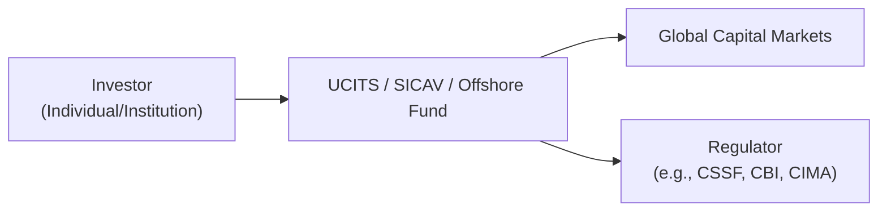

## Introduction

So, let’s say you’re chatting with a friend—someone who’s really excited about investing overseas. They tell you they’ve read about UCITS funds, SICAVs, and all these offshore vehicles in exotic jurisdictions, and they want your take. That conversation can be super tricky if you haven’t spent time digging into the countless international fund structures out there, each with its own set of regulations, tax implications, operational frameworks, and additional bells and whistles.

In global portfolio management, understanding how funds are structured and domiciled is crucial. You might have two funds that invest in the same underlying assets but follow entirely different regulatory frameworks, taxation rules, distribution channels, and risk management techniques. This can affect how you or your clients experience liquidity, reporting transparency, tax obligations, and more.

Below, we’ll explore the major players in the world of international fund structures: UCITS (Undertakings for Collective Investment in Transferable Securities), SICAVs (Société d’Investissement à Capital Variable), various offshore funds, and a few other specialized setups. We’ll also talk about key regulatory differences, product selection criteria, client suitability, and the nuts and bolts of due diligence.

## Key International Fund Structures

### UCITS: Europe’s Passportable Funds

UCITS stands for “Undertakings for Collective Investment in Transferable Securities.” It’s a Europe-wide regulatory framework that lets a fund (once authorized in one EU member state) be sold to the general public across all other EU member states with minimal additional registration requirements. UCITS funds are well-known for their relatively strict regulatory and risk-management guidelines intended to protect retail investors.

• Retail-friendly status: Perhaps one of the biggest draws of UCITS is that they’re readily available to retail investors. In many ways, it’s Europe’s “stamp of approval” showing these funds meet specific diversification and liquidity requirements.

• Passporting: If a UCITS is set up and authorized in, say, Luxembourg, it can be marketed and sold throughout other EU countries. No need to re-register from scratch each time, which can reduce administrative overhead.

• Diversification and liquidity constraints: UCITS frameworks typically cap any holding in a single issuer to a certain percentage of the portfolio. They also require daily or at least frequent liquidity.

• Regulatory oversight: UCITS are subject to oversight by local regulators (like the Commission de Surveillance du Secteur Financier, or CSSF, in Luxembourg) as well as broader EU-related directives.

Personally, I’ve always found UCITS to be a bit like the “universal donor” in funds—capable of being distributed widely across Europe and, sometimes, even recognized in non-European jurisdictions due to their strict operational standards.

### SICAVs: Europe’s Open-Ended Structures

SICAV stands for “Société d’Investissement à Capital Variable.” It’s another popular structure across Europe—especially in Luxembourg. If you spend much time around mutual fund distribution in Europe, you’ll hear about SICAVs constantly. A SICAV is typically an open-ended collective investment scheme. That means:

• Variable capital: The fund’s capital grows or shrinks depending on investor subscriptions and redemptions. Pricing is usually done daily, similar to US mutual funds.

• Flexible sub-funds: SICAVs can often have multiple sub-funds beneath a single overarching umbrella. Each sub-fund might pursue different objectives or invest in various asset classes.

• Popular in Luxembourg: Luxembourg is famous for offering a variety of tax-efficient and flexible fund structures, with the SICAV being one of the most common. Many large asset managers worldwide have established a Luxembourg SICAV for European distribution.

• Governance: Like UCITS, SICAV management is overseen by a board of directors, depositaries, and custodians. Ring-fencing (to ensure assets in one sub-fund remain separate from others) is usually part of the deal.

On a personal note, I’ve sat in an investment committee meeting once, discussing the difference between a SICAV sub-fund and a standalone UCITS. Ultimately, the major factor boiled down to administrative convenience and distribution plans across Europe. But in reality, from an end investor’s perspective, the difference can sometimes be minimal—assuming both structures are UCITS-compliant and governed by strict regulations.

### Offshore Vehicles

Let’s be honest: when you hear “offshore,” you might picture sandy beaches, palm trees, and lucrative (but possibly mysterious) tax advantages. Offshore funds are typically organized in jurisdictions like the Cayman Islands, the British Virgin Islands, Bermuda, or sometimes in European hubs like Luxembourg or Ireland (though Luxembourg and Ireland are more “onshore” in Europe-chatter).

• Tax neutrality: Many offshore jurisdictions offer zero or very low corporate taxes for fund entities. This is supposed to allow the fund itself to be tax-neutral—investors pay taxes in their home countries where required, but the fund isn’t double-taxed locally.

• Investor eligibility: Some offshore funds cater to institutional or accredited investors only, meaning there may be higher minimum subscription amounts, lock-up periods, or other restrictions. In other cases, some are open to retail, depending on local regulations and distribution rules.

• Regulatory environment: Jurisdictions vary in their regulatory stringency. Luxembourg or Ireland are recognized for robust rules combined with tax efficiencies, whereas some smaller island jurisdictions might have a lighter regulatory touch. That’s not automatically negative—it just means as an investor or portfolio manager, you need to double-check the quality of oversight.

• Types of structures: Offshore funds can include limited partnerships, unit trusts, or open-ended company structures. Hedge funds, private equity funds, and certain specialized strategies often favor offshore setups, especially when dealing with global investors from many different tax regimes.

It’s important not to conflate “offshore” with “shady.” Maybe I shouldn’t step on a soapbox here, but the truth is: many offshore funds operate completely above board under recognized structures, offering valuable solutions to investors who require cross-border tax efficiency. That said, disclaimers are vital. You have to verify compliance with your local securities laws, anti-money laundering rules, and the broader global compliance environment (e.g., FATCA, CRS, etc.).

## Regulatory Differences in a Nutshell

Regulation can be as confusing as trying to translate eight languages at once. UCITS are primarily governed by the European Union framework with additional local rules. Luxembourg’s CSSF implements these rules. Ireland has the Central Bank of Ireland (CBI) for oversight. The UK’s Financial Conduct Authority (FCA) sets certain guidelines for funds distributed to UK investors.

Offshore jurisdictions, on the other hand, each have their own regulators (like the Cayman Islands Monetary Authority, or CIMA). Depending on the jurisdiction, regulatory oversight is robust but can vary widely in speed, administrative burden, and transparency requirements.

Here’s a quick visual summary of how international fund structures typically interact with investors, regulators, and the global markets:

In many respects, all roads lead to the fund, which then invests in a range of securities, real estate, or alternative assets. The regulatory framework influences how that process is disclosed, reported, and taxed.

## Product Selection Criteria for Clients

Selecting the right international fund vehicle can feel like picking the right mode of transportation: if you need speed and easy door-to-door travel, you might choose a ride-share; if you want cheaper but slower, maybe the bus. Likewise, fund structures each come with unique pros and cons:

• Liquidity requirements: UCITS funds generally offer daily liquidity. Offshore hedge funds might have monthly or quarterly gates or lock-ups. Evaluate how quickly your client wants to redeem funds (and at what cost).

• Transparency: UCITS must release a Key Investor Information Document (KIID) and abide by strict disclosure. Some offshore vehicles might have more opaque structures. If your client is big on transparency—and many institutional investors are—this can be a deciding factor.

• Regulatory oversight: Certain clients, especially large retirement funds or insurance companies, might only be permitted to invest in highly regulated structures that meet specific risk and compliance thresholds.

• Currency denominations: International funds may offer share classes in multiple currencies—USD, EUR, GBP, JPY—and for global investing, that flexibility can matter. It’s a relief not to have to do an extra currency conversion if your client’s functional currency is something else entirely.

• Minimum subscription: Sometimes the biggest difference is the barrier to entry. A retail UCITS might let you in for a few hundred or thousand euros. A sophisticated offshore hedge fund might ask for a minimum of USD 1 million (or higher if they cater to institutions).

## Due Diligence and Governance

Whether we’re talking about a vanilla UCITS fund or an exotic offshore structure, due diligence is the name of the game. Let’s face it, reading through a 100-page prospectus or an offering memorandum isn’t exactly everyone’s idea of a great weekend. But ignoring governance details can lead to nasty surprises.

1. Board of directors and fund governance: Check if the fund’s board is composed of independent directors with relevant expertise. For instance, in a UCITS or SICAV, the local laws often require a mix of local and potentially international directors. For an offshore fund, you might see directors from the domicile and also from major financial centers (e.g., London).

2. Management team: Evaluate the fund manager, sub-advisors, and their track record. Loads of experience in global equity might not mean they understand the intricacies of global fixed-income. The manager’s track record, style, and approach matter considerably.

3. Auditor and custodian: A recognized auditor (e.g., one of the Big Four) and a reputable custodian (often a large global bank) can signal a stronger commitment to operational integrity.

4. Reporting standards: Are audited financial statements easily accessible? Do they comply with IFRS or local GAAP? Are performance reports aligned with GIPS (Global Investment Performance Standards)?

5. Share class structure: Some funds offer multiple share classes with different eligibility rules, management fees, or performance-based fees. Understand if these classes suit your client’s tax or fee preferences.

6. Tax transparency: Some jurisdictions require funds to pass through certain types of income, or might withhold taxes at the source. Understand your local tax treatment and reciprocal tax treaties.

## Common Pitfalls and Challenges

• Tax complexity: Cross-border investing can quickly spawn complicated tax obligations. For example, if the fund is domiciled in Luxembourg and invests in Brazilian equities, an investor in Canada might have to consider withholding taxes, possible double-taxation, or other complexities. Engage local tax professionals if you’re unsure.

• Over-reliance on perceived “safety:” Just because UCITS is a recognized brand doesn’t mean the fund’s investment strategy or manager is automatically top-tier. Always check performance and risk management.

• Currency risk oversight: If you invest in share classes denominated in USD but your base currency is EUR, you might end up with unwanted currency exposure. Some share classes hedge currency exposure, but not all.

• Regulatory arbitrage: An offshore fund might have fewer compliance rules around leverage or derivatives—great for hedge fund fans but potentially riskier for an investor who isn’t prepared for those complexities.

• Restricted distribution: Certain structures are only open to accredited or institutional investors and can’t be actively marketed to retail. Always confirm if the client qualifies.

## Best Practices for Portfolio Managers

• Align structure with client profile: Institutions might prefer an institutional share class in a Luxembourg SICAV for taxation reasons, whereas a retail investor could lean on a straightforward UCITS product. Always map structure to investor goals and constraints.

• Diversify across domiciles: If you manage large multi-asset or multi-regional portfolios, it can be advantageous to spread out structures. For example, use a Cayman Island fund for certain alternative strategies but rely on a UCITS umbrella for your core equity exposure. It might reduce regulatory uncertainty in any single jurisdiction.

• Monitor ongoing compliance: Laws change, and global regulations evolve. For instance, a recent shift in EU rules might alter how UCITS funds can employ certain derivative instruments. Make it a habit to re-check compliance every year or more frequently.

• Provide clear documentation to clients: Even if you have exotic or multiple structures in place, clarity is golden. Summaries of each vehicle’s key features—regulatory environment, redemption periods, fees—help build trust.

• Stress-test the governance: If you ever question whether a fund’s board is truly independent or the auditor is reputable, that’s a red flag. It might mean you’re better off exploring alternatives with more robust governance.

## Real-World Example

I once worked with a client—a moderate-sized pension fund—who insisted on daily liquidity. They saw a fancy offshore hedge fund at a conference and wanted in. But the hedge fund only provided quarterly liquidity, with a 60-day notice period, and had potential lock-ups. Pulling money out quickly just wasn’t an option. Despite the fund’s great track record, it was a mismatch for that client’s liquidity needs. We ended up structuring a portion of their alternative exposure through a UCITS-compliant alternative strategy that provided more frequent redemption windows. That’s the nitty-gritty: sometimes a more flexible structure is a must-have, no matter how tempting a certain strategy’s returns might look.

## Conclusion

Picking the right international fund structure isn’t just about returns—though we all love performance. It’s about regulation, liquidity, fees, governance, tax, and a million other details that can drastically change the investment experience. UCITS and SICAVs have become the go-to for cross-border retail distribution in Europe, while offshore funds in places like the Cayman Islands cater to more specialized or institutional investors seeking greater flexibility or tax neutrality. Either way, do your homework. Trust me, you’ll be happy you did when that next big client (or your own portfolio) needs clarity on cross-border investing.

Whether you’re a brand-new portfolio manager or a seasoned pro looking to bolster your global perspective, these structures are at the heart of international investing. Keep an open mind, remain curious, and never shy away from digging into the fine print.

## Glossary

• UCITS: A European regulatory framework allowing cross-Europe sale of mutual funds that meet unified diversification, liquidity, and disclosure requirements.  
• SICAV (Société d’Investissement à Capital Variable): An open-ended collective investment scheme with variable capital, typically domiciled in Luxembourg or other European jurisdictions.  
• Offshore Fund: An investment fund domiciled outside the investor’s home country, often in a jurisdiction with favorable tax or regulatory frameworks.  

## References and Further Reading

- ESMA Guidelines on UCITS:  
  https://www.esma.europa.eu/  
- Local Regulatory Authority Websites (e.g., CSSF, Central Bank of Ireland) for Fund Registration Procedures.  
- Investment Company Institute (ICI) surveys on global fund structures.  
- CFA Institute Global Investment Performance Standards (GIPS).  

---

## Test Your Knowledge: International Fund Structures Quiz



### Which of the following best describes UCITS funds in Europe?

- [x] They are funds that can be sold cross-border throughout the EU once authorized in one member state.
- [ ] They are funds restricted to a single European market and cannot be marketed abroad.
- [ ] They are hedge funds open only to institutional investors.
- [ ] They are purely passively managed vehicles.

> **Explanation:** UCITS (Undertakings for Collective Investment in Transferable Securities) are recognized across the EU. After authorization in a single state, they can be distributed freely across member states due to the “passporting” mechanism.

### Which characteristic often differentiates an offshore fund from a UCITS fund?

- [ ] Offshore funds must have daily liquidity, whereas UCITS do not allow daily liquidity.
- [x] Offshore funds are frequently domiciled in low-tax or tax-neutral jurisdictions.
- [ ] Offshore funds only allow investments in government bonds.
- [ ] Offshore funds are always more regulated than UCITS.

> **Explanation:** Offshore funds are usually in jurisdictions with favorable tax treatment, unlike UCITS funds, which are heavily regulated under the European framework and often provide frequent liquidity and robust investor protections.

### What is a primary reason investors might favor a SICAV structure in Luxembourg?

- [ ] It requires zero reporting to regulators.
- [ ] It restricts portfolio managers from investing in global markets.
- [ ] It has no investor eligibility requirements.
- [x] It offers a flexible, open-ended structure with multiple sub-funds and robust regulatory oversight.

> **Explanation:** SICAVs offer flexibility in structuring multiple sub-funds, which can each have different investment strategies, under a single umbrella. Luxembourg’s regulatory framework is recognized globally for investor protection and transparency.

### A fund with limited regulatory oversight, higher investment minimums, and quarterly redemptions is likely to be:

- [ ] A retail-focused UCITS fund.
- [x] An offshore hedge fund structure.
- [ ] An ETF listed on a major exchange.
- [ ] A standard SICAV sub-fund.

> **Explanation:** Offshore hedge funds commonly have higher minimum investment amounts, are lightly regulated compared with UCITS or SICAVs, and may involve more restrictive redemption policies.

### Which of the following factors is essential for due diligence on international funds?

- [ ] The brand of coffee served in the fund manager’s office.
- [x] The reputation of the auditor and custodian used by the fund.
- [ ] The availability of only a single share class.
- [ ] The requirement to post daily returns on social media.

> **Explanation:** The auditor’s and custodian’s reputation are critical governance checks. Independent and globally recognized service providers typically bring a higher level of transparency and credibility to the fund.

### For an investor extremely concerned about currency risk, what might be a critical criterion when choosing an international fund?

- [x] Availability of currency-hedged share classes.
- [ ] Minimum subscription exceeding $10 billion.
- [ ] An offshore domicile with favorable corporate taxes.
- [ ] Existence of a single local regulatory authority.

> **Explanation:** Currency-hedged share classes help manage foreign exchange risk by hedging exposure to fluctuations in the base currency. This is vital for investors who want to mitigate currency volatility.

### An institutional pension fund looking for a core equity holding with strong regulatory oversight and daily liquidity is most likely to consider:

- [x] A UCITS fund domiciled in Ireland or Luxembourg.
- [ ] A private equity fund with a 5-year lock-up.
- [ ] A Cayman-domiciled hedge fund with high leverage.
- [ ] A closed-end fund on a minor exchange.

> **Explanation:** UCITS often provide daily or frequent liquidity, strict regulation, and transparency, making them suitable for institutional investors with a need for stable core strategies.

### What is a common motivation for setting up an umbrella SICAV rather than multiple separate funds?

- [ ] To avoid needing a portfolio manager.
- [x] To build multiple sub-funds under one legal structure, reducing administrative duplication.
- [ ] To limit investor eligibility strictly to retail clients.
- [ ] To bypass local anti-money laundering regulations.

> **Explanation:** Umbrella SICAVs allow asset managers to offer various sub-funds, each with its own strategy, under a single corporate entity, thus streamlining operational and regulatory processes.

### Why might a client prefer an offshore fund in the Cayman Islands?

- [ ] They want real-time daily reporting under UCITS guidelines.
- [x] They desire a tax-neutral structure that can accommodate complex alternative strategies.
- [ ] They plan to invest solely in local municipal bonds.
- [ ] They only invest in short-term treasury bills.

> **Explanation:** Cayman vehicles typically provide tax neutrality and fewer restrictions on alternative (e.g., hedge fund) strategies, appealing to sophisticated investors seeking flexible mandates.

### A UCITS fund is recognized for its cross-border “passporting” within the EU. True or False?

- [x] True
- [ ] False

> **Explanation:** True. UCITS funds benefit from a “passport” that allows them to operate and be marketed to retail investors throughout EU member states with relatively minimal additional registration processes.


