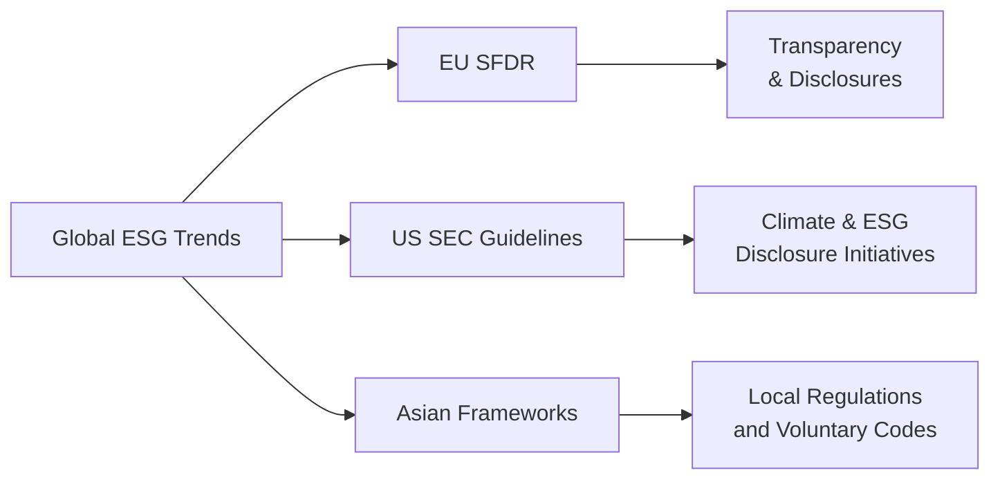

## Introduction

ESG (Environmental, Social, and Governance) investing is no longer just a niche concept. It has gradually become a mainstream focus for portfolio managers, policy makers, and ordinary investors. You know, it’s kind of funny—ten years ago, a lot of folks treated ESG as something you do because you “want to do good in the world.” Now, here we are, and ESG is seen as a fundamental part of risk management and value creation. Even though ESG is discussed pretty much everywhere, actual regulations and standards can vary dramatically across different regions. That complexity can really keep you on your toes when constructing global, multi-asset portfolios.

Below, we’ll explore how ESG standards differ in Europe, the United States, and Asia, and we’ll look at local drivers affecting these standards and guidelines. We’ll also talk about data availability (or the lack of it!) and what these differences mean for multi-asset managers trying to juggle everything from compliance headaches to investment performance. Let’s dive in.

## Emerging ESG Frameworks Worldwide

Most major regions now have their own approach to ESG disclosures and responsible investment guidelines. As ESG issues get more attention from regulators, we’re seeing an evolving patchwork of requirements, each tackling topics like greenhouse-gas (GHG) emissions, social responsibility, and governance best practices. Below is a quick diagram summarizing the broad frameworks you might see in different parts of the globe:

In practice, the lines aren’t always neat and tidy, but this flowchart tries to capture how countries and regions follow distinct sets of principles or laws, all branching out from a global push toward sustainable finance.

## European ESG Regulations (EU SFDR)

Europe is often considered the frontrunner in ESG regulation. The Sustainable Finance Disclosure Regulation (SFDR) is a set of rules that requires banks, asset managers, insurers, and other financial market participants to disclose how they integrate sustainability risks into their investment processes.

• Scope of SFDR: Well, the SFDR covers pretty much everyone marketing financial products in the EU, even third-country managers distributing into the region. If you’re a portfolio manager in one of the EU countries—or you want to sell to European investors—be prepared to show how you factor social and environmental considerations into your investment decisions.

• Classification of Funds: One interesting point is the classification system (often “Article 6,” “Article 8,” or “Article 9” funds). These articles define how funds should advertise and document their sustainability characteristics. Yes, that means if you claim to offer a “green” product, you need the disclosures to back it up.

• Implementation Challenges: From personal experience, implementing SFDR for an asset manager can feel like doing your taxes in a brand-new country—it’s not just about the added paperwork; it’s about reframing your entire process around these rules. Managers must also provide consistent, comparable metrics around greenhouse-gas emissions data, diversity programs, or board independence depending on the fund’s stated objectives.

## ESG Emphasis in the United States

Turning to the U.S., the Securities and Exchange Commission (SEC) has historically taken a more disclosure-oriented approach. That said, if you follow the headlines, you’ll know the SEC has recently proposed rules that would require additional ESG-related information (for example, details on climate risks and board governance structures).

• SEC Guidelines: While the official guidelines are still evolving, many corporations are asked to release climate-related financial disclosures, discuss material social risks, and provide governance details about risk oversight. Unlike Europe’s more prescriptive style (in some aspects), the U.S. often focuses on whether certain ESG factors are considered “material” to investors.

• Corporate ESG Reports: U.S. companies have also been under increasing pressure—some from activist shareholders, others from public reputation concerns—to produce sustainability reports, often aligned with frameworks such as the Sustainability Accounting Standards Board (SASB) or Global Reporting Initiative (GRI). These frameworks are largely voluntary, though institutional investors now pay closer attention to them.

• Market Influences: In my opinion, the “bottom-up” investor demand in the U.S. can be just as strong as any top-down regulatory push. Large pension funds and asset owners—like state pension systems—are asking more ESG questions than ever before. That pressure trickles down to corporates.

## ESG Landscape in Asia

Asia is, well, a vast tapestry of cultures, economies, and stages of market development. You can’t lump it all together, but there are some common threads:

• Local Regulatory Variations: Countries such as Japan have introduced stewardship codes encouraging institutional investors to engage on ESG issues. Meanwhile, Singapore’s regulators have launched guidelines and an ESG disclosure regime for listed companies. In China, certain sectors (like heavy manufacturing) are strongly encouraged to disclose their environmental impacts, but overall coverage remains uneven.

• Cultural and Political Factors: The weight given to “Social” vs. “Environmental” concerns can vary significantly by country. Some regions may prioritize labor standards and community engagement, while others push heavily on decarbonization.

• Data Gaps: For some emerging markets, the challenge isn’t always regulation but reliable, consistent data. A friend of mine who used to run due diligence on factories in Southeast Asia said that it was tough to find real apples-to-apples comparisons across different producers. You might see big differences in approach even within the same country.

## Drivers of Regional ESG Differences

Why do ESG standards vary so drastically from one place to another? Part of the story lies in local drivers: social priorities, cultural values, and political frameworks.

• Social Priorities: Regions that have experienced environmental crises (like severe air pollution or deforestation) often have stronger grassroots demand for environmental accountability. Socially, diverse labor practices and regulatory histories can shape which ESG factors get the most attention.

• Cultural Values: For instance, in some Asian markets, there’s a deep cultural heritage of respecting nature and community, which can pave the way for “green finance.” In parts of Europe, the public is heavily attuned to governance issues because of historical corporate scandals. So it’s not all about laws; it’s about what local stakeholders truly care about.

• Political Will: Legislation in the EU is partly a product of strong policy ambitions around sustainability and climate change. Meanwhile, the U.S. approach is often subject to changing political administrations. Asian markets might incorporate a blend of voluntary codes and mandatory disclosures, depending on government involvement and economic objectives.

## Data Availability and Quality

For asset managers considering multi-region investments, data can be a major headache. Let’s face it, if your data stinks, it’s hard to do robust ESG analysis.

• Developed Markets vs. Emerging Markets: While developed markets generally have more standardized ESG disclosures, you still see a ton of inconsistency in how metrics are reported. Emerging markets may have big data gaps or incomplete coverage, making it tough to benchmark companies.

• Third-Party Ratings: Many managers use ESG rating agencies (think MSCI, Sustainalytics, or others) to fill data gaps. But rating agencies themselves face challenges in emerging markets, where they might have fewer local analysts or rely on outdated company reports. The result? Inconsistency across rating providers, especially in smaller countries.

• Qualitative vs. Quantitative: In a perfect world, everyone provides consistent data on carbon emissions or board composition. In reality, certain social or governance factors remain qualitative or intangible. If you’re building a multi-asset portfolio, you should be prepared to roll up your sleeves and do some good old fundamental research.

## Implications for Multi-Asset Investments

Okay, so how do we actually use this patchwork of ESG standards when we’re building a global or multi-asset portfolio?

• Navigating Regulatory Complexity: If you’re distributing a fund in Europe and the U.S., you may face double reporting burdens—SFDR in Europe, plus any SEC climate disclosures in the U.S. This can translate into increased operational costs, data acquisition expenses, and staff training.

• Aligning Investment Policies: If your investor base is heavily skewed towards a particular region, you’ll want your portfolio approach to reflect those local ESG preferences. For instance, European retail investors might want more robust climate risk metrics, while an Asian institutional investor might care more about supply chain labor standards.

• Capturing Opportunities, Avoiding Pitfalls: ESG integration isn’t just about “being good.” It’s also a way to capture alpha by identifying firms with strong sustainability practices that can drive long-term growth—or mitigate tail risks from environmental or labor issues. On the flip side, ignoring these signals in a multi-asset portfolio can lead to reputational or regulatory damage.

• Due Diligence Processes: With so many frameworks out there, portfolio managers may need a specialized ESG due diligence approach for each region. Watch out for “greenwashing”—some companies or funds might overstate their sustainability credentials if local regulations are lax.

## Common Pitfalls and Best Practices

• Over-Reliance on One Rating System: Relying on a single ESG data provider might be quick and convenient, but it can miss local nuances. Best practice is to triangulate data from multiple sources, including local rating agencies, NGO reports, and direct corporate disclosures.

• Not Updating Policies: ESG regulations keep changing—like, seriously fast! If you’re not updating your Investment Policy Statement (IPS) or risk management frameworks to reflect new rules, you risk falling behind, especially when operating across multiple jurisdictions.

• Ignoring Materiality: The trick is to figure out which ESG factors matter for each industry or region. An oil company’s carbon footprint might be a massive concern, whereas for a software firm, data privacy and governance practices might be bigger social or governance considerations.

• Engaging Locally: Some global investors talk a lot about local issues but never actually engage with the community or corporate management. A robust stewardship process means interacting with local stakeholders, hosting site visits, or partnering with local experts.

## Personal Anecdote: Unexpected Lessons

A while back, I worked with a small emerging-market private equity fund. They wanted to adopt “global best practices” in ESG—but soon realized the local regulatory environment didn’t require half of the disclosures we see in the U.S. or Europe. They ended up creating their own internal code of conduct, bridging the local gap by applying internationally recognized frameworks (GRI, SASB) to their targets. Interestingly, their portfolio companies saw the benefits of improved resource efficiency and better brand reputation almost immediately. Sometimes you just have to take the initiative yourself.

## Glossary

• EU SFDR (Sustainable Finance Disclosure Regulation):  
  EU rules mandating that financial market participants disclose how they integrate sustainability risks. Fund managers must classify and disclose how they handle sustainability under Articles 6, 8, or 9, among other requirements.

• ESG Integration:  
  The process of incorporating environmental, social, and governance considerations into investment research, decision making, and risk management. ESG integration can vary in scope—from simply screening out certain sectors to deeply embedding ESG metrics into financial models.

• Stewardship Code:  
  A set of principles or guidelines (often voluntary) that encourage institutional investors to engage with investee companies, promote responsible ownership, and consider ESG factors in their oversight. Examples include the UK Stewardship Code and Japan’s Stewardship Code.

## References and Further Reading

- Global Reporting Initiative (GRI):  
  https://www.globalreporting.org/  
  Established a widely recognized set of standards for sustainability reporting.

- Sustainability Accounting Standards Board (SASB):  
  https://www.sasb.org/  
  Focuses on industry-specific sustainability metrics and materiality.

- UN PRI (Principles for Responsible Investment):  
  https://www.unpri.org/  
  Provides a framework for integrating ESG factors into investment strategies and ownership practices.

## Final Exam Tips

• Pay attention to the specific ESG regulatory terminology in the region you’re asked about. If the question references SFDR, don’t confuse it with general “best practices.”  
• Scenario-based prompts often revolve around evaluating a global portfolio with different regional requirements. Illustrate your ability to adapt and mention real data challenges.  
• Remember that “ESG integration” doesn’t just mean screening out “bad” stocks. Be prepared to discuss engagement, stewardship practices, and how they fit into a multi-asset context.  
• Brush up on the potential biases in ESG data. On the exam, a question might ask you to compare or reconcile disparities across rating agencies or highlight weaknesses in emerging-market ESG reporting.

Anyway, keep these considerations at the forefront and you’ll be in a great position to answer those multi-asset or global ESG exam questions confidently.

---

## Test Your Knowledge of ESG Standards Across Different Regions



### Which of the following statements correctly describes the EU SFDR?

- [x] A regulation requiring asset managers to disclose ESG integration and classify their products based on sustainability objectives.
- [ ] A voluntary international ESG framework focusing solely on governance issues.
- [ ] A set of tax guidance rules governing carbon offsets for the EU.
- [ ] A rating agency’s proprietary scoring model for investor engagement.

> **Explanation:** The EU Sustainable Finance Disclosure Regulation (SFDR) mandates disclosure of how sustainability factors are integrated into financial products, including classification under Articles 6, 8, and 9.

### In the U.S., ESG-related disclosures are:

- [ ] Entirely prohibited by the SEC.
- [ ] Mandatory for all corporations regardless of size.
- [x] Evolving, with some key proposals focusing on material climate and social risks.
- [ ] Largely overseen by the United Nations.

> **Explanation:** The SEC is gradually introducing proposals to require more detailed ESG disclosures, with a focus on material financial risks, particularly climate-related risks.

### Which region is known for a Stewardship Code that emphasizes engagement between institutional investors and investee companies on ESG issues?

- [ ] The United States
- [x] Japan
- [ ] Canada
- [ ] The Middle East

> **Explanation:** Japan’s Stewardship Code is one of the more notable in Asia, encouraging responsible engagement with investee companies.

### Data availability in emerging markets for ESG factors is often limited because:

- [ ] Legal frameworks ban ESG reporting.
- [ ] Investors show no interest in ESG disclosures.
- [ ] Rating agencies are unwilling to assess local companies.
- [x] Companies’ disclosures might be voluntary or inconsistent, and standardized data collection remains immature.

> **Explanation:** In many emerging markets, ESG disclosures are not strictly enforced by regulators, leading to incomplete or inconsistent data for analysts.

### What is a common risk when relying on third-party ESG ratings?

- [x] Inconsistency across different providers, particularly in emerging markets.
- [ ] Lack of application to listed equities.
- [x] No coverage of governance concerns in rating models.
- [ ] Mandatory acceptance by law in developed markets.

> **Explanation:** Different ESG rating agencies often use distinct methodologies and data sources, which can lead to inconsistent ratings, especially in regions with less standardized disclosure.

### A fund designated as an “Article 8” product under the SFDR typically signifies:

- [x] The fund promotes environmental or social characteristics but may not target a specific sustainable investment objective.
- [ ] It focuses solely on governance practices in emerging markets.
- [ ] It is required to have no carbon emissions in its underlying portfolio.
- [ ] It must exclude all fossil-fuel holdings.

> **Explanation:** Article 8 funds under SFDR promote environmental or social factors, whereas Article 9 focuses on sustainable investment as the explicit objective.

### In the U.S., ESG disclosures are often framed around:

- [x] Materiality, with guidance suggesting companies disclose ESG factors material to financial performance.
- [ ] A universal mandate requiring all ESG metrics in a standard format.
- [x] Declaring net-zero commitments without any justification.
- [ ] A single global standard identical to Europe’s SFDR.

> **Explanation:** The U.S. tends toward a materiality-based approach from the SEC perspective. Companies are encouraged to disclose climate or social risks that could be financially material.

### Cultural and political considerations can influence regional ESG standards because:

- [x] Different regions prioritize distinct social or environmental concerns based on their histories and values.
- [ ] ESG standards are uniform globally and unaffected by culture.
- [ ] Investors generally ignore local norms when assessing ESG risks.
- [ ] Political frameworks are irrelevant to sustainable finance disclosures.

> **Explanation:** Cultural context and political backgrounds shape which ESG issues become a regulatory or public priority in each region.

### One potential pitfall for asset managers dealing with multi-region ESG regulations is:

- [x] Failing to update investment policies in line with shifting local requirements.
- [ ] Maintaining compliance with all evolving rules simultaneously.
- [ ] Only applying stewardship codes to emerging markets.
- [ ] Concentrating on the “Social” dimension while ignoring “Environmental” factors worldwide.

> **Explanation:** ESG regulations evolve rapidly and differ region by region. Managers who don’t periodically revise their approach may find themselves non-compliant or behind best practices.

### True or False: ESG integration is solely about socially responsible screening and excludes engagement with companies.

- [x] True
- [ ] False

> **Explanation:** This statement is actually false. ESG integration is broader than negative or positive screening; best practices also involve company engagement, stewardship, and deeper risk assessments. (Note: If you picked “True,” remember that true ESG integration goes beyond screening.)


