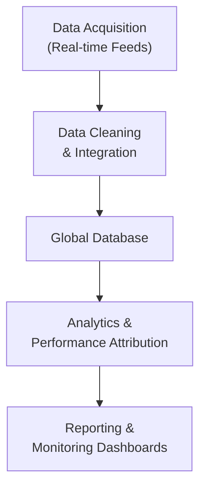

## Introduction and Context

Imagine you’re sitting at your desk, sipping your morning coffee (or tea, if you’re like me and trying to cut back on caffeine). Newscasters are buzzing about an unexpected interest rate decision in Japan. Suddenly, your smartphone pings you with data on European unemployment figures coming in three points higher than expected. Meanwhile, you’ve got a portfolio spread across multiple continents—some allocations in emerging markets, some in highly liquid U.S. equities, and a taste of European bonds. Doesn’t it feel like you’re juggling flaming torches?

Effective global monitoring and analytics are your safety net in this high-wire act. In a globally interlinked environment, it’s not enough to rely on monthly or quarterly assessments. You need fast, accurate, and actionable intelligence—sometimes delivered in microseconds—so you can shift strategies, hedge exposures, or rebalance with minimal delay. Let’s explore the tools, data sources, analytics approaches, and best practices that can help you stay firmly on the beam, even when world events threaten to knock you off balance.

## Real-Time Data Feeds: Staying One Step Ahead

It used to be that portfolio managers would wait for data to trickle in weekly or monthly. Now, with high-frequency trading floors and around-the-clock news cycles, real-time data feeds have become indispensable. These feeds provide up-to-the-second information on:

• Market Pricing & Liquidity  
• Trading Volumes & Order Book Depth  
• Economic Announcements & Corporate Earnings Calls  
• Social Media Sentiment & News Headlines  

You’d be amazed how quickly a piece of political news can shift exchange rates or how a tweet from a key political leader might cause a ripple (or a tidal wave) in market sentiment. Having automatic alerts can be the difference between quickly adjusting your currency hedge and taking an uncomfortably big loss.

· Global economic calendars: Tools like Bloomberg Terminal, FactSet, or even free services from large financial news websites can remind you about upcoming central bank announcements, employment reports, or major corporate earnings.  
· Corporate events trackers: Keeping close tabs on dividend announcements, share buybacks, or M&A rumors can alter your equity allocation or your bond management strategy in a heartbeat.  

### A Brief Personal Anecdote on Real-Time Data
I still remember the day back in 2021 (feels like a lifetime ago) when a surprise oil inventory report was released earlier than usual. If I hadn’t had an alert set on my phone, I might have missed an immediate short-lived but significant spike in oil prices—something that potentially impacted my commodity exposures. That 15-minute gap was absolutely crucial in deciding whether to roll or close certain futures positions.

## Fundamental vs. Quantitative Analytics in a Global Context

Monitoring global markets means you need to approach analytics in two broad ways: fundamental and quantitative. Now, there’s no one-size-fits-all. Some managers prefer fundamental analysis, while quantitative teams rely on algorithmic or factor-based insights. Often the most robust approach is a hybrid of both.

### Fundamental Analysis
Fundamental analysis involves dissecting economic and financial information:
• Macro-level research: GDP trends, geopolitical climates, monetary and fiscal policies.  
• Industry or sector analysis: Demand-supply dynamics, technology innovations, regulatory changes.  
• Company-specific insights: Balance sheets, income statements, management quality, strategic outlook.  

In a global portfolio, fundamental investors don’t just track one region. They watch for changing trade agreements, different interest rate environments, or local investor sentiment in multiple jurisdictions.

(Glossary Note) “Fundamental Analysis”: Evaluating a security by examining economic, financial, and other qualitative and quantitative factors.

### Quantitative Analytics
On the other hand, quantitative analytics rely on numerical models:
• Statistical models: Using correlations, time-series analysis, and regression to identify patterns in large data sets across global markets.  
• Factor analysis: Breaking returns into exposure factors like size, value, momentum, and even more exotic metrics if you’re feeling adventurous.  
• Machine learning approaches: Neural networks, random forests, or reinforcement learning can help parse global data sets far too large for a single human to analyze effectively.  

Quant teams often feed real-time data into high-speed algorithms. Maybe you’re trying to scalp a meager alpha from cross-exchange currency mispricing. Or you’re building a multi-factor equity strategy that rebalances daily. Either way, global monitoring is crucial for toggling your model’s signals on or off promptly.

## Performance Attribution in Global Portfolios

So you ran your strategy for a year, and your returns are in. Great—time to pop the champagne, right? Well, not quite yet. You’ll need to understand where those returns came from. That’s what performance attribution is all about. It breaks down your aggregate return into different drivers:

• Currency Effects: Changes in exchange rates can materially impact your returns. Maybe your gains from European equities are overshadowed by a depreciating euro.  
• Regional Allocation Decisions: Did your overweight in Asian technology stocks outshine the rest? Or did your underexposure to Latin American commodities hamper you?  
• Security Selection: Within each sector, region, or asset class, which specific securities were the winners or losers?  

(Glossary Note) “Performance Attribution”: The process of breaking down an investment strategy’s returns into components (asset allocation, security selection, currency, etc.).

Global performance attribution typically requires a specialized approach. You might layer currency attribution over standard equity or fixed-income attribution. For instance, you might first measure how your currency positioning contributed to gains or losses, and then measure how the underlying investments themselves performed in local currency terms. This two-tier analysis is especially helpful when you have complex, multi-asset positions across regions with volatile exchange rates.

## The Need for a Robust IT Infrastructure

No matter how clever your analytics might be, or how well you interpret them, everything can come to a halt if your IT infrastructure isn’t up to snuff. This is where professionals often underestimate the complexity of multi-market data.

Picture this: you have equities from the U.S., government bonds from Japan, a currency hedge for your Euro exposure, plus a couple of commodity futures. Then you add real-time analytics. Now each data feed might come in multiple formats—some in CSV, some in XML, some via exclusive vendor APIs. If your systems are not robustly integrated, you’re going to end up with a messy patchwork of data, riddled with errors and impossible to reconcile in real time.

### Specialized Tools
• Bloomberg Terminal, FactSet, Refinitiv: Offer consolidated data feeds with analytics tools for charting and correlation.  
• Advanced Risk Systems (e.g., MSCI RiskMetrics, Axioma): Provide scenario analysis, factor decomposition, and integrated risk management for multi-asset portfolios.  
• In-House Solutions: Some large asset managers build proprietary platforms for data ingestion, cleansing, analytics, and performance measurement.  

## Data Governance in a Global Regulatory Landscape

In multi-asset global investing, data is traveling from multiple jurisdictions—each with its own privacy laws, data security requirements, and time-zone cues. Ensuring data consistency, security, and proper usage policies is critical. You want to avoid a meltdown where you discover your risk model is based on incomplete or inaccurate data from a restricted source.

(Glossary Note) “Data Governance”: Ensuring data quality, consistency, and security across an organization’s systems.

### Coordinating Across Borders
- Different data privacy laws: The EU’s GDPR, for instance, places strict rules on handling personal data, which can extend to how you store certain categories of investment data.  
- Multiple regulatory frameworks: The U.S., Europe, Asia, and other regions often have specific guidelines on frequency and format of reporting.  

It’s not just about being compliant. Data governance also means you minimize operational risk. After all, a single glitch in your data feed could lead to a faulty trading signal—costing you real money and possibly your firm’s reputation.

## Advanced Tools for Global Monitoring

These days, advanced analytics platforms can combine everything from social media sentiment on OPEC statements to central bank digital currency announcements. Here are a few powerhouses:

• Sentiment Analysis Tools: Natural Language Processing (NLP) that picks up sentiment changes in real time. You might glean that market participants in Japan have drastically shifted views on inflation.  
• Multi-Asset Optimization Software: Tools that can digest correlations across stocks, bonds, currencies, commodities, and alternatives in real time.  
• Machine Learning & AI Suites: For pattern recognition, portfolio rebalancing triggers, or even predictive modeling that spots regime shifts.  

## Integrating Cross-Border Market Data

In practice, how do you piece this all together without going insane and forgetting to eat lunch? A typical day might look like this:

1. Start the day by reviewing real-time dashboards showing overnight performance in Asia. This includes exchange rates, equity index levels, and changes in bond yields.  
2. Check your fundamental data updates—a GDP revision from a major European country could be a sign of shifting growth patterns.  
3. Feed all of this into your quantitative models. The model churns out signals for your next trades, or an alert for how your currency hedge ratio might need to change.  
4. Document all changes and rationale in a central repository, ensuring you’re meeting compliance requirements in each region.  

## Best Practices and Common Pitfalls

It’s easy to get carried away with the sheer volume of data. You might wake up one morning to find your entire desk stacked with live dashboards. Yet more data isn’t always better—better data is better. Here are some tips:

• Prioritize Quality Over Quantity: Curate your data sources carefully to avoid duplication or contradiction.  
• Build Redundancy: Always have a backup feed or a second vendor for critical data (like exchange rates or market indices).  
• Be Mindful of Overfitting: Using machine learning models on mountains of data can lead to over-optimized strategies that crumble in live markets.  
• Maintain Clear Documentation: The last thing you want is to find that your team can’t replicate or explain a critical daily analytics routine because the lead developer left the firm.  

## Visual Overview of a Global Monitoring Workflow

Below is a Mermaid diagram illustrating a high-level workflow for global monitoring and analytics. You can imagine each node is a step in your daily, weekly, or monthly routine.  

This streamlined flow helps keep your data pipeline organized. You acquire the data, scrub it for errors, store it in a central database, process analytics (including performance attribution and risk measures), then feed results into dashboards for quick decision-making.

## Practical Examples & Case Studies

1. Global Equity-Bond Allocation: A manager invests in U.S. tech stocks, German industrials, and Japanese government bonds. Each morning, real-time data feeds update the price and yield changes. The system triggers an alert if there is a rapid bond yield movement in Tokyo, prompting a partial rotation into short-duration instruments.  
2. Currency Overlay in a Multi-Asset Fund: Performance attribution reveals that unhedged currency exposure in emerging markets has led to outsized volatility in returns. The portfolio manager sets up a real-time currency analytics feed to track changing interest rate differentials. A machine learning model sub-allocates 30% of the position to currency futures when certain conditions are met.  
3. Commodity-Focused Hedge Fund: Drilling into real-time data from shipping logs and social media posts relating to maritime traffic helps the manager predict supply disruptions in oil. The manager shortens or lengthens futures exposures based on this intelligence.  

## Key Exam Tips for CFA Candidates

• Be explicit in describing how you’d handle currency effects in performance attribution. The exam often favors candidates who can detail the step-by-step approach to separating currency contribution from local market returns.  
• When tackling scenario-based or essay questions, outline the importance of robust data ingestion systems. Link it to risk control, performance measurement, and compliance.  
• Practice quickly identifying fundamental vs. quantitative signals and how they might conflict or confirm each other in a multi-asset framework.  
• Mention real-time data considerations (like latency or data governance) in your answers, as they show mastery of a global multi-asset environment.  
• Show understanding of how a meltdown in data infrastructure can lead to compliance issues, or worse, flawed trades that cost your firm and clients.  
• Keep your explanations concise. The exam values clarity—especially if you can demonstrate a thorough chain of logic from data feed to final investment decision.  

## Conclusion

Global monitoring and analytics are no longer optional luxuries for portfolio managers—they’re absolute necessities. Whether you’re a fundamentals-driven macro researcher, a high-speed AI quant, or somewhere in between, the ability to gather, manage, and interpret data in near real time is the key to staying competitive in today’s complex financial markets. That said, it’s not just about having fancy data and powerful tools—it’s about governance, security, and a well-organized infrastructure that ensures data integrity at every step.

If you stay proactive—constantly reviewing and enhancing your analytics pipeline, thoroughly attributing your returns, and staying on top of regulatory changes—you’ll be well-positioned to deliver consistent, risk-adjusted returns. Just remember to take a break now and then. Global monitoring might demand 24/7 vigilance from your system, but no human can (or should!) go without some well-deserved downtime.

## References and Further Reading

• Shiryaev, A. (1998). Statistical Analysis of Financial Data. Springer.  
• Bloomberg, FactSet, Refinitiv, S&P Global.  
• Practitioner guides on multi-asset analytics and performance measurement.  
• Global data governance and regulations resources (e.g., GDPR in the EU, SEC guidelines in the U.S.).  

## Glossary Recap

• Performance Attribution: The process of breaking down an investment strategy’s returns into components (asset allocation, security selection, currency, etc.).  
• Fundamental Analysis: Evaluating a security by examining economic, financial, and other qualitative and quantitative factors.  
• Data Governance: Ensuring data quality, consistency, and security across an organization’s systems.  

## Mastering Global Monitoring & Analytics: 10-Question Quiz



### Which of the following is a primary benefit of real-time data feeds in global portfolio management?

- [x] They provide up-to-the-second information for rapid decision-making.
- [ ] They eliminate the need for fundamental analysis.
- [ ] They reduce all exchange rate risks automatically.
- [ ] They ensure full compliance with all regional regulations without user input.

> **Explanation:** Real-time data feeds allow immediate updates on market prices, economic indicators, and sentiment, enabling swift decisions in volatile markets. However, they do not negate analysis or regulatory compliance.

### In a global multi-asset portfolio, how does fundamental analysis typically differ from quantitative analysis?

- [ ] Fundamental analysis uses real-time monitoring, while quantitative analysis relies solely on delayed data.
- [ ] Fundamental analysis examines only currency values, while quantitative analysis uses macros.
- [x] Fundamental analysis focuses on economic, financial, and qualitative factors, while quantitative analysis relies on statistical or algorithmic modeling.
- [ ] Fundamental analysis is only relevant for equities, whereas quantitative methods apply only to fixed income.

> **Explanation:** Fundamental analysis evaluates economic drivers and corporate fundamentals, whereas quantitative techniques typically rely on data-driven modeling and statistics. Both can be used across multiple asset classes.

### What is the primary purpose of performance attribution in a global context?

- [ ] To eliminate currency and market risks.
- [x] To break down the sources of returns, such as currency effects, regional allocations, and security selection.
- [ ] To consolidate all global returns into one unified measure.
- [ ] To replace standard portfolio evaluation with a single performance metric.

> **Explanation:** Performance attribution helps managers see which factors (allocation, selection, currency) contributed to the overall return. It does not eliminate risks or unify all returns into a single measure but rather disaggregates them.

### When integrating real-time data from multiple vendors into a single analytics platform, which of the following is most critical?

- [ ] Using only CSV formats for all feeds.
- [x] Employing robust data governance to ensure data consistency and integrity.
- [ ] Relying on a single vendor to simplify pricing data.
- [ ] Converting real-time data to monthly data for easier storage.

> **Explanation:** Multi-vendor data integration can lead to inconsistencies or duplication. Rigorous data governance ensures that each feed is accurate, consistent, and secure.

### A fund manager notices that her global portfolio’s equity returns have been offset by adverse currency movements. Which step is crucial for thorough performance attribution?

- [x] Separating currency effects from local asset returns.
- [ ] Combining currency effects with sector weights.
- [x] Confirming whether currency hedges were properly implemented.
- [ ] Excluding currency exposures from the performance evaluation.

> **Explanation:** Currency effects must be separately identified in the return breakdown, and hedging effectiveness should be checked. Excluding currency exposures from the analysis would omit a key performance driver.

### In a hybrid global monitoring approach, real-time analytics often rely on:

- [x] Continuous data updates and automated ingestion.
- [ ] Strictly annual reviews of data consistency.
- [ ] Delays of at least 24 hours for price feeds.
- [ ] Manual input of each trade.

> **Explanation:** Real-time analytics require frequent or continuous data updates (often automated), enabling rapid adjustments in portfolio management decisions.

### How might a multinational asset manager best handle varying data privacy laws when assembling a global database?

- [x] Implement strong data governance policies and ensure region-specific compliance protocols.
- [ ] Store all data in a single location without encryption.
- [x] Use multiple backups with minimal security.
- [ ] Negotiate to bypass certain privacy laws through private agreements.

> **Explanation:** Adhering to regional privacy laws is essential. Comprehensive data governance—including region-specific policies, encryption, and compliance checks—is key to avoiding legal and reputational risks.

### Which of the following statements about robust IT infrastructure is most accurate?

- [ ] It is only needed for forex trading.
- [x] It underpins real-time data processing, analytics, and reporting in a global portfolio context.
- [ ] It eliminates the need for performance attribution.
- [ ] It guarantees regulatory compliance without human oversight.

> **Explanation:** A robust IT infrastructure ensures timely data processing and accurate analytics across multiple asset classes. It supports but does not replace oversight, performance attribution, or compliance.

### One drawback of relying exclusively on machine learning models for global portfolio management is:

- [x] Overfitting, which can lead to poor performance when market conditions shift.
- [ ] The inability to process large data sets in real time.
- [ ] Elimination of all qualitative inputs.
- [ ] Immediate detection of macroeconomic regime changes.

> **Explanation:** Machine learning models can become overfitted to historical patterns and fail in new market conditions.

### True or False: Adopting real-time global monitoring systems means a manager will no longer need to conduct manual due diligence or fundamental analysis.

- [x] False
- [ ] True

> **Explanation:** Real-time systems enhance and speed up data analysis, but they do not eliminate the utility of human judgment, fundamental research, and manual due diligence processes.


