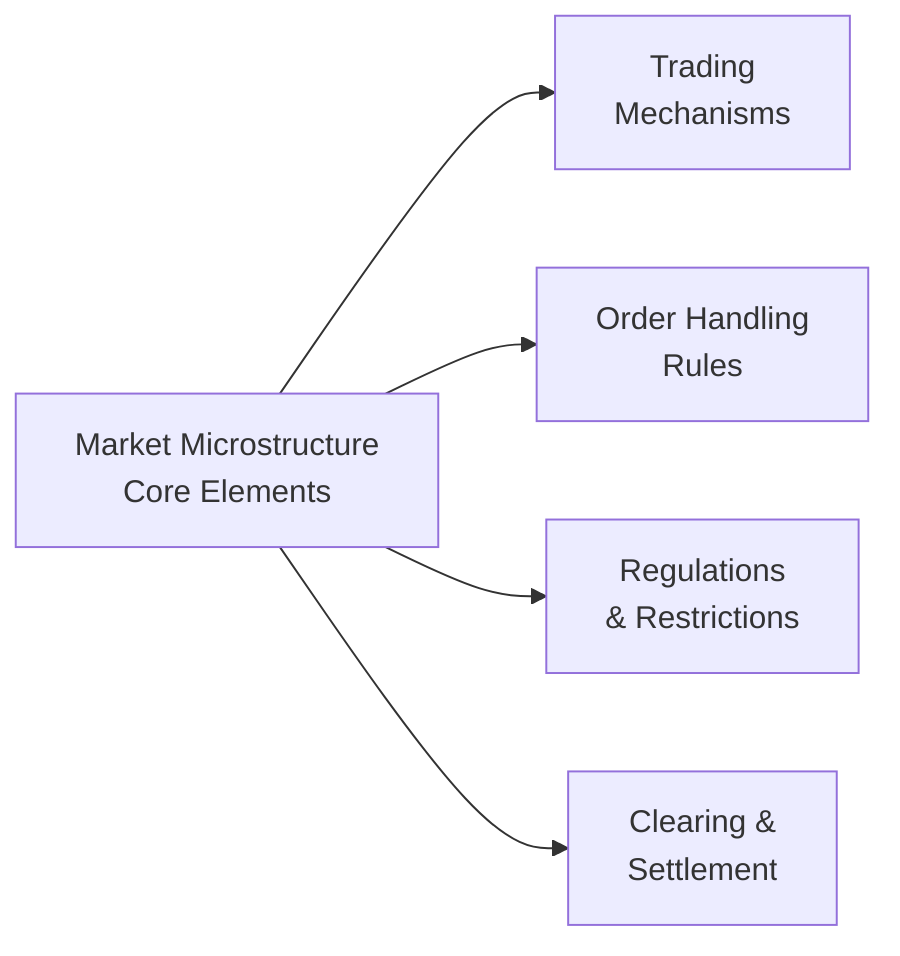

## Introduction
Welcome back! It’s sometimes mind-boggling how many investors take on global markets—eagerly diversifying across borders—without fully understanding the genuine hurdles. This section expands on the idea that, while cross-border investing offers unique diversification benefits and exposure to growth in different regions, there are also significant complexities. You might recall from earlier discussions in Chapter 2 (on risk and return) the benefits of diversification. But, like I always tell my friends, once you venture beyond domestic frontiers, you gotta watch out for those tricky details—sometimes they're costly.

Below, we’ll walk through some pitfalls you’re likely to encounter when implementing international portfolios. We’ll examine problematic practices such as overconcentration in domestic equities (a phenomenon commonly termed “home bias”), poor benchmarking, and underestimating transactional complications like currency risk and trading expenses. Also, we’ll highlight how sloppy execution can severely impact performance—especially in illiquid or less-developed markets. The goal is to help you see potential trouble spots upfront and put real, workable solutions in place.

## Common Pitfalls in Global Portfolio Construction

### Home Bias and Overconcentration
There’s a reason many folks in the industry keep harping on home bias. Even though one’s domestic market might feel safer or more familiar, it can lead to an undesirable overconcentration and missed global opportunities. You might think, “But I know everything about my local market,” which is precisely part of the bias itself. Investors often:
• Overestimate the stability and returns of their domestic market.  
• Underestimate the risks in that same market (for instance, political or economic shifts).  
• Fail to see attractive opportunities in international equities or fixed income.  

Let’s be real, ignoring global diversification potential can mean leaving valuable risk-reduction benefits on the table. As was highlighted in Chapter 14.1 on international diversification, adding different currencies and economic regions can reduce volatility. So, it’s often well worth venturing abroad—provided you do it with eyes wide open.

### Poor Benchmarking and Market Representation
Another biggie: mismatched benchmarks. Sure, you can pick a well-known global index such as the MSCI All Country World Index, but does that index truly reflect the specific mix of markets where you’re investing? Sometimes, managers end up selecting an index that’s either:
• Too broad, including regions or sectors they’re not actually exposed to.  
• Too narrow, excluding the emerging frontier or specialized sectors they invest in.  

When results deviate significantly from that benchmark, confusion often arises—clients might lose trust or wonder about the portfolio manager’s skill. Chapter 3.5 introduced the Security Market Line (SML) concept, but bear in mind that for correct performance comparisons, the chosen benchmark’s risk-profile and asset composition should line up closely with the portfolio. Also, keep in mind that currency exposure matters. If the benchmark is unhedged in certain currencies but your portfolio is fully hedged, the comparison can get lopsided.

### Underestimating Currency Risk
Currency can be a doozy in international portfolios. If you’re actively picking stocks in Europe but your base currency is USD, you’re effectively placing a currency bet on the euro. Whenever you skip a formal hedging policy (like we discussed in Chapter 10 on currency management and overlays), you’re leaving your returns somewhat at the mercy of exchange rate fluctuations. That can result in:
• Negative surprise outcomes if the local currency depreciates.  
• Potential mismatch between the underlying asset’s performance and final portfolio returns in the investor’s home currency.  

One time, I recall analyzing a portfolio that made a killing in Japanese equities—only to see the gains nearly erased by a sudden yen slide. Let me tell you, that’s deflating. So do you hedge all of it, partially, or not at all? There’s no one-size-fits-all approach, but factoring currency volatility in your risk assessments is a must.

### Miscalculating or Overlooking Transaction Costs
Sometimes it feels like transaction costs are just an afterthought. But in global investing, they can be a big deal. You’ve got brokerage fees, currency conversion costs, potential taxes on certain trades, and a whole bunch of rebalancing friction when shifting between markets. In more exotic or less liquid markets, these operating costs can eat away at returns really fast.

I once had a colleague realize—too late, unfortunately—that subtle stamp duties and local transaction taxes were piling up on his emerging markets rebalances. Over a few quarters, that chipped away almost 1% from annual performance. Tools like transaction cost analysis (TCA), introduced in Chapter 7.15 on portfolio analytics vendor management, can help you measure and manage these costs more effectively.

## Inefficient Execution Strategies
Proper execution is essential. You can be spot-on with your timing or stock selection, but if your trades are executed sloppily, you might be giving away pennies (or more) on every order. Here are two major pitfalls:

### Using Multiple Brokers Without Oversight
In global markets, you might think distributing trades across multiple brokers fosters competition, leading to better pricing. And that can be true. But if you don’t actively monitor “best execution” or keep an eye on reliable broker performance metrics, your results could suffer. Brokers might misunderstand your instructions or fail to route your trades optimally. You also risk inconsistent fill prices and difficulty reconciling net costs across different trading platforms.

### Trading in Illiquid Markets Without Limit Orders
It’s fun to place a market order and see a quick fill—until you’re dealing with a low-volume or less-developed exchange where the bid-ask spread is massive. Frankly, you can get hammered on execution. Entering large market orders in illiquid environments can cause outsized price moves against yourself. A prudent approach might be to:
• Break up the trade into smaller tranches.  
• Use limit orders to cap your acceptable price range.  
• Consider time-of-day trading windows, especially in global markets with limited liquidity outside certain hours.  

In short, don’t blindly press “buy” or “sell.” Have some situational awareness.

## Liquidity Analysis in Less-Developed Exchanges
Liquidity is—how shall I say it?—a fickle companion in emerging and frontier markets. I once worked on a Latin American small-cap strategy, and let me be honest, it’s not fun waiting days and days just to unload a position. Thin volumes lead to wide bid-ask spreads, which can balloon your trading costs. And settlement cycles may differ from T+2 to maybe T+5 or even T+7 in rare cases. Let’s see how to approach it:

### Potential for Wide Bid-Ask Spreads
If you’re used to trading large-cap stocks on major U.S. or European exchanges, then you might be in for a surprise. In smaller or less liquid markets:
• You might see ephemeral quotes—orders vanish or get pulled within seconds.  
• A large buy (or sell) order can push you to pay (or accept) a disadvantageous price.  
• Local market makers might have limited capital to take the other side of your trade.  

Chapter 15.13 on quantitative vs. judgmental overlays touched on market fragmentation. The more fragmented and lower-volume the market, the more you need to finesse your approach.

### Higher Market Impact and Delayed Settlement
In robust markets, if you’re dealing in moderately sized trades, your market impact might be negligible. Not so in many emerging exchanges. Placing orders that are big relative to average daily volume can cause price distortions and quickly squeeze the order book. Plus, you need to check settlement rules—some places require pre-trade deposits or extra documentation, leading to potential settlement delays. If you have short-term liquidity needs, or you’re trying to rotate sectors frequently, these constraints can hamper your strategy.

## Guidelines for Thorough Due Diligence

### Evaluating Local Market Brokers and Custodians
A huge part of success in foreign markets is picking the right on-the-ground partners. For example, if you’re investing in Southeast Asia, having a robust custodian with strong compliance and operational frameworks can spare you a lot of headaches. Ask questions like:
• Does the broker have a track record with foreign institutional clients?  
• Are they well-capitalized and regulated by a respectable authority?  
• Do they have a robust technology platform for order placement, confirmations, and settlement?  

And yes, you should consider local political climates. Chapter 14.6 on political risk and geopolitical analysis dives deeper into that realm. Good local partnerships help you navigate these waters.

### Understanding Market Microstructure Nuances
Market microstructure basically refers to how a market’s internal mechanics operate—price discovery, order matching, and participant behavior. In some markets, you can’t partially cancel or alter an order without incurring fees. In others, short selling is restricted, or shares might not be available to borrow. All these little details can dramatically impact your trading strategy.

Below is a Mermaid diagram that visualizes elements of local market microstructure:

Being well-versed in these structural components helps prevent nasty surprises. You don’t want to find out mid-trade that your order was rejected because of some local quirk.

### Local Trading Hours, Settlement Rules, and Governance Norms
I remember a friend who tried to execute U.S. trades in the middle of the night from Europe via an automated system. He forgot to account for early market closings on certain holidays—costing him an opportunity. International markets have a patchwork of schedules and holiday calendars. Transparent corporate governance might also differ, with varied standards for disclosures and regulatory enforcement. Doing a bit of homework on these matters can save you from unexpected losses or simply operational chaos.

## Best Practices and Practical Tips
• Maintain a consistent, well-defined currency hedging policy—don’t decide on the fly.  
• If you rely on multiple broker relationships, create a best execution policy or oversight committee.  
• Perform advanced transaction cost analysis (covered in Chapter 7.15) to compare actual trade slippage versus expected.  
• Incorporate local market liquidity constraints into your portfolio rebalancing schedule.  
• Always remain watchful of corporate actions and foreign capital flow regulations.  

## Exam Relevance and Key Takeaways
In the context of the CFA exam, especially at the advanced levels, you might face scenario-based questions where you have to detect or remedy pitfalls in global portfolio implementation. Possibly you’ll be given a situation with an investor who invests heavily in local bonds, ignoring better yields abroad, or you might be shown how a manager bungled trade execution in an illiquid equity. Understanding the “why” can help you propose solutions swiftly.

Remember also to link these insights with the broader concerns explored in earlier chapters—from risk measurement (Chapters 2 and 3) to currency overlays (Chapter 10). The exam often tests how you synthesize multiple concepts to arrive at well-reasoned portfolio strategies.

## Glossary
• Home Bias: The tendency for investors to overinvest in their domestic market relative to global market-cap weights, often ignoring diversification benefits overseas.  
• Market Microstructure: The study of how exchanges, trading systems, and market participants interact to facilitate the buying and selling of securities.  
• Limit Order: An order to buy or sell a security at a specific or better price, ensuring greater control over fill price but not guaranteeing execution if the limit price is never reached.

## References and Further Reading
• French, K., & Poterba, J. (1991). “Investor Diversification and International Equity Markets.” The American Economic Review.  
• World Federation of Exchanges (WFE) Publications—Comprehensive source for global trading volumes, listings, and market data.  
• Market Liquidity Research from major investment banks and academic journals—helpful in further exploring microstructure and transaction cost modeling.

## Final Thoughts
Constructing global portfolios can feel like venturing into a whole new landscape. It is exciting yet requires more up-front homework and ongoing vigilance. If it seems daunting, remember: you can mitigate most of these issues with a disciplined, well-documented process—especially if you track best execution practices, measure trading efficiency, and maintain a robust currency risk policy.

Don’t be afraid to consult local experts or team up with brokers or custodians that have proven experience. As I love to say: a comprehensive grasp of the operational nuts and bolts turbos your success potential. That’s it for now—stay curious, stay thorough, and keep building your global perspective!

---

## Test Your Knowledge: Avoiding Global Portfolio Pitfalls



### Which of the following best describes home bias?
- [ ] Investing in foreign markets as a hedge against inflation.
- [x] Overconcentrating in one's domestic market due to familiarity.
- [ ] Preferring short-term international trades only to capture volatility.
- [ ] Exclusively investing in currency hedged foreign equities.

> **Explanation:** Home bias typically refers to overinvesting in domestic markets, often stemming from comfort and familiarity rather than objective diversification benefits.

### Which is a key risk associated with neglecting proper currency hedging in international portfolios?
- [ ] Guaranteed higher returns when the home currency weakens.
- [ ] Elimination of bid-ask spreads during trading.
- [x] Potential negative impact on returns if foreign currencies depreciate significantly.
- [ ] Better tracking error relative to domestic benchmarks.

> **Explanation:** Failing to hedge foreign currency exposure can lead to unanticipated losses if the foreign currency falls in value against your base currency.

### To avoid benchmarking pitfalls in an international portfolio, a manager should:
- [ ] Select any well-known global index for credibility.
- [ ] Switch benchmarks each quarter depending on performance.
- [x] Match the portfolio’s actual asset composition to the chosen benchmark.
- [ ] Avoid comparing performance to any external standard.

> **Explanation:** A consistent and relevant benchmark reflects your investable universe, ensuring accurate performance attribution and risk comparisons.

### What is a possible downside of using multiple brokers without sufficient oversight?
- [x] Inconsistent and suboptimal trade execution across different trading platforms.
- [ ] Limited access to global markets.
- [ ] Lower clearing fees.
- [ ] Automatic best execution due to increased competition among brokers.

> **Explanation:** Spreading trades across brokers can lead to inconsistent execution, especially if there's no framework ensuring true best execution. 

### In less-developed exchanges, which factor typically contributes to higher execution costs?
- [x] Wider bid-ask spreads caused by lower liquidity.
- [ ] Margin requirements that are universally lower.
- [x] Delayed settlement cycles that rarely impact total returns.
- [ ] Full transaction transparency and immediate clearing.

> **Explanation:** Thin volumes commonly result in wide bid-ask spreads and delayed settlement, raising execution and carry costs.

### Using a limit order in an illiquid market is advisable because:
- [x] It ensures you don’t pay more (or receive less) than a specified price.
- [ ] It guarantees same-day execution.
- [ ] It eliminates market impact.
- [ ] It allows you to trade outside local market hours.

> **Explanation:** A limit order sets a maximum purchase price (or minimum sale price), protecting you from extreme price swings in a thinly traded market, though it may not fill if the limit is never met.

### Reviewing local political events and governance frameworks is important in due diligence because:
- [x] Political instability can affect market accessibility and liquidity.
- [ ] It is irrelevant; global markets always supersede local governance.
- [x] Corporate actions are unaffected by local governance standards.
- [ ] Currency risk is automatically hedged by local governance factors.

> **Explanation:** Political and governance factors can directly influence market operations, regulations, and even currency stability—vital aspects of thorough due diligence.

### An example of a potential mismatch in global benchmarking is:
- [x] Using an emerging market index to evaluate a portfolio trading mostly in developed markets.
- [ ] Matching an unhedged index with an unhedged portfolio.
- [ ] Using a benchmark that accounts for your portfolio’s sector tilts.
- [ ] Reporting performance in the portfolio’s base currency.

> **Explanation:** Selecting an index that does not align with the portfolio’s actual market exposures leads to distorted performance comparisons.

### Which of the following best describes market microstructure?
- [ ] The fundamental analysis framework for equity valuation.
- [x] The study of how exchanges and trading systems function internally.
- [ ] A measure of portfolio mud weight.
- [ ] A direct reference to the capital asset pricing model.

> **Explanation:** Market microstructure examines order processing, price discovery mechanisms, and trading behaviors that drive actual market operations.

### True or False: Consistently rebalancing positions without regard to transaction costs is recommended in international portfolios.
- [ ] True
- [x] False

> **Explanation:** Rebalancing should be balanced against potential trading costs, especially in illiquid or volatile international markets, where transaction expenses or taxes might erode returns.


