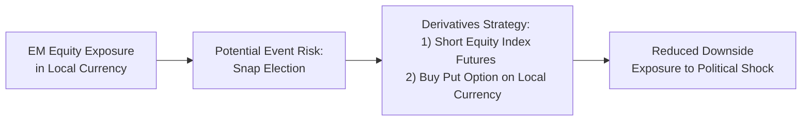

## Introduction

I remember one election season—maybe it was the last one or the one before—when my entire trading desk was on edge. We’d all show up nervously every morning, sipping too much coffee, because pretty much every news alert felt like it could swing currency values, interest rates, or commodity prices around by an uncomfortable margin. It was around that time that I fully realized how critical it is for portfolio managers to hedge political and economic uncertainty. I mean, no one likes to watch carefully built positions evaporate just because a major policy announcement goes a different way than expected.

Hedging political and economic uncertainty works differently from typical asset-allocation adjustments because these uncertainties often come in abrupt waves. This section dives into how (and why) we might structure various hedges—especially derivative-based hedges—to reduce potential damage to a portfolio when, say, a trade deal fails or a referendum yields a surprising result. We’ll talk about balancing the cost of carrying these hedges with the probability (and magnitude) of adverse events, so that protection doesn’t become prohibitively expensive. We’ll also integrate these ideas within a broader risk framework, referencing topics from Chapter 6 (“Introduction to Risk Management”) and Chapter 10 (“Portfolio Overlays and Currency Management”) to ensure nothing falls through the cracks.

## Understanding the Nature of Political and Economic Uncertainty

Political and economic uncertainty arises from events like elections, referendums, trade negotiations, policy announcements, or shifts in geopolitical power. One day, everything seems calm; the next, a surprise vote can send equities tumbling and currencies swinging wildly. In global or multi-asset portfolios, these shocks can appear as:

• Commodity price swings if a new policy disrupts supply chains.  
• Currency gyrations if investors flock to safe-haven currencies.  
• Interest rate spikes if central banks react to sudden inflationary (or deflationary) expectations.

Portfolio managers often face this uncertainty at least once or twice a year in various markets. If you have broad equity or fixed income exposures, or if you hold assets denominated in foreign currencies, ignoring political developments can mean waking up to double-digit percentage losses.

## Common Tools for Hedging Uncertainty

Given the unpredictability of these events, your hedges need to be nimble. The main idea is to mitigate downside risk but avoid overpaying for protection that might never be triggered (and, as we know, options can bleed premium). Let’s explore a few common derivative tools:

### Options

• Put Options on Equity Indexes: A straightforward way to guard against falling equity markets. During a politically charged period (e.g., an election that might cause market jitters), a temporary put on the relevant equity index can offer short-term downside protection. The cost is the option premium, which can spike if volatility expectations rise (implied volatility).  
• Call Options on Commodities: If you’re an airline worried about an oil-price spike due to new sanctions, a call option on oil futures may cap your maximum price risk.  

### Futures

• Equity Futures: Short futures positions on broad market indexes can effectively reduce equity exposure. This approach typically carries lower up-front costs than buying options, but it does require more margin maintenance and lacks the “limited loss” feature options provide.  
• Interest Rate Futures: In an environment where you worry that new government spending policies will spur unexpected inflation, short positions in government bond futures (or interest rate swap futures) can hedge a portfolio’s interest rate sensitivity.  

### Total Return Swaps

• If you hold a particular asset subject to high political risk (like a local emerging market equity index), a total return swap can transfer that market exposure temporarily to another party. You would pay a fixed or floating rate in exchange for receiving (or paying) the total return on the reference asset. This can reduce or eliminate direct ownership risk during volatile periods.

The relative simplicity of each approach will differ, and you should carefully evaluate the operational complexity and counterparty risks. As we discussed in Chapter 10.9 (“Institutional Practices for Overlay Management”), complexity in overlay strategies can become a source of unexpected friction or losses.

## Event-Driven Hedging

Sometimes hedging is more art than science—especially when talking about specific events like national elections, referendums, or trade talks. This approach is called “event-driven hedging.” Basically, you tailor a hedge around a known potential catalyst. For instance:

• Elections and Referendums: If a candidate is perceived as business-unfriendly, equity markets might drop if they win. A short-term put on the equity index or a currency hedge can be placed just before the election results.  
• Trade Negotiations: If a breakdown in negotiations might trigger tariffs, you might short futures on commodities sensitive to that region’s tariffs, or buy currency puts if you suspect the domestic currency will weaken.  
• Major Policy Announcements: Central bank announcements on interest rates can be hedged using interest rate futures, interest rate options (caps/floors), or interest rate swaps that lock in a desired rate.

The trick is timing and cost. Options typically become more expensive right before a big event because implied volatility rises. So, you’ll want to weigh the cost of getting in early (at lower IV) and paying a longer time premium vs. waiting until closer to the event (at higher IV) with a shorter time premium. 

## Balancing Cost and Probability of Adverse Events

Sure, it would be lovely to hedge out every conceivable tail risk, but that can become expensive and, frankly, impractical. When deciding how much coverage you need:

• Probability of Event: Is a big surprise likely, or does the market consensus point to “more of the same”?  
• Magnitude of Potential Damage: Would a negative outcome slash your portfolio’s value by 2% or 20%?  
• Budget for Protection: If your daily mark-to-market swings are small, you might not want pricey hedges. But if you’re responsible for a fund that must limit drawdowns, you may be compelled to buy more robust protection.

In simpler terms, you’re trying to answer the question: “Is the cost of this derivative hedge worth the sleep I’m losing?” Because sometimes you can be so well-protected that you’ve also locked yourself out of market upside, especially if you adopt strategies like short futures that eliminate upside gains.

## Holistic Risk Management

In Chapter 6.2, we introduced risk management frameworks that map out a firm’s total exposures. Hedging political and economic uncertainty should slot neatly into your overall risk plan. You don’t want to add new derivative positions without thinking about:

• Correlation Effects: A hedge on one segment of your portfolio might inadvertently create exposures elsewhere.  
• Operational Complexity: Adding three or four layers of derivative overlays can create confusion and potential for error, particularly around margin calls or settlement.  
• Counterparty Risk: If your hedges are over-the-counter (OTC), you must trust that your counterparties will deliver if the event goes against them. (If they declare bankruptcy precisely when the contract is in your favor, your hedge might vaporize.)

As we emphasize in Chapter 6.9 (“Data Quality and Model Risk”), you need robust internal processes to ensure you understand how these derivative positions will behave under various scenarios. Stress testing (Chapter 6.16) can help you see what might happen if the “worst-case scenario” becomes reality.

## Practical Example: Hedging an Emerging Market Equity Portfolio

Let’s say you manage a portfolio with exposure to an emerging market (EM) country that’s about to hold an unexpected snap election. There’s a real chance that an anti-business candidate could win, sending the local equity index down drastically. At the same time, that could trigger a run on the local currency.

Below is a simplified figure illustrating a two-pronged hedge:



1) Short Equity Index Futures: This locks in a price for the local equity index, so if the market tanks, the short position will ideally gain in value, offsetting your long equity exposure.  
2) Buy Put Option on the Currency: If the local currency depreciates, the put option payoff helps offset that currency loss.

Remember, this approach has costs: margin requirements for the futures and premiums paid for the put. But it often may look attractive compared to large, unprotected losses.

## Python Example: Quick Simulation of Option Payoff

If you’re a data junkie who enjoys coding up quick payoff calculations, here’s a small Python snippet that simulates a currency put payoff for different exchange rates:

```python
import numpy as np

strike_price = 50.0  # Hypothetical strike
premium = 2.0        # Option premium
exchange_rates = np.arange(40, 61, 1)

payoffs = []
for rate in exchange_rates:
    intrinsic_value = max(strike_price - rate, 0)
    net_payoff = intrinsic_value - premium
    payoffs.append(net_payoff)

for rate, payoff in zip(exchange_rates, payoffs):
    print(f"Exchange Rate: {rate}, Put Payoff: {round(payoff, 2)}")
```

In practice, you could expand this script to incorporate implied volatility shifts, time decay, or even Monte Carlo simulations that reflect the probability distributions around election outcomes.

## A Note on Over-Hedging (Pitfall Alert)

Sometimes, the biggest danger is layering too many protection strategies so that you end up with either:

• Redundant coverage that doubles (or triples) your costs.  
• Offsetting exposures that effectively do nothing.  

A humorous example: I once saw a small fund implement a short equity futures hedge and simultaneously buy put options with nearly the same maturity and underlying. The result? The short futures ate into profits immediately when the market turned bullish, and the put options expired worthless. They basically paid for something that canceled out the other. The moral is: keep it simple. Use the smallest effective hedge necessary.

## Case Study: Elections and Currency Hedges

Let’s walk through a quick case study to illustrate an event-driven hedge:

• Situation: A multi-asset global fund invests 25% of its capital in the British equity market. A critical referendum is coming up, and there’s speculation that if the “leave” vote wins, the GBP could drop significantly.  
• Hedge: The manager buys 3-month put options on GBP against the USD at-the-money. This ensures that if the pound slides, the fund’s U.S.-dollar-based investors are relatively insulated from the depreciation in the British market. The manager also shorts some FTSE 100 index futures to lock in gains on the equity side during the referendum.  
• Outcome: The “leave” vote wins, the pound plummets. The negative equity performance is partially offset by the short futures position. Meanwhile, the put on GBP yields a positive payoff, further cushioning the blow.

Sure, the fund paid a premium for those puts—and if the “remain” vote had prevailed, those options might have expired worthless. But for a risk-averse manager, that premium was acceptable insurance to maintain stable returns and protect investor capital.

## Incorporating Political Hedges into a Risk Framework

Earlier chapters (especially 6.3 on “Risk Tolerance, Risk Budgeting, and Policy Integration”) highlight the importance of weaving all hedging decisions into the broader strategic plan. A formal governance framework:

• Sets maximum allowable hedging costs (a certain percentage of total portfolio).  
• Ensures that event-driven hedges aren’t used excessively, draining performance.  
• Defines roles: Who decides when to implement an event-driven hedge? How far in advance? Under which conditions do we let it expire vs. roll it forward?

Governance can feel bureaucratic, but it usually prevents last-minute panic trades—like grabbing high-cost options at the eleven-th hour just because the market rumor mill is going wild.

## CFO vs. “Market Maverick” Perspective

There’s often tension between the CFO or Board (who want minimal volatility) and the portfolio manager or trader who might want to maximize returns. Political uncertainty hedging is a prime area where these perspectives clash:

• CFO Perspective: “Use stable, systematic hedges so we don’t end up in the headlines for big losses.”  
• Market Maverick Perspective: “Sometimes these hedges get too pricey. We could take a small speculative position if it’s mispriced and actually profit from the event.”

Finding a balance requires analyzing your overall risk tolerance, as you would in building an Investment Policy Statement (IPS). For high-risk-tolerant funds aiming for alpha, some “unhedged” opportunistic plays might be tolerable. For lower-risk pension funds, the mandate usually restricts them to more conservative risk overlays.

## Exam Tips and Key Takeaways

• On the CFA® exam, you might face scenario-based questions about deciding whether to purchase put options vs. short futures to hedge an anticipated political event. Think carefully about the payoff structure, cost, margin requirements, and time horizon.  
• Be sure you can do basic calculations on expected payoffs from derivatives (especially if you’re asked to compare the net costs vs. potential outcomes).  
• Keep in mind the broader risk management framework: mention correlation, operational complexity, and counterparty risk.  
• Understand that sometimes not hedging is a valid choice if the hedge cost is excessive relative to the expected potential loss.  
• Remember, call out the difference between systematic and unsystematic risk. Political risk can be somewhat unsystematic if unique to one nation’s policy change, but in certain global crises, these events can morph into systematic contagion.

## Glossary

Event-Driven Hedging: Strategies specifically designed to protect a portfolio around individual upcoming events or announcements that can rapidly alter market prices.  
Counterparty Risk: The risk that the counterparty in a derivative contract fails to honor its obligations, particularly acute in OTC derivatives.  
Total Return Swap: A swap in which one party receives the total return of a reference asset (including both income and capital gains), while paying a fixed or floating rate. Useful for transferring specific exposures within a portfolio.

## References and Further Reading

• Taleb, N. N. (2007). The Black Swan. Random House.  
• Bloomberg’s periodic reports on event-driven hedge strategies involving currencies, commodities, and interest rates.  
• Baker, S. R., Bloom, N., & Davis, S. J. “Measuring Economic Policy Uncertainty,” which provides empirical data on how global markets react to policy surprises.  

----------------------

## 10 Questions to Test Your Mastery of Hedging Political and Economic Uncertainty



### Which of the following best describes event-driven hedging?  
- [ ] A strategy that only applies to unexpected macroeconomic conditions.  
- [x] A strategy designed to protect portfolios around known catalysts such as elections or referendums.  
- [ ] A method of incorporating hedges exclusively in the currency market.  
- [ ] A form of fundamental analysis focusing on corporate events.  

> **Explanation:** Event-driven hedging is specifically aimed at protecting against price shocks due to known forthcoming events (e.g., elections, policy announcements).

### If a portfolio manager expects a sharp currency depreciation following a major referendum, which instrument would most directly protect against that risk?  
- [ ] Buying a call option on the currency.  
- [x] Buying a put option on the currency.  
- [ ] Shorting an equity index future.  
- [ ] Writing a put option on the currency.  

> **Explanation:** A long put option on the currency profits if the currency depreciates below the strike price.

### How do implied volatility levels typically behave ahead of major political events?  
- [ ] They always remain unchanged.  
- [ ] They usually plummet.  
- [x] They often rise as uncertainty approaches.  
- [ ] They only rise if interest rates also rise.  

> **Explanation:** Implied volatility generally increases as uncertainty about a major political event intensifies.

### One advantage of short equity futures compared to buying put options to hedge market downside risk is:  
- [x] No upfront premium is required (beyond margin).  
- [ ] They guarantee unlimited profit potential.  
- [ ] They do not require margin.  
- [ ] They protect against upward market moves.  

> **Explanation:** Short futures require margin rather than an option premium, which can make them cheaper to implement initially, although they remove upside potential.

### Which of the following is the best illustration of counterparty risk in a hedging transaction?  
- [ ] A put option that rises in value after a market downturn.  
- [ ] Government regulation preventing the use of certain derivatives.  
- [x] An OTC contract that might fail if the opposing party defaults.  
- [ ] Rising costs of margin due to higher volatility.  

> **Explanation:** Counterparty risk is the possibility that the counterparty in an OTC derivative will fail to fulfill its obligations.

### Which of the following statements accurately captures the concept of “over-hedging”?  
- [x] Employing multiple duplicate hedges and incurring excessive premiums.  
- [ ] Hedging only a fraction of the portfolio's exposure.  
- [ ] Hedging after the event has already occurred.  
- [ ] Maintaining no hedges whatsoever.  

> **Explanation:** Over-hedging occurs when a portfolio manager invests in protective positions that surpass the actual exposure or use multiple, overlapping hedges, causing unnecessary costs.

### How might a total return swap be used in an event-driven hedge?  
- [x] Transferring the economic exposure of a politically sensitive asset to another party.  
- [ ] Locking in a fixed currency exchange rate for an extended period.  
- [ ] Speculating on short-term interest rate movements.  
- [ ] Facilitating commodity physical delivery.  

> **Explanation:** A total return swap allows an investor to exchange the cash flows from a reference asset, offloading the direct price movement risk to a counterparty.

### From a risk management perspective, which of the following is crucial to avoid operational mishaps when layering multiple derivative hedges?  
- [x] Ensuring robust internal controls and clear documentation of trades.  
- [ ] Relying solely on real-time market quotes from a single vendor.  
- [ ] Automatically rolling over expiring options without review.  
- [ ] Neglecting netting arrangements in OTC contracts.  

> **Explanation:** Strong governance, tracking, and documentation are crucial to prevent confusion and mitigate operational risks with multiple hedges.

### If a portfolio measures 2% daily volatility normally, but an upcoming policy announcement could cause 10% swings in a single session, which factor is most relevant in deciding on hedging?  
- [ ] The manager’s personal political views.  
- [x] The probable size of a negative outcome vs. the cost of protection.  
- [ ] The average daily volume of trading.  
- [ ] Past performance in a bull market.  

> **Explanation:** The decision to hedge hinges on balancing the cost of hedging against the probable negative market move.

### True or False: A short futures position can provide unlimited downside risk protection without requiring an upfront option premium.  
- [x] True  
- [ ] False  

> **Explanation:** Shorting futures can protect against falling prices, and while there’s no specific premium like with an option, there is a margin requirement and the risk of missing any potential upside gains.


