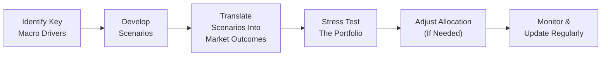

## Overview of Scenario Planning

Picture this: You’ve just spent months carefully designing a multi-asset portfolio, balancing everything from equities to commodities, and you’re feeling pretty confident—until, suddenly, a wave of concerning economic data points to an impending global recession. Or, on the flip side, your region’s central bank signals a coordinated push for growth through fiscal and monetary measures, fueling market optimism and risk-taking. How do you prepare for these fork-in-the-road moments?

That’s where scenario planning comes into play—a forward-looking method for imagining plausible alternative futures and testing how portfolios might respond to drastic macroeconomic shifts. The idea is that you combine rigorous data analysis from prior chapters (like how we approach macroeconomic indicators in Chapter 1.6 and risk management structures in Chapter 6) with a sprinkle of creativity and open-mindedness. Then you synthesize this into robust strategies that can handle the unexpected.  

Scenario planning is all about systematically mapping out potential economic and market trajectories—such as a systemic financial crisis leading to global recession, or perhaps a global expansion hinged on low interest rates—and anticipating how these outcomes might alter the behavior of various asset classes. Armed with these hypothetical scenarios, you can adjust asset allocations, hedge certain exposures, or strategically increase positions that might flourish in the predicted environment.  

## Why Scenario Planning Matters

Before we get into the nitty-gritty, let me share a quick anecdote. Several years ago, I was managing a small portfolio for a family-owned business. We had some large directional bets on emerging markets, convinced that strong growth and improving demographics would propel higher returns. Then, out of nowhere—boom—commodity prices crashed, sending commodity-exporting emerging markets into tailspins. We realized (well, a tad too late) that we had planned for the most likely scenario but overlooked numerous other plausible outcomes. A disciplined scenario planning process could have saved us from that painful (and costly) lesson.

It’s not that scenario planning can completely eliminate risk or uncertainty—nobody owns a crystal ball. But it can help you:

• Anticipate drawdowns in a portfolio (see the glossary entry “Drawdown Risk” below).  
• Prepare contingency plans for extreme market crises (Chapter 1.16).  
• Think more holistically about how a wide range of macroeconomic or geopolitical events might play out.  
• Communicate these contingency plans effectively to clients and stakeholders, highlighting your proactive risk culture.

Scenario planning becomes especially crucial in a global context, where markets are tightly interlinked, regulations differ, and political risks can pop up unexpectedly.  

## Common Global Scenarios and Their Implications

Planners typically start by brainstorming a range of scenarios that capture broad, impactful developments. Here are a few that regularly surface and might be relevant for your analysis:

Global Recession with Deflationary Pressures  
When economies contract and price levels start to fall, portfolios can get hammered. Firms suffer reduced earnings, consumer demand shrinks, unemployment rises, and equity markets draw down. Even bond markets, typically safe havens, can become uncertain if deflation threatens corporate credit quality. Additionally, deflation often means central banks are near or at the lower bound of interest rates, limiting policy ammunition. In such scenarios, you might consider:  
• High-grade government bonds for safety.  
• Defensive equity sectors (e.g., utilities or consumer staples) that can better withstand economic downturns.  
• Gold or certain alternative assets as a hedge against market panic.  

Coordinated Global Expansion  
On the other side of the fence is the bullish scenario: synchronized global economic growth fueled by low interest rates, fiscal stimulus programs, or technological breakthroughs. Equities usually flourish, credit spreads tighten, and cyclical industries like consumer discretionary or technology can see outsized gains. There’s also a chance of mild inflation, which is typically positive for risk assets but can eat away at fixed coupon bonds. Portfolio considerations might include:  
• Allocating more to equity, especially growth-oriented or cyclical segments.  
• Emphasizing risk assets such as high-yield bonds or emerging market equities, mindful of the potential volatility.  
• Building inflation-hedge components (like TIPS) if inflation is expected to awaken alongside growth.  

Commodity Booms or Busts  
Sometimes the global narrative is shaped by swings in commodity prices: an oil glut, a spike in metals demand, or a sharp drop in agricultural yields due to climate events. Commodity-intensive economies (e.g., certain emerging markets or countries heavily reliant on resource exports) react differently than technology- or service-based economies in these situations. A commodity boom can buoy currencies tied to these economies, and it can also shift the relative attractiveness of equity sectors (energy, materials). A bust has the opposite effect, often impacting local debt markets and corporate profitability in those regions.

## The Scenario Planning Process

Rather than guess what might happen, scenario planning systematically draws out multiple paths the future could take. Many professionals structure these steps as follows:

1. Identify Key Macro Drivers:  
   This part is essentially scanning the horizon for major economic catalysts—like interest rate trends, changes in consumer behavior, or policy shifts. As you learned in Chapter 14.2, it helps to evaluate how global macroeconomic factors (e.g., GDP growth, inflation, and currency movements) drive markets.

2. Develop Plausible Scenarios:  
   Next, combine the macro drivers in different ways to produce a handful of coherent scenarios. Each scenario includes narratives: Will central banks hike rates aggressively? Will technology breakthroughs accelerate productivity? Are we facing trade wars or alliances?  

3. Translate Scenarios into Market Outcomes:  
   For each scenario, infer how asset classes respond. So a deflationary recession scenario might see equity markets drop by 25% while 10-year Treasury yields sink below 1%. Meanwhile, a growth scenario might see developed-market equities up 15% to 20%, with moderate inflation and rising yields.  

4. Stress Test the Portfolio:  
   Apply these hypothetical market outcomes to your portfolio positions. By quantifying the possible returns (and drawdowns) under each scenario, you reveal vulnerabilities or upside potential. Remember references to Chapter 2 on measuring risk and return for a robust viewpoint.

5. Adjust Portfolio Allocation:  
   If the stress test reveals unacceptable losses in a recession scenario, you might reduce cyclical equity exposure or add more protective assets. If the growth scenario is extremely advantageous and you believe it’s likely, you might tilt more heavily toward equities. 

6. Update and Iterate:  
   Once the plan is in place, watch for new data—corporate earnings, macro indicators like GDP or inflation, changes in government policy—and revise your scenarios. The world’s not static; your assumptions shouldn’t be either.  

Below is a simplified flowchart that captures these steps:

## Using Scenario Planning to Guide Asset Allocation

So, how exactly do we turn scenario planning into tangible portfolio decisions? Think of it like underwriting potential economic futures. You’re essentially asking, “What if the world looks like scenario X over the next 12 to 18 months?” Then you examine how each holding—equities, fixed income, alternatives—might fare.

• Equity Positions: If recession is on the table, focus on defensive sectors, quality growth companies with strong balance sheets, or low-volatility factors. Conversely, a growth scenario might prompt a heavier tilt into cyclical or high-beta stocks.  

• Fixed Income: In uncertain or deflationary markets, long-duration government debt can be a strong performer. However, in an environment of rising rates due to strong economic demand, shorter-duration bonds or floating-rate notes might be better. High-yield credit can do well if the expansion scenario also means lower default risk.  

• Real Assets: Real estate and commodities often respond differently to inflationary or deflationary pressures. If you expect inflation from robust growth, consider inflation-protected instruments, real estate, or farmland. If you foresee deflation, the case for certain commodities might weaken unless they serve a safe-haven function (like gold in times of crisis).  

• Alternatives: Hedge funds, private equity, and other illiquid strategies carry their own risk-return profiles. Scenario planning can highlight the trade-offs: in a deep recession, liquidity can dry up and hamper redemptions; but in a growth era, private equity might deliver outsize gains in innovative sectors.

Chapter 2 introduced the concept of variance, covariance, and correlation. Scenario planning broadens our perspective by reflecting how correlations can drastically change under different macro regimes—sometimes risk-on cycles drag everything up together, while crisis periods push all correlations to 1 (meaning everything might drop together).

## The Importance of Continual Updates

One of the biggest mistakes folks make: They develop a thoughtful scenario map, then file it away until the next year. But scenario planning is not a one-and-done exercise; it’s a living, breathing approach. Macroeconomic data—like unemployment, consumer sentiment, or industrial production—arrives monthly or quarterly. Policy announcements crop up with little warning. And new technologies might disrupt entire business models practically overnight.

Whenever new information hits the market, reevaluate your scenarios:  
• Have the probabilities of certain outcomes shifted?  
• Are we closer to a growth scenario or a deep recession scenario than we were three months ago?  
• Do we need different hedges or sector tilts?  

This iterative loop ensures your portfolio isn’t left behind, anchored in assumptions that have expired.  

## Practical Example: Technology-Driven Expansion vs. Credit-Driven Crisis

Let’s walk through a simple hypothetical that you might see in a corridor conversation at an asset management firm:

• Scenario 1: Technology-Driven Growth  
  – Major breakthroughs in AI and automation cause an increase in productivity, driving GDP growth above 3% in developed economies.  
  – Equity markets rally, especially in technology and consumer sectors that benefit from lower costs and higher demand.  
  – Interest rates edge up gradually, but inflation is moderate.  
  – Commodity prices remain stable or tick slightly higher, with less robust upside.  
  – Portfolio adjustments might include overweighting tech equities, while keeping moderate duration in bonds and some inflation-protected securities.

• Scenario 2: Credit-Driven Crisis  
  – Rising rates have battered overleveraged corporate balance sheets, triggering defaults in lower-rated bonds.  
  – Bank lending tightens, consumer confidence plunges, and equity markets correct sharply.  
  – Central banks try to cut rates aggressively, but deflationary trends take hold.  
  – Portfolio decisions might favor government bonds, defensive equities, and perhaps gold or other safe-haven assets. Hedging instruments, such as equity put options, might help mitigate drawdown risk.

By comparing how the portfolio might perform in each scenario, you glean insights on the range of outcomes and can shape your allocations to be more resilient or opportunistic.  

## Best Practices and Pitfalls

Scenario planning is beneficial, but it has its traps:

Best Practices  
• Stay Objective: Avoid letting personal biases overshadow data-driven insights.  
• Keep Scenarios Plausible: Overly far-fetched scenarios (like alien invasions) might be fun to brainstorm but don’t always add real value to your risk analysis.  
• Use a Mix of Qualitative and Quantitative Data: Incorporate data from economic models, but also pay attention to market sentiment, policy directions, and corporate guidance.  
• Document Scenario Inputs and Assumptions: This helps avoid confusion later and ensures you can track changes over time.  

Common Pitfalls  
• Overconfidence: Believing your central scenario is too certain can hamper exploring alternative futures.  
• Underestimating Correlation Spikes: Realize that traditional diversification can fail in crisis periods when asset class correlations converge.  
• Ignoring Behavioral Biases: Overconfidence, anchoring to specific data points, or herding with general consensus can all weaken your scenario planning. Chapter 5 on Behavioral Biases can help you spot these issues.  
• Failing to Revisit Scenarios: As mentioned, scenario planning should be iterative.  

## Tying Scenario Planning to the CFA Exam

For those aiming for a strong performance in their CFA exam, scenario planning is typically tested in essay (constructed response) or item set format. You might see questions presenting an economic backdrop—maybe deflationary signals or a bullish tech environment—and then you’ll be asked to recommend asset allocation changes or evaluate portfolio risk. Nailing down the logic behind scenario planning, including how to pivot from one scenario to the next, is crucial.

Practical exam tips:  
• Show how you quantify or measure portfolio risk under each scenario.  
• Provide reasoned asset allocation decisions that match the scenario assumptions.  
• Justify your beliefs with reference to correlations, betas, or macroeconomic indicators.  
• Demonstrate thorough knowledge of drawdown risk, Macro developments, and risk mitigation strategies.

## Conclusion

Scenario planning is a powerful tool in a global portfolio manager’s toolkit. Rather than being caught off guard by the world’s twists and turns, you proactively map out potential futures and prepare your best responses. As you integrate scenario work into your practice, you’ll likely find it’s not just a risk management exercise—it also uncovers new opportunities. Maybe your portfolio is well-positioned for a growth scenario, or maybe you see an overlooked high-quality bond sector that’s been unfairly punished and could serve as a hedge.

Sure, no plan is foolproof. But scenario planning fosters a mindset of anticipation rather than reaction. It encourages you to remain flexible, keep a pulse on market developments, and pivot your investments when the outlook changes. In a world as interconnected and fast-changing as ours, that’s a huge advantage—one that can protect downside risk in a recession and help you catch the next big wave of growth.

## Glossary

• Scenario Planning: A process of imagining multiple plausible future states of the world to prepare strategic responses.  
• Deflationary Pressures: A persistent decrease in the general price level of goods and services, often leading to reduced economic activity.  
• Drawdown Risk: The measure of a portfolio’s peak-to-trough decline over a specified period, reflecting potential maximum losses.

## References for Further Reading

• Schwartz, P. (1991). The Art of the Long View. Doubleday.  
• IMF Global Financial Stability Reports for forward-looking assessments.  
• Market macro blogs and scenario research from leading asset management firms.  
• Refer back to earlier sections on macroeconomic indicators (Chapter 1.6) and risk management concepts (Chapter 6) for related frameworks and measure techniques.

----

## Scenario Planning for Global Recession vs. Growth: 10 Essential Exam Questions



### Which of the following best describes the main purpose of scenario planning in portfolio management?

- [ ] To eliminate all forms of risk from economic downturns.
- [ ] To guarantee maximum returns across all market environments.
- [ ] To identify a single definitive forecast of future macro conditions.
- [x] To consider multiple plausible macro outcomes and inform asset allocation decisions.

> **Explanation:** Scenario planning aims to explore multiple plausible futures, not to eliminate all risk or guarantee maximal returns. It helps portfolio managers adjust allocations based on different macroeconomic possibilities.

---

### In a global recession accompanied by deflationary pressures, which asset is most likely to provide a relatively safe haven?

- [x] Long-duration government bonds
- [ ] High-yield corporate bonds
- [ ] Technology-sector equities
- [ ] Emerging market equities

> **Explanation:** In a deflationary environment, investors often flock to risk-free or near risk-free government bonds, especially long duration if rates are expected to fall further.

---

### Which of the following steps in the scenario planning process best fits the phrase “translating high-level economic narratives into projected market outcomes”?

- [x] Converting scenarios into explicit return/volatility assumptions
- [ ] Developing plausible, qualitative narratives of the future
- [ ] Rebalancing the portfolio according to scenario analysis results
- [ ] Conducting ongoing performance attribution

> **Explanation:** Once macro scenarios are established, managers assign quantitative outcomes to asset classes—expected returns, volatilities, and correlations—so they can stress test a real portfolio.

---

### When central banks promote synchronized global growth through low interest rates and fiscal stimulus, which of the following portfolio strategies might be most beneficial?

- [ ] Rotating into defensive stocks
- [ ] Significantly reducing equity exposure across the board
- [ ] Only holding cash to avoid equity risk
- [x] Increasing exposure to cyclical and growth-oriented equities

> **Explanation:** Under coordinated global growth, cyclical and growth stocks often benefit from rising consumer demand and improving corporate earnings.

---

### A portfolio manager identifies a risk that all asset classes could become highly correlated during crises. Which practice best addresses this concern within scenario planning?

- [x] Incorporate correlation spikes in each negative scenario
- [ ] Use only historical average correlations for forecasting
- [ ] Avoid any investment in equities
- [ ] Assume correlations remain constant across scenarios

> **Explanation:** One key scenario planning principle is acknowledging that correlations can (and often do) rise drastically in crises. Factoring these correlation spikes helps prevent underestimating downside.

---

### Under a growth-driven scenario, inflation rates might rise modestly. Which instrument could a portfolio manager consider to hedge moderate inflation risks?

- [ ] Regular corporate bonds
- [ ] Interest rate caps
- [x] Treasury Inflation-Protected Securities (TIPS)
- [ ] Currency forwards on a strong currency

> **Explanation:** TIPS adjust principal values with inflation, protecting investors from purchasing-power erosion.

---

### True or False: Scenario planning is a static process that requires only one set of assumptions, updated annually.

- [ ] True
- [x] False

> **Explanation:** Scenario planning must be iterative, updating assumptions and probabilities as new economic data and policy changes emerge.

---

### What is a major pitfall to be aware of when conducting scenario planning?

- [ ] Incorporating both qualitative and quantitative factors
- [x] Overconfidence in a single most-likely scenario
- [ ] Including more than one scenario
- [ ] Stress-testing different portions of the portfolio

> **Explanation:** Overconfidence in a single forecast of the future may blindside a portfolio manager if unexpected events occur. Scenario planning is about balancing multiple plausible outcomes, not clinging to just one.

---

### Which of the following is a direct benefit of scenario planning for a multi-asset portfolio?

- [ ] Automatically reducing volatility in equity markets
- [ ] Ensuring maximum returns in a commodity boom
- [x] Identifying vulnerabilities and potential hedges in different macro regimes
- [ ] Eliminating the impact of geopolitical risks

> **Explanation:** Scenario planning helps reveal a portfolio’s strengths and weaknesses under different economic situations, allowing managers to prepare hedges or adjust exposures as needed.

---

### True or False: In a commodity boom scenario, service-oriented economies are always better positioned than commodity-exporting economies.

- [ ] True
- [x] False

> **Explanation:** Commodity-exporting nations may see increased revenues and stronger currencies during commodity booms, while service-oriented economies might not experience the same surge. The impact depends on the specific commodity and broader economic context.


