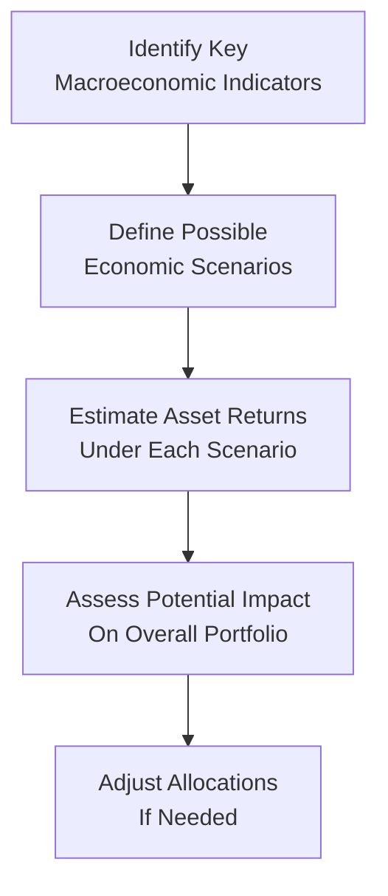

## The Role of Global Macroeconomic Indicators in Asset Allocation

Sometimes I look back at my first attempt to integrate macroeconomic data into my portfolio decisions, and I can’t help but smile. I remember opening my laptop, scanning headlines about GDP growth, unemployment rates, or interest rates, and thinking, “Well, this must mean something for stocks or bonds, right?” Over time, I discovered that being systematic about integrating macroeconomic indicators into asset allocation is an art as well as a science. It’s a bit like cooking: you have your ingredients (the indicators), and you need to add them in the right proportions and at the right times to produce a well-balanced portfolio.

Below, we’ll look at some of the most common macroeconomic factors and signals that influence asset allocation decisions, and we’ll explore how an investor can make sense of it all (yes, even if you’re just starting out in macro analysis).

## Integrating Key Macroeconomic Indicators

Macroeconomic indicators provide signals about the broader economic environment, both at the national and global level. These signals are crucial for forming opinions on how an economy might be evolving, which in turn influences asset class returns. Let’s discuss some of the most commonly watched indicators.

### GDP Growth Rates
Gross Domestic Product (GDP) is often considered the broadest measure of economic output. A robust GDP figure typically indicates strong consumer and business activity, which can support corporate earnings and boost equity markets. However, if GDP growth becomes too strong or overheated, it might prompt central banks to raise interest rates to manage inflation—potentially creating headwinds for certain asset classes (like long-term bonds or high-duration equities).

### Employment Data
Employment figures, such as the unemployment rate or non-farm payrolls, reflect the labor market’s strength. Rising employment often leads to increased consumer spending, buoying corporate revenue. But if wage growth is too rapid, that might trigger inflationary pressure—ultimately affecting different asset classes in varying ways (for example, inflation-sensitive commodities might get a lift, but high-duration bonds could suffer).

### Interest Rates and Monetary Policy
Interest rates influence the cost of borrowing for individuals, businesses, and governments. Central banks often raise or lower policy rates to manage inflation and foster stable economic growth. When rates are low, borrowing is cheaper, encouraging corporate and household spending. This environment could favor equities and certain fixed income instruments (e.g., corporate bonds). Conversely, higher interest rates tend to dampen both consumer and business spending, often benefiting short-duration assets but placing downward pressure on growth-oriented equities.

### Inflation and Consumption Patterns
Inflation is the general rise in prices of goods and services over time. When inflation is stable and modest, it generally indicates a healthy economy, supporting corporate profitability and equity valuations. However, suddenly high inflation can erode bond prices (particularly long-term issues) and drive investors toward inflation-hedging assets such as commodities, real estate, or Treasury Inflation-Protected Securities (TIPS). Shifts in consumption patterns—triggered by price changes or shifts in consumer sentiment—can dramatically alter sector performances within equity markets.

### Fiscal Policy, Trade Balances, and Government Spending
Fiscal policy includes government tax policies and spending programs, which can directly affect economic growth. Expansionary fiscal policy (e.g., stimulus spending or significant infrastructure spending) can boost short-term demand but might also lead to higher inflation or deficits. Trade balances—like current account surpluses or deficits—reflect a country’s trade flow with the rest of the world. Substantial shifts here can impact currency strength, which in turn affects multinational corporations, export-sensitive industries, and foreign investments in local capital markets.

## Macroeconomic Cycles and Asset Class Interplay

Just as there are seasons in the year, economies naturally cycle through expansion, peak, contraction (recession), and trough. Each phase of the cycle carries distinct implications for asset classes.

- Equity Performance: During an expansion, equities often thrive on rising corporate earnings and higher consumer spending. However, if expansions extend for too long and lead to overheating, central banks might step in with tighter monetary policies. This can temper equity returns. In a recession, equities tend to suffer from falling earnings, but certain defensive sectors (e.g., utilities or consumer staples) might hold up better.
  
- Bond Yields: Bonds can be a bit of a rollercoaster in different interest-rate environments. When growth is strong, demand for credit rises, sometimes pushing yields higher and prices lower. During a recession, monetary authorities typically cut rates, which boosts bond prices. For portfolio managers who can tactically adjust durations (the sensitivity of bond prices to interest-rate changes), macroeconomic cycle analysis becomes a key advantage.

- Commodities and Real Assets: In inflationary conditions (often occurring near late-cycle expansions), commodities like precious metals or energy might surge as investors seek hedges against eroding purchasing power. Real estate often benefits from stable growth and moderate inflation, given the potential for rental income to rise with prices.

- Currency Movements: Don’t forget foreign exchange. When one economy is in a strong expansion, its currency might appreciate relative to that of a slower-growing country. Portfolio managers who allocate globally must monitor currency exposure, hedging where necessary to mitigate unwelcome volatility.

## Global Dispersion in Returns and Volatilities

Global capital markets rarely move in lockstep. One region might be in the midst of a booming recovery, while another languishes in recession. This dispersion creates opportunities—and challenges.

For instance, consider how a strong U.S. dollar environment impacts emerging markets. A strengthening dollar can draw capital flows away from riskier emerging markets, leading their currencies to depreciate (sometimes abruptly). Meanwhile, countries with heavy export dependency might actually relish a weaker currency to spur overseas demand. Clearly, regional nuances matter greatly in multi-asset allocation.

Moreover, interest-rate differentials between countries influence the so-called “carry trade,” where investors borrow in a lower-rate currency and invest in a higher-rate currency, hoping to profit on the yield differential. That carry trade might unwind violently if macro fundamentals shift or if global risk appetites collapse—leading to fast capital outflows from certain markets. All of these cross-currents underscore why it’s vital to keep a global lens when analyzing macro conditions.

## Scenario Analysis Based on Macroeconomic Signals

Managing a portfolio in a dynamic global context implies you’re always looking over the horizon, anticipating possible changes. Enter scenario analysis. Rather than assume a single future path, scenario analysis considers multiple “what if” conditions, such as:

• Recession Scenario  
• Moderate Growth Scenario  
• Boom Scenario  

You might also consider specific macro events—like unexpected central bank tightening, a global supply shock, or a sudden emerging-market liquidity crisis. By mapping out how each asset class could respond, you effectively stress-test your portfolio. It’s almost like playing a game of chess in your head: “If the global economy slumps and interest rates drop, how do my equities perform? Which sectors might benefit? Should I hold more short-term bonds?”

A simple diagram can illustrate this scenario analysis approach:

This process is iterative. You regularly revisit the scenarios as new data shifts the macro landscape. Scenario analysis isn’t about predicting the future with absolute certainty—no matter how good we are, macro forecasting is famously tricky. Instead, it’s about preparing for a range of likely outcomes.

## Monitoring Leading Indicators and Emerging Market Conditions

Leading economic indicators trailblaze the path for future economic activity. The Purchasing Managers’ Index (PMI), for example, reflects near-term manufacturing and service sector momentum. Consumer confidence indices gauge how optimistic households feel about spending. Building permits can indicate imminent real estate activity. When these indicators turn sharply lower, it may foreshadow a downturn, prompting a portfolio tilt toward more defensive assets or geographies.

Emerging markets introduce further complexities—capital flows can abruptly reverse on changes in global risk appetite or local policy. Many emerging economies also rely heavily on commodity exports, so a slowdown in global demand can create a brutal chain reaction in local equity, bond, and currency markets. Moreover, because central bank transparency varies considerably around the world, policy surprises in emerging markets can be more abrupt, leading to outsized price movements.

## Practical Example: Macro Data in Action

Let’s do a short real-world thought experiment:

• Suppose the GDP growth rate in Country A has been declining quarter-over-quarter. Consumer confidence is down, and the central bank recently cut interest rates to stimulate lending.  
• Equity markets in Country A have shown signs of weakening, and yields on 10-year government bonds have fallen in anticipation of possible further rate cuts.  
• Meanwhile, Country B’s economy is booming, with strong job growth, slightly higher inflation, and a central bank that’s raising rates. Equities in Country B are rallying, but bond prices are under pressure, especially at the long end of the curve.  

An investor scanning these data points might adjust their portfolio to be overweight equities in Country B (anticipating continued earnings growth), but hold more short-term fixed income in Country B’s currency to avoid the negative impact of rising rates on longer-duration bonds. Simultaneously, they might shift from equities in Country A to longer-duration government bonds there—anticipating that if the slowdown persists, yields could keep falling and bond prices might rise. This is a simplified example, but it demonstrates how a constant read on macro indicators sparks timely allocation tweaks.

## Common Pitfalls and Challenges

• Overreliance on One Indicator: Many investors get hooked on a single data release or a single central bank announcement. It’s better to build a mosaic of signals.  
• Late Adjustments: By the time official GDP data is released, the market might have already priced in the shift. Leading indicators and real-time data sets can help.  
• Ignoring Currency Risk: Focusing purely on equity or bond performance without factoring in currency movements can cripple returns in global portfolios.  
• Underestimating Policy Shifts: Central banks sometimes surprise markets with “off-cycle” rate cuts or hikes. Additionally, sudden fiscal changes—such as large infrastructure packages—can disrupt valuations quickly.  

## Best Practices for Leveraging Global Macroeconomic Factors

• Data Triangulation: Combine official GDP or employment data with leading indicators (PMIs, consumer confidence, etc.), anecdotal evidence, and capital flow data.  
• Ongoing Scenario Planning: Don’t treat scenario analysis as a one-off exercise. Update it frequently as new data rolls in.  
• Use Risk Budgets: As discussed in earlier chapters, risk budgeting helps ensure that a potential macro shock (e.g., severe recession) doesn’t derail your entire portfolio.  
• Tactically Rotate Within Asset Classes: Sometimes, the answer isn’t just about “stocks vs. bonds” but “cyclicals vs. defensives” or “short-duration vs. long-duration.”  

## Linking Back to the Broader Portfolio Context

In earlier chapters, we explored risk-return objectives and the governance needed to maintain a disciplined Investment Policy Statement (IPS). Integrating macro factors is part of ensuring the asset allocation remains in harmony with the investor’s risk tolerance and return objectives. As we layer on these macro considerations, we can refine strategic and tactical allocations, calibrate sector exposures, and decide when to hedge currency or interest-rate risks. This is particularly important for managers overseeing global or multi-asset portfolios, where cross-country correlations and diverging policy cycles dramatically affect outcomes.

## Glossary

• Macroeconomic Policy: Actions by central banks (monetary policy) and governments (fiscal policy) aimed at steering the broader economic environment—such as adjusting interest rates, bond-buying programs, tax rates, and public spending.  
• Leading Economic Indicators: Data points that more quickly reflect turning points in economic activity, helping forecast future trends (e.g., PMI, building permits, and consumer confidence).  
• Recession: A significant decline in economic activity, often defined as two consecutive quarters of negative GDP growth, leading to lower employment and spending.  
• Scenario Analysis: An investment technique that tests portfolio performance under various assumed economic states or shock events, helping investors plan and adjust allocations in response to potential outcomes.

## References and Further Reading

- International Monetary Fund (IMF) World Economic Outlook:  
  https://www.imf.org/en/Publications/WEO  
- CFA Institute Research Foundation publications on macroeconomic cycles.  
- Mankiw, N. G. (2019). Macroeconomics (10th ed.). Worth Publishers.

## Concluding Thoughts and Exam Tips

Moving from theoretical indicators on a spreadsheet to actual portfolio decisions can feel challenging, especially if macro signals are mixed. The trick is to weigh the relative importance of each macro factor, identify potential turning points, and remain flexible. Particularly for CFA candidates at higher levels, you’ll encounter scenario-based exam questions that ask you to combine data from multiple macro indicators to form an investment recommendation. Don’t just memorize definitions. Practice dissecting hypothetical economic data and clarifying how it might reshape a portfolio’s equity, bond, and alternative allocations.

On the exam, watch for:

• Constructed-Response Questions: They might present a table of macro indicators (e.g., rising unemployment, stable inflation, etc.) and ask you to justify or critique an asset allocation decision.  
• Item Set Vignettes: You may be given “mini-cases” that detail new economic policies, changes in PMI, or central bank announcements. The question could revolve around adjusting a global balanced portfolio to reflect the new macro environment.  
• Time Management: Sketch out the relevant macro framework quickly and highlight the likely winners and losers in each scenario.

Above all, approach macro data with an open mind—be ready for surprises, keep up with frequent data releases, and anchor your decisions in a coherent scenario analysis framework. The payoff is a more robust, forward-looking portfolio that aligns with both your IPS constraints and the realities of shifting global economic cycles.

---

## Global Macroeconomic Factors in Asset Allocation: 10 Practice Questions for CFA Exam



### In a shrinking economy with declining GDP growth and low consumer confidence, which asset classes are most likely to perform relatively better?

- [x] Long-duration government bonds and defensive equity sectors.
- [ ] High-yield corporate bonds and growth-oriented equities.
- [ ] Commodities and emerging-market equities.
- [ ] Cryptocurrency and frontier markets.

> **Explanation:** During an economic contraction, investors may seek safety in long-duration government bonds (benefiting from lower interest rates) and more stable defensive equity sectors. Growth-oriented equities and riskier assets are more vulnerable to poor economic conditions.

### During a rapidly expanding economic cycle with rising inflation, how might central banks typically respond?

- [x] Increase policy rates to manage inflationary pressures.
- [ ] Decrease policy rates to spur growth further.
- [ ] Halt all bond purchase programs but keep rates unchanged.
- [ ] Introduce capital controls on foreign investments.

> **Explanation:** Central banks commonly tighten monetary policy by raising interest rates when inflation accelerates, aiming to prevent the economy from overheating.

### If the U.S. dollar strengthens significantly against most other currencies, how could this impact an emerging market’s local equity market (denominated in that market’s own currency)?

- [x] Capital outflows potentially weaken the local equity market as investors look for less risky U.S. assets.
- [ ] Local equity prices generally remain unaffected by foreign exchange fluctuations.
- [ ] It typically leads to impressive gains in local equity indices due to trade advantages.
- [ ] Currency appreciation in emerging markets offsets any capital flow issues.

> **Explanation:** A strengthening U.S. dollar often causes capital outflows from riskier emerging markets back into dollar-denominated assets. This can put downward pressure on emerging market equities and currencies.

### Which of the following is considered a leading economic indicator?

- [ ] The unemployment rate.
- [x] Purchasing Managers’ Index (PMI).
- [ ] GDP growth rate.
- [ ] Public debt levels.

> **Explanation:** The PMI is widely viewed as a leading indicator because it provides a forward-looking snapshot of manufacturing and service activity levels—often signaling changes in economic momentum before broader data becomes apparent.

### When constructing a scenario analysis, which factor would generally be considered the most influential for projecting interest rate movements?

- [ ] Consumer spending habits in niche luxury markets.
- [x] Central bank monetary policy announcements and inflation expectations.
- [ ] The historical average of corporate bond spreads.
- [ ] Historical equity market returns over the last decade.

> **Explanation:** Interest rates are primarily driven by central bank policies and inflation expectations. While consumer spending, corporate spreads, and historical returns matter, they tend to be secondary influences relative to monetary policy decisions.

### A recession is typically defined by:

- [ ] A temporary stock market downturn of over 10%.
- [ ] Chronic budget deficits in government spending.
- [x] At least two consecutive quarters of negative GDP growth.
- [ ] An inversion in the yield curve for more than a week.

> **Explanation:** The classic definition of a recession is two consecutive quarters of decline in real GDP, signifying a sustained slowdown in economic activity.

### How should an investor react if two leading indicators turn abruptly negative, suggesting a downturn, yet other indicators remain stable?

- [x] Perform a thorough scenario analysis, weighing the potential downturn against other signals.
- [ ] Immediately sell all equity holdings and hold only cash.
- [ ] Ignore the negative signals until all indicators shift in the same direction.
- [ ] Double down on cyclical stocks to exploit any mispricing.

> **Explanation:** Leading indicators are important clues, but a balanced approach is required. Scenario analysis helps you evaluate the downside risk while considering other stable indicators.

### If interest rates are expected to rise in the near future, which bond positioning is typically the most prudent?

- [x] Short-duration bonds to reduce sensitivity to rising rates.
- [ ] Long-duration bonds for higher potential capital gains.
- [ ] Zero-coupon long-term bonds.
- [ ] Junk bonds with high duration.

> **Explanation:** Rising rates cause bond prices to fall, especially for long-duration bonds, which are more sensitive to interest-rate changes. Short-duration bonds often hold up better in a rising-rate environment.

### Which of the following might indicate that an economy is transitioning from expansion to a recession?

- [x] Tighter credit conditions and falling consumer confidence.
- [ ] Increasing demand for luxury goods.
- [ ] Continued rise in stock market valuations across all sectors.
- [ ] Central banks actively cutting rates to stimulate an overheated economy.

> **Explanation:** As credit conditions tighten and consumers lose confidence, businesses often see reduced demand, signaling a potential economic downturn. Active rate cuts might be a response to the slowdown, but not necessarily a sign of an “overheated” economy.

### The capital flow reversal phenomenon happens when:

- [x] Foreign investors abruptly sell securities in emerging markets, returning capital to their home markets.
- [ ] Central banks reduce interest rates within their country.
- [ ] The government offers tax incentives for foreign direct investment.
- [ ] The domestic currency appreciates against all major peers.

> **Explanation:** Capital flow reversal is a situation where foreign capital quickly exits emerging or riskier markets, often caused by changing global interest rates, escalating risk aversion, or a surge in the U.S. dollar.


