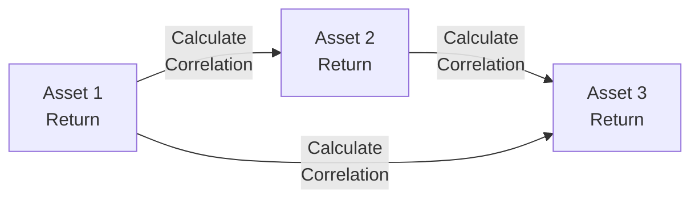

## Introduction

Well, maybe you’ve noticed how sometimes equities and bonds seem to move in opposite directions (giving you that nice diversification effect), yet at other times, they move in lockstep, amplifying your portfolio’s overall risk. This phenomenon often surprises folks who assume correlations are stable or entirely dependable. In reality, cross-asset correlations can shift dramatically as economic, geopolitical, or even behavioral forces take hold. In this section, we’ll dig into why these correlations matter for portfolio construction and performance, and how macro hedging strategies can help offset broad economic risks.

## The Importance of Cross-Asset Correlations

Picture this: you’re sitting at your desk, toying with the idea of adding corporate bonds to reduce your equity portfolio volatility. Historically, bonds and equities have had a low correlation, so you’d expect less risk. But what happens if the Federal Reserve aggressively hikes interest rates while global markets panic about recession? There’s a good chance your carefully built correlation assumptions could be thrown out the window—equities and bonds might plummet together as fear plays the tune. 

Correlation, a statistical measure ranging from -1 to +1, is central to modern portfolio theory. A correlation of +1 means two assets move exactly in tandem, while -1 means they move perfectly in opposite directions.

When correlations appear low, that indicates a potential diversification benefit. But in times of market stress, these correlations tend to spike, straining your assumptions and possibly causing larger drawdowns than you’d anticipated. This is often attributed to:

• Liquidity Crises: When investors need cash, they sell everything—raising correlations across asset classes.  
• Policy Shocks: Central bank announcements or unexpected geopolitical events can send shockwaves across all markets.  
• Risk-On/Risk-Off Dynamics: In a “risk-off” environment, investors often sell riskier assets (like equities, junk bonds, or emerging markets) and pile into so-called safe havens (like U.S. Treasury bonds, gold, or certain currencies). However, if markets go into full panic mode, even supposedly safe assets can move in the same downward direction as equities.

## Why Correlations Shift During Stress

I recall a conversation with a fellow analyst about 2008’s financial crisis. We’d both loaded up on a variety of assets convinced of their diversification benefits. When Lehman Brothers folded, everything from equities to corporate bonds to even some commodities sank together. All that talk about their historical correlations didn’t seem to matter much in the face of a systemic crisis.  

Monetary policy decisions (e.g., quantitative easing or aggressive rate hikes) can flatten out the typical relationships between assets. And during liquidity events—where market participants scramble for cash—assets that used to behave quite differently can suddenly become highly correlated.  

Here’s a simple formula for correlation between two assets A and B:


\rho_{A,B} = \frac{\mathrm{Cov}(A, B)}{\sigma_A \, \sigma_B}


• ρ₍A,B₎: The correlation between assets A and B.  
• Cov(A, B): The covariance of returns of A and B.  
• σ_A and σ_B: The standard deviation of returns for A and B, respectively.

In calm markets, Cov(A, B) may be relatively small (or negative). But once risk sentiment flips, covariance among risky assets often shoots upward.

## Macro Hedging: Protecting Portfolios from Broad Economic Risks

Macro hedging is about reducing your portfolio’s overall vulnerability to looming economic or market-wide risks. Rather than hedging each individual security, macro hedging strategies focus on the big factors that drive returns across multiple asset classes—like interest rates, equity market performance, or foreign exchange movements.

### Hedging Equity Risk with Index Futures or Options

Let’s say you hold a broadly diversified equity portfolio but suspect a market correction is on the horizon. One comparatively cost-effective strategy is to short equity index futures (e.g., S&P 500 futures) or buy put options on that index. This helps offset the potential downside if equities tumble. Conversely, if you’re feeling extremely confident, you can hedge less or not at all. But trust me, exchanges and many risk managers typically prefer seeing a hedge in place, at least if your directional bet is large.

### Using Interest Rate Swaps to Hedge Bond Exposure

Suppose you manage a bond portfolio and spot early signs that interest rates might rise. One macro hedge involves entering an interest rate swap to pay a fixed rate and receive a floating rate. If rates go up, the swap position gains value (because paying fixed is more attractive now, while receiving floating rates that increase with the market can offset some of your bond losses). If rates barely move, your cost is effectively the swap’s net payment. This strategy helps you stay invested in the bonds you might prefer for other reasons (like credit yield) while hedging the directional interest rate risk.

### Currency Hedges to Reduce FX Exposure

If you’re investing internationally, foreign exchange (FX) movements can be a big source of volatility. You might use currency forwards or options to hedge your portfolio’s foreign currency exposure. For instance, a U.S. investor in euro-denominated bonds can hedge the USD/EUR exchange rate by entering into forward contracts that lock in the exchange rate at which they’ll convert euros back into dollars. This is particularly relevant when you expect currency swings to overshadow any underlying returns on the asset.

## Dynamic Nature of Correlations

As we hinted earlier, correlation isn’t a one-and-done figure you can just tuck away in your asset allocation policy. It’s dynamic, heavily driven by factors like:

• Policy Changes: Central banks shift rates; governments implement stimulus packages; trade policies are reconfigured.  
• Geopolitical Events: Wars, trade disruptions, pandemics, or natural disasters can alter demand and supply relationships across multiple asset classes.  
• Market Volatility: The “risk-on/risk-off” phenomenon quickly changes investor sentiments, especially in times of uncertainty.  

It’s worth regularly updating your correlation estimates. One approach is to rely on rolling correlations—calculating correlations over a recent window (like 90 days or 180 days) to watch for changes. Another approach involves building regime-switching models or factor-based methods that attempt to predict how correlations might behave in different scenarios (e.g., high-volatility vs. low-volatility regimes).

Here’s a visual representation of how we might analyze correlations among multiple assets in a broad portfolio:



You’d update these relationships over time and see if they remain stable or shift under stress.

## Monitoring Cross-Asset Linkages and Tail-Risk Events

Another angle: consider extreme scenarios (a.k.a. tail-risk events). Traditional correlation metrics like Pearson correlation might be less informative when we’re dealing with the tails of the distribution. For instance, you might want to calculate how correlated assets are specifically during market downturns. Some practitioners use conditional correlation estimates or copulas to measure how assets behave in worst-case scenarios.

One best practice: frequently run stress tests, scenario analyses, and what-if simulations. This approach can help reveal how your portfolio might behave if correlations suddenly spike. Let me underscore that it’s not just about measuring correlation in a calm environment—it’s about preparing for that storm where diversification can vanish quickly.

## Practical Examples and Real-World Scenarios

• A Global Equity & Bond Portfolio: Imagine a U.S. portfolio holding both domestic and international equities plus a selection of investment-grade corporate bonds. The portfolio manager monitors interest rate risk via interest rate swaps and hedges about 50% of currency exposure. As the dollar strengthens, the FX hedge offsets some losses on the euro, yen, and sterling denominated positions. Meanwhile, the bond positions might still face interest rate risk if the Federal Reserve pivots sharply—hence the manager uses rate swaps as partial protection.

• Commodity Integration: A portfolio invests in commodities such as gold or oil to add diversification. But in a liquidity crisis, you might see these commodities selling off alongside equities. Macro hedging could involve short positions on broad commodity indexes or using options to mitigate sharp drawdowns if global growth expectations fall.

## Subjectivity and Choosing a Hedging Level

Alright, so how do you decide how much macro hedging to put in place? This can be as much art as it is science. Some managers set strict rules. Others rely on their gut (and I’d say that often introduces more risk). A typical approach is to estimate your maximum drawdown tolerance and measure how your portfolio might breach that limit given certain correlation assumptions. Then, you’d apply a hedging strategy to scale back the likely losses.

In my opinion, a balanced approach that uses historical data, forward-looking indicators, and scenario-based modeling offers the best chance of success.

## A Quick Python Example

To keep you from yawning, here’s a tiny snippet of Python code that calculates correlations between two return series. Let’s say you have daily returns for equities and bonds; you can do a rolling correlation:

```python
import pandas as pd

df['RollingCorr'] = df['Equity'].rolling(window=60).corr(df['Bonds'])

print(df['RollingCorr'].tail())
```

This rolling correlation helps you see if the relationship is stable, trending up, or drifting down—each scenario might inform a different hedging posture.

## Conclusion and Exam Tips

Cross-asset correlations and macro hedging form a critical pillar of modern portfolio construction. Under normal conditions, building out a multi-asset portfolio with low correlations looks great, but always keep in mind how correlations can converge when volatility or liquidity risks hit. Regularly monitor how macro factors, policy changes, and global sentiment could whip correlations into unexpected shapes.

For the exam, remember to:

• Emphasize correlation’s dynamic nature—don’t treat it as static.  
• Know the standard formulas for correlation and how to apply them.  
• Understand how to articulate macro hedging strategies—such as using derivatives (futures, swaps, options) to manage equity, interest rate, or FX exposures.  
• Stay mindful of how crisis periods can erode diversification benefits.

Being able to discuss how and why you’d implement macro hedges, as well as explaining the procedure for monitoring correlations and scenario testing, is often a key step in tackling scenario-based questions.

## Glossary

Correlation: A statistical measure (ranging from -1 to 1) indicating how two assets move relative to each other.  
Macro Hedging: Strategies designed to protect a portfolio from broad economic risks (e.g., rising rates, market downturns).  
Risk-On/Risk-Off (RORO): A pattern where market sentiment collectively shifts between higher-risk and lower-risk assets.

## References and Further Reading

- Meucci, A. (2010). Risk and Asset Allocation. Springer.  
- BlackRock Investment Institute Insights on Cross-Asset Correlation Trends.  
- Articles on macro hedging tools in The Journal of Portfolio Management.  
- CFA Institute. (Latest Edition). CFA Program Curriculum, particularly sections on derivatives and risk management.  

## Cross-Asset Correlations and Macro Hedging Practice Questions



### Which statement best describes the typical behavior of correlations during a market crisis?

- [ ] They often become more negative, enhancing diversification benefits.
- [x] They tend to increase, reducing diversification benefits.
- [ ] They have no clear direction and remain unpredictable.
- [ ] They are controlled by central bank policies and remain constant.

> **Explanation:** In a crisis, investors generally sell a broad range of assets to raise cash, driving correlations higher (i.e., assets move together).

### What is one benefit of using index futures to hedge a large equity portfolio?

- [ ] They eliminate equity risk entirely.
- [x] They provide a cost-effective, broad-based short exposure.
- [ ] They increase portfolio correlation to fixed income assets.
- [ ] They have zero basis risk.

> **Explanation:** Equity index futures can be a cost-effective way to gain or reduce overall market exposure quickly. They do not eliminate all equity risk but help offset broad market moves.

### Why might correlations between asset classes change over time?

- [ ] Correlations are fixed by financial regulations and do not change.
- [x] Shifts in economic conditions, monetary policy, and investor risk appetite can impact how different assets move together.
- [ ] Model risk ensures correlations remain constant over time.
- [ ] Behavioral biases of investors keep correlations stable.

> **Explanation:** Macroeconomic factors, policy changes, and pattern shifts in investor sentiment all contribute to changing correlations.

### An interest rate swap used to hedge bond exposure typically involves:

- [ ] Paying floating, receiving floating.
- [ ] Receiving floating, receiving fixed.
- [x] Paying fixed, receiving floating.
- [ ] Notional payments in both directions.

> **Explanation:** When hedging rising rates, managers pay fixed and receive a floating rate that increases with benchmark interest rates, offsetting some losses on bond prices.

### Hedging foreign currency exposure in a global portfolio is most relevant when:

- [x] Currency fluctuations significantly impact returns relative to the underlying assets.
- [ ] All investments are in the domestic market.
- [x] The investor wants to lock in a conversion rate to reduce volatility from FX movements.
- [ ] The investor has no exposure to international markets.

> **Explanation:** If you hold foreign-denominated assets, FX movements can affect returns. Hedging is particularly useful when currency volatility is large or unpredictable.

### Which tool can effectively hedge equity downside risk without selling the underlying equity positions?

- [x] Buying put options.
- [ ] Using collared equity or short calls alone.
- [ ] Selling the equity outright.
- [ ] Investing in a different equity sector.

> **Explanation:** Buying put options gives the right to sell at a specific price, limiting downside risk while retaining the potential upside of the equity.

### In a risk-on market environment, investors tend to:

- [ ] Allocate more to risk-free assets.
- [x] Search for higher yields and move into equities, high-yield bonds, or EM assets.
- [x] Sell safer assets in favor of higher-return potentials.
- [ ] Avoid leveraged investments.

> **Explanation:** During risk-on phases, investors typically embrace riskier assets for higher returns.

### A measure that focuses on how correlations behave specifically during market downturns is referred to as:

- [ ] Pearson correlation coefficient.
- [ ] Rolling correlation.
- [ ] Standard deviation.
- [x] Conditional correlation.

> **Explanation:** Conditional correlation estimates how relationships change (often strengthening) under certain market conditions, such as downturns or high volatility.

### To account for changing correlations in portfolio management, one might:

- [x] Use rolling or dynamic correlation measures.
- [ ] Rely on a single long-term historical correlation figure indefinitely.
- [ ] Disregard correlation assumptions.
- [ ] Use only the Sharpe ratio for all risk measurement.

> **Explanation:** Rolling or dynamic correlation measures allow managers to capture how relationships evolve over different market windows or regimes.

### True or False: Macro hedging strategies aim to protect portfolios from individual stock risk rather than broad economic or market-wide risks.

- [x] True
- [ ] False

> **Explanation:** Macro hedging is about mitigating exposure to broad macroeconomic or systemic risks (like interest rates, market downturns, or foreign exchange). It doesn’t specifically target single-stock risk.


