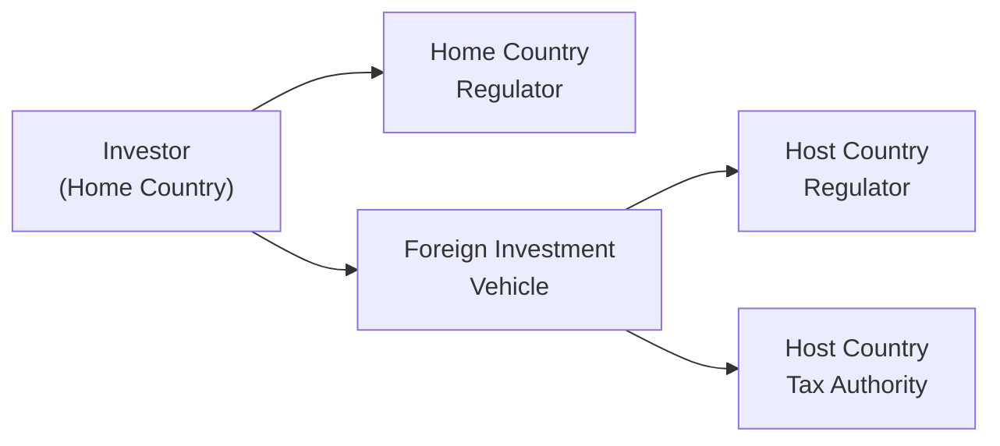

## Regulatory Differences Across Major Markets

Regulatory environments can vary enormously from one region to another, and—believe me—navigating these differences can feel like you’re trying to crack a secret code. I once chatted with a former colleague who managed cross-border portfolios in both Europe and Asia. He joked that he kept a separate folder for each country’s documentation—just so he wouldn’t lose track of the different rules, filing deadlines, and legal disclosures. That’s kind of how it goes when you’re dealing with multiple regulators.

Below is a quick look at some of the key regulators around the globe:

• United States – The Securities and Exchange Commission (SEC)  
• Europe – The European Securities and Markets Authority (ESMA)  
• Singapore – The Monetary Authority of Singapore (MAS)  
• Hong Kong – The Securities and Futures Commission (SFC)  
• Australia – The Australian Securities and Investments Commission (ASIC)  

Each regulator typically has its own take on market structure, licensing requirements, client suitability, and reporting standards. For instance, the SEC might emphasize thorough public filings and detailed disclosures, while regulators in Asia could place stricter constraints on foreign investor participation. ESMA in Europe also plays a significant role in shaping harmonized regulations and passporting rules across EU member states, but it leaves some critical decisions (like local tax policies) to each country’s own authority.

## Common Compliance Themes

Despite the diversity of rules, certain themes show up pretty much everywhere—like the greatest hits of regulation:

### Disclosure Requirements

Regulators require investment managers to disclose material information to clients or the public. Think about performance data, fee structures, and risk factors. In the U.S., you might see mandated filings such as 10-K, 10-Q, and ADV forms. In the EU, you often have guidelines around Key Investor Information Documents (KIIDs). Regardless of the acronym, the aim is the same: keep investors informed so they can make decisions with their eyes wide open.

### Trading Restrictions

Regulators often impose restrictions on short sales, margin trading, or derivatives usage. These constraints aim to limit systemic risk and speculation, but they can also create operational challenges. If you’re adjusting a global equity portfolio, it’s crucial to know whether local rules even allow short selling or whether there are circuit breakers that can halt trading under certain conditions.

### Anti–Money Laundering (AML) Rules

AML regulations require financial institutions to identify clients, perform due diligence, and report suspicious activities. The whole point is to prevent criminals from funneling illicit funds through legitimate markets. Many jurisdictions have mandatory Know Your Customer (KYC) protocols, risk scoring, and continuous monitoring. If you’re setting up a fund, be prepared for thorough background checks, especially if your client base spans multiple countries.

### Client Suitability and Best Execution

Asset managers everywhere typically have an obligation to ensure that investments align with a client’s risk profile, objectives, and restrictions. “Best execution” means your trading must aim to secure the most favorable terms for the client, considering price, costs, speed, and order size. The trick is that the specific metrics for evaluating best execution can differ by region.  

### Fiduciary Obligations

Fiduciary duty is the legal obligation to act in the client’s best interest with loyalty and care. This concept is deeply woven into many professional standards, including the CFA Institute Code of Ethics and Standards of Professional Conduct. If local regulations are stricter, you must comply with the higher standard. Violate fiduciary duties, and you could face hefty penalties or even a ban from the industry.

## The Impact of Taxation on Investment Returns

Tax can be the silent performance killer. Every time you receive dividends, coupons, or realize capital gains, the taxman is around the corner (or so it feels) letting you know it’s pay-up time. And if you’ve ever compared a pre-tax return with an after-tax return, it can be an eye-opening difference.

### Withholding Taxes on Dividends and Interest

Many countries withhold a portion of dividends or coupon payments at the source. For example, if a U.S. investor receives dividends from a French stock, the French authorities might automatically withhold a certain percentage before the investor sees a dime. These rates can vary widely—sometimes 15%, 25%, or even higher.

You can represent the after-tax return mathematically (the simplest version) as:

$$
\text{After-Tax Return} = \text{Gross Return} \times (1 - T)
$$

where \\( T \\) is the relevant tax rate (expressed as a decimal). This equation might come in handy if you’re quickly calculating the potential impact of withholding taxes on a cross-border investment.

### Double Taxation Treaties

So, you might wonder: “Do I have to pay tax in the foreign country and again at home?” Possibly. And that’s where double taxation treaties come in. These treaties stop the same income from getting taxed twice. For instance, the U.S. and many other countries have bilateral agreements that allow foreign investors to claim a tax credit or a reduced withholding rate, which sure beats paying a double bill.

### Leveraging Tax-Efficient Structures

In certain cases, you can reduce tax drag by using structures like exchange-traded funds (ETFs) or specialized offshore funds based in jurisdictions that have favorable tax codes. You might choose a U.S.-domiciled ETF that automatically reinvests dividends, or an Ireland-domiciled UCITS fund (for European investors) that benefits from EU passporting and potentially lower withholding rates on specific securities. The choices can get incredibly nuanced, so it’s worth doing your homework (and maybe calling a tax attorney) before you pick one for your portfolio.

### Case in Point: Real Estate Investments

Real estate is often subject to unique local taxes like property taxes, stamp duties, and capital gains taxes on property sales. I remember a property deal in the Asia-Pacific region where the local stamp duty was so high that it nearly nullified the investment’s yield advantage. That experience taught me: always look at local laws and add the expected taxes into your investment’s net present value (NPV) analysis before committing.

## Strategies for Navigating Regional Regulations and Taxes

So how do portfolio managers juggle these complexities?

• Diversify across jurisdictions: Spread your holdings among regions with different tax treaties, regulatory strengths, and growth prospects.  
• Maintain robust documentation: Create a tracking system for local compliance rules—especially for large multi-asset or global portfolios.  
• Seek professional advice: Working with local counsel or specialized tax advisors can help you identify potential pitfalls and set up structures that optimize after-tax returns.  
• Monitor changes aggressively: Regulations and tax laws change fast (and sometimes unpredictably). Annual reviews might not be enough—you need continuous monitoring.  

## Practical Flow of Cross-Border Regulatory Compliance

Below is a simple flowchart illustrating interactions among an investor, their home regulator, a foreign entity, and the host regulator. While every country’s rules differ, the general process outlines how your compliance documentation might flow.

• The investor is subject to home-country rules, typically overseen by a local regulator.  
• When funds flow to a foreign investment vehicle, that vehicle must comply with the host’s regulations.  
• The host country’s tax authority may charge withholding taxes or require special filings.  

## Influences on Asset Selection

### Corporate Bonds vs. Sovereign Bonds

Local regulations can impact corporate bond liquidity, reporting requirements, and accounting standards. Meanwhile, some sovereign bonds might be tax-exempt or carry specific advantages in the domestic market. If a government wants to encourage local investment, it might waive withholding taxes on governmental debt, making sovereign bonds potentially more attractive.

### Real Estate vs. Equities

In regions with high stamp duties on real estate transactions, or complicated zoning laws, public equities might offer fewer regulatory hurdles—but possibly more volatility. Conversely, in some jurisdictions with robust real estate investment trust (REIT) structures, real estate can be an extremely tax-efficient choice for returning income to shareholders.

### ESG Considerations

Regulations around disclosure for environmental, social, and governance (ESG) factors have gained momentum worldwide. If you’re focusing on sustainable investing, be sure to review local ESG regulations that might impose additional reporting or screening obligations. The EU, for example, has introduced regulations requiring consistent ESG disclosures (the SFDR framework), which influences how portfolio managers label or market “green” investments.

## Best Practices and Common Pitfalls

• Don’t Overlook Filing Deadlines: Late disclosures or not adhering to local rules can lead to penalties or even cost you your license.  
• Double-Check Tax Residency: If a manager or fund is deemed a resident in a high-tax jurisdiction, it can drastically reduce net income.  
• Beware of Frequent Turnover: If local regulations impose higher capital gains taxes on short-term trades, a high-churn strategy may underperform after taxes.  
• Keep Abreast of Currency Regulations: Some emerging markets have strict currency controls that can hamper cross-border liquidity and repatriation of profits.  

## Glossary

• Withholding Tax: A tax withheld at the source on investment income (dividends, interest) paid to non-resident investors.  
• Double Taxation Treaty: An agreement between countries to prevent or mitigate double taxation of the same income.  
• AML (Anti–Money Laundering): Regulations designed to prevent criminal activity through the financial system.  
• Fiduciary Duty: The legal obligation to act in the best interest of clients.

## Exam Tips and Final Thoughts

For CFA Level III exam scenarios, be prepared to:

• Compare how different regulatory frameworks affect portfolio construction, particularly if a question references multiple jurisdictions.  
• Show how to integrate withholding taxes and local tax rates into expected returns or scenario analyses. (Practice a few calculations so you can do them quickly under exam pressure!)  
• Evaluate the trade-offs between compliance costs and return benefits, especially in an institutional context.  
• Think critically: how might new AML or ESG regulations alter portfolio strategies?  

A good approach is to mentally outline a step-by-step method for evaluating a cross-border investment that includes: (1) the regulatory requirements, (2) the potential tax bite, (3) the net expected return, and (4) the client’s overall objectives and constraints.

## References and Further Reading

• OECD Tax Policy Studies: https://www.oecd.org/ctp/  
• U.S. Securities and Exchange Commission (SEC): https://www.sec.gov  
• European Securities and Markets Authority (ESMA): https://www.esma.europa.eu  
• Monetary Authority of Singapore (MAS): https://www.mas.gov.sg  
• CFA Institute Handbook: Guidance on fiduciary duty, AML, and ethics standards  

---

## Test Your Knowledge: Regional Regulatory and Tax Considerations for Global Portfolio Management



### Which of the following is a primary function of the SEC in the United States?

- [x] Enforcing securities laws and requiring disclosures to protect investors
- [ ] Setting global tax rates
- [ ] Providing exchange rate targets
- [ ] Auditing foreign central banks

> **Explanation:** The SEC primarily enforces U.S. securities laws and mandates disclosures to protect investors. It does not set tax rates or exchange rate policy.

### When dealing with withholding taxes in cross-border investments, which factor most commonly determines the amount withheld?

- [ ] The investor’s hometown currency
- [ ] The number of shares held
- [x] The investor’s tax residency and any applicable treaty
- [ ] The investor’s net worth

> **Explanation:** Withholding taxes are typically dependent on the tax residency of the investor and the relevant tax treaties (if any) between the source country and the investor’s country of domicile.

### A portfolio manager looking to comply with AML regulations is most likely to:

- [x] Perform thorough Know Your Customer (KYC) checks
- [ ] Eliminate short selling from the strategy
- [ ] Invest only in triple-A rated bonds
- [ ] Avoid derivative transactions

> **Explanation:** AML regulations focus on preventing illicit funds from entering the financial system. KYC checks are a core part of AML procedures.

### What is the main purpose of best execution requirements?

- [x] To ensure trades are executed under the most advantageous terms for the client
- [ ] To limit the use of leverage
- [ ] To block all high-frequency trading
- [ ] To keep all trading data private

> **Explanation:** Best execution standards seek the most favorable deal for the client when placing trades, considering factors like price, costs, and liquidity.

### Which of the following best describes how a double taxation treaty typically benefits an investor?

- [x] It prevents the investor’s income from being taxed twice on the same earnings
- [ ] It allocates capital gains to the investor’s home regulator
- [x] It reduces interest rates on foreign bonds
- [ ] It fully exempts the investor from paying any taxes

> **Explanation:** A double taxation treaty helps investors avoid being taxed in two jurisdictions on the same income, often enabling tax credits or reduced rates.

### Assume you have a portfolio that receives dividend payments from a foreign country with a 20% withholding tax. If the dividend is $1 per share, what is the after-tax dividend per share?

- [x] $0.80
- [ ] $0.75
- [ ] $1.20
- [ ] $1.00

> **Explanation:** The after-tax dividend per share is $1 × (1 – 0.20) = $0.80.

### Which statement about choosing a fund domicile is accurate?

- [x] A fund’s domicile can impact investors’ tax obligations and reporting requirements
- [ ] A fund’s domicile has minimal effect on tax arrangements
- [x] A fund must always be domiciled in the same country as its largest investor
- [ ] Domicile only matters when investing in sovereign bonds

> **Explanation:** A fund’s domicile often determines the regulatory framework, tax rules, and reporting obligations. It doesn’t have to match the investor’s citizenship.

### Why might some jurisdictions have zero withholding on interest from sovereign bonds?

- [x] To encourage investment in government debt
- [ ] They do not believe in collecting taxes
- [ ] Their regulators have no authority
- [ ] They want to discourage foreign investment

> **Explanation:** Governments may implement zero withholding (or very low rates) to make sovereign bonds more attractive to foreign investors, thus aiding in debt financing.

### When considering the fiduciary duty within global portfolio management, the highest priority is to:

- [x] Act in the client’s best interest at all times
- [ ] Ensure the lowest cost of hedging derivatives
- [ ] Maximize the manager’s own compensation
- [ ] Comply with local tax ordinances above everything

> **Explanation:** Fiduciary duty legally binds the manager to act in the best interest of their clients, which supersedes all other considerations, including their own compensation.

### True or False: ESG regulation in the European Union has no bearing on global asset managers operating in Europe.

- [x] True
- [ ] False

> **Explanation:** This is a trick question. Global asset managers with operations in Europe generally must comply with local ESG disclosure requirements. Even though they’re global, if they operate or do business in the EU, they’re bound by EU rules.




