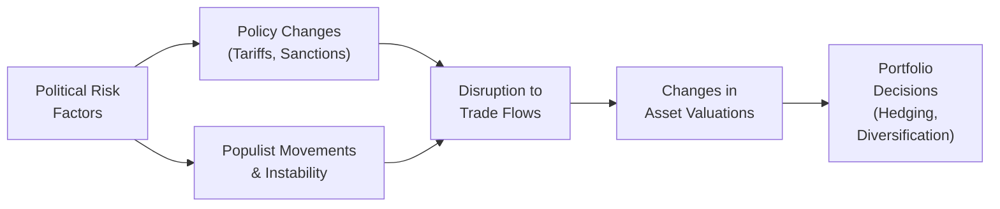

## Understanding Political Risk

Political risk can feel like a slippery concept, right? Sometimes it’s not as straightforward as looking at a company’s balance sheet or analyzing a country’s GDP growth. You’ve probably heard stories of governments suddenly increasing taxes, imposing capital controls, or even taking over profitable foreign ventures. All these scenarios feed into the broader category of political risk, which we usually define as the potential for investment losses stemming from political instability or government actions.

Political risk can manifest in a variety of forms—and it’s not restricted to emerging markets. Countries that you might think of as stable can impose unexpected tariffs or adopt populist policies that undermine previously secure investments. It’s best to stay on your toes, keep your eyes open, and remember that political risk can pop up anywhere.

In practice, political risk includes:

• Unexpected regulatory shifts (e.g., new tax laws or export restrictions).  
• Government interference in private business.  
• Asset seizures or nationalization (commonly referred to as expropriation).  
• Political violence (riots, civil wars, or leadership turbulence).  
• Changes in foreign policy or trade agreements that reshape trade flows.  

Because political developments can create volatility in financial markets, the role of geopolitical analysis in portfolio management is critical. A rigorous approach incorporates both qualitative and quantitative assessment tools—risk indices, scenario analyses, professional forecasts—to help you keep pace with changes.

## Assessing and Quantifying Geopolitical Risk

You might be wondering: “How on earth do we measure something so unpredictable?” Well, some individuals rely on a combination of news reports, local experts, and personal experience. Others use specialized political risk indices compiled by firms like the Political Risk Services (PRS) Group or S&P Global. Let’s explore some of these tools.

• Political Risk Indices: These indices often track factors such as government stability, internal and external conflict, levels of corruption, ethnic or religious tensions, and policy uncertainty. By combining multiple data points, they give a broad, numerical overview of how “risky” an environment may be.  
• Credit Rating Agency Reports: Moody’s, Standard & Poor’s, and Fitch routinely revise sovereign credit ratings based on assessments of government stability and macroeconomic policy. A sudden downgrade could be your cue to reevaluate certain investments.  
• Country-Specific Exposure Analysis: Many portfolio managers create heat maps to see which countries or regions host the majority of their firm’s revenue sources, supply chains, or customer base. When the political situation deteriorates in a heavily exposed region, you’ll know to pay extra attention.  

### Practical Example

Imagine you’re managing a global equity portfolio, and you notice that 20% of your holdings’ revenues come from one region in Asia. Suddenly, news breaks about an intensifying territorial dispute there. You might want to track developments more closely, maybe even have a contingency plan to hedge some portion of that exposure. Perhaps you reduce holdings slightly or look into derivatives that offset the expected volatility.

## Policy Changes and Market Impacts

Policy changes can be especially impactful because they strike at the heart of a firm’s strategic decisions. For instance, if a government introduces hefty tariffs on steel imports, domestic industries that rely on imported steel could face higher costs and lower profit margins—leading to declines in stock prices. Meanwhile, local steel producers might see a temporary boost in competitiveness, attracting higher investment.

Trade sanctions are another biggie. If a government restricts exports to a certain country—or imposes financial sanctions on specific counterparties—supply chains get disrupted, deserving thorough analysis. Portfolio managers might have to pivot to assets in alternative markets, shift funding sources, or utilize derivatives to manage currency exposures.

### A Quick Note on Populist Movements

Populist movements, which might champion protectionist policies or nationalistic rhetoric, can trigger abrupt changes in foreign trade agreements and immigration policies. Consider Brexit: the 2016 referendum kicked off years of negotiation and persistent uncertainty. Many industries, from automotive manufacturing to asset management, found themselves facing new border controls, rules of origin, and cross-border hiring restrictions. Valuation models had to incorporate everything from supply chain disruptions to changes in consumer sentiment. Even if sometimes these events feel far away, they can ripple through global markets in subtle ways.

## Disruptions to Supply Chains and Investment Prospects

When political tension escalates—due to trade disputes, border disputes, or regulatory crackdowns—supply chains tend to get tangled. Think about rare earth minerals used in high-tech gadgets. If a major supplier slips into regulatory turmoil or experiences an embargo, the entire global tech sector could see cost pressures. Consequently, you might see major shifts in investment prospects across industries and regions.

From a portfolio management perspective, it’s wise to map out where each portfolio company sources critical inputs. A toy manufacturer might rely on cheap plastic from a region with rising political tension. A sudden tariff or border dispute could hamper the company’s access to raw materials, reduce profitability, and ultimately dent share prices. Being proactive means you can lighten positions early, choose suppliers with less exposure, or employ a hedging strategy to buffer short- to medium-term volatility.

## Incorporating Scenario Planning

We all wish we had a crystal ball to foresee how political developments will bend the markets. Alas, we don’t. But scenario planning is the next best thing. By envisioning plausible scenarios—like a regime change, a populist surge, or new energy regulations—and assigning probabilities to them, you get a structured approach to risk management. Scenario planning typically involves:

1. Identifying Key Variables: Pin down the main factors at play—like commodity prices, policy shifts, or currency fluctuations.  
2. Creating Multiple Scenarios: From “best-case” to “worst-case,” build out at least three or four scenarios.  
3. Estimating Financial Impact: Project how your portfolio’s performance might diverge across these scenarios.  
4. Crafting Responses: Determine potential hedges, tactical trades, and triggers for rebalancing.  

Scenarios can be as simple or complex as you like, but the goal is always to keep your firm’s eyes open to alternative outcomes. If the worst-case scenario seems plausible enough, it might be wise to limit exposure or invest in protective instruments.

### Example: Brexit and Scenario Planning

Before the official Brexit negotiations, many portfolio managers outlined how different outcomes might affect their holdings. A “soft Brexit” scenario with a friendly trade agreement might have only a minor effect on foreign exchange rates and cross-border supply chains. On the other hand, a “hard Brexit” scenario, involving abrupt severance from existing EU regulations, might have implied higher tariffs, potential slowdowns in certain UK exports, and heightened currency volatility. Planners then weighed the probability of each scenario and sometimes purchased currency hedges or repositioned their portfolios accordingly.

## Hedging Strategies for Unexpected Outcomes

Political developments—including surprising election results or new sanctions—can spark big moves in currencies, bond yields, and equity prices. While it’s impossible to hedge against everything, a few instruments can help cushion the impact of these surprises:

• Currency Derivatives: Forward contracts and options can safeguard your portfolio from sharp currency fluctuations tied to political news.  
• Sovereign CDS: Credit default swaps allow investors to protect themselves against a government default—a risk that escalates during periods of major political strife.  
• Equity Index Options: Buying protective puts or employing a collar strategy on an exposed equity index can help manage downside risk.  
• Diversification: Perhaps an obvious one, but sometimes the best “hedge” is to avoid overconcentration. Spread exposures across different regions, markets, and sectors to reduce vulnerability to a single political shock.  

### Mermaid Diagram: Political Risks Impact Flow

In the diagram above, you can see how various political risks can flow through policy changes and ultimately impact asset valuations. From there, portfolio managers respond with hedges or reallocate assets to maintain risk-adjusted returns.

## Glossary

• Expropriation Risk: The potential for a government to seize or nationalize private assets. This often scares away foreign investors since it can lead to a total or near-total loss on an investment.  
• Sovereign Risk: The risk that a national government will default on its debt or unilaterally modify contractual terms. It’s commonly tracked through sovereign bond spreads and credit ratings.  
• Geopolitical Analysis: A structured method of evaluating how political and geographic factors influence economic and market outcomes. This often includes monitoring conflict areas, alliances, trade agreements, and domestic political sentiments.  
• Populist Movement: A political approach that aims to represent the viewpoint of ordinary people who feel neglected by the elites. Such movements can create waves of regulatory or economic changes, often with protectionist or nationalist underpinnings.

## Best Practices and Common Pitfalls

• Keep a flexible mindset. Relying on a single narrative that “nothing will change” is a recipe for trouble.  
• Stay updated: Follow local, regional, and global news trends, including reputable analyst insights.  
• Don’t oversimplify. Political environments can shift gradually—and if you ignore the early warning signs, you could find your portfolio hammered before you get a chance to act.  
• Avoid panic selling. Just because the media coverage is intense doesn’t necessarily mean the event is a portfolio game-changer. It pays to calmly assess how real impacts compare to sensational headlines.  
• Communicate your strategy. If you’re managing money for clients, reassure them that you’re monitoring both domestic and international risks diligently and adjusting the portfolio as needed.

## Practical Example: Engaging a Regional Expert

Some time ago—well, it feels like a lifetime now—I was working with a fund heavily invested in Eastern Europe. We grew nervous about a rumored change in leadership in one of the countries we were exposed to, with speculation about new capital restrictions. While the official press was dismissive, local economic think tanks painted a more sobering picture: the new administration might hike taxes on foreign companies. By building relationships with local experts, we got an early read on how likely these reforms were. We then hedged currency exposure and repositioned to avoid the most vulnerable sectors. The rumor partly came true—that new government did push through a tax law that impacted some multinational firms—yet we escaped the brunt of it because we had looked beyond standard headline news.

## Bringing It All Together Across Asset Classes

Political risk affects every asset class differently:

• Equities: Corporate earnings can sink from tariffs, expropriation, or even consumer boycotts in foreign markets. Geopolitical tensions can also spur equity volatility.  
• Fixed Income: Sovereign yields spike when investors demand higher compensation for uncertainty, and credit spreads can widen for corporate bonds if the broader economy is pressured by instability.  
• Currencies: Political turmoil can trigger rapid exchange rate movements, either from capital flight or, conversely, from a “safe-haven” inflow if a country is deemed more stable.  
• Alternatives: Real assets like real estate or infrastructure can become riskier, if governments threaten property rights or dramatically shift local regulations. Commodities may also face supply and demand disruptions due to political conflict or trade embargoes.

It’s wise to track interdependencies between these asset classes. A meltdown in one asset class can spread to another, especially when triggered by systemic political crises such as large-scale international sanctions or prolonged trade wars.

## Final Exam Strategies for Political Risk Analysis

1. Tie Qualitative and Quantitative Methods Together: On the exam, you might be asked to discuss both the conceptual framework for identifying political risk and the precise metrics for measuring it. Demonstrate that you understand how to blend indices, credit spreads, scenario analysis, and qualitative judgments.  
2. Provide Concrete Examples: If a question asks about responding to a trade war, reference how currency hedges, adjustments in supply chain analysis, or equity index options might be used.  
3. Consider Time Horizon: Short-term disruptions versus long-term structural changes can require different hedging or rebalancing strategies.  
4. Show Scenario Thinking: Especially in constructed-response formats, illustrate how you would develop different scenarios—best-case, base-case, and worst-case—and outline the portfolio implications.  
5. Watch for Common Pitfalls: Overconcentration in a single region or sector is a red flag. Mention diversification strategies or thresholds you’d enforce.  

## References and Further Reading

• Eurasia Group’s Top Risks Reports – Annual publications that offer founded insights into global geopolitical risks.  
• Butler, K. (2008). Multinational Finance (4th ed.). Wiley.  
• World Bank’s MIGA (Multilateral Investment Guarantee Agency) – For political risk insurance products and country risk assessments.  

--------------------------------------------------------------------------------

## Test Your Knowledge: Political Risk & Geopolitical Analysis



### Which of the following is most closely associated with political risk?
- [ ] A shift in consumer preferences
- [x] Government interference with private assets
- [ ] Changes in seasonal weather patterns
- [ ] Fluctuations in a country’s birth rate

> **Explanation:** Political risk typically relates to actions taken by governments or political entities, such as asset nationalization, regulatory changes, or new tariffs.

### What is one primary reason investors pay close attention to populist movements?
- [ ] They always lead to expropriation of private assets.
- [x] They can institute abrupt policy changes that disrupt markets.
- [ ] They have no significant influence on government actions.
- [ ] They reduce sovereign debt levels.

> **Explanation:** Populist movements can alter trade agreements, taxation, and regulatory frameworks. These shifts disrupt markets and introduce volatility.

### In scenario planning, which of the following steps should you complete first?
- [ ] Develop a response strategy.
- [x] Identify and analyze key economic or political variables.
- [ ] Execute trades based on worst-case outcomes.
- [ ] Assign probabilities to scenarios.

> **Explanation:** The initial step in scenario planning is to identify the primary factors (variables) that could change potential outcomes. Response strategies and probabilities come later.

### Which of the following is a typical hedge against political risk in a bond portfolio?
- [x] Credit default swaps (CDS) on sovereign issues
- [ ] A short position in an unrelated equity sector
- [ ] Buying commodities for a different region
- [ ] Real estate direct investment

> **Explanation:** CDS on sovereign debt can protect against a possible government default or other credit-related events that often stem from political turmoil.

### Which factor is least likely to be included in a specialized political risk index?
- [ ] Government stability
- [ ] Levels of corruption
- [x] Quarterly corporate earnings statements
- [ ] External conflict potential

> **Explanation:** Political risk indices focus on political, economic, military, and social factors. Quarterly corporate earnings are more of a company-level metric than a measure of political risk.

### What is expropriation risk?
- [x] The potential for a government to seize private assets
- [ ] A slight increase in reserve requirements for banks
- [ ] Changes in corporate governance best practices
- [ ] Temporary halts in trading activities

> **Explanation:** Expropriation risk explicitly refers to losses when a government nationalizes or otherwise seizes private assets.

### A hedge fund manager is worried about a country’s growing political tension and severe currency devaluation risk. Which combined strategy might be most relevant?
- [x] Currency forward contracts and equity index puts
- [ ] Investing more in local companies and ignoring sentiment
- [ ] Limiting data analysis to one political risk index
- [ ] Taking no action until a crisis actually unfolds

> **Explanation:** Currency forwards hedge currency exposures, while equity index puts can offer downside protection if the equity market falls.

### Sovereign risk is best described as:
- [x] The risk that a national government will default on its debt or alter contract terms
- [ ] The risk of a private corporation failing to meet debt obligations
- [ ] The risk that a corporate bond gets downgraded due to supply chain issues
- [ ] The risk of an investor portfolio dropping in value overnight due to market fluctuations

> **Explanation:** Sovereign risk focuses on governmental defaults or unilateral changes to contract terms, distinct from corporate default risk.

### When analyzing an emerging market, you discover that a significant portion of your portfolio’s revenues come from that country’s infrastructure projects. Which approach helps manage potential political or regulatory shocks?
- [x] Conducting scenario analyses and engaging with local experts for insights
- [ ] Replacing all senior management with local executives
- [ ] Relying solely on global news broadcasts
- [ ] Immediately liquidating all regional holdings

> **Explanation:** Using scenario analysis and local expertise provides nuanced understanding, helping you make balanced decisions about hedging or rebalancing. Immediate liquidations or ignoring the risk may be overly reactive or dismissive.

### Political risk analysis is relevant only in emerging markets. True or False?
- [ ] True
- [x] False

> **Explanation:** Every country, including developed economies, can experience abrupt policy shifts or leadership changes, creating political risk exposures even in seemingly stable markets.


