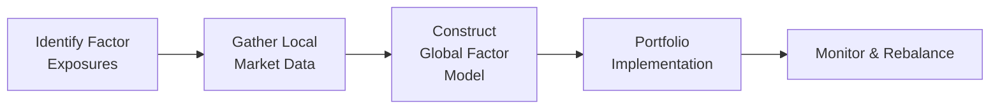

## Introduction

Global multi-factor investing is all about taking that familiar toolset of factor-based strategies—like value, momentum, quality, size, and low-volatility—and applying them in markets across the world. If you’ve read about or dabbled in factor investing locally, you’ve probably seen how it can boost returns, manage risk, or add diversification benefits. But once you decide to expand that approach to, say, a European equity portfolio, or maybe an emerging-market bond strategy, you might start thinking: “Oh dear, do I need to collect entirely new data sets, or worry about local accounting rules?” Well, yes, you do. It’s a little more complicated than you might initially imagine.

In this section, we’ll dig into the unique considerations you’ll encounter when extending factor investing to a global scope. We’ll talk about the data challenges, the differences in market structure and investor behavior, and, of course, the all-important question of rebalancing and style drift. If you’re really just looking for a big theme, here it is: factor investing demands attention to detail. That means picking the right factor definitions for a given region, verifying that you have accurate and comparable data, and then dealing with the higher transaction costs or lower liquidity that can plague local markets. But, trust me, if you stay disciplined, global multi-factor strategies can be a powerful channel to diversification and possibly that elusive alpha.

## Core Global Factors

Before diving into the specifics, let’s do a quick refresher of the most common factors. They typically include:

• Value: Pursuing securities with lower valuation metrics (e.g., low price-to-book, low price-to-earnings).  
• Momentum: Buying recent winners and selling (or underweighting) recent losers.  
• Quality: Focusing on stocks (or bonds) with robust fundamentals (e.g., consistent earnings, strong balance sheets).  
• Size: Favoring small- and mid-cap securities over large-cap, or vice versa.  
• Low-Volatility (Low Vol): Targeting securities that have historically shown lower return fluctuation.

On a global scale, these factors may still define your portfolio, but you might notice more nuanced or region-specific drivers—like in certain emerging markets, “value” might revolve around a different book-value definition, or different tax treatments for cross-listed securities. So yes, the shopping list of factors might look the same, but the “recipe” for how you combine them can vary quite a bit region by region.

## Regional Variation in Factor Exposures

### Economic Structures and Investor Behavior

It’s critical to remember that different regions bring different economic structures and investor psychology:  
• Some emerging markets tend to have more retail investors, resulting in higher trading frictions or behavioral biases that can amplify factor returns.  
• Developed markets may be more efficient, so capturing factor premiums might require a more refined approach.  

In my early days working with a global multi-factor equity team, I was initially surprised (almost shocked, to be honest) at how strongly momentum signals carried over in some frontier markets. But once we dug into it, we realized that local retail behavior and limited institutional coverage contributed to a real momentum effect. So keep an eye out. Sometimes the factor you think “shouldn’t matter” can matter a lot, depending on local circumstances.

### Accounting Standards and Transparency

Another key difference: local accounting rules, financial reporting standards, and data availability. For instance, the way “book value” is calculated can differ. In one region, intangible assets might be recorded differently than in another. This discrepancy can affect your entire value factor classification. If you rely on price-to-book as a critical input—and that book value is compiled under IFRS in one market, US GAAP in another, or a partially adopted IFRS in an emerging market—there’s potential for “apples-to-oranges” comparisons.

For quality, your evaluation metrics (e.g., return on equity, debt-to-equity, or net margins) might look drastically different across borders, simply because of how different countries present or define these statements. And in some frontier markets, data timeliness is an issue—quarterly or semiannual statements might be delayed or incomplete, so you have to be careful about using stale data.

## Building a Global Multi-Factor Portfolio

### Data Collection and Factor Model Construction

Constructing a robust global multi-factor model is at its core a data challenge. You need broad, consistent data across all your targeted regions. You might set up automated pipelines to gather stock fundamentals from local exchanges, plus bond yields from local markets if you’re building multi-factor fixed income strategies. In practice, many professional asset managers license global databases from major providers, such as MSCI or FTSE Russell, to ensure consistent coverage.

And be sure to test your factor definitions across different data sets. Sometimes, you’ll run the same definition on two data sets (both claiming to be IFRS-based, for instance) and see a small discrepancy in how intangible assets are reported or how share counts are aggregated. A thorough data validation is absolutely essential.

### Diagram: High-Level Process for Global Factor Investing

Below is a simple Mermaid diagram to illustrate a typical workflow:

1. Identify factor exposures: Determine which factors (value, momentum, size, etc.) you want to target.  
2. Gather local market data: Ensure consistent, high-quality data from each region.  
3. Construct the factor model: Rank securities by factor signals, standardize the metrics, and combine them.  
4. Portfolio implementation: Build the actual trade list, weighting each security or bond by factor scores.  
5. Monitor & rebalance: Rebalance periodically to maintain the desired factor exposures and watch for style drift.

### Combining Equity and Bond Factors Globally

Equities are the most common playground for factor investing, but multi-factor approaches are spreading into fixed income too. For bonds, factor definitions differ:  
• Value might be measured by yield spreads relative to a risk-free benchmark.  
• Momentum might refer to recent price performance or rating upgrades and downgrades.  
• Quality in bonds might revolve around the likelihood of default (credit rating stability, interest coverage ratios, etc.).  

In a global bond context, region-specific yield curves and differences in credit rating methodologies (for instance, comparing local rating agencies in emerging markets vs. the “big three” in developed markets) can significantly impact your factor signals. Similarly, liquidity can be more constrained in emerging-market debt, which means you must manage transaction costs carefully.

## Overcoming Regional Discrepancies

### Transaction Costs and Liquidity

Let’s address one of the biggest practical challenges: transaction costs. If you’re building a factor-tilted portfolio in a major developed market (think large-cap US or European equities), trading is easier, and you can frequently rebalance. But if you’re building multi-factor exposure in frontier or smaller emerging markets, your transaction costs—spread, market impact, and so on—can be huge.

I remember working on a multi-factor strategy for Southeast Asian equities, and we found that rebalancing too frequently ate into any alpha we were generating. We basically had to adopt a more passive rebalancing scheme—like a quarterly or semiannual approach—just so we wouldn’t destroy all the alpha with trading costs. This is what factor investing is all about: balance the theoretical allure of factor signals with the practical constraints of real-world trading.

### Different Factor Definitions per Region

You might also adapt your factor definition to local norms. For instance, “book value” in one market might systematically differ from that in another, so you might pivot from price-to-book to price-to-earnings or enterprise value-to-EBITDA in that region. Similarly, your “momentum” factor might exploit shorter time windows in markets with higher volatility than what you’d use in a less volatile developed market. The key is to do enough research to understand where your standard factor definitions might break down. Don’t be shy to tweak them, but always keep track of how these changes fit into your overall investment policy statement (IPS) or your strategy’s stated style.

## Rebalancing and Style Drift

### Maintaining Target Factor Exposure

Factor investing relies on systematically holding onto exposures that you believe will pay a premium over time. But if you never rebalance, your portfolio might drift away from your desired factor tilt. In global markets, currencies can move, local market performance can deviate significantly, and some factors might become more dominant than others. Eventually, you could wind up with a portfolio that looks very different from what you initially designed.

So, we do periodic rebalancing—monthly, quarterly, or maybe a custom interval. The main reason is to bring the portfolio back in line with the original exposures. You might also do “event-driven” rebalancing if a big market movement or currency shock changed your factor exposures dramatically.

### Example: Drifting from Value to Growth

Imagine you started with a tilt toward “value” in Europe, but those stocks rally strongly, and in six months, they’re priced so high that they no longer appear cheap on your metrics. You now have a portfolio that’s gliding toward a more growth-like profile—even though your objective was to remain value-tilted. In that case, a rebalancing cycle would typically have you rotate out of the newly expensive names into whatever is undervalued now, thus maintaining your factor consistency.

## Practical Considerations and Pitfalls

• Liquidity constraints: Smaller international markets can be tricky to trade.  
• Data quality: Stale data, inconsistent reporting, or partial coverage in some countries.  
• Currency risk: If you’re investing across multiple currencies, you’ll need to consider hedging strategies that align with your factor approach. Sometimes ignoring currency risk can overshadow the benefits from factor tilts.  
• Regulatory changes: Emerging markets might introduce new capital controls or limit foreign ownership. That can hamper your ability to manage factor exposures fluidly.

## Personal Reflections

Let me just say, I’ve personally found that the biggest barrier to success with global multi-factor strategies isn’t the “theory”—the theory often works. The real challenge is all the operational stuff: data mismatch, rebalancing costs, timing differences in reporting, and so on. My advice is to carefully prototype a global factor strategy in a paper portfolio first. Watch how it performs with real market data (and real transaction-cost estimates!). That can save you from painful mistakes once you fully implement.

## Conclusion

Taking factor investing to a global scale can enhance diversification and create new alpha sources, but it also magnifies data, operational, and liquidity challenges. By being mindful of different accounting standards, local investor behaviors, and trading frictions, you can tailor each factor to the realities of each region. Don’t forget to rebalance at sensible intervals—too frequent, and you’ll rack up fees that may dwarf the factor premium; too infrequent, and you risk style drift. Ultimately, success in global multi-factor investing hinges on thorough data analysis, disciplined portfolio construction, and a healthy dose of patience.

## References and Further Reading

• Ang, A. (2014). Asset Management: A Systematic Approach to Factor Investing. Oxford University Press.  
• MSCI’s Global Factor Indexes, research available at: https://www.msci.com/factor  
• FTSE Russell’s Factor Index Series, research available at: https://www.ftserussell.com/  
• Select academic articles on regional factor investing can be found in The Journal of Finance.  

## Test Your Knowledge: Global Multi-Factor Investing Essentials



### Which of the following factors is most commonly associated with investing in undervalued securities?

- [ ] Momentum
- [x] Value
- [ ] Size
- [ ] Low-volatility

> **Explanation:** The value factor focuses on undervalued securities, often identified by metrics like low price-to-book or low price-to-earnings ratios.

### Which of the following is the most significant reason why “book value” comparisons may differ across global markets?

- [ ] Investor bias
- [x] Differences in accounting standards
- [ ] Higher transaction costs
- [ ] Unavailable currency hedging

> **Explanation:** Because different regions use different accounting frameworks (e.g., IFRS vs. US GAAP), the book value calculation can vary, making direct comparisons challenging.

### When implementing a global multi-factor strategy in emerging markets, which of the following typically presents the greatest challenge?

- [ ] Stable local currencies
- [ ] Excessively high dividend yields
- [x] High transaction costs and lower liquidity
- [ ] Standardized reporting regulations

> **Explanation:** Emerging and frontier markets often have wider spreads, thinly traded securities, and higher market impact costs, all of which can erode the benefits of frequent rebalancing.

### A global fixed income factor strategy that selects bonds based on strong fundamental metrics is primarily targeting which factor?

- [x] Quality
- [ ] Momentum
- [ ] Size
- [ ] Value

> **Explanation:** In fixed income, “quality” might represent stable credit ratings, lower default probability, and strong financial ratios—consistent with a fundamentals-based approach.

### What is the main risk of not rebalancing a global factor portfolio regularly?

- [ ] Increased foreign exchange gains
- [x] Style drift away from target factor exposures
- [ ] Over-perfect alignment with the benchmark
- [ ] Excess concentration in multiple factors at once

> **Explanation:** Without periodic rebalancing, a portfolio’s factor exposure can wander, diluting the intended tilts (e.g., drifting from value to growth).

### When extending a factor-based approach to global equities, which piece of advice is most practical?

- [x] Carefully standardize data definitions across regions
- [ ] Focus on a single region to avoid complexity
- [ ] Rebalance weekly to maximize alpha
- [ ] Avoid emerging markets entirely

> **Explanation:** Global factor investing requires consistent and comparable data across all markets. This standardization ensures fair comparisons for making buy/sell decisions.

### If a manager wants to exploit recent performance patterns in different geographic regions of the equity market, they’re targeting which factor?

- [ ] Value
- [x] Momentum
- [ ] Size
- [ ] Quality

> **Explanation:** Momentum strategies rank securities based on recent performance, buying recent winners and avoiding or shorting recent losers.

### In global multi-factor bond investing, which factor is typically closest to capturing a “value” approach?

- [ ] Coupon payments
- [ ] Duration
- [x] Yield spreads over risk-free rates
- [ ] Historical issuer rating

> **Explanation:** “Value” in bond markets often refers to bonds that appear cheap on a spread basis relative to their credit risk, implying higher yields for the same level of risk.

### Which of the following is most likely to cause abrupt style drift in a global factor portfolio?

- [ ] Routine currency hedging
- [ ] Automation of data collection
- [x] Large price movements in certain factor holdings
- [ ] Lower correlation between regional exchanges

> **Explanation:** Sudden price moves can push previously undervalued securities into overvalued territory (or vice versa), altering the portfolio’s factor composition more quickly than anticipated.

### Global multi-factor investing strategies generally require more advanced data management practices than domestic factor strategies. True or False?

- [x] True
- [ ] False

> **Explanation:** Global strategies must handle multiple accounting standards, potential data-release lags, and unique market structures, demanding more sophisticated data management systems.


