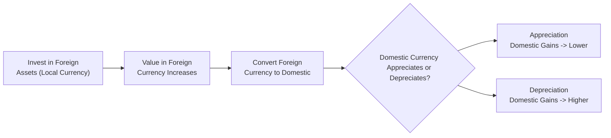

## Introduction
I remember the first time I realized how currency moves could flip an investment’s performance. Years ago, I was backpacking across Europe. The US dollar had dipped, so each euro bought fewer dollars, meaning my bank account shrank a bit faster whenever I converted. It was a real eye-opener on how exchange rates can change your buying power. And that same dynamic applies to portfolio managers who invest globally. 

When we invest outside our home country (let’s call it the domestic market), the returns we receive must eventually convert back into domestic currency. If our domestic currency appreciates (becomes stronger), then those foreign returns won’t look as hot once they’re converted. If our currency depreciates (weakens), hey, that can pump up the final returns from foreign investments. 

This section delves into why that happens and what we can do about it. We’ll talk about economic theories driving currency values (like purchasing power parity), the pros and cons of hedging currency exposures, and best practices for folding currency outlooks into a global portfolio strategy.

## Effects of Currency Movements on Portfolio Returns
It often surprises new investors to learn that positive returns on an international asset in its local market can still translate into losses when converted back home, if the domestic currency has strengthened significantly. Conversely, you might see a modest local return turn into a pleasant surprise once your currency has depreciated relative to the foreign currency.

### Basic Example
Suppose you’re a US-based investor buying shares of a European company:

• You invest USD 10,000 when the EUR/USD rate is 1.25.  
• That means you exchange USD 10,000 for EUR 8,000 (since 10,000 / 1.25 = 8,000).  
• After some time, let’s say your European equity investment grows by 10% in euro terms, so it’s now worth EUR 8,800.  
• But the exchange rate also changes. If the EUR/USD rate drops from 1.25 to 1.15 (the USD has strengthened, or the EUR has weakened), when you bring that money back home, you actually end up with 8,800 × 1.15 = USD 10,120. You made a small gain, but nowhere near what you might have expected if the exchange rate had stayed constant at 1.25 (which would have given you USD 11,000).

This simple example highlights how domestic-currency appreciation can erode foreign investment returns. And, as you might guess, the opposite scenario adds a friendly tailwind to your profits if your domestic currency weakens.

## Economic Fundamentals Behind Currency Trends
There’s more to exchange rates than random market moves. Over the long haul, economic variables guide currency valuations:

### Purchasing Power Parity (PPP)
This principle basically says that in the long run, exchange rates should converge so that identical goods have the same price in different countries. If a burger costs USD 5 in the United States and an equivalent burger costs EUR 4 in Europe, and if the EUR/USD is 1.25, eventually the exchange rate might adjust to maintain consistent prices. Obviously, real markets are more complicated—trade barriers, brand perceptions, shipping costs—but PPP is a helpful concept to anchor your understanding. 

Mathematically, PPP can be expressed as:


\text{Exchange Rate} = \frac{\text{Price Level (Domestic)}}{\text{Price Level (Foreign)}}


Though PPP is more of a medium- to long-term anchor, it reminds us that currencies often adjust toward equalizing purchasing power, especially when large discrepancies exist.

### Interest Rate Differentials
Countries with higher interest rates often see their currencies strengthen in the short to medium term, as investors seek those higher yields. The interest rate parity relationship suggests that any gain from higher interest rates in one currency should, in theory, be offset by expected changes in the spot–forward exchange rates. Formally:


F = S \times \frac{1 + i_d}{1 + i_f}


where:  
• \\(F\\) is the forward exchange rate,  
• \\(S\\) is the current (spot) exchange rate,  
• \\(i_d\\) is the domestic interest rate,  
• \\(i_f\\) is the foreign interest rate.

### Trade Balances and Capital Flows
Countries running persistent trade surpluses often see upward pressure on their currency, as foreign buyers need local currency to pay for exports. Conversely, a consistent trade deficit can mean downward pressure on the currency. Meanwhile, strong capital inflows—like foreign direct investment or big bond market purchases—also boost a currency.

## Hedged Versus Unhedged Strategies
Global investing often demands a decision: hedge currency exposures or not? 

• **Unhedged Approach**: Your returns fluctuate with currency moves. This can be profitable when your domestic currency is weakening, but it’s a bummer if it’s strengthening.  
• **Hedged Approach**: By locking in an exchange rate or using derivatives (like forwards, futures, or options) to offset currency risk, you stabilize your returns in domestic-currency terms.  

Of course, hedging isn’t free. There’s usually a cost, which can be significant if the interest rate differential is large or if implied volatility is high in currency options. And, ironically, you can miss out on gains if your domestic currency depreciates. 

### Partial Hedging
Some managers hedge only a portion—say 30–70%—of their foreign currency exposures. This approach balances the desire for stable returns with the potential benefit of a favorable currency move. It also helps manage hedging costs.

### Example of Hedged Return
Let’s say you’re a Swiss-based investor holding British stocks. You notice that the Swiss franc (CHF) might strengthen against the pound sterling (GBP). If you buy an FX forward contract to lock in the sterling-to-CHF conversion for your expected proceeds, then even if GBP falls 5% relative to CHF, your realized return (in CHF) won’t be impacted as severely by that movement. You’ve basically swapped out that currency risk (though there were some costs and operational complexities to get that hedge in place).

## Incorporating Currency Expectations
When building a global or multi-asset portfolio, it’s helpful to forecast currency trends—though precision can be tricky. Some managers rely on:

• **Tactical Currency Overlays**: Specialists—sometimes external currency managers—actively manage currency risk, seeking alpha from short-term currency moves.  
• **Strategic Allocation Decisions**: Setting a strategic hedging policy (perhaps partial hedges) and revisiting it periodically.  

You could have a scenario where you expect your domestic currency to weaken over the next 12 months. In that case, maybe you don’t hedge certain exposures (like foreign equity) so you can potentially reap the additional currency gains. But if your currency starts to strengthen unexpectedly, you might scramble to put on partial hedges.

## Practical Mermaid Diagram
Below is a simplified flowchart illustrating how currency appreciation or depreciation impacts returns:

This flowchart shows the ultimate step—converting back into domestic currency—where you see the real effect of exchange rate movements.

## Real-World Case Study
In early 2015, the Swiss National Bank removed the cap on the CHF relative to the euro. The Swiss franc soared almost instantly against the euro, and for Swiss investors who owned eurozone equities, their returns were suddenly worth fewer francs when converted back. Some Swiss funds faced large revaluation hits on their euro-denominated assets. That abrupt shift illustrated how policy changes can whipsaw currency markets and severely affect portfolio outcomes.

## Best Practices and Pitfalls
• **Stay Aligned with Objectives**: If you need stable returns over short horizons—like paying near-term liabilities—hedging is often advisable.  
• **Monitor Costs**: High hedging costs can eat into returns and potentially erode what you intended to protect in the first place.  
• **Beware of Overconfidence**: Predicting currency moves can be extremely hard. Don’t chase short-term speculative gains without thorough research.  
• **Regularly Reassess**: Global markets, interest rates, and capital flows can shift quickly. A currency strategy that made sense last year might be ill-suited for new macro conditions.

## Summary and Exam Tips
• **Focus on the Big Picture**: For exam scenarios, identify how currency movements affect your final returns and whether hedging is beneficial.  
• **Quantitative Skills**: Practice converting returns under various exchange rates. You might see item sets requiring step-by-step computations.  
• **Highlight Theories**: The CFA exam loves concepts like PPP and interest rate parity. Understand the formulas, but also interpret how they apply to real portfolios.  
• **Hedging Mechanics**: Know the differences between forward- and option-based currency hedges, partial vs. full hedge, and the cost implications.  
• **Scenario Analysis**: Walking through best-case, worst-case, and middle-case currency scenarios is a common approach in exam questions.

In short, to do well on the exam (and in real life), you’ll want a solid grasp on how currency swings can tilt an investment’s fortunes—and how to manage or exploit that volatility.

## Glossary
• **Purchasing Power Parity (PPP)**: States that in the long run, exchange rates adjust so that identical goods have the same cost in different countries.  
• **Currency Overlay**: A strategy that manages currency exposures separately from the core portfolio assets, often with the goal of hedging or generating incremental returns.  
• **Interest Rate Parity**: Suggests that the difference in interest rates between two countries is offset by forward exchange rate adjustments in efficient markets.

## References and Further Reading
• Abken, P. (1990). “Currency Hedging Strategies for International Portfolios.” Federal Reserve Bank of Atlanta.  
• CFA Institute articles on currency management in global portfolios.  
• Eiteman, D.K., Stonehill, A.I., & Moffett, M.H. (various editions). Multinational Business Finance.  
• For advanced readers, exploring academic research on target-zone models or micro-structure of FX markets can be valuable to broaden understanding.

---

## Test Your Knowledge: Currency Appreciation and Depreciation Quiz



### A portfolio manager's domestic currency strengthens. What is the likely impact on returns from foreign investments in the absence of hedging?

- [ ] Returns will increase in domestic currency terms.
- [x] Returns will decrease in domestic currency terms.
- [ ] Returns remain unchanged during strengthening phases.
- [ ] Foreign returns always become higher in nominal terms.

> **Explanation:** When the domestic currency appreciates, the foreign investment’s value translates into fewer domestic currency units.

### Which of the following best describes purchasing power parity (PPP)?

- [ ] Exchange rates that remain constant regardless of inflation differences.
- [ ] A short-run model focusing on interest rate differentials.
- [x] An economic theory suggesting goods should cost the same globally once currency is factored in.
- [ ] A derivative pricing model based on forward rates and spot rates.

> **Explanation:** PPP states that over time, exchange rates adjust so that identical goods or baskets of goods cost the same in different countries.

### In a situation where your domestic currency is expected to depreciate significantly, which approach might be favorable if you seek higher returns from your foreign holdings?

- [ ] Full hedging approach.
- [ ] Zero exposure to foreign assets.
- [x] Unhedged or partially hedged strategy.
- [ ] Strict currency speculation with short positions on foreign currencies.

> **Explanation:** Keeping exposure unhedged or partially hedged may capture potential gains if the domestic currency indeed falls, making foreign returns more valuable.

### Consider a forward contract used to hedge currency risk. Which of the following is a major cost component?

- [x] Interest rate differential between the currencies.
- [ ] Commodity price swings.
- [ ] Real estate market trends.
- [ ] Stock market volatility in the domestic country only.

> **Explanation:** Forward pricing primarily reflects interest rate differentials between two currencies. That differential is a key driver of hedging costs.

### A Swiss investor holds euro-denominated assets. The euro weakens dramatically against the Swiss franc. Which statement likely holds true when converting back to CHF?

- [x] The final value in CHF will be reduced.
- [ ] The final value in CHF will be boosted.
- [x] The currency move negatively impacts the total return.
- [ ] The return is unaffected because different countries’ currencies don’t matter.

> **Explanation:** A weakening euro translates to fewer CHF per euro. Hence, the investor’s euro returns diminish once converted back into Swiss francs.

### Which currency management style involves an external manager focusing purely on foreign exchange positions without altering underlying portfolio holdings?

- [x] Currency overlay.
- [ ] Full hedging policy.
- [ ] Opportunistic partial hedge.
- [ ] High-frequency trading strategy.

> **Explanation:** Currency overlay managers handle currency exposures independently of the main portfolio, aiming to either reduce risk or generate extra returns.

### A US investor invests in Japanese equities. The yen strengthens significantly against the dollar during the holding period. How does this likely affect the investor’s final return in USD terms?

- [x] Enhances the USD return.
- [ ] Eliminates any local market profits.
- [x] Adds a tailwind to performance once converted back.
- [ ] Has no impact since they’re in different currencies.

> **Explanation:** When the yen strengthens, each yen converts to more US dollars, boosting the overall USD return.

### Which of the following statements about partial hedging is correct?

- [x] It reduces currency volatility risk but retains some potential upside.
- [ ] It is more expensive than full hedging in all cases.
- [ ] It completely eliminates downside risk from exchange rate fluctuations.
- [ ] It locks in the forward rate for all currency exposure.

> **Explanation:** Partial hedging means hedging only some portion of the exposure, thus mitigating some currency risk while preserving some upside if the domestic currency weakens.

### A domestic currency is forecasted to strengthen due to rising interest rates. What is a common reason behind this phenomenon?

- [x] Investors purchase domestic-currency assets to capture higher yields.
- [ ] Domestic inflation is out of control.
- [ ] International trade deficits shrink automatically.
- [ ] Central banks disable forward markets.

> **Explanation:** Higher yields attract foreign capital, leading to an increased demand for the domestic currency, pushing its value up.

### In the context of currency management, is the statement “A weakening domestic currency automatically guarantees better total returns on all foreign assets” true or false?

- [x] True
- [ ] False

> **Explanation:** Generally, if the domestic currency weakens, foreign assets become more valuable when converted back. That said, specific asset performance can vary, but the currency component alone boosts returns.


