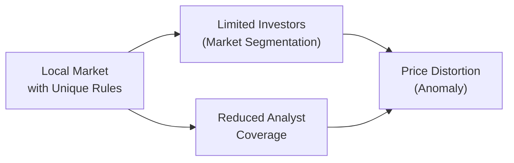

## Overview

Have you ever noticed how certain local stock markets just behave... strangely? Maybe there's a small, almost quirky, holiday-sensitive effect, or a period when a specific stock trades at a significant discount compared to the exact same stock listed abroad. You see these odd inconsistencies and can’t help but wonder if there’s a quick profit to be made. Well, that’s what we’re diving into here: local market anomalies and the potential for arbitrage.

Local market anomalies arise for a variety of reasons—some structural, some behavioral, and some downright surprising (like a cultural or seasonal quirk that drives investor sentiment). And when these anomalies create price dislocations, we get fertile ground for arbitrage, provided we can navigate the many risks and complexities along the way.

In this section, we’ll talk about the key drivers of local market anomalies, real-life examples of quirky market behavior, how arbitrage strategies can exploit any inefficiencies that pop up, and what it takes to manage the many risks—such as insider trading regulations or capital controls—that can quickly turn a sure-win trade into a nightmare. Along the way, we’ll reference relevant insights from risk management concepts (see Chapter 6: Introduction to Risk Management) and from multi-asset perspectives (see Chapter 14.1: International Diversification). Let’s start with a deep look at what really leads to local anomalies.

## Identifying Local Market Anomalies

Local market anomalies can stem from various causes, including regulation, investor behavior, or peculiar events on the ground. Below are a few standout factors:

• Market Segmentation  
  Market segmentation occurs when certain investor groups cannot or will not invest across different markets. Sometimes, it’s due to legal restrictions—like a retiree’s pension allocation rules—or it might be cultural or behavioral: local investors might stick to their home market out of comfort. This limited pool of participants can leave segments of a market underpriced or overpriced. When fewer analysts watch a particular segment, mispricing can persist. (For a deeper discussion on segmentation and its effects, you might spot some parallels in Chapter 2.16: Diversification Across Geographical Regions.)

• Low Analyst Coverage  
  If an asset trades in a regional exchange with minimal coverage, the collective wisdom of analysts is missing. In theory, effective coverage can help reduce mispricing by driving fair valuations. But with few eyes on a security, anomalies can fester.

• Preferential Tax Treatments  
  Certain markets offer special tax incentives on dividends or capital gains—perhaps only to local citizens or to certain institutional categories. This discrepancy might encourage local purchase or sale patterns that deviate from global norms. The mismatch in net returns can lead to price differentials versus an “unfavored” market window.

• Seasonal or Cultural Phenomena  
  Everyone’s heard of the “January Effect,” but local markets worldwide have their own calendar-based quirks: the Lunar New Year effect in specific Asian markets, Golden Week in Japan, or cultural traditions that coincide with annual portfolio rebalancing. Sometimes prices rally in the lead-up to a festival or slump right after. We can’t ignore the psychological and liquidity impact of these patterns.

Here’s a simple schematic of how local anomalies might arise when certain investor segments are restricted from participating:



The local market imposes constraints (A), which lead to a limited investor base (B) and reduced coverage (C). In turn, these dynamics can foster price distortions or anomalies (D).

## Arbitrage Opportunities in Local Markets

Arbitrage is about buying and selling an asset simultaneously to lock in profit from a price discrepancy, without taking on significant net risk—at least in theory. But in practice, local market frictions can test that assumption. Here are the most common ways arbitrage might crop up in these markets:

• Mispricing Due to Regulatory Constraints or Liquidity Differences  
  Some investors must abide by certain holding limits or are prohibited from short selling. Others might face liquidity shortfalls in less-traveled markets. If a large pension fund must sell (or buy) a security for regulatory reasons, short-term demand or supply imbalances can create short-lived mispricing, ripe for arbitrage.

• Cross-Listing Arbitrage and Dual-Listed Shares  
  A classic scenario is when a company lists its shares on two different exchanges—perhaps London and New York. If the share trades at different prices in these markets, an arbitrageur could short the higher-priced one and buy the lower-priced one. In principle, those trades should converge over time. This approach works best in big, liquid markets but can also appear in smaller jurisdictions, especially when capital controls hamper the free flow of funds. (You might recall from Chapter 10: Portfolio Overlays and Currency Management that currency risk can complicate such trades.)

Below is a quick formula that expresses the profit from a cross-listing arbitrage scenario in two markets (A and B), assuming we ignore transaction costs and currency risk for simplicity:


\text{Arbitrage Profit} = (P_{A} - P_{B} \times \text{ExchRate}_{B \to A}) \times \text{Quantity}


Where:  
• \\(P_{A}\\) = Price in Market A  
• \\(P_{B}\\) = Price in Market B  
• \\(\text{ExchRate}_{B \to A}\\) = Exchange rate needed to convert currency B into currency A  

When the value in parentheses is positive (and large enough to cover fees), you might have an arbitrage play.

Let’s say you want to do a quick computational check in Python:

```python
price_A = 10.50  # Price in Market A (in currency A)
price_B = 10.45  # Price in Market B (in currency B, unconverted)
exch_rate_B_to_A = 1.00  # If 1 B = 1 A in the local exchange rate
quantity = 1000

arbitrage_profit = (price_A - price_B * exch_rate_B_to_A) * quantity

if arbitrage_profit > 0:
    print(f"Potential arbitrage profit of: {arbitrage_profit} in currency A")
else:
    print("No arbitrage opportunity found (profit <= 0).")
```

This simple snippet quickly checks for a riskless profit, ignoring real-life transaction costs and the (often significant) perils of currency fluctuation, short-selling constraints, capital controls, or clearing/settlement risk.

## Risk Factors in Exploiting Local Anomalies

You’d think a local anomaly is free money, right? Not so fast. Real-world constraints can kill an arbitrage strategy before it even starts, or expose you to more risk than you anticipated.

• Execution Complexities and Insider Regulations  
  Trading in unfamiliar jurisdictions can lead to operational issues, from settlement backlogs to local rules on what counts as insider trading. Some countries have stringent “insider” definitions that even hamper quick cross-border trades.

• Capital Controls  
  Governments may impose taxes or absolute blocks on capital flows to prevent excessive currency volatility or protect local industries (see Chapter 14.8: Currency Appreciation and Depreciation Effects). If you can’t freely move your profits out, or if you’re forced into certain local-currency assets, you might not realize your gains as expected.

• Transaction Costs  
  Even if you see a local anomaly, steep transaction fees, taxes, or spreads can devour any profit margin. You might have to complete a series of trades all at once, and each step can incur its own cost.

• Policy Shifts  
  A sudden policy change can erase a local anomaly overnight. For instance, if a government abruptly adjusts dividend taxation structures, that originally favored local investors disappears, and so does the anomaly.

• Currency and Liquidity Risks  
  The glint of local-market arbitrage can hide the potential for large currency losses or illiquidity. Small markets can’t absorb large trades easily. That means your strategy could move the market against you—especially in low-volume stocks.

## Integrating Local Anomalies with a Global Macro Perspective

Local anomalies don’t exist in a vacuum. Just ask anyone who has tried to exploit a local discount, only to see macro events—say, a major central bank announcement—shift global sentiment entirely.

• Incorporate Macro Indicators  
  Keep an eye on macro data (Chapter 1.6: Integration of Macroeconomic Indicators in Portfolio Decisions) that might impact the capital flows in and out of local markets. If foreign direct investment is surging in country X, your undervalued asset might correct rapidly. That’s great if you’re positioned, but also risky if you’re short something suddenly become “hot” to foreign investors.

• Risk-Management Framework  
  Chapter 6 offers a deeper look into risk governance and measuring risk through VaR, stress tests, and scenario analyses. Before diving into local anomalies, you want a robust approach that outlines how much exposure you can have to small, illiquid markets—and how to measure the potential downside of abrupt policy shifts.

• Potential for Diversification Benefits  
  Sometimes, a local anomaly strategy can be an unexpected source of diversification in a global portfolio. If local returns are uncorrelated with mainstream global equities or bonds, you might reduce overall portfolio volatility. Head over to Chapter 14.1: International Diversification for a bigger conversation on cross-border synergy.

## Practical Implementation Tips

Rushing to exploit local market anomalies without a plan can be costly. Below are some practical considerations:

• Due Diligence  
  Thoroughly research local regulations, insider trading laws, and any potential capital controls that might restrict your cash flows.

• Partnerships with Local Brokers  
  Partner up with local brokers who understand not just the market microstructure but also the cultural and regulatory nuances—like holdups around major holidays or early closings.

• Pilot Trades and Stress Testing  
  Start small. Test your arbitrage strategy with a fraction of your intended capital to gauge real transaction costs, trade settlement times, and potential hidden pitfalls. Stress test your plan (Chapter 6.5: Measuring Risk with VaR, Stress Testing, etc.) under market shocks and sudden liquidity drains.

• Hedging Where Possible  
  If currency risk is significant, consider overlay strategies (Chapter 10) to hedge your exposure. A simple currency forward can neutralize the majority of exchange-rate risk, though perfect hedging is rarely possible or free.

## Case Studies and Lessons Learned

Let me share a personal memory from my early years in portfolio management (though let’s keep it between us). I recall looking at an undervalued small-cap stock listed in a frontier market. The local research staff insisted it was a no-brainer due to low coverage and a hidden takeover rumor that hadn’t made mainstream press. Turns out, the rumor was just that: a rumor, and local regulators launched an insider trading investigation right when I was hoping to purchase. Could that have become a neat win? Possibly. But local anomalies can get messy with unexpected regulatory clampdowns.

Contrast that with a more successful cross-listing arb involving an energy company listed in both Toronto and New York. For about two days, the price difference was wide enough to generate a clear, after-cost profit. Our team executed promptly, factoring in currency, settlement times, clearing fees—you name it—and we walked away with a tidy sum once the prices converged. The lesson? Local anomalies can be profitable, but you need to be nimble, thorough, and above all, prepared for surprises.

Below is a basic mermaid diagram that sketches a standard approach to local market arbitrage:


## Common Pitfalls and How to Avoid Them

• Overreliance on Historical Patterns  
  An anomaly that appeared consistently over the past 10 years can vanish once widely reported. Keep your eyes open for regime changes—like new tax laws or big expansions in market access.

• Ignoring Behavioral Constraints  
  Local investor behaviors don’t always conform to classical economic models. Overconfidence or herd behavior can inflate or deflate anomalies in unexpected ways.

• Underestimating “Hidden” Costs  
  Custody fees in small markets, plus an illiquid market’s hefty bid-ask spreads, can rapidly eat up potential profits. Sometimes, these costs aren’t spelled out in an obvious manner.

• Failing to Manage Market Impact  
  If you’re trading a large position relative to average daily volume, you might drive prices away from you. In illiquid or frontier markets, even modest trades can move the needle.

## Exam Tips for CFA Candidates

• Expect scenario-style questions exploring how to identify a local mispricing and the constraints preventing immediate exploitation.  
• Be ready to discuss how capital controls, taxes, or other frictional elements can wipe out theoretical profits in an arbitrage scenario.  
• Practice writing concise, bullet-point answers for the essay portion (constructed response). Show awareness of risk controls, potential short squeeze threats, and any corporate governance nuances (like insider trading restrictions).  
• Don’t forget currency effects. Even in a perfect local anomaly, you often need to mention how to hedge currency risk or how exchange rates might reduce or magnify returns.  

## References and Further Reading

- “Local Market Anomalies and International Diversification,” The Journal of Investing.  
- Fama, E. F. (1970). “Efficient Capital Markets: A Review of Theory and Empirical Work.” The Journal of Finance.  
- The Journal of Portfolio Management for case studies on arbitrage strategies.

---

## Test Your Knowledge: Local Market Anomalies and Arbitrage



### Which of the following factors most directly leads to local market anomalies in some jurisdictions?

- [ ] High correlation with the global market
- [x] Market segmentation and limited investor participation
- [ ] Central bank interest rate policies
- [ ] Widespread analyst coverage

> **Explanation:** When a market is segmented due to restrictions on certain participants, or because local investors are the only ones who trade actively, mispricings can persist, creating local anomalies.

### Dual-listed share arbitrage usually involves which of the following pairs of transactions?

- [x] Buying the underpriced share in one market and selling the overpriced share in another
- [ ] Buying futures in the local market and stocks in a foreign market
- [ ] Buying local corporate bonds and shorting government bonds
- [ ] Shorting both listings in different markets simultaneously

> **Explanation:** Dual-listed arbitrage strategies exploit price differentials of the same company cross-listed on different exchanges by buying the cheaper one and shorting the more expensive one.

### A sudden policy change that eliminates a preferential tax treatment for local investors is most likely to:

- [x] Erase the anomaly rapidly
- [ ] Expand the anomaly, increasing the spread
- [ ] Have no effect on local market anomalies
- [ ] Create brand-new arbitrage opportunities automatically

> **Explanation:** Discontinuing a tax advantage can destroy the incentive that created the anomaly. As soon as the policy shifts, prices may converge and the anomaly disappears.

### Which of the following is a common challenge in exploiting arbitrage in an emerging or frontier market?

- [ ] Lower transaction costs due to higher competition
- [x] Capital controls that limit the free flow of funds
- [ ] Vast analyst coverage that prevents mispricing
- [ ] Absence of insider trading laws

> **Explanation:** Capital controls restrict foreign flows, complicating the ability to execute cross-border transactions or repatriate profits, which is a major challenge in some emerging or frontier markets.

### In evaluating an arbitrage trade, you note P(A) = 12, P(B) = 13, and an exchange rate of 1.10 (currency B to A). For 100 shares, ignoring transaction fees, which of the following procedures indicates a possible profit?

- [x] Calculate (12 - 13 × 1.10) × 100
- [ ] Calculate (13 - 12 × 1.10) × 100
- [ ] Calculate (12 × 13 - 1.10) × 100
- [ ] Calculate (12 / 13 - 1.10) × 100

> **Explanation:** The standard cross-listing profit formula is (P(A) - P(B) × ExchangeRate) × Quantity. Here, it would be (12 - 13 × 1.10) × 100.

### Which one of the following best describes a local investor's advantage in spotting local market anomalies?

- [x] Access to local information and cultural insights
- [ ] Guaranteed government grants and subsidies
- [ ] The ability to trade without transaction fees
- [ ] Exemption from all insider trading regulation

> **Explanation:** Local investors may understand cultural or seasonal factors better and find subtle, maybe even anecdotal, insights. This often gives them a slight edge.

### Which risk factor is most associated with an abrupt change in government policy?

- [ ] Lower transaction costs
- [ ] Surge in global liquidity
- [x] Disappearance of a tax-incentive-based anomaly
- [ ] Elimination of short-selling constraints

> **Explanation:** A quick policy shift related to taxes, capital controls, or investment restrictions can dissolve an anomaly almost immediately.

### What is one potential benefit of trading in a less liquid local market, assuming you can effectively manage the liquidity risk?

- [x] Higher potential return if you find a unique mispricing
- [ ] Reduced profitability due to wider spreads
- [ ] Guaranteed arbitrage opportunities from regulation
- [ ] Elimination of insider trading laws

> **Explanation:** Less liquid local markets can, at times, offer more pronounced mispricing. If you can navigate the liquidity risk (i.e., wide spreads, potential slippage) effectively, you might reap higher returns.

### Which of the following is NOT a reason local market anomalies might occur?

- [ ] Low analyst coverage
- [x] High daily trading volumes and strong global integration
- [ ] Specific cultural or seasonal trading patterns
- [ ] Local regulations that segment the market

> **Explanation:** High trading volumes and strong global integration typically reduce market segmentation and limit persistent anomalies.

### True or False: When attempting local market arbitrage, ignoring the possibility of currency fluctuations can lead to an overestimation of potential profits.

- [x] True
- [ ] False

> **Explanation:** Currency risk can significantly reduce (or enhance) the ultimate payoff. Failing to account for currency swings can inflate your projected profit.


