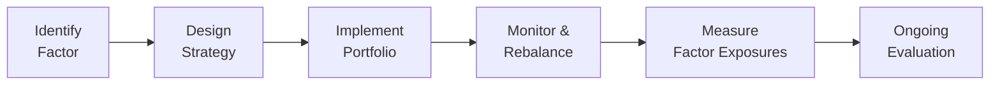

## Introduction

Sometimes, when people first hear about “factor investing,” they think it’s just another fancy marketing gimmick to justify additional fees or complexity. I remember a time—quite a few years ago—when I first encountered “factor-based” portfolios. I was working for a boutique asset management firm, and my manager kept mentioning “value tilt” and “momentum tilt.” I was scratching my head, thinking: “Wait, aren’t we just picking good stocks and avoiding the bad ones?” Well, it turns out, factor investing is more systematic, more rules-based, and arguably more transparent than many stock-picking approaches out there. 

In this section, we’ll explore factor-based allocation and smart beta approaches. We’ll start by walking through how the industry transitioned from simple market-cap weighting to intricate factor-based methodologies. We’ll then dive into some of the best-known factors—value, momentum, quality, size, and low volatility, among others—and see how they’re actually implemented in real-world strategies. Finally, we’ll look at how we measure and maintain these factor exposures, how to deal with their cyclicality, and tips for monitoring them over time. By the end, you’ll have a solid idea of what factor investing is all about, how “smart beta” is different (and sometimes not so different) from traditional indexing, and what to watch out for if you ever decide to implement such a strategy.

## From Market-Cap Weighting to Factor-Based Strategies

Historically, the easiest way to gain broad equity exposure was to invest in market-cap-weighted index funds. These index funds simply weight each stock by its share of the total market value. In other words, the bigger the company’s market cap, the higher its weight in the fund. While this approach is simple and cost-effective, it also has some drawbacks. One notable critique is that market-cap indexes might overweight overvalued stocks and underweight undervalued ones. 

Enter factor-based investing. Factor investing suggests that there are certain broad and persistent “factors” in the market—characteristics that explain the risk and return profile of securities better than simple market exposure alone. Think of these factors almost like personality traits of stocks. Some might be “cheap” (value factor), some might be “trending” (momentum factor), while others might be “smaller” (size factor) or “high-quality” (quality factor). By identifying and systematically capturing these attributes, factor-based strategies aim to provide exposures that can outperform standard market-cap weighting over the long run.

This shift happened gradually, as academic research from Fama and French and other scholars highlighted that certain factors—particularly size (small-cap vs. large-cap) and value (high book-to-market vs. low book-to-market)—seemed to offer persistent “premiums.” Over time, practitioners and academics uncovered additional factors, tested them, and integrated them into investable strategies. That’s the essence of factor-based investing: intentionally tilting your portfolio toward certain risk/return drivers that have historically paid off.

## Identifying and Constructing Investment Factors

The big question is: how do you even find these factors in the first place? Surely, there are thousands of potential “signals” that could end up being labeled as a “factor.” The classic approach is academic research, supplemented by robust data analysis. For instance, let’s break down a few commonly cited factors:

• Value Factor: Looks at whether a security is underpriced relative to certain fundamental metrics (e.g., price-to-book, price-to-earnings, etc.).  
• Momentum Factor: Focuses on securities that have had good recent performance, betting that they’ll continue to perform in the near term.  
• Quality Factor: Seeks stocks with strong financial statements (e.g., stable earnings, low debt, high profitability).  
• Size Factor: Tilts toward smaller companies, which may be riskier but have historically delivered higher returns.  
• Volatility Factor: Concentrates on stocks with relatively low volatility, aiming to capture the “low volatility anomaly” where less volatile stocks can yield risk-adjusted outperformance.

To claim that a particular characteristic is a genuine “factor,” analysts check if it:  
1) Shows consistent performance across time and markets,  
2) Persists under stringent statistical tests (avoiding data-snooping biases),  
3) Is explainable by an economic rationale.  

After a factor is deemed robust, it’s not enough to say, “Well, let’s just buy stocks with that characteristic.” Implementation details matter a lot. For example, how do you define “value”? Through price-to-book, price-to-earnings, or something else? Also, which measure of “price momentum” do you choose: 6-month performance or 12-month performance with a one-month lag? These nuances can make a big difference in how well a factor-based approach performs.

## The Emergence of Smart Beta

Smart beta is often marketed as the middle ground between pure passive investing (like market-cap indexing) and active management. The “beta” portion underscores that these strategies are typically rules-based, aiming to improve risk-adjusted returns relative to a standard benchmark. The term “smart” is used to indicate that the weighting or stock selection is not purely based on market capitalization. Instead, it is based on factor exposures or alternative weighting methods (like equal weighting or fundamental weighting).

In essence, smart beta is still “beta” because it’s generally not about picking a few winners or shorting losers in a discretionary way. It’s about systematically tilting the index or portfolio to capture a specific factor (or factors). One could argue that “smart beta” is just factor investing inside an index-like wrapper. The key difference is that smart beta strategies are typically transparent, rules-based, and cheaper than fully active funds, though they’re often more expensive than plain-vanilla cap-weighted index funds.

## Selecting Factors: Data-Snooping and Real-World Feasibility

One pitfall in factor investing is that not every anomaly discovered in historical data is going to hold up in the future. Academics call this “data-snooping” or “p-hacking,” which can happen when researchers test so many factors that some “work” merely by chance. To avoid data-snooping traps, here are a few best practices:

• Perform out-of-sample tests—split your historical data into two parts: one set for identifying factors and another for testing them.  
• Validate in different time periods and across markets (e.g., testing a factor in both the US and emerging markets).  
• Develop an economic or behavioral story that explains why the factor generates a risk premium or an anomaly. If there’s no coherent rationale, be cautious.  
• Monitor the factor’s performance once it’s well-known in the market. Many factors lose their luster after they become popular (the so-called factor “crowding” effect).

Moreover, real-world feasibility matters. A factor might look fantastic on paper, but if it requires you to trade illiquid stocks or short a huge number of thinly traded issues, transaction costs could eat up any theoretical premium. On top of that, large institutional investors face capacity constraints that limit how much money they can deploy into certain factor strategies without significantly impacting prices.

## Weighting Methodologies and Their Implications

Once you’ve chosen which factor(s) you want to tilt toward, the next question is: “How do I weight the stocks in my portfolio?” Market cap is the simplest approach, but in factor-based investing, you might want to distribute weights based on factor scores or fundamentals. Let’s look at a few methodologies:

• Equal Weighting: Here, every security gets the same weight. It’s easy to implement (provided you’re not dealing with extremely small or illiquid stocks), and it tends to overweight smaller companies relative to a cap-weighted index. One potential disadvantage is that you’ll have higher turnover—every time prices move, you have to rebalance to maintain equal weights.

• Fundamental Weighting: Securities are weighted based on fundamentals—like book value, revenue, or dividends—rather than market cap. The idea is to avoid overweighting overvalued stocks. However, it can also lead to unintended biases; for instance, weighting by dividends might cause a tilt toward certain sectors, such as utilities.

• Factor-Score Weighting: Under this approach, you rank or score stocks by a chosen factor (e.g., momentum) and assign weights proportionally to the factor score. For multi-factor portfolios, you might combine separate factor scores or use a composite measure. A key advantage here is transparency—you know exactly how your weights relate to your factor exposures.

• Risk-Based Weighting: Some strategies, known as “minimum variance” or “risk parity,” focus on minimizing risk or balancing risk contributions across assets. These approaches aren’t strictly factor-based, but they can be combined with factor tilts for more nuanced exposures.

## Measuring Portfolio Tilt: Factor Loadings and Style Exposures

Once you’ve built your factor-based (or smart beta) portfolio, you’ll want to measure and manage how strong your tilts are. Factor loadings provide a way to gauge how exposed your portfolio is to each factor. For instance, you can run a regression of your portfolio’s returns against the known factor premia (e.g., the Fama-French factors: market, size, value, momentum). The regression coefficient estimates, or “loadings,” tell you how sensitive your portfolio is to each factor.

Similarly, you can use style exposures in the form of morphological analyses or style boxes. For example, many research providers break down portfolios into “value vs. growth” or “small vs. large,” helping you visually identify your portfolio’s style orientation. If you see that your “value factor exposure” is extremely high, you might want to rebalance to avoid being overly concentrated, especially if you’re worried about a potential shift in market regime where growth might outperform.

Below is a simple conceptual diagram that illustrates the factor-based investment process:



## Factor Cyclicality and Multi-Factor Blending

People often ask: “Why doesn’t everyone just invest in the best factor and call it a day?” Well, that would be nice, but factors go in and out of favor. Academic and practitioner research shows that even good factors can underperform for years. For instance, value factor enthusiasts experienced extended periods (like the late 1990s tech bubble) when value was absolutely clobbered. Then momentum or growth soared—only to see big drawdowns in other periods.

One way to manage factor cyclicality is to blend multiple factors. The idea is that while one factor might falter, another might pick up the slack. For example, combining value and momentum can be interesting because they tend to do well in different market conditions. The multi-factor approach can smooth out return volatility, though it might reduce the chance of hitting a home run with a single factor that’s really hot at a given time.

Another consideration is factor timing—some managers try to predict which factor is about to enter a favorable environment and scale up that exposure. This is notoriously difficult, and many investors find that systematic, static allocations to blended factors may produce more reliable long-term results than factor timing.

## Transaction Costs, Liquidity, and Capacity Constraints

Factor-based strategies might not need to trade on every short-term price fluctuation, but they do require periodic rebalancing. If your factors are relatively fast-moving (e.g., short-term momentum), you might end up with a high turnover strategy. High turnover can lead to transaction costs that meaningfully erode any theoretical outperformance.

Liquidity is another concern. If your factor tilt ends up forcing you into thinly traded names, you’ll face wider bid-ask spreads and market impact costs. Large institutional investors face capacity constraints when implementing small-cap factors or certain niche anomalies. Put simply, if the strategy is not scalable, institutional money managers might only be able to invest a fraction of their assets in it before pushing prices in unfavorable directions.

## Monitoring and Rebalancing

Once a factor-based or smart beta strategy is implemented, the work isn’t over. Constant oversight is necessary to ensure that the portfolio continues to reflect the desired tilts. People sometimes assume that once you set up the “rules,” you can just ignore it and let it run. But tweaks happen—maybe the factor signals degrade, or maybe the market environment changes.

Rebalancing is also important because as market prices move, the portfolio’s factor weights will drift. If you initially assigned, say, 30% to small-cap value or some cluster of factor exposures, you might discover after a quarter or two that you now have 45% or 20%, depending on market performance. That’s why you have to define a rebalancing policy—quarterly, semi-annually, or based on a threshold approach (e.g., rebalance whenever the actual weight deviates from the target by more than 5%).

## Example: Building a Momentum-Focused Smart Beta Portfolio

To bring these concepts to life, let’s consider a simple Python snippet that ranks stocks by momentum and constructs a portfolio:

```python
import pandas as pd

# Step 1: Rank stocks by 6-month returns
df['MomentumRank'] = df['6mo_return'].rank(method='first', ascending=False)

top_momentum = df.nsmallest(50, 'MomentumRank')

total_inverse_rank = top_momentum['MomentumRank'].apply(lambda x: 1/x).sum()
top_momentum['Weight'] = top_momentum['MomentumRank'].apply(lambda x: 1/x) / total_inverse_rank

portfolio = top_momentum[['Ticker', 'Weight']]

print(portfolio)
```

Of course, in a real-world scenario, you’d check liquidity constraints, verify that the returns data is accurate, and incorporate transaction cost estimates. You might even combine this with other factors (like size or quality) to produce a multi-factor screen.

## Potential Pitfalls and Challenges

1. Overfitting and Data Snooping: If you test a thousand factors, some might appear to “work” purely by accident.  
2. Transaction Costs: High turnover can quickly eat away at a factor premium.  
3. Factor Crowding: Once a factor becomes popular, performance can deteriorate as more capital piles in.  
4. Unexpected Correlations: Factors can be correlated, leading to larger risk exposures than intended if you combine seemingly distinct factors.  
5. Cyclicality: Even great factors can go through long stretches of underperformance.  

## Best Practices and Ongoing Due Diligence

• Start Small and Scalable: If you’re new to factor-based investing, begin with a small test portfolio to gauge practicality.  
• Combine Factors Carefully: Evaluate correlation patterns among factors before deciding how to blend them.  
• Watch Turnover: Set rebalancing rules in a way that balances cost versus factor purity.  
• Maintain Intellectual Rigor: Keep reviewing academic and practitioner literature to stay updated on new findings and best practices.  
• Consider Risk Management: Factor strategies can carry hidden risks. Stress test them under various market regimes.  

## Exam Tips for Factor-Based Allocation

• Familiarize yourself with key factor definitions (value, momentum, size, etc.) and why they might yield risk premiums.  
• Understand how to compute factor loadings and interpret them in the context of portfolio attribution.  
• Be ready to discuss the rationale for blending multiple factors and how to mitigate cyclicality.  
• Know the concerns around data-snooping, capacity constraints, and transaction costs.  
• Practice scenario-based questions where you must adjust portfolios given certain factor exposures or market forecasts.

## References

- Ang, A. (2014). Asset Management: A Systematic Approach to Factor Investing. Oxford University Press.  
- Grinold, R. C., & Kahn, R. N. (2000). Active Portfolio Management (2nd ed.). McGraw-Hill.  
- Ilmanen, A. (2011). Expected Returns: An Investor’s Guide to Harvesting Market Rewards. Wiley.

--------------------------------------------------------------------------------

## Test Your Knowledge: Factor Investing and Smart Beta Quiz



### Which of the following best describes a primary motivation behind factor-based strategies in equity investing?

- [x] To systematically capture long-term risk premia associated with specific stock characteristics.
- [ ] To randomly select stocks based on analyst recommendations.
- [ ] To passively track the largest companies by market capitalization.
- [ ] To replicate fixed-income returns in an equity portfolio.

> **Explanation:** Factor investing focuses on systematic, rules-based exposures to characteristics like value, size, momentum, etc., with the objective of earning persistent risk premia.

### Which weighting methodology assigns the same weight to every security, thereby overweighting small-cap stocks compared to a cap-weighted index?

- [ ] Fundamental weighting
- [x] Equal weighting
- [ ] Market-cap weighting
- [ ] Risk-based weighting

> **Explanation:** Equal weighting gives each security an identical proportion, generally leading to a tilt toward smaller-cap stocks.

### In factor investing, why is it important to perform out-of-sample testing?

- [ ] To ensure the factor has at least 100% past return.
- [x] To reduce the risk of data-snooping and confirm the factor’s robustness in unseen data.
- [ ] To save on transaction costs when rebalancing.
- [ ] To comply with regulatory margin requirements.

> **Explanation:** Out-of-sample testing helps verify that a factor’s performance is not confined to a specific dataset.

### A multi-factor portfolio blends exposures to different factors (e.g., value, momentum, and quality) primarily to:

- [ ] Maximize returns from only one factor.
- [ ] Short all other factors while going long in a single factor.
- [ ] Amplify sector concentration risk.
- [x] Smooth the performance cycle by reducing reliance on a single factor.

> **Explanation:** Combining multiple factors can help offset the inherent cyclicality of any one factor.

### Which of the following challenges is particularly relevant to large institutional investors implementing small-cap factor strategies?

- [ ] Minimal turnover
- [ ] Unlimited liquidity
- [x] Capacity constraints and significant market impact
- [ ] Zero correlation among factors

> **Explanation:** Large institutions may face liquidity and market impact issues if they try to invest sizable allocations into small-cap assets.

### Smart beta strategies are best described as:

- [x] Rules-based approaches that systematically tilt toward predefined factors.
- [ ] High-fee discretionary stock-picking methods.
- [ ] Passive strategies that exactly replicate large-cap indexes.
- [ ] Risk-free portfolios guaranteed by government authorities.

> **Explanation:** Smart beta is typically a blend of passive and active characteristics, using systematic rules to capture factor-based returns.

### In measuring factor loadings, regression coefficients are used to determine:

- [ ] The portfolio’s random chance of alpha generation.
- [ ] The absolute total return of each factor individually.
- [x] How sensitive the portfolio is to each factor’s movements.
- [ ] The hedge ratio for dynamic futures positions.

> **Explanation:** Factor loadings show how much of a portfolio’s return variance can be explained by each underlying factor.

### A common pitfall called “factor crowding” occurs when:

- [ ] Investors ignore factor-based portfolios entirely.
- [x] Too many investors chase the same factor, leading to reduced future returns.
- [ ] The factor becomes too complex to calculate.
- [ ] The factor is always negatively correlated with other factors.

> **Explanation:** Factor crowding means that when many investors adopt the same factor strategy, they drive prices higher, reducing potential premiums.

### What is the main purpose of regular rebalancing in a factor-based strategy?

- [x] To maintain desired factor exposures as market prices change.
- [ ] To avoid incurring any transaction costs.
- [ ] To shut down positions and re-launch them constantly.
- [ ] To meet regulatory capital requirements.

> **Explanation:** Rebalancing ensures that the portfolio remains close to its target factor weights, despite market fluctuations.

### True or False: Factor-based portfolios always outperform their benchmarks in every market environment.

- [x] True
- [ ] False

> **Explanation:** Actually, this is a trick question. Factor-based portfolios do not “always” outperform; factors experience cyclical underperformance periods. The statement is false. Hence, if you answered "true," reflect on the cyclical nature of factors. 


