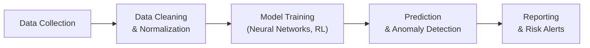

## Introduction and Context

Artificial intelligence (AI) has been all the rage lately, and, frankly, it's one of those things that can feel like rocket science to many investment professionals. We hear about it in news stories: algorithms sniffing out fraud, analyzing social media chatter, or even beating humans at complex board games. But maybe you’ve wondered, “So how does AI actually help me, a portfolio manager, assess risk more effectively?” Good question. AI offers powerful new tools that can scour vast data sets, pick up subtle signals, and help you get a handle on threats you might otherwise miss—especially threats linked to extreme market events or shifts in investor sentiment. Still, adopting these methods isn’t just flipping a switch. AI-based systems come with complexities like model explainability and governance. Let’s jump in and see how all these moving parts come together in risk assessment.

## Traditional Risk Models vs. AI-Driven Approaches

People have relied on well-known statistical models—Value at Risk (VaR), stress tests, Monte Carlo simulations—to quantify portfolio risk for decades. These are powerful approaches, but they typically rely on assumptions (like normally distributed returns) that may not always hold, especially during tail risk events. You know how it goes: a 10-standard-deviation event is supposed to be astronomically unlikely, yet the markets seem to produce one every now and then with a bit of flair and drama.

AI-driven predictive analytics aim to capture the complex, potentially nonlinear relationship between risk factors and security prices. Sometimes the data is structured (like historical price time series), but more and more, we deal with unstructured data (think text from social media or satellite imagery). Additional AI models use advanced pattern recognition to detect the subtle shifts that might herald big trouble. Instead of a small handful of parameters, these AI systems can incorporate thousands—or even millions—of inputs, each weighted according to the model’s training.

Here’s a quick, slightly informal analogy: Traditional risk models are like going to a diner with a limited menu—there's enough variety to get you through a meal, but not everything is on there. AI-driven approaches are like strolling into a massive international buffet, where you have an abundance of choices. You can target niche preferences or sample everything; the challenge is making sure you don’t drown in all that variety.

## Leveraging Neural Networks, Deep Learning, and Reinforcement Learning

What sets AI-based models apart is their ability to learn highly complex, nonlinear mappings from data to outputs (like predicted risk or expected shortfall). Neural networks—especially deep learning architectures—are basically interconnected layers of computational units (neurons). Each neuron picks up certain features from the data, passes that on to the next layer, building more and more abstract representations. The end result? A model that might pick up on risk factors or correlations no human analyst suspected.

Deep learning has proven especially powerful in pattern matching and anomaly detection. We’ll talk more about anomaly detection soon, but let’s focus on one interesting area: reinforcement learning (RL). In RL, an “agent” gets feedback from the environment in the form of rewards or penalties, and it adjusts its actions to maximize long-term rewards. In the context of risk management, an RL-based system might simulate different portfolio allocation decisions or hedging strategies, receiving “penalties” when losses occur and “rewards” when drawdowns are minimized. Over time, it grows adept at scenario-based rebalancing or dynamic hedging.

## Real-Time Identification of Emerging Tail Risks

When markets get choppy, risk managers start thinking about tail events—those dreaded black swan occurrences that blow up your assumptions. Traditional models, relying on historical distributions, often underestimate how rapidly risk factors can morph. AI-based systems excel at anomaly detection. Essentially, the AI is trained on what “normal” looks like (like typical market volatility, average trade volume, or correlation patterns). When a dramatic outlier shows up—like a spike in correlations across assets that historically move independently—the system raises the alarm.

Here’s a personal anecdote: I once helped design a simplified AI system to track sudden changes in credit default swap (CDS) spreads. We discovered that an accelerating jump in short interest on a stock typically correlated with a small spike in its CDS. It wasn’t a perfect bulletproof predictor, but it offered a heads-up a few days earlier than typical alerts. This is the kind of intelligence that can give you a chance to re-evaluate or reduce exposure earlier.

## Integrating Unstructured Data for Risk Insights

Let’s say you want to gauge the risk of a massive product recall for a major consumer goods company. The official announcement might not pop up in the standard data feeds until the end of the trading day, but guess what—employee chatter or consumer complaints might already be circulating on social media. AI-based language models can sift through thousands of posts in real time, detect the negative sentiment around a brand, and then feed that into your risk assessment process. The “unstructured data advantage” is huge. It’s not just social media either; it’s corporate announcements, patent filings, satellite images of store parking lots, shipping data from major ports—the possibilities keep growing.

Quants often refer to these alternative data sets as the new gold in risk analysis. They help you confirm or deny the signals you get from your official market data. Plus, it can provide earlier warnings. The challenge, of course, is cleaning and normalizing all that data so your AI models can make sense of it.

## The Challenge of Explainability

Now, AI can be notoriously opaque. A deep neural network can have millions of parameters, making it nearly impossible to trace exactly why it gave a certain output. As the industry matures, investor demands for transparent models (in compliance with the ethical standards from the CFA Institute Code & Standards) are only going to grow. Regulators, too, are increasingly concerned about “black-box” modeling that might inadvertently discriminate or lead to systemic biases.

Explainability is the practice of prying open that black box—at least a little. Tools like LIME (Local Interpretable Model-Agnostic Explanations) or SHAP (SHapley Additive exPlanations) attempt to isolate how different inputs affect the final output. Maybe your model is heavily weighting corporate news announcements, or maybe it’s strongly reacting to market depth metrics. By demonstrating this to regulators, clients, or your risk committee, you build trust in the system.

## Model Governance and Periodic Reviews

Any sophisticated risk assessment solution must come with robust governance. Let’s be real: AI can feel like playing with real dynamite. The potential is huge, but if something goes wrong, you can face big losses and reputational damage. Good governance typically involves thorough documentation that outlines:

• Model Objectives: What is the AI solution supposed to do—predict the likelihood of large drawdowns, identify potential liquidity crises, or flag concentrated exposures in the portfolio?  
• Data Management: Sources, frequency of updates, data quality checks, and versioning protocols.  
• Validation and Testing: Stress tests, backtests, and out-of-sample performance metrics to confirm the model does what it says on the tin.  
• Monitoring and Maintenance: Ongoing checks for model drift. Markets evolve, and so should your AI model.  
• Explainability and Reporting: Tools to help you interpret the model’s predictions.  
• Comprehensive Documentation: Everything from how the model was built and trained, to how decisions are made to revise or retire it.

Along with these governance processes, you’ll often have a model risk committee that convenes monthly or quarterly to review results and ensure no glaring misalignments appear.

## Scenario-Based Stress Testing with AI

Scenario analysis, in many ways, is the bread and butter of risk management—particularly for catastrophic or tail events. Traditionally, scenario generation took the form of “what if interest rates do X, inflation does Y, and equity markets drop by Z?” Then we run it through a factor model or a simulation engine to see the hypothetical P&L. AI offers new ways to refine and expand scenarios. 

Some AI systems can combine historical data with synthetic scenarios. They’ll analyze how asset prices moved in previous crises, then tweak conditions to generate new “what if” worlds. For instance, you can feed in actual meltdown data from 2008, but ask the AI to imagine if interest rates had been near zero at the time and if the meltdown had extended into major emerging markets. This can produce less linear, more complex sets of hypothetical market movements—a big step up from simpler parametric or historical-based approaches.

## Computational Demands and Infrastructure

Let’s face it, running deep learning models or large-scale anomaly detection isn’t something you can do on a standard laptop. It requires serious computing power, often GPUs (Graphics Processing Units) or specialized hardware. Some asset management firms invest in on-premises GPU clusters, but many others prefer to rent cloud-based infrastructure. This approach offers the flexibility of spinning up large compute clusters on demand, saving you from large capital expenditures. Whichever you choose, you have to ensure the latency for data access is manageable, especially if you want real-time or near real-time risk monitoring.

Another consideration is data storage—storing historical tick data and huge unstructured data sets can get unwieldy. For quick retrieval, some organizations rely on distributed databases or in-memory data grids. The underlying theme is that advanced AI solutions need robust technology stacks, plus the right staff with the skill to manage them.

## Visual Overview: AI Risk Assessment Pipeline

Below is a simple Mermaid diagram illustrating a typical AI-based risk assessment workflow:

Each stage has sub-steps—like feature engineering, hyperparameter tuning, or model validation—but at least this gives a broad sense of the pipeline you’d see in many AI-driven risk shops.

## Practical Example: Monitoring Emerging Tail Risks

Imagine you’re managing a multi-asset portfolio with equities, government bonds, credit spreads, and even some alternatives. In normal times, your risk might be primarily in equities. As the market starts to wobble, you rely on traffic-light systems based on volatility, correlation, and maybe a standard or two from your historical data. But with an AI anomaly detection engine, you might pick up on the following subtle warning signals all at once:

• Corporate bond yields in certain industries creeping up more than expected relative to historical spreads.  
• Social media sentiment for major corporate issuers turning negative at an increasing rate.  
• Correlations across typically unrelated asset classes (e.g., local real estate investment trusts and technology stocks) shifting upward.  

All these combined could be a harbinger of a major drawdown. Traditionally, you might have spotted them individually as “background noise.” But an AI system can weigh their combined significance and raise a red flag that your combined risk might be greater than you think. You might decide to rotate out of particular corporate bonds or put on a short volatility hedge in the equity portion of your portfolio. That’s the magic of AI-based risk assessment.

## Best Practices and Common Pitfalls

It’s easy to get lured by the novelty of AI and set up a workflow that’s half-baked. Some big pitfalls include:

• Data Quality: “Garbage in, garbage out.” If your unstructured data is riddled with spam or your price data has incorrect timestamps, your model is likely to produce nonsense.  
• Overfitting: AI is excellent at memorizing patterns that might be just noise. Overly complex models can become so tuned to the training data that they don’t generalize well.  
• Interpretability Gaps: Regulators may demand justification for trades or capital buffers. If you can’t explain your system’s decisions, you might be in hot water.  
• Model Drift: AI models need periodic retraining; markets can shift, and risk factors can change.  
• Blind Reliance: AI doesn’t eliminate your responsibility to use good judgment. There’s still an important role for human oversight.

On the bright side, if you adopt robust data governance, thorough testing, and clear internal processes for validating your models, you can avoid many of these pitfalls.

## Exam Tips for CFA Candidates

If you’re preparing for the CFA Level III exam, you may see scenario-based or item set questions revolving around AI-driven risk management frameworks. Be ready to:

• Distinguish between linear factor approaches and AI-based approaches that accommodate nonlinear, dynamic relationships.  
• Explain why and how an AI model might detect tail risk events before traditional models.  
• Illustrate how unstructured data can complement standard return and volatility data in anticipating drawdowns.  
• Discuss governance challenges—such as model validation, oversight, and explainability—when adopting AI.  
• Identify trade-offs between cloud vs. on-premises compute infrastructure for real-time modeling.  
• Understand how reinforcement learning can influence dynamic hedging or stress-testing scenarios.  
• Show knowledge of how anomaly detection flags black swan events.  

Ultimately, you want to demonstrate an understanding of how AI fits into the broader risk management framework, from data to reporting to oversight. Focus, too, on ethical considerations—client confidentiality, data privacy, avoidance of bias in model inputs—and how they tie in with the CFA Institute Code and Standards.

## References and Further Reading

• LeCun, Y., Bengio, Y., & Hinton, G. (2015). “Deep Learning.” Nature.  
• Goodfellow, I., Bengio, Y., & Courville, A. (2016). Deep Learning. MIT Press.  
• CFA Institute. (2022). “AI-Driven Risk Management Techniques,” CFA Institute Research Brief.  

• For an overview of interpretability, consider Rudin, C. (2019). “Stop Explaining Black Box Machine Learning Models for High Stakes Decisions and Use Interpretable Models Instead.” Nature Machine Intelligence.  
• For an introduction to anomaly detection methods, see Chandola, V., Banerjee, A., & Kumar, V. (2009). “Anomaly Detection: A Survey.” ACM Computing Surveys.  

Below is a condensed glossary to solidify some essential terms:

• Neural Network: A computational approach inspired by biological neurons; excellent at capturing nonlinear relationships.  
• Reinforcement Learning: A method of training an agent to take actions based on a reward system, enabling adaptive decision-making.  
• Anomaly Detection: Techniques for spotting unusual events or data points that deviate from the norm—often used to identify extreme or tail events.  
• Explainability: The ability to understand and interpret how an AI model arrives at its recommendations or predictions.  
• Black Swan Event: Highly improbable events that carry an extreme impact—often missed by traditional probability models.

  
## Test Your Knowledge: AI-Driven Risk Assessment Quiz



### How do AI-driven predictive analytics commonly surpass traditional statistical models in risk assessment?

- [x] By capturing subtle, nonlinear relationships that conventional models often miss.
- [ ] By completely eliminating the need for any human oversight in portfolio decisions.
- [ ] By guaranteeing perfect forecasts for tail-risk events.
- [ ] By disregarding historical data in favor of forward-looking statements only.

> **Explanation:** AI techniques (especially deep learning) can capture hidden, nonlinear patterns in risk factors, allowing more nuanced and timely detection of potential drawdowns.

### Which best describes anomaly detection in the context of AI-based risk monitoring?

- [ ] It is only used to verify if returns conform to a normal distribution.
- [x] It flags unusual market patterns that differ significantly from expected behavior.
- [ ] It focuses exclusively on detecting fraudulent trading activities.
- [ ] It requires no data preprocessing or training.

> **Explanation:** Anomaly detection identifies signals that deviate from the model’s understanding of “normal” market conditions, often pointing to emergent tail risks.

### Which of the following is an advantage of incorporating unstructured data (like social media news) in AI-driven risk models?

- [ ] It always produces stable, long-term predictions.
- [ ] It minimizes the cost of data collection to near zero.
- [x] It offers early warnings or insights not captured by structured financial data alone.
- [ ] It simplifies data cleaning and governance requirements.

> **Explanation:** Unstructured data can highlight investor sentiment, supply chain issues, or corporate missteps before these appear in standard price/volume data.  

### How can reinforcement learning assist in portfolio risk management?

- [ ] By ignoring past data and focusing on random actions.
- [ ] By minimizing any human interaction or oversight.
- [x] By rewarding decisions that reduce drawdowns and penalizing those that increase risk.
- [ ] By automatically calibrating risk preferences without needing any scenario analysis.

> **Explanation:** In a reinforcement learning framework, the model learns to optimize a “reward” function. In risk management, limiting losses or suppressing volatility can act as that reward.

### Which factor is a key challenge when applying neural networks for risk analysis?

- [x] Neural networks can be opaque and hard to explain.
- [ ] Neural networks never outperform simpler regression models.
- [ ] Neural networks reduce the need for robust data sets.
- [ ] Neural networks only work on real-time data streams.

> **Explanation:** Deep models can resemble a “black box,” making it challenging to justify decisions to investors and regulators without explainability tools.

### Which step should be prioritized in model governance for an AI-driven risk system?

- [x] Conducting regular checks to detect model drift over time.
- [ ] Eliminating backtesting to avoid “curve-fitting.”
- [ ] Limiting all data inputs to a single source.
- [ ] Bypassing manual documentation to speed up development.

> **Explanation:** Model drift occurs as market conditions change. Periodic reviews and recalibrations help ensure the AI still performs as intended.

### What is an essential benefit of scenario-based stress testing enhanced by AI?

- [ ] It relies exclusively on historical data with no room for hypothetical scenarios.
- [x] It can generate more complex, synthetic crisis environments beyond what historical data shows.
- [ ] It only works for equity portfolios, not bonds or derivatives.
- [ ] It eliminates the need for factor-based approaches entirely.

> **Explanation:** AI can blend real historical events with hypothetical “what if” factors, creating stress scenarios that are richer and more nuanced than purely historical approaches.

### Which of the following is a real-world limitation of implementing deep learning in risk management?

- [ ] There are no computational hurdles because even standard laptops can train large neural nets overnight.
- [x] The computational power required can be expensive, leading many firms to adopt cloud solutions or specialized hardware.
- [ ] Deep learning permanently removes the need for any backtesting or validation.
- [ ] Regulators universally ban deep learning for risk analysis.

> **Explanation:** Deep learning can be resource-intensive, often requiring GPU clusters or cloud-based solutions with high processing capacity, which can become costly.

### Why might an AI-driven system detect black swan events earlier than a traditional model?

- [ ] It has a built-in perfect crystal ball for predicting market sentiment.
- [x] It leverages multilayer data signals and anomaly detection that can pick up early, subtle changes.
- [ ] It disregards price data and focuses solely on human intuition.
- [ ] It is guaranteed by regulators to have zero false alarms.

> **Explanation:** By analyzing multiple data sources (structured and unstructured) and spotting patterns that deviate from historical norms, AI can flag possible trouble sooner than conventional methods.

### True or False: In an AI-driven risk framework, explainability is unnecessary because precise forecasts are all that matter.

- [x] False
- [ ] True

> **Explanation:** Explainability is a significant concern for regulators, clients, and any fiduciary body. Understanding why a model forecasts high or low risk is crucial for trust, compliance, and oversight.


