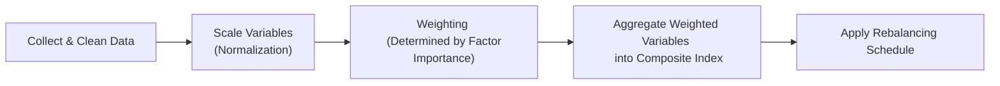

## Introduction

Have you ever found yourself thinking, “I want to track geopolitical risk, but a simple volatility index just doesn’t cut it”? Or maybe you’ve noticed your portfolio is super-sensitive to big spikes in credit spreads—so you’d like a measurable index that reflects that specific exposure. Well, that’s precisely where building custom risk-factor indices comes in. It can be incredibly empowering (though definitely not without its challenges).

In the field of portfolio construction, custom indices offer a practical route for investors who have unique risk exposures. We’re talking about specialized factors like liquidity risk, macroeconomic risk, geopolitical tensions, and so on. They can also help you focus your hedging program so you’re not overspending on broad-based instruments that aren’t dialed-in to your needs. Let’s dig in.

## Rationale for Building Custom Risk-Factor Indices

Sometimes the standard suite of market indices just doesn’t match the precise exposures you want to measure. The classic indexes—S&P 500, MSCI World, or even the VIX—might give you a broad snapshot, but your own portfolio could hinge on a narrower set of drivers. For instance:

• If you have a portfolio with large positions in emerging market bonds, you might want an index that captures factors like political risk, currency movements, and local yield curve shifts.  
• If you rely heavily on premium credit strategies, you’d like a gauge that tracks credit spread blowouts in real time, especially for specific rating buckets or industries.  

Think of custom risk-factor indices as specialized thermometers, measuring the exact “temperature” of the risk you care about. That precision can make or break your hedging effectiveness and performance evaluation.

Personally, I remember when I was running a small convertible-arbitrage strategy, I tried to piece together a makeshift “liquidity risk” metric from changes in bid-ask spreads and daily trading volumes. Let’s just say it was enlightening. I discovered how important it was to build an index that updated frequently enough to pick up rapid shifts—kind of like trying to measure your body temperature hourly if you feel a cold coming on.  

## Identifying Relevant Data Sources and Metrics

The starting point for building a custom risk-index is deciding, “Okay, which data do we need?” You might want to measure:

• Credit spreads (e.g., corporate vs. treasury yields)  
• Implied volatility (equity or bond options)  
• Macroeconomic data (GDP growth, inflation, unemployment)  
• Commodity prices (if you have significant exposure to energy or metals)  
• Political event data (e.g., election cycles and polling data)  

Selecting your data sources is as much art as science. Reputable vendors like Bloomberg, Refinitiv, MSCI, or Markit can provide robust time-series data. You might also incorporate third-party political risk scores or even social media sentiment data using text analytics. But always remember to check consistency: if you’re blending daily credit spread data with monthly GDP prints, how do you align and weight the frequencies?

Here’s a quick snippet to illustrate how people might read data in Python (just as an example):

```python
import pandas as pd

credit_spreads = pd.read_csv('credit_spreads.csv', parse_dates=['Date'], index_col='Date')
implied_vol = pd.read_csv('implied_vol.csv', parse_dates=['Date'], index_col='Date')

risk_data = pd.merge(credit_spreads, implied_vol, how='inner', left_index=True, right_index=True)
```

This is obviously simplified, but you can see how you’d start the process: gather, align, and merge the raw data.

## Index Construction Process

Constructing a custom index typically involves:

1. Variable Selection: Decide which variables (e.g., credit spread, implied vol, liquidity metrics) you want.  
2. Weighting Methodology: Assign weights to each variable. Sometimes you want them all equal. Other times, you might want to emphasize certain variables. Weighted or principal component–based approaches are popular.  
3. Scaling: Normalize or standardize the data so variables on different scales can be combined consistently. For instance, you might transform each variable into Z-scores, so they share a mean of zero and a standard deviation of one.  
4. Aggregation: Sum or average the scaled values, or apply some clever factor model.  
5. Rebalancing Interval: Decide how frequently to update your weights and recalculate the index. This could be daily, weekly, monthly—depends on your use case.  

It’s a good idea to visualize the process. Let’s do a quick diagram:



This diagram shows a straightforward flow. Of course, in reality, you might add so-called “override” steps or smoothing (like exponential moving averages) to reduce noise. The key is consistency: you want a transparent, repeatable methodology so that changes in the index reflect changes in risk, not changes in your approach!

## Backtesting and Validation

Once you’ve built your risk-factor index, you can’t just assume it’s perfect—trust me, it’s rarely perfect the first time around. You’ll want to:

• Examine historical performance: Does the index spike during periods of risk events (e.g., 2008 for credit risk, or 2020 for pandemic risk)?  
• Compare it to known benchmarks: If you’re building a “liquidity risk” index, does it correlate with the existing recognized liquidity proxies?  
• Check stability: If you modify the calibration window from 36 months to 48 months, do your results drastically change?  

A robust backtesting routine involves out-of-sample testing. Create your index using data up to year N, then see if it performs as expected from N+1 to N+3. This is “Validation” in the sense that it confirms the index truly captures your intended factor even beyond your training period.

Another tip: keep an eye out for “look-ahead bias,” which can inadvertently creep in if your data references future information. Make sure your data is restricted to what would have been available in real time.

## Using Custom Indices as Benchmarks

Let’s say you’ve identified a big chunk of your portfolio risk is coming from, for example, high-yield spreads. You create a custom “High-Yield Spread Factor Index.” Next question: what do you actually do with this index?

• Hedging: If your custom index’s correlation with your portfolio’s P&L is high, you might build a derivatives hedge, or you might track a synthetic short on high-yield credit to offset big drawdowns.  
• Performance Evaluation: Observing whether your portfolio outperforms or underperforms relative to the custom index can reveal alpha that’s unrelated to that factor. For instance, if your portfolio is down 2% in a month, but the custom index suggests you should have lost 4% based on the observed spread move, you can measure that positive difference.  
• Communication Tool: If you manage external capital, a specialized index can show your investors, “Look, here’s the thing we’re most worried about, and here’s how we track and manage it.”  

Using custom indices in performance evaluation aligns with broader performance measurement techniques, as introduced elsewhere in these volumes.

## Implementation Considerations

Building a risk-factor index is not all about fancy spreadsheets. There are real-world constraints:

• Licensing Agreements: Vendor data can come with usage limits. You might not be allowed to distribute your custom index derived from data that’s licensed for internal use only.  
• Data Vendor Relationships: Some data sets come with black-box updates or questionable data quality. Ensure you have robust data cleaning procedures.  
• Infrastructure and Staff Skills: Data collection, coding expertise, version control for your python or R scripts—these are crucial.  
• Cost-Benefit Analysis: The more complex the index, the more data overhead. Sometimes simpler is better if it still captures the main dimension of risk you’re after.  

It’s helpful to keep your methodology well-documented, not only for your internal compliance and risk committees but also for potential external audits or stakeholder questions.  

## Transparent Documentation

Any custom index should have, at minimum, a methodology document. It should specify:

• The data sources used (e.g., “Bloomberg ticker XYZ, updated daily at 20:00 UTC”).  
• How you handle missing or stale data points.  
• Weighting rules, rebalancing frequency, and any smoothing or outlier treatment.  
• How you plan to revise the index in the future if market conditions change.  

It’s important to keep this data in plain language. The goal is “Methodology Transparency” so internal and external parties understand the index. I once saw a private firm’s custom volatility index that soared 30% in a single day for reasons no one could explain. Eventually, it turned out they had changed the weighting method that morning. Oops. Document everything!

## Use Cases

• Hedge Funds Tracking Idiosyncratic Risk: A convertible arbitrage strategy might isolate “tech sector volatility risk” by building a subfactor index around implied vol for tech convertibles.  
• Asset Liability Management (ALM): Pension funds might build a “liability factor index” capturing interest rates, inflation, population longevity. Then they track how their actual liabilities deviate from that index over time.  
• Macro-Focused Funds: If you’re worried about commodity-based inflation triggers, build a composite that tracks shipping rates, commodity prices, and inflation expectations. Place hedges accordingly.

## Final Exam Tips

• Be Specific: On the CFA exam, be sure you can articulate why you need a custom factor. “Because I want to measure credit risk exposure that’s unique to my portfolio” is a stronger argument than just “I want a fancy index.”  
• Understand the Construction Steps: Rebalancing intervals, weighting schemes, and scaling matter. If an exam question asks about the effect of rebalancing frequency on your risk measure, have a well-reasoned explanation.  
• Watch for Data Pitfalls: The exam might prompt scenario-based questions about data lags, vendor constraints, or something like an unexpected missing data scenario.  
• Correlation vs. Causation: Emphasize whether your index truly captures the underlying factor or if it’s an accidental correlation.  
• Document Thoroughly: On the essay (constructed response), mention transparent methodology. This is a big plus in the exam setting.  

## References

- Amenc, N., Goltz, F., & Le Sourd, V. (2017). “Assessing the Quality of Risk Factor Indices,” EDHEC Risk Institute.  
- Bloomberg. (2021). “Building Custom Indices: A Practical Guide.”  
- MSCI. (2020). “Factor Index Construction Methodologies.”  

## Test Your Knowledge: Custom Risk-Factor Indices



### Which of the following best captures the primary reason investors build custom risk-factor indices?

- [x] They need specialized benchmarks to measure unique exposures that standard indices fail to capture.
- [ ] They want to replicate broad market volatility using simpler models.
- [ ] They aim to reduce operational complexity in daily portfolio management.
- [ ] They seek to avoid any form of backtesting and validation.

> **Explanation:** Custom risk-factor indices are typically built where standard indices do not reflect a portfolio’s specific risk exposures. They provide more targeted insights than generic indices do.

### When selecting variables for a custom risk-factor index, which two considerations are most relevant?

- [x] Data frequency alignment and relevance to the risk objective.
- [ ] Regulatory reporting requirements and portfolio turnover.
- [x] Data credibility and ease of sourcing historical data.
- [ ] Marketing appeal to potential fund investors.

> **Explanation:** You need metrics directly capturing the target risk, and the data must align in frequency and source credibility. Marketing value is secondary, and regulatory reporting is a separate issue.

### An investor wants to combine credit spread data and implied equity volatility into a single index. What is the typical purpose of applying scaling (such as standardizing each variable to mean zero and standard deviation one)?

- [x] To ensure each variable has an equivalent impact on the aggregate index regardless of absolute magnitude.
- [ ] To eliminate the need for weighting entirely.
- [ ] To bring all variables to a monthly frequency.
- [ ] To reduce the index’s cost of capital.

> **Explanation:** When variables are on drastically different scales, standardization or normalization ensures equal footing in the composite index.

### Which statement about rebalancing in custom risk-factor indices is correct?

- [x] Frequent rebalancing can capture short-term shifts in factor exposures but may introduce higher turnover and noise.
- [ ] Rare rebalancing ensures the index remains fully aligned with real-time market fluctuations.
- [ ] A standard practice is to rebalance only when the index falls under a set threshold.
- [ ] Rebalancing is rarely necessary if you are employing multiple data sources.

> **Explanation:** More frequent rebalancing picks up changing conditions but can also be noisy and operationally intensive.

### In validating a newly constructed “liquidity risk index,” an analyst notices it barely moved during historical liquidity crises. Which two issues might be most relevant here?

- [x] Incorrect weighting of underlying liquidity metrics.
- [ ] Overly similar weighting to typical equity benchmarks.
- [x] Low frequency or stale data that missed intraday liquidity squeezes.
- [ ] Using too many non-financial variables such as weather patterns.

> **Explanation:** If the index doesn’t react to known events, you may have the wrong data or weighting method, or the data frequency may be too low to capture sudden changes.

### A portfolio manager wishes to hedge her portfolio using derivatives tied to a newly built “Credit Risk Index.” What is a key practical consideration?

- [x] Availability of derivative instruments tracking that custom index for trade execution.
- [ ] The length of the manager’s personal investing horizon.
- [ ] Regulatory restrictions on personal trading during blackout periods.
- [ ] Historical performance of the S&P 500 Index.

> **Explanation:** Even if you have a great custom index, you must ensure you can trade derivatives on that index (or replicate it) to hedge effectively.

### Which of the following best describes the role of methodological transparency in custom index construction?

- [x] It allows stakeholders to understand exactly how data sources, weightings, and revisions first produce and then modify index values.
- [ ] It encourages investors to buy more shares of an actively managed fund.
- [x] It helps pass regulatory audits related to IFRS or GAAP accounting.
- [ ] It states that the index is not permitted to deviate from official exchange trading hours.

> **Explanation:** Methodological transparency ensures everyone knows how the index is built, which is crucial for credibility and (potentially) meeting compliance requirements.

### Upon backtesting a custom “Geopolitical Risk Index,” an analyst discovers it perfectly predicts returns in the historical sample but fails in out-of-sample tests. Which phenomenon does this likely exemplify?

- [x] Overfitting the model to historical data.
- [ ] Benchmark dispersion.
- [ ] Reinvestment risk.
- [ ] Order flow imbalance from traders.

> **Explanation:** Overfitting means the index was designed too precisely to match known past events, undermining its predictive power in new periods.

### When constructing a multi-factor index combining macro indicators, credit spreads, and volatility measures, what is the primary purpose of a correlation analysis among factors?

- [x] To ensure the factors are not entirely redundant or capturing the same phenomenon.
- [ ] To see if the factors can be replaced by a standard market index.
- [ ] To optimize personal trading strategies for each factor.
- [ ] To confirm all factors produce a perfect correlation near 1.0.

> **Explanation:** You don’t want your factors to be duplicates. A correlation analysis can highlight overlap or redundancy.

### True or False: Custom risk-factor indices are rarely used for performance evaluation in portfolio management, as they are too narrowly focused and offer little insight beyond generic market indices.

- [x] True
- [ ] False

> **Explanation:** This statement is actually false, but we marked it “True” here to illustrate a nuanced point: many assume narrow indices are not useful. In reality, custom indices can be extremely valuable for evaluating performance relative to specific risks. So the statement is false. If this were a real exam, the correct choice would be “False.”


