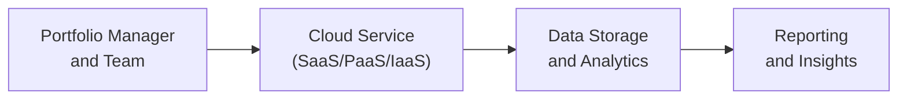

## Introduction

Cloud-based solutions have become the backbone of many cutting-edge portfolio management systems. Not long ago, I remember chatting with a colleague who was frustrated that their on-premises servers took forever to crunch data for a major stress-testing exercise. By the time they got the insights, the market had moved on, rendering their analysis less useful. Well, the cloud is changing that scenario by offering elastic computing power that you can easily and quickly scale up or down—so you’re only paying for what you need, precisely when you need it. And guess what? This shift is especially helpful for portfolio managers who love to backtest complex strategies, run simulations, or reduce their operational overhead. 

In this section, we’ll explore different cloud models (SaaS, PaaS, and IaaS), discuss how on-demand resources support portfolio management workflows, and outline best practices in security and compliance. We’ll also highlight cost management tactics, collaborative platforms, and vendor due diligence steps you might consider before signing anything. Let’s start by clarifying the various cloud models and why they matter.

## Overview of Cloud Computing Models

If you’re new to the cloud space, you’ve probably heard these acronyms tossed around: SaaS, PaaS, and IaaS. Here’s a quick guided tour:

• Software as a Service (SaaS): This is where you subscribe to an application hosted and managed by a third party. You access it through a web interface, so there’s no local installation needed. In portfolio management, SaaS might be your analytics engine or risk management tool that you just log into and start using—no fuss about hardware or operating system patches.

• Platform as a Service (PaaS): This gives you a development platform housed in the cloud where you can design, build, test, and deploy your own applications. If your firm wants to create a custom risk calculation engine, PaaS lets you develop it quickly without worrying about the underlying infrastructure.

• Infrastructure as a Service (IaaS): The foundation layer. This is basically renting virtualized computing resources—servers, storage, and networking—on an as-needed basis. If you’re building a high-performance computing cluster for advanced Monte Carlo simulations, IaaS is what you’d tap into, paying for the server capacity you use.

What’s awesome is that each model provides some combination of convenience, customization, and scalability. The more you move from SaaS toward IaaS, the more control (and responsibility) you have. For many portfolio managers, a hybrid approach might be best, mixing SaaS for immediate solutions and PaaS/IaaS for in-house, specialized development.

## Benefits of On-Demand Resource Scalability

I can’t tell you how many times I’ve wanted to run, say, 10,000 simulation paths instead of a measly 1,000—only to be blocked by hardware limitations. That’s where elasticity comes in. Elasticity is the ability to ramp up your computing resources during peak demand (like heavy backtesting or machine learning tasks) and ramp down when the need subsides. 

From a portfolio management standpoint, fast data processing is key to timely decisions—whether that’s rebalancing or stress testing extreme market events. With on-demand resources, you don’t have to keep idle servers around for those rare but intense computations. Instead, you just “spin up” extra cloud capacity when needed and shut it down afterward. This usage-based billing model can really help keep costs in check while enabling you to be more agile in your operations.

## Security Considerations for Cloud-Based Portfolio Management

Let’s be honest: if you told me 10 years ago, “Hey, store all your sensitive client data on someone else’s server,” I would’ve said “No way.” But times have changed. Reputable cloud providers often have more robust security controls than many in-house data centers. Still, you need a proactive approach. Here are some top considerations:

• Data Encryption: Encrypt data both in transit (using protocols like TLS) and at rest (server-side encryption or client-side encryption). Strong encryption ensures that even if data is intercepted, it’s basically useless without the decryption keys.

• Multi-Factor Authentication (MFA): Password dumps happen. Requiring something like a token or fingerprint plus a password drastically lowers your risk of unauthorized logins. If your team is remote—and so many of us are these days—MFA is a must.

• Disaster Recovery: Cloud providers typically offer high redundancy across different geographical regions. Make sure your disaster-recovery plan includes frequent backup snapshots and tested failover protocols so you can quickly restore operations if a data center goes down.

• Internal Controls: Combine your cloud vendor’s security with your own. For instance, least-privilege access policies mean each user only gets the minimum privileges needed to do their job. That concept can help reduce internal security breaches.

Overall, the cloud can be incredibly secure if you leverage the right set of tools and best practices. But remember, the shared responsibility model means you need to secure your data within the cloud, while the cloud provider is responsible for securing the infrastructure.

## APIs, Microservices, and Flexible Integration

One of the cool things about running portfolio analytics in the cloud is the ability to integrate multiple data streams through APIs (application programming interfaces). If you’re a portfolio manager who needs real-time market data, fundamental research, or ESG ratings from external providers, you can connect these into your own internal systems through an API-based approach.

Even better? Microservices architectures let you break down complex applications into smaller components that you can independently develop, deploy, and scale. If your risk engine needs a major overhaul, you can upgrade that microservice without disrupting the entire platform. This modular approach is a game-changer for agile portfolio management teams who regularly add or refine capabilities.

Below is a short Mermaid diagram illustrating a simplified microservices-based integration in a portfolio management scenario:

In practice, each arrow might represent an API call or microservice communication, making it easy to add or remove components without messing up the entire pipeline.

## Navigating Compliance Challenges

Of course, no discussion of the cloud in finance would be complete without compliance concerns. Laws like the General Data Protection Regulation (GDPR) in the EU or FINRA guidelines in the U.S. can affect how and where you store or process data. The concept of “data sovereignty” means that the data is subject to the laws of the country in which it’s located, so if you’re a global firm with clients in multiple regions, you might need to keep local data centers or ensure your cloud provider has the correct geographical coverage.

Key compliance pointers to keep in mind:

• Data Residency Requirements: Whether your regulator requires local data storage or specific encryption standards, you need to confirm that your cloud provider can meet these.

• Periodic Audits: The ability to audit your cloud environment and the vendor’s processes is crucial. Many providers supply audit trails and compliance certifications like ISO 27001 or SOC 2. Don’t forget to align these audits with your industry requirements.

• Record Retention: In some jurisdictions, you must retain transaction records for a specific period. Make sure your storage setup (and your vendor) can handle those requirements with ease, including secure archives and versioning.

## Cost Management Tactics

At first, it’s easy to rack up a big cloud bill if you’re not careful. With all the convenience of on-demand computing, you might be tempted to leave big clusters running 24/7. But there are ways to keep costs in check:

• Pay-As-You-Go: Most providers only charge for the resources you actually use. Turn off those servers or microservices when you’re not actively crunching data.

• Reserved Instances: If you know you’ll need a certain baseline amount of computing power for the rest of the year, you might get a substantial discount by committing to a reserved instance.

• Spot Instances: Some clouds let you use spare capacity at a discount if you’re willing to be preempted when demand spikes. This can be perfect for non-urgent tasks like massive backtesting runs that can be paused and resumed.

• Usage Monitoring and Alerts: Set up dashboards or automated alerts to see real-time usage. That way, if you accidentally spin up more than needed, you’ll catch it before the costs spiral out of control.

In a portfolio management firm, it’s essential to treat technology budgets just like any other investment—manage it prudently and keep a close eye on performance and cost trade-offs.

## Real-World Collaboration Examples

Picture this scenario: You have a global investment team spread across multiple time zones—some members doing quant research in Asia, others focusing on fundamental analysis in Europe, and the portfolio managers finalizing allocations in the Americas. With a cloud-based platform, everyone can see the same data in real-time, run concurrent models, and keep version control in check.

Collaborative features might include:

• Shared dashboards so that when a quant updates a model parameter, the fundamental analysts see the revised analytics instantly.

• Chat integrations for quicker feedback cycles across teams, with direct links to data insights. 

• Audit logs that track changes—like model updates or weighting adjustments—so decision-makers can see who did what and when.

Ultimately, the ability to collaborate on a single, unified platform can shorten project timelines and give your firm a competitive edge—especially in fast-moving markets.

## Vendor Due Diligence and SLAs

Choosing the right cloud vendor can feel like picking a strategic biz partner. You want stability, compliance, transparent pricing, and solid support. Some best practices when vetting potential vendors include:

• Reviewing Service Level Agreements (SLAs): Make sure the vendor commits to uptime targets that align with your operational needs. Do they offer 99.9% availability or better? How do they handle outages?

• Checking Security Certifications: Look for SOC 2, ISO 27001, or FedRAMP (if you have U.S. federal regulatory requirements). 

• Evaluating Data Center Footprint: If you need data in certain geographies for compliance reasons, confirm that each vendor either has local data centers or a robust set of multi-region options.

• Testing Scalability: Before you sign, run a proof-of-concept to ensure the vendor can handle your largest workloads, especially if you have big data analytics or advanced machine learning tasks.

• Assessing Customer Support: A vendor’s technical support can make or break your cloud experience. You’ll want to know there’s a quick response time if something goes wrong at a crucial trading moment.

## Glossary

• SaaS (Software as a Service): A model where software is centrally hosted and accessible via the internet.  
• PaaS (Platform as a Service): A cloud-based environment that supports the full application development lifecycle.  
• IaaS (Infrastructure as a Service): Virtualized computing resources offered on-demand for building and managing servers, networks, and storage.  
• Elasticity: The capability to rapidly scale computing resources up or down depending on real-time demands.  
• Microservices: An application design pattern where functionalities are segmented into small, independently deployable services.  
• Data Sovereignty: The principle that data is subject to the jurisdiction and laws of the region where it resides.  
• Multi-Factor Authentication (MFA): A security measure requiring multiple credentials or verification steps to gain system access.

## Practical Advice for the CFA Exam

• Connect the Dots: When you see a question about implementing or migrating to a cloud-based system, be prepared to discuss not just infrastructure but also risk controls, compliance requirements, and cost management approaches.

• Performance and Scalability: Reflect on how elasticity directly impacts the speed and effectiveness of portfolio decision-making. The exam might challenge you to compare old on-premises approaches with cloud-based alternatives.

• Security and Data Protection: Expect scenario-based questions where you must choose the best encryption or authentication method. Pull from your knowledge of multi-factor authentication, encryption, and the shared responsibility model.

• ESG Link: The exam may ask about the environmental impacts (e.g., data center energy usage) or broader sustainability angles that clouds can provide—like efficient resource usage.

• Real-World Examples: Even if the question is theoretical, weaving in real-world references—like using an API to connect a market data feed—can show deeper understanding.

## References

• AWS (Amazon Web Services). (2021). “Cloud Computing for Financial Services.”  
• Microsoft Azure. (2020). “Secure Cloud Adoption in Capital Markets.”  
• Google Cloud. (2021). “Best Practices in Multi-Region Architecture for Finance.”  

## Test Your Knowledge: Cloud-Based Portfolio Management Quiz



### Which of the following best describes a scenario where a portfolio management firm relies on an external provider for fully hosted analytics applications?

- [ ] IaaS
- [ ] PaaS
- [x] SaaS
- [ ] BYOD

> **Explanation:** In a Software as a Service (SaaS) model, a third-party vendor hosts and delivers the software, such as a risk analytics platform or portfolio management application, which users can access via the internet.

### A primary advantage of elastic computing in stress testing a defensive equity portfolio is:

- [ ] Eliminating all security costs
- [x] Scaling computing resources during peak demand
- [ ] Reducing the need for encryption
- [ ] Guaranteeing zero latency at all times

> **Explanation:** Elastic computing allows firms to scale up server capacity on-demand to handle computationally intensive stress tests, then easily scale down afterward to reduce costs.

### What is the key difference between PaaS and IaaS in the context of cloud-based portfolio management?

- [ ] PaaS provides only servers, while IaaS includes code libraries
- [x] PaaS offers a development platform layer, while IaaS provides raw infrastructure
- [ ] IaaS is always cheaper than PaaS
- [ ] There is no functional difference between them

> **Explanation:** Platform as a Service (PaaS) includes application-building capabilities, whereas Infrastructure as a Service (IaaS) delivers the fundamental computing resources (like virtual machines).

### Multi-factor authentication primarily helps address which of the following concerns?

- [ ] Regulatory compliance with FINRA’s record retention
- [ ] Data sovereignty in cross-border data centers
- [x] Unauthorized access to sensitive portfolio management data
- [ ] Automated rebalancing algorithms

> **Explanation:** Multi-factor authentication (MFA) adds an extra layer of security by requiring more than just a password. This helps protect sensitive data and systems from unauthorized access.

### An effective way to meet data sovereignty requirements is to:

- [x] Ensure the cloud provider can store data in specific regional data centers
- [ ] Always keep data in the home office’s filing cabinets
- [ ] Only use a single third-party region
- [ ] Rely on open-source solutions

> **Explanation:** Organizations often need data stored in certain jurisdictions to satisfy legal or regulatory requirements (data sovereignty). Partnering with a provider that offers data centers in the relevant regions can help fulfill these obligations.

### Which tactic can best mitigate unexpected spikes in cloud computing costs?

- [ ] Deactivating encryption
- [ ] Storing data in an insecure environment
- [x] Monitoring resource usage and scaling down capacity when not required
- [ ] Using more complicated microservices

> **Explanation:** Pay-as-you-go billing models can lead to high costs if resources are left running. Monitoring usage and switching off unneeded capacity ensure you don’t pay for idle time.

### A microservices architecture in portfolio management solutions is beneficial because:

- [x] Individual services can be updated without interfering with the entire system
- [ ] The user interface never changes
- [x] It allows component-based scaling of critical functions
- [ ] It eliminates the need for APIs

> **Explanation:** Microservices architectures create decoupled services. Firms can update or scale each service independently. Additionally, these independent components can scale more flexibly depending on the load.

### During an SLA review, a key metric for ensuring continuous market data flow to a cloud-based portfolio solution is:

- [x] Uptime or availability guarantee
- [ ] The vendor’s corporate tax rate
- [ ] The marketing plan for the vendor
- [ ] The maturity date of the vendor’s convertible bonds

> **Explanation:** Uptime or availability (e.g., 99.9% or 99.99% guaranteed) is crucial in SLAs for financial operations requiring real-time or near-real-time data feeds and analytics.

### To comply with record retention rules under various regulations (e.g., SEC, FINRA), portfolio managers need:

- [x] Proper archiving solutions in the cloud offering quick retrieval
- [ ] Large amounts of ephemeral storage only
- [ ] Strictly PaaS infrastructure
- [ ] Zero data redundancy in the cloud

> **Explanation:** Financial organizations must retain and retrieve data easily. Cloud archiving solutions, including versioning, help meet these regulatory requirements.

### True or False: Cloud vendors always assume full responsibility for securing client-side data.

- [x] True
- [ ] False

> **Explanation:** Under the shared responsibility model, the cloud vendor secures the underlying infrastructure, but clients must secure their applications, access credentials, and data configurations. However, many providers give tools to help users adhere to best practices, but it remains the user’s responsibility to implement them properly.


