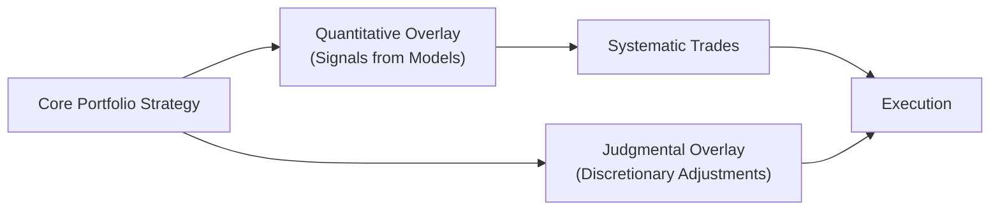

## Introduction and Context

Every investment manager faces a persistent question: “Should I trust my model, or should I trust my gut?” This dilemma often boils down to embracing quantitative overlays versus allowing for judgmental (discretionary) overlays. In this section, we’re going to dive deeply into what these overlays are, where they work best, how they can fail, and—most excitingly—how they can be combined to build robust portfolios. 

Admittedly, I first heard about quantitative overlays many years ago when I was at a firm that specialized in algorithmic trading. At the time, I was a fresh-faced analyst who found the world of advanced financial models oh-so-impressive. But I also recall the near-panic in the portfolio managers’ eyes whenever these sophisticated models spat out a trade signal that contradicted their instincts. Over time, I realized it’s not an either-or proposition. Models and humans can collaborate, but it’s often a messy affair to get that balance right.

## Defining Quantitative and Judgmental Overlays

### Quantitative Overlay
A “quantitative overlay” introduces systematic, model-driven signals or constraints atop an existing portfolio strategy. These overlays typically arise from statistical models, machine-learning algorithms, or econometric analyses that guide trades, position sizing, or risk exposure. You might have encountered the notion in earlier chapters on multi-factor investing (see Chapter 9 for expansions on factor modeling) or in risk management frameworks (Chapter 6), where you automatically hedge exposures once they exceed predefined thresholds.

Quant overlays:
• Rely heavily on historical data and calibration.  
• Use algorithms to generate signals systematically.  
• Aim for consistency and objectivity.  

### Judgmental Overlay
A “judgmental overlay” (sometimes called discretionary insight) is where humans step in to adjust the portfolio based on experience, intuition, or ongoing qualitative analysis. Picture a portfolio manager who sees a sudden change in monetary policy and thinks, “Well, my model hasn’t seen a situation quite like this before—I’m going to reduce credit exposure anyway.” That’s a judgmental overlay.

Judgmental overlays:
• Depend on human expertise.  
• May capture nuances or external factors that data series don’t fully reflect.  
• Are susceptible to behavioral biases if not carefully monitored.  

## When Quantitative Approaches Excel

### Large Datasets and Repetitive Patterns
Quantitative overlays shine in data-rich environments—think of high-frequency trading or large-cap equity markets with robust liquidity. For example, if you’re analyzing multi-year daily stock data with consistent patterns, a well-calibrated model can swiftly detect anomalies, mean reversion signals, or momentum factors. This approach can be consistent because machines can handle thousands of data points more reliably than humans who, let’s face it, might get bored or tired after combing through 50 data sets.

### Efficient or Semi-Efficient Markets
In markets where information is quickly disseminated (like major equity indexes or liquid currency pairs), purely fundamental input can be swiftly priced in. A quant overlay might exploit micro-inefficiencies that appear and disappear, reacting in real time. For instance, a simple factor-based approach might overweight value stocks when indicated by price-to-book or other metrics, do so systematically, and gradually tilt the portfolio (as we discussed in Chapter 9’s factor tilts).

### Objectivity and Repeatability
Models don’t get bored, scared, or excited. They also don’t rummage for coffee on a rough morning. A quantitative approach brings a level of objectivity, which helps mitigate certain emotional pitfalls such as panic-selling in a market downturn or panic-buying out of fear of missing out (FOMO). If your backtested model says “stick to the strategy,” it will—as long as the model remains properly governed and updated.

## When Judgmental Insights Prevail

### Rare or Unprecedented Events
Statistical models like to operate within known parameters. But what if your portfolio encounters truly black swan events? If you recall from Chapter 1.16 on Lessons from Market Crises, human judgment can sometimes detect early warning signs—like central bank rhetoric, sudden regulatory shifts, or even geopolitical tensions—that might not be fully incorporated into historical data. A portfolio manager’s experience and instincts can prove invaluable during these outlier periods.

### Nuanced Fundamental Changes
Markets are driven by human behavior, corporate strategies, and macroeconomic policy. Some of these factors exist as intangible signals not always captured by raw data. For instance, reading a new government stimulus plan in detail or noticing the subtle tone in a Federal Reserve press conference might influence a manager’s decision to override certain model outputs—especially if the plan signals fundamental disruptions that prior data never accounted for.

### Holistic Perspective
Human managers can weigh multiple aspects all at once—credit markets, commodity pricing, political tension, and even local cultural shifts. Sure, you can train a neural network to include these data, but sometimes people can interpret them in more dynamic ways. They can also incorporate intangible or still-developing data sets in real time without needing to re-code or recalibrate a model.

## Behavioral Biases and the Need for Governance

Relying on human judgment can expose the portfolio to well-known behavioral biases. For instance:

• Overconfidence: A manager believes their track record is impeccable and continues to increase risk exposure.  
• Confirmation Bias: Selectively ignoring model outputs that conflict with personal beliefs.  
• Anchoring: Clinging to an initial forecast even when new data suggests a change.  

As we covered in Chapter 5, these biases can slowly erode returns unless there is a rigorous governance structure. One approach might be to set strict rules about when a manager can override the model. For instance, the manager may be allowed to override a quant signal up to three times per quarter, but they must document the rationale in a formal record. Each override would be weighed in performance attribution (we’ll talk more about that in a moment).

## Combining Quantitative and Judgmental Overlays

The synergy between quantitative models and human judgment works best if both sides are aware of their own strengths and weaknesses. A classic setup:  
• Model Does the Heavy Lifting: The quant overlay combs through mountains of data, signals potential trades, and suggests position sizes.  
• Manager Evaluates “Edge Cases”: The judgment overlay steps in when events fall outside the model’s domain—for instance, a COVID-19-style shutdown that wasn’t fully accounted for in historical data.  

Below is a simplified Mermaid diagram to illustrate a typical workflow:



You can see that both the quantitative model (B) and human insights (E) feed into execution (D). The result is a combined strategy that can be more adaptive than a purely quant or purely discretionary approach alone.

### Feedback Loops for Continuous Improvement
One best practice is to ensure a feedback loop between the quant team and the portfolio managers. For example:  
1. Model generates a “Buy” signal for a certain equity.  
2. Manager overrides the signal due to a unique event not accounted for in the data (e.g., unusual corporate governance shift).  
3. Later, the model’s performance is compared to the actual portfolio performance.  
4. The quantitative team updates the model to account for this new type of event (if it’s truly relevant).  

This iterative process fosters learning on both sides. The model evolves to reflect the real world more accurately, and the manager gains a deeper understanding of the model’s logic.

## Common Pitfalls and Challenges

### Model Drift
Over time, markets evolve—be it in terms of volatility regimes, participant behavior, or regulatory changes. A model calibrated on historical data from “bullish times” may fail once the market environment shifts to a higher-volatility regime. This phenomenon is called “model drift.” Regular updates and re-calibration are key; letting a model run on stale data is a recipe for poor performance. This was painfully evident in the 2007–2008 financial crisis, when many credit models lost predictive power.

### Overrule Frequency
If managers are constantly overruling quant signals, you have to question: Why have a quant overlay at all? Frequent overrides can undermine the discipline of systematic strategies. Conversely, if overrides are too rare, are humans simply ignoring relevant new information? It’s important to define a healthy balance.

### Lack of Rigorous Performance Attribution
You can’t improve what you don’t measure. If a portfolio does well, was it because of the quant overlay or the manager’s override? If it underperforms, who is at fault? Without a proper performance attribution framework (as described in Chapter 3.10 and expanded throughout performance measurement discussions), it’s impossible to know which changes help and which harm. Over time, lack of clarity leads to guesswork and friction between teams.

## Practical Approaches for Implementation

### Enforced Override Policies
One approach is to formalize an override policy. For instance, you might let a manager deviate from model signals by a certain percentage (e.g., no more than ±3% from the recommended position sizing) but require additional documentation for extreme changes. Any override goes into the performance attribution system, which then calculates how those decisions impacted final returns.

### Manager vs. Model Scoring
Some firms implement an internal “scoreboard”:  
• Model’s signals are tracked in a hypothetical (paper) portfolio.  
• Manager’s actual trades are tracked in the real portfolio.  

At the end of a quarter or year, the performance of the actual portfolio is decomposed into model-driven decisions vs. discretionary decisions. Over time, this scoreboard can reveal each side’s strengths and weaknesses, guiding future improvements or re-calibrations.

### Eliminating the “It’s Personal” Factor
Managers sometimes take offense when a model suggests a different position. In an environment of high collaboration, the conversation shifts away from “the model is telling me I’m wrong” to “the model is highlighting data that might challenge our base assumptions.” This open attitude is crucial for building synergy rather than competition.

## Case Studies: Hits and Misses

### Success Story: Hybrid Commodity Strategy
Consider a commodity fund that used a momentum-based quant overlay to time entries in gold and crude oil. Their discretionary manager monitored geopolitical tensions and shipping disruptions that the model didn’t capture. During normal times, the model executed trades automatically. However, when unusual sanctions were announced, the manager stepped in to reduce crude oil exposure earlier than the model recommended. Combining these two approaches generated above-benchmark returns, with less volatility.

### A Words of Caution: Late-Stage Tech Bubble
Another story: a technology-focused hedge fund used a quant model that heavily favored growth stocks. By late 2029, the manager felt “tech mania” was about to peak, but the model kept doubling down based on strong momentum signals. She overrode the model—only halfway. Instead of completely slashing tech holdings, she just slightly reduced them, uncertain about going entirely against the model. In the ensuing crash, the partial override was too little, too late, leading to steep losses. The postmortem found that the model’s training period missed periods of major tech collapse, so it kept signaling “buy.” The manager’s gut said to run for the hills—but she didn’t trust that feeling enough to deviate from the system. The combination was half-hearted, and the results showed it.

## Python Snippet Example for Quant Analysis

Sometimes you might want to illustrate how a simple quant strategy can quickly highlight what the manager might have missed. Below is a brief Python snippet demonstrating a simple signal detection for a moving-average crossover—a classic approach—just to give a sense of how the logic might be coded:

```python
import pandas as pd

df['FastMA'] = df['Price'].rolling(window=20).mean()
df['SlowMA'] = df['Price'].rolling(window=50).mean()

df['Signal'] = 0
df.loc[df['FastMA'] > df['SlowMA'], 'Signal'] = 1

# Further analysis can help refine position sizes, risk controls, etc.
```

Though extremely basic, it showcases how quickly a programmatic approach can parse data, generate signals, and remain consistent day to day—something that is challenging for a human to replicate manually.

## Performance Attribution

In Chapter 3.10, we introduced the idea of performance attribution to identify the sources of returns and risk. When dealing with overlays, your attribution model might become more complex. Typically, you would decompose the portfolio’s return into:

1. Base Strategy Return (without overlays).  
2. Quantitative Overlay Contribution (the incremental return from systematic signals).  
3. Judgmental Overlay Contribution (the incremental return from discretionary overrides).  
4. Other Factors (transaction costs, fees, slippage, etc.).  

By consistently measuring these, you highlight whether your quant overlay is adding alpha or if it’s the human judgments that ultimately drive success (or failure).

## Creating a Feedback Loop and Continuous Refinement

We can’t emphasize enough the importance of a feedback loop:

1. Compare Model vs. Manager decisions.  
2. Conduct performance attribution at regular intervals.  
3. Analyze divergences.  
4. Refine the model and update assumptions (if warranted).  
5. Document manager overrides, diagnosing which overrides were beneficial.  

This cyclical process ensures that your strategies evolve rather than stagnate. Market conditions change—so must your approach.

## Communication Between Quantitative Teams and Fundamental Analysts

Having a robust communication channel between data scientists and fundamental analysts is paramount. You might have quants speak with sector specialists to incorporate real-time knowledge of regulatory changes, consumer sentiment, or new technology disruptions into the data set. Meanwhile, analysts can glean signals from the quants—like suspiciously low correlation breakdowns or unusual volatility patterns—to refocus their fundamental research.

## Best Practices

• Regular Model Review: Evaluate parameters monthly or quarterly to detect drift.  
• Document Override Criteria: Don’t rely on memory or informal conversations.  
• Transparent Performance Attribution: Keep everyone accountable.  
• Formal Governance: Establish policies and committees that continuously track overrides and ensure ongoing alignment with the Investment Policy Statement (IPS), discussed thoroughly in Chapter 4.  
• Collaboration Tools: Shared dashboards or cloud-based data analytics can reduce friction between teams.  

## Conclusion

Quantitative vs. Judgmental Overlays doesn’t have to be an adversarial standoff. Under many scenarios, combining systematic signals with discretionary insight can yield a well-rounded strategy—systematic enough to exploit data-driven opportunities while agile enough to adapt to unforeseeable changes in market structure or global events.

Yet, this synergy requires discipline. You need robust governance to prevent manager biases from running wild and a system of frequent checks to ensure the quant model remains relevant. With open communication, continuous feedback loops, and a willingness to adapt, your portfolio can tap into the strengths of both worlds—numbers and nuance.

## Final Exam Tips

• Understand the core rationale for quantitative vs. judgmental approaches. You may see a constructed-response question testing your ability to evaluate whether a portfolio manager’s override was justified.  
• Familiarize yourself with the concept of “model drift.” The exam could confront you with changing market conditions that render a once-effective model obsolete.  
• Keep track of performance attribution. Essay questions often require you to break down a portfolio’s returns into various sources.  
• Show knowledge of how governance structures mitigate behavioral biases. This can come up as a scenario-based item set, asking you to identify best practices for oversight.  
• Don’t forget that the combination approach is often tested. Be prepared to highlight the pros and cons of an integrated quant–judgmental overlay.

## References

• Grinold, R. C., & Kahn, R. N. (2000). Active Portfolio Management. McGraw-Hill.  
• Paddrik, M. (2019). “Balancing Quant and Discretion: The Overlay Challenge,” Journal of Asset Management.  
• CFA Institute. (2018). “Combining Quantitative Models with Fundamental Judgment.”  

## Test Your Knowledge: Quantitative vs. Judgmental Overlays



### In which situation is a quantitative overlay most likely to excel?

- [ ] When dealing with unpredictable geopolitical shocks that have no historical precedent.
- [x] When analyzing large sets of historical data in relatively efficient markets.
- [ ] When subjective opinion and qualitative information are more critical than numerical trends.
- [ ] When the manager specifically wants to test purely discretionary ideas.

> **Explanation:** Quant overlays thrive on vast data sets in markets where consistent patterns exist and can be systematically exploited.

### Which statement reflects a primary benefit of judgmental overlays?

- [ ] They remove all emotional bias from investment decisions.
- [ ] They automatically update model parameters when economy changes.
- [x] They can incorporate real-time and nuanced qualitative insights that are not captured in the data.
- [ ] They guarantee higher returns compared to a purely quant-driven process.

> **Explanation:** Judgmental overlays allow human managers to interpret qualitative variables and adjust for one-off or unprecedented market events.  

### What is “model drift”?

- [ ] A scenario where a manager repeatedly overrides recommended signals, drifting away from a systematic strategy.
- [ ] A technique for adjusting portfolio duration in fixed income investing. 
- [x] The decline in a model’s predictive power as market conditions or data distributions shift over time.
- [ ] The phenomenon of two signals converging to the same final recommendation.

> **Explanation:** Model drift occurs when a model’s performance degrades because its calibration no longer matches current market data or behaviors.

### Which behavioral bias could lead to ignoring valuable quant signals?

- [ ] Gambler’s fallacy.
- [x] Confirmation bias.
- [ ] Illusion of control.
- [ ] Herding bias.

> **Explanation:** Confirmation bias involves seeking out or giving more weight to information that confirms existing opinions or judgments, causing managers to ignore contradictory model signals.

### According to best practices, how should a firm structure override policies?

- [ ] Overrides should be allowed freely, without any documentation.
- [x] Overrides should be permitted up to a specified frequency or magnitude, with documentation of the reasons.
- [ ] Overrides should be strictly forbidden, to maintain a purely quantitative approach.
- [ ] Overrides should be decided by a third-party consultant only.

> **Explanation:** Allowing overrides—but with a defined procedure and proper documentation—strikes a balance between model discipline and necessary discretion.

### Which of the following is a potential pitfall of combining quant and judgmental overlays?

- [x] Lacking rigorous performance attribution to differentiate returns from each overlay.
- [ ] Having too many data points for model calibration.
- [ ] Incurring minimal transaction costs regardless of frequency.
- [ ] Identifying too few override opportunities in a year.

> **Explanation:** Without performance attribution separating quant-driven portions from discretionary adjustments, it is impossible to track the effectiveness of each approach.

### Which method is suggested to ensure continual improvement of the quant model?

- [ ] Freezing models for at least five years to see their long-term performance.
- [x] Establishing feedback loops where overrides are documented, results are analyzed, and models are updated.
- [ ] Outsourcing all quantitative research to external vendors.
- [ ] Prohibiting internal collaboration between quants and analysts.

> **Explanation:** A formal feedback loop allows the model to learn from managerial discretion and real-world results, leading to ongoing refinements.

### What balance should a firm aim for in terms of manager overrides?

- [ ] Managers should ignore quant signals entirely and rely solely on intuition.
- [ ] Managers should never override the quant model under any circumstances.
- [x] There should be clear guidelines on how often and how significantly overrides can occur.
- [ ] Managers should override every quant signal to capture discretionary alpha.

> **Explanation:** Successful integration relies on careful, transparent rules for overrides, ensuring that both the model and human input are leveraged appropriately.

### Which of the following statements best captures the goal of combining quant and judgmental overlays?

- [ ] To replace quant signals entirely with discretionary decisions.
- [x] To leverage systematic strengths while retaining flexibility for unforeseen market conditions.
- [ ] To eliminate the need for performance attribution.
- [ ] To rely solely on mean-variance optimization.

> **Explanation:** The primary advantage of mixing quant and discretionary methods is balancing model-driven consistency with flexible, real-world judgment.

### True or False: Behavioral biases only affect judgmental overlays and never creep into quantitative models.

- [x] True
- [ ] False

> **Explanation:** While quant models are objectively rule-based, they can still be influenced by biases in the data selection, parameter choices, or a manager’s predisposition to validate a particular model approach. However, the statement says “only affect judgmental overlays and never creep into quantitative models.” This can be interpreted as generally true in the sense that the direct biases are more associated with the human overlay. If you consider biases in model building as well, you could argue “False.” In strict exam contexts, the statement might be considered “False” because model building can be biased. But here, the question suggests a narrower lens: direct investor behavioral biases manifest predominantly in discretionary decisions.


