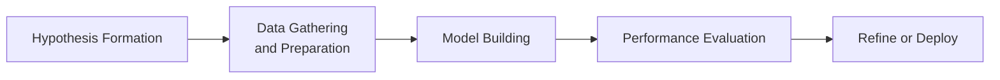
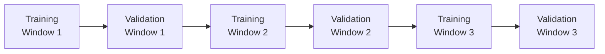

## Introduction

We’ve all had that moment—maybe you’re hanging out with a friend who’s excited about some fancy algorithmic strategy. They’re working from a stack of historical data, performing all sorts of complex coding alchemy, and proclaiming, “Hey, if this had been running in 2020, I’d be a billionaire by now!” But, well, anyone who’s tried actual live trading knows: talk can be—how should I say it—very cheap. The real test is whether that fancy algorithm can hold its ground when tested on fresh, unseen data, deal with messy markets, and keep up consistent performance in the face of changing conditions.

Whether you’re building a new trading system from scratch, or refining a pre-existing suite of micro-alpha strategies, it’s super important to set up a robust testing and validation framework. If you do it right, you’ll discover the actual edges—and flaws—of your approach. If you do it wrong, you risk spinning tall tales about “perfect” backtest returns that crumble under real-world complexities. This section dives into the essential components of testing and validating algorithmic strategies.

## The Testing and Validation Workflow

When constructing an algorithmic strategy, it’s helpful to think of a straightforward workflow. This workflow is cyclical because the “end” of one test may lead to new ideas and improvements. Let’s break it down:

- Hypothesis Formation  
- Data Gathering and Preparation  
- Model Building  
- Performance Evaluation  
- Deployment or Further Iteration  

Below is a rough visual overview before we dive deeper:



Each step involves its own nuances. For instance, data gathering must address data quality and cleaning, while performance evaluation must incorporate robust statistical checks. Let’s unpack each of these and then discuss more advanced tools like walk-forward optimization and scenario-based testing.

## Hypothesis Formation

It all starts with an idea. Maybe you think a certain macroeconomic factor drives price movements in small-cap equities, or that a particular momentum indicator is predictive for short-term currency pairs. Form your hypothesis clearly:

• Be explicit about the strategy’s logic or edge.  
• Articulate assumptions about which market or asset class you’ll trade.  
• Decide on metrics you’ll use to evaluate success (e.g., Sharpe ratio, drawdown, etc.).  

Words of caution: Don’t let your imagination run wild with a million random signals. That’s a perfect recipe for curve fitting. Set a coherent rationale for why you believe your approach might add value.

## Data Gathering and Preparation

Once you have a hypothesis, you need data. This part can be… well, somewhat mundane, but it’s absolutely critical. Potential pitfalls include:

• Missing data or inaccurate observations.  
• Survivorship bias (only including assets that survived over the test period).  
• Look-ahead bias (using data that wouldn’t have been available at the time of a trade).  

Keep meticulous records of how you cleaned and processed the data. In my opinion, robust data hygiene is half the battle. Otherwise, your “ace” model could be learning from distorted or incomplete data sets.

**Practical Tip:** Consider a time-series cross-validation approach in your data pipeline. This helps ensure that any data transformation or normalization is done only with information available prior to each test window.

## Model Building

Now it’s time to build your magical algorithm. This could be a simple moving average crossover or a complex machine learning model with hundreds of factors. Model building typically involves:

• Feature engineering to capture predictive signals.  
• Parameter selection (like the look-back window for a moving average, or hyperparameters for a machine learning algorithm).  
• Handling how signals translate into actual trading decisions (like position sizing, stop losses, or timing rules).  

Avoid overcomplicating your initial “prototype.” Start with a structure that you can easily test, interpret, and refine. If you’re using advanced methods, be mindful that more complexity often means more ways to overfit.

## Performance Evaluation

Time to see whether your algorithmic strategy is just talk or if it’s ready for prime time. Performance evaluation is multi-faceted:

• In-Sample Testing → This uses the same historical period that helped create or train the model. It’s usually the very data on which you calibrated or “taught” your model.  
• Out-of-Sample Testing → This uses a separate portion of historical data that was never touched by the model during development. It’s akin to a fresh exam for your strategy.  

We’ll get into the specifics of out-of-sample testing shortly. The main idea is this: even if your in-sample results are mind-blowing, that’s no guarantee of future success. In fact, mind-blowing in-sample results can sometimes be a red flag that the model might be memorizing noise.

**Key Performance Metrics:**  
Typical metrics include returns, volatility, maximum drawdown, Sharpe ratio, and Sortino ratio. For advanced strategies, practitioners also measure factor exposures, using analytics similar to those described in earlier chapters on Factor Models (see Chapter 9).  

**Transaction Costs and Slippage:**  
We’ve all heard the story of the novice newbie who says “my strategy yields 8,000% returns,” then forgets to account for commissions, bid-ask spreads, or the cost of crossing the spread on illiquid instruments. Don’t skip these—later, we’ll explain how to incorporate them realistically into your tests.

## In-Sample and Out-of-Sample Testing

### In-Sample Testing

**Definition:**  
It’s the evaluation of your strategy on the same historical dataset used to develop or tune it.

**Purpose and Pitfalls:**  
You’ll see how well your model fits the data. But if your strategy is extremely complex, you may be fitting noise rather than signal. The dreaded “curve fitting” or “data mining bias” emerges when you tweak parameters to make your backtest look perfect on that same dataset. If in-sample performance is too good to be true, it probably is.

### Out-of-Sample Testing

**Definition:**  
Your strategy is tested on historical price data (or any relevant data) that was never used in the modeling process. If your model can’t hold up on new data, it likely won’t hold up in real markets.

**Length of Out-of-Sample Period:**  
Aim to use a time window that’s large enough to be truly representative. Just a few weeks or months of out-of-sample data might not cut it. For instance, if your strategy is meant to capture multi-year cyclical effects, your out-of-sample window should be likewise long enough to reflect a full cycle.

In the best scenario, your in-sample results are respectable, but not “perfect,” and your out-of-sample performance is fairly consistent with in-sample returns. That’s a good sign you haven’t overfit to random quirks of the data.

## Cross-Validation Methods for Time-Series

In typical machine learning problems, you often see K-fold cross-validation: data gets split randomly into K “folds,” the model is trained on K-1 folds, and tested on the remaining fold. For time-series, you can’t just shuffle data randomly, because the chronological order matters. Instead, use “rolling” or “expanding” windows that respect the passage of time.

Below is an example of a time-series cross-validation setup:



In each iteration, you use earlier data for training, then validate on the next chunk of data, then roll forward to the next iteration. This process checks if your model’s performance is consistent across multiple segments of time.

### Sample Python Snippet

Here’s a brief snippet that demonstrates a time-series split in Python (using scikit-learn-like pseudo-code):

```python
import numpy as np
from sklearn.model_selection import TimeSeriesSplit

tscv = TimeSeriesSplit(n_splits=5)

for train_index, val_index in tscv.split(X):
    X_train, X_val = X[train_index], X[val_index]
    y_train, y_val = y[train_index], y[val_index]
    # Build and train your model
    model.fit(X_train, y_train)
    # Evaluate on validation
    predictions = model.predict(X_val)
    # Gather performance metrics...
```

Of course, real-world code might require more complexity—especially for handling instrument-level data, intraday time stamps, market closures, etc.

## The Role of Walk-Forward Optimization

One shortcoming of a single in-sample/out-of-sample test is that it may only reflect one optimization pass. In dynamic markets, you might want to re-optimize parameters periodically. That’s where walk-forward optimization comes in.

**How It Works:**  
1. You pick a training window (say 2 or 3 years).  
2. You find “optimal” parameters within that window.  
3. You then move forward in time, using those parameters on the subsequent period (say 3–6 months), effectively your out-of-sample period.  
4. You record the performance, then shift the entire window forward and repeat.  

This repeated process mimics how you’d actually adjust your strategy in real life. Markets change. Volatility regimes come and go. A static set of parameters that worked three years ago might be irrelevant now. So walk-forward optimization systematically re-tunes the strategy while ensuring each new test is out-of-sample for that iteration.

## Accounting for Transaction Costs, Market Impact, and Slippage

No matter how brilliant your algorithm might appear in a frictionless world, real trading involves numerous frictions. Let’s highlight these:

**Fixed and Variable Costs:**  
• Commissions or exchange fees.  
• Borrowing costs and short rebate rates if you’re shorting.  

**Market Impact:**  
• Larger trades might move the price—especially in illiquid instruments.  
• Trading algorithms that rely on high-frequency signals can get hammered by short-term volatility bursts.

**Slippage:**  
• Difference between your “theoretical” execution price and the actual fill price.  
• Usually depends on the volatility and volume of the market.

In your backtest, incorporate these costs with assumptions grounded in reality. For instance, if you’re trading a modest volume in highly liquid instruments (like large-cap equities or major currency pairs), your market impact might be small, but you still need a realistic figure for the bid-ask spread.  

## Scenario-Based Testing

Real markets can get chaotic—think back to the 2008 financial crisis or the 2020 pandemic-driven sell-off. If your data lacks crisis periods, you can artificially create stress scenarios or highlight historical meltdown intervals. The idea is to see how your strategy might react when volatility spikes, correlations blow out, or liquidity vanishes.

Here are a few scenario-testing approaches:

• **Historical Stress Test:** Replay the strategy through a known crisis period (e.g., 1987 crash, 2001 dot-com bust, 2008 financial crisis).  
• **Monte Carlo Shock:** Randomly generate price shocks or volatility spikes to test how your model might react to abrupt changes.  
• **Factor Turns:** If you’re factor-based, push your factor exposures to extremes to see if your strategy remains intact.  

Scenario tests can reveal big vulnerabilities, like extreme drawdowns or margin calls that your “normal environment” backtests glossed over.

## Paper Trading and Sandbox Environments

If your out-of-sample testing looks good, you might be itching to jump in with real money. But a safer next step is “paper trading” or using a sandbox environment:

**Paper Trading**  
• You submit trades in real time using simulated capital.  
• You see how orders get filled based on live market quotes (though there’s usually no real slippage or actual order queue considerations unless you have a sophisticated simulation).  

**Sandbox or “Demo” Environment**  
• Electronic trading platforms often provide specialized practice accounts.  
• Good place to test the operational side: does your code handle error messages, partial fills, or unexpected disconnections?

Paper trading is a final check before you go “live live.” If you realize the real-time signals or fill logic behave differently than in your backtest, you have time to fix it—without losing real money.

## Model Monitoring and Ongoing Re-Calibration

Once you’re live, the process doesn’t stop. It’s a cycle. You keep collecting new data points. You watch your portfolio’s actual performance. You also watch how signals might degrade as market participants adapt or as liquidity moves from one venue to another. Models can go “stale” over time, especially if they exploit ephemeral anomalies.

**Key Points for Monitoring**  
• Track daily or weekly returns, drawdowns, and risk exposures.  
• Compare actual results with backtested forecasts.  
• Investigate any large discrepancy to see if it’s caused by market regime shifts, a data feed glitch, hardware latencies, or other issues.  

Regularly review your code base, too. In live trading, a single coding slip can cause serious real-money losses—like referencing the wrong ticker or mishandling real-time data feed. Code review sessions with a second (or third) set of eyes can be absolutely invaluable.

## A Practical Example: SMA Crossover Strategy

Let’s tie things together with a quick example. Suppose you’re testing a simple 50-day vs. 200-day moving average crossover strategy on U.S. large-cap equities:

1. **Hypothesis Formation:** You suspect that a “golden cross” (where the 50-day MA crosses above the 200-day MA) signals positive momentum.  
2. **Data Gathering:** You obtain daily adjusted close data for the S&P 500 stocks from 2010 to 2023. You carefully handle stock delistings to avoid survivorship bias.  
3. **Model Building:** A buy signal triggers when the short MA crosses above the long MA, and a sell signal triggers on the opposite condition. Position sizing is 100% long or 0% if no bullish signal.  
4. **Performance Evaluation:**  
   - You use 2010–2015 as your in-sample period to tune some details (e.g., to see if a 50/200 or 60/200 or 50/180 is better).  
   - Then you lock in the best parameters and test them on 2016–2018 out-of-sample.  
   - Finally, you do a separate out-of-sample test for 2019–2023.  
   - When you see that returns are consistent (though not extraordinary) across all test windows, you confirm a modest edge.  
   - You incorporate transaction costs—like $0.005 per share or 0.02% per trade—and see that the strategy is still profitable, though with smaller net returns.  
5. **Walk-Forward Optimization:**  
   - You chunk the timeline into 2-year windows for optimization, followed by 6-month out-of-sample tests. Over multiple cycles, the strategy remains stable.  
6. **Scenario Testing:**  
   - You specifically isolate the 2020 COVID-19 crash period to see how the strategy performed under a massive volatility spike. The drawdown was large but recovered over time.  
7. **Paper Trading:**  
   - You run the strategy with real-time data in a paper account for 2 months and find that slippage is a bit higher than expected in your backtest, so you refine those assumptions.  
8. **Go Live and Monitor:**  
   - You gradually allocate a small portion of real capital and keep watching performance. If you notice a big divergence from the backtest predictions, you’ll revisit the code, data, or strategy assumptions.

## Conclusion

Testing and validating algorithmic strategies isn’t just a quick step on your path to profits. It’s a continuous, disciplined process that merges statistical know-how, financial domain expertise, technology infrastructure, and good old-fashioned skepticism. Every assumption—from data quality to how you handle transaction costs—can significantly alter the outcome and reliability of your backtest results.  

By embracing techniques like in-sample/out-of-sample tests, cross-validation for time-series, walk-forward optimizations, scenario-based testing, and thorough paper trading, you build a foundational layer of confidence in your strategy. But remember, real markets are fluid. Staying vigilant, reviewing performance, and re-tuning your approach based on objective evidence are keys to longevity in algorithmic trading.  

And if your first test doesn’t pan out the way you hoped—don’t despair. That’s just how you learn. In many ways, an “uninspiring” out-of-sample result might be the best teacher of all: it shows that the real world is complicated, that caution is warranted, and that truly robust strategies are never built in a day.

## Exam Tips

• Always keep the difference between in-sample and out-of-sample testing crystal clear.  
• Don’t forget to discuss transaction costs, slippage, and market impact in any answer about backtesting.  
• Be prepared to illustrate how time-series cross-validation differs from regular cross-validation.  
• Show you can apply walk-forward optimization principles: mention the difference between training windows and out-of-sample windows.  
• In scenario-based questions, highlight how historical crises can be used for stress testing.  
• Emphasize the ongoing process of monitoring and re-calibration. If you only mention “build and deploy,” you’ll miss key marks on the exam.  

## References

- Kissell, R. (2013). The Science of Algorithmic Trading and Portfolio Management. Academic Press.  
- Bailey, D., Borwein, J., Lopez de Prado, M., & Zhu, Q. (2017). “The Probability of Backtest Overfitting,” Journal of Computational Finance.  
- CFA Institute. (2019). “Backtesting & Model Validation: Practical Approaches.”  

## Test Your Knowledge: Algorithmic Strategy Validation



### Which of the following best defines out-of-sample testing for an algorithmic strategy?

- [ ] Using multiple performance metrics to evaluate the same historical period used for model training.
- [x] Testing a strategy on data not used in model training to assess its predictive power on new data.
- [ ] Re-optimizing parameters continuously on the in-sample dataset.
- [ ] Using the same dataset for both model training and performance comparison to reduce complexity.

> **Explanation:** Out-of-sample testing uses data that the model did not "see" or use during its training phase. This step checks for overfitting and generalizability.

### Which method is primarily used to replicate real-world sequential order in repeated model training and testing?

- [ ] K-fold cross-validation with randomly shuffled data
- [x] Time-series cross-validation
- [ ] Leave-one-out cross-validation
- [ ] Random sub-sampling cross-validation

> **Explanation:** Time-series cross-validation respects the chronological order of data, ensuring the model does not train on "future" information.

### When a simple moving average strategy is optimized across many parameters on the same dataset, which bias is most likely to occur?

- [x] Curve fitting or data mining bias
- [ ] Random sampling bias
- [ ] Survivorship bias
- [ ] Normality bias

> **Explanation:** Tuning a large number of parameters on the same dataset often leads to curve fitting, where the model matches historical noise rather than true predictive signals.

### In a walk-forward optimization, what happens immediately after an optimal parameter set is identified for a short window?

- [ ] The parameter set is used on the initial training sample again.
- [x] The parameter set is then applied to the following out-of-sample window to evaluate performance.
- [ ] The parameter set is discarded if not profitable.
- [ ] The parameter set is frozen for the entire future dataset without changes.

> **Explanation:** The essence of walk-forward optimization is to optimize parameters on one “training” portion and then test them on the subsequent out-of-sample portion before moving forward.

### Which of the following is an accurate statement regarding transaction costs in backtesting?

- [x] They must be estimated and deducted to reflect realistic net performance.
- [ ] They can be safely ignored if the strategy has a strong performance edge.
- [ ] They only apply to large institutional traders, not retail-level strategies.
- [ ] They reduce overall returns by a fixed 50% in all realistic scenarios.

> **Explanation:** Transaction costs vary and must be modeled carefully. Ignoring them can grossly inflate backtest performance.

### Paper trading serves primarily to:

- [ ] Validate that historical data was accurate in prior tests.
- [x] Provide a risk-free environment for real-time strategy evaluation.
- [ ] Immediately guarantee profit once the strategy is implemented live.
- [ ] Offer a guaranteed fill price at the midpoint of the bid-ask spread.

> **Explanation:** Paper trading lets you see how your strategy behaves in real-time market conditions, but without risking real capital.

### Which best describes the use of scenario-based testing?

- [ ] Evaluating model performance using only normal market environments.
- [ ] Using leftover data splits for validation.
- [x] Stress-testing the strategy against extreme market conditions or crises.
- [ ] Replacing out-of-sample evaluation with one entire time-series chunk.

> **Explanation:** Scenario-based testing is meant to examine how a strategy might perform under unusual or extreme market conditions, such as the 2008 crisis.

### One key benefit of walk-forward optimization is that it:

- [ ] Eliminates the need for any out-of-sample period.
- [ ] Avoids all forms of parameter overfitting.
- [x] Adapts parameters periodically as market conditions change.
- [ ] Requires fewer computational resources than standard backtesting.

> **Explanation:** Walk-forward optimization is designed to re-tune parameters at intervals, aligning the strategy with evolving market regimes.

### How do you describe the difference between in-sample and out-of-sample data?

- [ ] In-sample data is used to validate while out-of-sample is used to train.
- [x] In-sample data is employed to develop and parameterize the model, whereas out-of-sample data evaluates generalization.
- [ ] Both are used interchangeably in advanced cross-validation.
- [ ] They refer to identical datasets copied for different usage in machine learning frameworks.

> **Explanation:** In-sample data “teaches” the model, while out-of-sample data provides objective testing of that model.

### True or False: A perpetually high Sharpe ratio in a backtest, combined with perfect out-of-sample performance, guarantees future profitability.

- [x] True
- [ ] False

> **Explanation:** This is actually a trick question. Even near-perfect historical metrics cannot “guarantee” future success (the future is uncertain), but high in-sample and out-of-sample performance can strongly suggest a robust edge. If performance is truly perfect, it remains wise to beware of potential overfitting or data bias.


