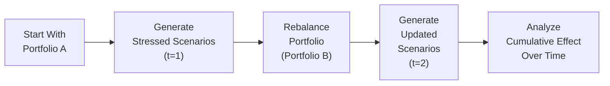
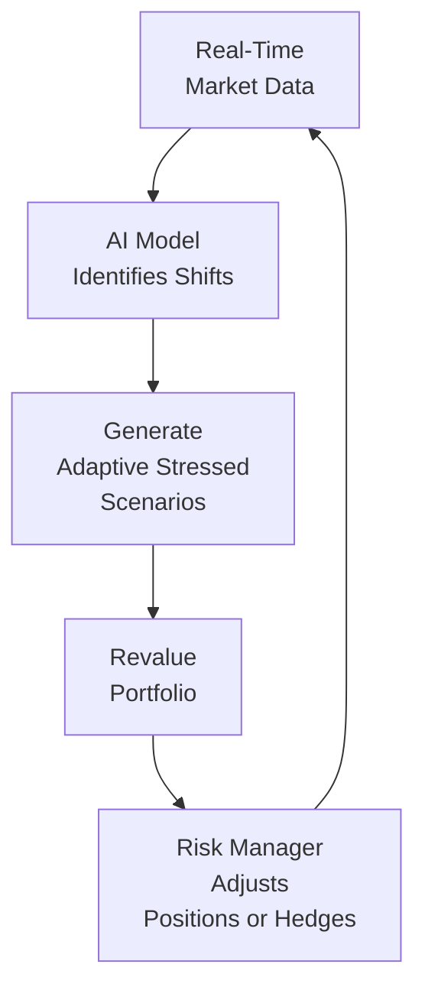

## Introduction

Stress testing has come a long way since the days of simply replaying historic market events (like the 2008 financial crisis) and measuring how portfolios might respond. If you ask me, I’ll never forget my first encounter with a “traditional” stress test model—it was basically a script that said, “What if interest rates jump up by 200 basis points, just as they did in some major event from history?” Well, that was helpful, up to a point. But as the financial landscape grows ever more complex, these older approaches can miss the nuance of correlated shocks, non-linear payoffs, and rapidly changing market conditions. So let’s dive in and explore how our stress testing toolkit is being modernized to tackle the complexities of contemporary portfolio management.

We’ll begin by clarifying the differences between old-school, historical-based stress tests and more advanced, multi-factor approaches. Then, we’ll walk through scenario generation techniques that harness Monte Carlo simulations and historical bootstrapping. We’ll talk about how non-linear instruments—like options and structured products—behave under stress. We’ll also explore dynamic, AI-powered stress testing methods that adapt continuously to new market data. By the end, you’ll hopefully have a clear understanding of how these cutting-edge tools can help you design robust portfolios that stand up to even the most severe market shocks.

## Traditional Versus Advanced Stress Testing

Traditional stress tests often rely on historical crisis scenarios. For instance, a portfolio might be tested against the market conditions witnessed during the dot-com bubble burst in the early 2000s or the credit crisis in 2008. The idea is to assume that if such conditions were to recur, you could see how your portfolio’s value changes. But here’s a quick question: when was the last time markets repeated themselves perfectly? They rarely do. While historic data is super valuable, a single, static scenario doesn’t always capture new forms of market stress—like a once-in-a-lifetime pandemic or an unexpected geopolitical conflict.

That’s why advanced stress testing employs more sophisticated methods. Rather than merely “re-importing” historical data, we use simulation, multi-factor analyses, and sensitivity checks to create hypothetical environments. These advanced methods can generate forward-looking scenarios, which is especially relevant when new risk factors (e.g., cybersecurity threats or climate change) don’t have a well-defined history yet.

## Multi-Factor Stress Testing and Correlated Shocks

In real markets, risk factors—things like equity prices, interest rates, oil prices, credit spreads—tend to move together in complex ways. A major economic downturn, for example, might simultaneously trigger rising default rates, a drop in stock prices, and a flight to quality that impacts bond yields. Multi-factor stress testing attempts to capture these correlations. Instead of shocking a single variable, you might shock multiple variables at once, following a correlation matrix or factor model.

Imagine a situation where you’re holding a global equity-fund portfolio along with some high-yield bonds. If you only stress test equity risk, you might miss how the same factor that drives equity prices down can also push credit spreads higher, hurting your high-yield bonds. With multi-factor approaches, you apply correlated shocks—perhaps a 10% drop in global equities couples with a 200 basis-point widening in high-yield spreads. This paints a more realistic picture of losses across the entire portfolio.

## Scenario Generation Tools

A major leap in modern stress testing involves robust scenario generation, typically relying on two main methods:

### Monte Carlo Simulation

Monte Carlo simulation uses randomized draws from probability distributions to create thousands (or even millions) of possible market scenarios. Let’s say you model returns for each asset class in your portfolio with certain means, volatilities, and correlations. You feed these parameters into the simulation and generate a broad distribution of outcomes. The power of Monte Carlo is that it can capture tail events (albeit with some assumptions about the shape of your distributions). If you want to see how your portfolio might behave in the worst 1% of cases (the so-called tail risk), the simulation can highlight those riskier outcomes.

Here’s a small example in Python-like pseudocode just to illustrate:

```python
import numpy as np

means = np.array([0.02, 0.03, 0.01])
cov_matrix = np.array([
    [0.001, 0.0006, 0.0003],
    [0.0006, 0.002, 0.0007],
    [0.0003, 0.0007, 0.0015]
])

num_scenarios = 100000
simulated_returns = np.random.multivariate_normal(means, cov_matrix, num_scenarios)

portfolio_weights = np.array([0.4, 0.4, 0.2])
portfolio_returns = simulated_returns @ portfolio_weights

var_95 = np.percentile(portfolio_returns, 5)  # 5th percentile as an example
print(f"5th percentile stress-level return: {var_95:.4%}")
```

In such a simulation, you can tweak the assumptions to introduce non-normal distributions or more complex correlation structures. Once the base scenario distribution is in place, you can artificially stress variables—like imposing a 20% drop in equity returns on top of your random draws—to see the knock-on effect.

### Historical Bootstrapping

Historical bootstrapping is another technique where you sample (with replacement) from actual historical data. Let’s say you have 15 years of daily returns for your portfolio components. By randomly picking data “chunks” from this time series, you create new hypothetical yet historically grounded paths. If your data set already includes some major crises, so much the better. You’ll likely see similar extreme movements reappear in your generated scenarios. This approach preserves any observed correlation patterns because the data is real, but it’s limited by the historical window you select. If your history doesn’t include a pandemic or an extreme interest rate environment, your scenario generation might miss these possible events.

## Accounting for Non-Linear Instruments

The big curveball in stress testing arises when you hold non-linear instruments, such as options, structured notes, or any products with embedded optionality. Because these payoffs aren’t strictly a linear function of the underlying asset’s movement, any standard stress testing approach must factor in different payoff profiles under various states of the world. For instance, a long call option might lose its entire time value when volatility collapses, even if the underlying price doesn’t change much. Alternatively, if implied volatility skyrockets, your out-of-the-money options might suddenly become more valuable.

In other words, a 10% drop in the underlying might not simply translate to a 10% change in your option’s value; it can be way more—or way less—depending on volatility, time to expiry, and moneyness. Models like Black-Scholes are often used to reprice options across different stressed environments. But in advanced stress tests, you’d also incorporate changes in implied volatility skew or shifts in interest rates that affect option prices. This is where scenario-based revaluation is essential: for each stress scenario, you’re recalculating a new option price, as opposed to applying a simple linear approximation.

## Dynamic Stress Testing

Markets evolve, and your portfolio composition likely changes over time, too—maybe you rebalance monthly, add new strategies, or close out positions. Dynamic stress testing accounts for these changes by running repeated stress simulations over multiple time steps, updating your portfolio’s holdings and the market conditions along the way. This way, you might discover that a portfolio hedged against equity risk in January becomes unhedged by April, because your short positions expired or the hedge ratio drifted.

Think of it as building a timeline of possible future states:



Each step, you incorporate new price paths and the updated risk exposures. It’s more involved computationally, but dynamic stress testing gives you a more realistic sense of how ongoing market volatility and changes in holdings affect your risk profile.

## Interpreting Stress Test Results

So you run a fancy multi-factor dynamic stress test—awesome. But how do you interpret the results? Typically, risk managers focus on metrics like:

• Potential portfolio loss: “Under these severe conditions, the portfolio might drop 15% in value.”  
• Capital shortfall: “Do we have enough capital allocated to cover potential drawdowns under stress?”  
• Concentrations of risk: “Which positions or asset classes contribute most to the worst-case losses?”  
• Risk limits: “Are we breaching any of our pre-established limits on, say, interest rate risk or equity drawdown risk?”

Often, the outcomes inform essential decisions like adding hedges, scaling back positions, or raising additional capital. Some firms set triggers—if the stress test shows you’d lose more than 20% of your total portfolio in a meltdown scenario, you might need to reduce leverage or buy put options as insurance.

## Regulatory Requirements

Financial institutions, such as banks and insurance companies, operate under regulations that mandate robust stress testing frameworks. Under Basel guidelines (for banks) and Solvency directives (for insurance firms in certain jurisdictions), institutions are obliged to run specified “bottom-up” and “top-down” stress tests. These often include firm-specific idiosyncratic scenario tests as well as system-wide macro scenarios issued by regulators (e.g., a severe recession, a housing market crash, or a sudden jump in risk-free interest rates).

• Basel Accords require banks to hold capital based on VaR or even Expected Shortfall, plus stress test results to demonstrate capital adequacy under stressed conditions.  
• Solvency II in Europe demands insurance companies demonstrate that they can meet obligations even under a wide range of adverse scenarios, including interest rate volatility and natural disaster exposures.

Failure to demonstrate resilience under these regulatory stress tests can mean higher capital requirements or other supervisory actions, which can be expensive and hamper growth.

## AI-Driven Stress Testing

One of the cutting-edge developments in risk management is the use of artificial intelligence and machine learning to refine stress test scenarios. Picture this: a system that monitors live macroeconomic indicators, market data, social media sentiment, and even global news feeds. If it spots a spike in credit default swaps or an unusual correlation between certain equity sectors, it can dynamically adjust your stress scenario parameters in real time. It might even highlight previously underappreciated connections—like how a disruption in a global supply chain could ripple through an equity portfolio or a commodity position.

Moreover, AI can help you detect “regime shifts” where historical relationships cease to hold—just think of the radical shifts in consumer behavior during the COVID-19 pandemic. Instead of waiting six months to realize your correlation assumptions were outdated, an AI-driven model might detect anomalies and update scenario generation on the fly. Of course, these approaches can be data-hungry and require strong oversight to avoid overfitting or spurious correlations. But they’re gradually becoming an important part of the stress testing ecosystem.

Here’s a quick, stylized flow of how an AI-driven approach might work:



## Practical Implementation and Examples

Let’s imagine a mid-sized asset management firm overseeing a multi-asset portfolio. The portfolio comprises equities, corporate bonds, some structured credit instruments, and a smattering of out-of-the-money equity call options. The firm wants to test the portfolio’s resilience in a scenario where inflation unexpectedly skyrockets and central banks respond with rapid rate hikes. Using advanced stress testing, the firm might:

• Increase interest rates by 300 basis points over six months in the model.  
• Assume credit spreads widen by 150 basis points, given the economic slowdown.  
• Impose a 10% equity drawdown, reflecting lower earnings expectations.  
• Factor in volatility changes: for instance, equity implied vol might jump by 30%.  
• Reassign a higher discount rate for the structured products, lowering their present value.  

The firm’s risk managers then run these assumptions through a multi-factor scenario generator, adjusting each asset class’s distribution. The short-dated call options might actually lose most of their time value if the underlying price stagnates. Meanwhile, the corporate bonds might lose significant market value. The resulting drawdown might be, say, 18% in the worst decile of outcomes. That triggers a discussion: “Do we want to hedge more interest rate risk, or do we pivot to safer fixed income allocations?” The final decision could lead to acquiring interest rate swaps or protective puts.

## Best Practices and Common Pitfalls

• Avoid Overfitting: Stress testing is about robust resilience, not about perfect predictions. Building a model that perfectly explains a past crisis might blind you to unique future shocks.  
• Reflect Changing Correlations: Market regimes shift—what was correlated in a bull market might decouple in a crisis. Dynamic or AI-driven methods can help, but always validate with expert judgment.  
• Incorporate Non-Linearities: Don’t treat complex derivatives like linear exposures. Classic example: a short Gamma position can blow up if volatility rises.  
• Understand the Outputs: Stress test results are only valuable if you interpret them correctly. It’s easy to get lulled into a false sense of security if you rely on a single scenario.  
• Document Assumptions Transparently: Regulators and stakeholders usually want to know exactly how you arrived at certain scenario assumptions and risk factor shocks. Full transparency is crucial.  
• Maintain Data Quality: Stress testing is only as good as the data fueling it. Missing or inaccurate data leads to flawed results. Make sure your data pipeline is robust.  

## Exam Tips and Practical Insights

For CFA candidates, stress testing questions often appear as item sets describing a portfolio, followed by hypothetical market events. Watch for details on how correlated risk factors might amplify losses. You might be asked to identify the portfolio’s biggest vulnerability or suggest an appropriate hedge. They might show you a “before and after” scenario with changes in interest rates, volatilities, or correlation coefficients. Remember also to pay attention to how non-linear instruments are being stressed—don’t assume a one-to-one relationship between changes in the underlying and changes in option prices.

Some key points:

• Be comfortable with the basics of running a stress test—define the scenario, revalue positions, interpret results.  
• Recall that correlation can shift significantly under stress. This often leads to greater losses than naive, single-factor approaches would suggest.  
• Distinguish historical-based stress tests (like replaying the 2008 scenario) from advanced methods (Monte Carlo, historical bootstrapping, multi-factor).  
• Understand how to handle non-linear instruments.  
• Be prepared to discuss how regulatory bodies (Basel, Solvency) mandate stress testing and capital adequacy.  

If you see a constructed-response question, they might ask you to outline how you’d design a stress test for a portfolio heavy in mortgage-backed securities or for a pension fund with a large equity exposure. Or you could get a question about dynamic stress testing—explain how it differs from a one-shot test in a static portfolio.

## Conclusion

Stress testing is no longer just a “check-the-box” exercise for risk managers and CFA candidates. It’s a dynamic, multi-faceted process that helps ensure we’re truly prepared for disruptive market events—the kind that leave us going, “Wow, I didn’t see that coming.” By integrating multi-factor scenarios, sophisticated simulation tools, non-linear revaluation, dynamic portfolio updates, and even AI-driven intelligence, we can capture a far more realistic range of outcomes. Ultimately, the power of the advanced stress test lies not just in the data or the technology, but also in our own ability to interpret and act decisively on its results.

**Remember:** A well-designed stress test can be an eye-opener. It can reveal hidden correlations, highlight underappreciated tail risks, and push you to recalibrate your risk appetite or capital buffers. Whether you’re using it to manage an institutional portfolio or just studying these techniques for the exam, developing expertise in stress testing methods is a key step toward stronger, more resilient portfolio strategies.

## References

• Kupiec, P. (1999). “Stress Testing in a Value at Risk Framework,” Journal of Derivatives.  
• Jorion, P. (2007). Value at Risk: The New Benchmark for Managing Financial Risk (3rd ed.). McGraw-Hill.  
• IMF. (2012). “Stress Testing Methods and Practices.”  

## Portfolio Stress Testing: Key Concepts and Best Practices



### Which of the following best describes an advantage of multi-factor stress testing over single-factor testing?

- [ ] It reduces the number of computational steps in the simulation.
- [ ] It eliminates the need for historical data.
- [x] It captures correlated shocks across various risk factors.
- [ ] It guarantees the ability to predict future market crises precisely.

> **Explanation:** Multi-factor stress testing applies simultaneous shocks to several risk factors that may be correlated, yielding a more realistic view of the portfolio’s potential drawdown than single-factor tests.


### What is the primary goal of historical bootstrapping in stress testing?

- [x] To generate plausible future scenarios based on real historical data.
- [ ] To ignore volatility dynamics and focus on normal market conditions.
- [ ] To rely exclusively on AI-driven approaches for scenario creation.
- [ ] To create purely hypothetical events devoid of any historical context.

> **Explanation:** Historical bootstrapping repeatedly resamples from actual historical observations, preserving any lurking correlation patterns and tail events in the data.


### In the context of non-linear instruments, why is it insufficient to simply apply a linear shock to an option’s price?

- [ ] Because options are unaffected by changes in market volatility.
- [ ] Because options’ payoffs are always fully hedged.
- [x] Because the payoff depends on variables like implied volatility, time decay, and strike moneyness.
- [ ] Because options never lose value when markets move against the holder.

> **Explanation:** An option’s price can respond in complex, non-linear ways to changes in the underlying asset price, volatility, time to maturity, and interest rates.


### Dynamic stress testing differs from a static approach mainly in that it:

- [ ] Ignores changes in portfolio composition over time.
- [ ] Relies exclusively on historical events and data.
- [x] Updates portfolio exposures and market conditions over multiple time steps.
- [ ] Excludes the possibility of correlation shifts in multi-factor models.

> **Explanation:** Unlike a single snapshot stress test, dynamic stress tests reevaluate the portfolio across different time horizons, capturing rebalancing actions and shifting market regimes.


### Which regulatory framework typically requires banks to hold incremental capital based on stress test results?

- [x] The Basel Accords  
- [ ] The Kyoto Protocol  
- [ ] The International Monetary Fund’s Charter  
- [ ] The GIPS Standards

> **Explanation:** Under Basel requirements, banks must maintain adequate capital buffers to withstand losses predicted by stress tests, ensuring financial stability and mitigating systemic risk.


### How can AI-driven models enhance stress testing for portfolios?

- [x] By incorporating real-time macro data and detecting regime shifts dynamically.  
- [ ] By eliminating the need for regular risk officer oversight.  
- [ ] By only using a single historical scenario run repeatedly.  
- [ ] By hiding correlations from the stress test calculations.

> **Explanation:** AI can rapidly process large volumes of data (including social media, satellite data, etc.) to adapt scenario assumptions in real time, identifying new risks sooner.


### An asset manager wants to evaluate worst-case scenarios where multiple risk factors surge simultaneously. Which scenario setup best accomplishes this?

- [x] Multi-factor shock that raises interest rates, widens credit spreads, and lowers equity prices in tandem.  
- [ ] An exclusive shock to a single interest-rate factor without any interplay.  
- [ ] Extending time horizons without changing underlying parameters.  
- [ ] Repeatedly sampling only from normal market periods.

> **Explanation:** To capture the joint impact of correlated factors, you apply simultaneous shocks to multiple variables—such as rates, credit, and equities—based on estimated correlations or worst-case assumptions.


### In the event that a portfolio’s stress test indicates a capital shortfall, what is the recommended action?

- [ ] Increase overall leverage to amplify potential returns.  
- [x] Reduce risk exposures or raise additional capital reserves.  
- [ ] Ignore the results if they are within historical norms.  
- [ ] Shift all investments to risk-free assets permanently.

> **Explanation:** When a stress test reveals vulnerability, risk managers often lower exposures or secure more capital to safeguard the firm’s solvency in adverse conditions.


### One common pitfall in stress testing is overfitting. Which of the following best describes this risk?

- [ ] Relying on too few data points from out-of-sample periods.  
- [x] Customizing the stress test so specifically to past events that it fails to anticipate new risks.  
- [ ] Using robust scenario generation that changes over time.  
- [ ] Conducting routine backtests to confirm scenario validity.

> **Explanation:** Overfitting occurs when a stress-testing model is tailored too closely to past specific events, reducing its ability to predict or capture future, potentially different shocks.


### True or False: Correlations among asset classes typically remain constant under extreme market conditions.

- [ ] True
- [x] False

> **Explanation:** In crises, correlations often increase sharply as panic or systemic factors affect various assets simultaneously, undermining assumptions of stable correlation structures.


