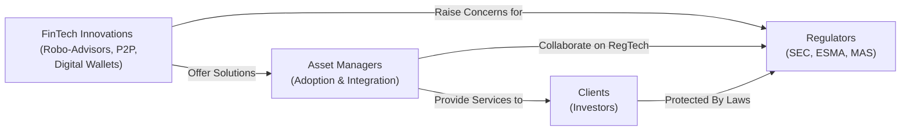

## The Evolving Intersection of FinTech and Regulation

It’s funny how quickly technology shakes things up in our industry, right? Not long ago, portfolio managers relied almost exclusively on face-to-face meetings and plain old spreadsheets. Well, maybe it was more than a decade ago, but still—it feels like just yesterday. Today, FinTech innovations like robo-advisory platforms, peer-to-peer transactions, digital wallets, and cryptocurrency trading tools are drastically reshaping how we build portfolios and interface with clients. 

These new tools also create brand-new regulatory puzzles. Even if you’re just dipping your toes into advanced portfolio management, it’s worth understanding how FinTech is intersecting with rules and guidelines set by global agencies like the US Securities and Exchange Commission (SEC), the European Securities and Markets Authority (ESMA), or the Monetary Authority of Singapore (MAS). As you move toward more sophisticated roles (which might be your near future if you’re reading this in a CFA context!), you’ll likely discover that harnessing innovation while respecting regulatory obligations is an absolute must. 

Below, let’s explore this thrilling intersection between FinTech’s promise and the regulatory frameworks that shape (and sometimes challenge) the development and application of new technology in portfolio management.

## Emerging FinTech Solutions Influencing Portfolio Management

A lot of folks pioneering FinTech solutions claim they’re reinventing finance from the ground up. While that might be a stretch, there’s no denying these tools are changing our daily workflows:

• Robo-Advisory Platforms: Algorithm-driven platforms that automate much of the client profiling, portfolio construction, and rebalancing process. They use optimization models (discussed in previous sections like 15.2 on Machine Learning and Algorithmic Portfolio Optimization) to streamline decision-making, reduce human error, and cut costs.  
• Peer-to-Peer (P2P) Lending Networks: Online marketplaces allowing individuals to lend to, or borrow from, each other directly, bypassing traditional banks. From a portfolio perspective, P2P lending can be an alternative asset class with its own yield curve quirks and default risk.  
• Digital Wallets and Payment Systems: Think “all-in-one” apps that manage different forms of currency, both fiat and digital, and allow quick transfers and payments.  
• Tokenized Securities: Equities, bonds, or other assets are “tokenized” for easier fractional trading and potentially global access. Some of these are still evolving under pilot regulatory frameworks.  
• AI-powered Risk Assessment: Tools that scan huge data sets in real time to evaluate market risk, credit risk, or operational risk (see Chapter 6: Introduction to Risk Management for more about risk processes).

Anyway, the reason these solutions matter is that they can amplify efficiency and market accessibility, but they also pose new regulatory concerns: data privacy, algorithmic bias, compliance with AML (Anti-Money Laundering) and KYC (Know Your Customer), and so on. 

## The Core of Global Regulatory Frameworks for FinTech

Because FinTech spans so many business models (payments, lending, investing, etc.), the regulatory environment is, to put it mildly, complicated. Regulatory bodies worldwide aim to protect investors, ensure market integrity, and promote innovation—sometimes a tough balancing act, as any compliance officer will tell you.

• Investor Protection: SEC, ESMA, and MAS all emphasize that platforms—robo-advisors, especially—must deliver suitable recommendations and transparent disclosures. In many jurisdictions, this is known as the “suitability requirement.”  
• Data Privacy: Regulations such as the European General Data Protection Regulation (GDPR) require robust data protection. If you’re using big data analytics (as we discussed in 15.6 on the Role of Big Data in Security Selection), you need proper user consent and strong encryption protocols.  
• System Integrity: Regulators also monitor whether platforms are resilient to cyber threats or hardware malfunctions (refer to Chapter 6.13, Cybersecurity Risk in Portfolio Management). The ever-increasing reliance on cloud-based technology means system outages can snowball into significant disruptions.  

One of the best ways to visualize how these pieces fit together is to see how FinTech interacts with Regulators, Asset Managers, and Clients. Let’s illustrate that:



In the diagram above:  
• FinTech developers present tools (top-left node), which both managers and regulators must evaluate.  
• Asset managers want to incorporate these tools effectively to enhance client experience (top-right node).  
• Regulators ensure compliance and investor protection (right node).  
• Ultimately, clients remain at the heart of the ecosystem (bottom node).

## RegTech: Automation Tools for Compliance

As FinTech solutions expand, the complexity of regulatory compliance also grows. That’s exactly where RegTech solutions come in. 

RegTech taps into AI, natural language processing (NLP), and big data analytics to fast-track compliance tasks. For example:

• AML/KYC Automation: Digital identity verification, facial recognition, and pattern detection in transactions can quickly flag suspicious activity.  
• E-Discovery Tools: AI-based scanning of emails, instant messages, or voice logs to detect potential market abuse or insider trading.  
• Automated Reporting: Tools that pull compliance data from various systems into regulatory filings that are up to date and error-free.

### Python Snippet Illustrating Simple Pattern Detection

Below is a very simplified (and definitely not production-ready) example of a Python function that uses a naive pattern detection approach for transaction monitoring:

```python
import re

def detect_unusual_payments(descriptions):
    # Regex to detect flagged terms like "crypto" + big amounts
    pattern = re.compile(r"crypto.*(1[0-9]{4,})")  # e.g., amounts 10000+
    alerts = []
    for desc in descriptions:
        if pattern.search(desc.lower()):
            alerts.append(f"ALERT: Potential large crypto transaction found -> {desc}")
    return alerts

transactions = [
    "Transfer: InnovativeCrypto 15000",
    "Payment: grocery 120",
    "Remittance: crypto deposit 9950",
]

found_alerts = detect_unusual_payments(transactions)
for alert in found_alerts:
    print(alert)
```

In real-world enterprise systems, these solutions operate on a much larger scale, often analyzing huge streams of data in near real-time. But the concept stays the same: use AI or pattern recognition to spot trouble so compliance teams can spend more time investigating real issues instead of chasing down false positives manually.

## Cybersecurity Protocols for Digital Client Accounts

It’s hardly a secret that we’ve seen more cybersecurity threats as finance goes digital. From a regulatory standpoint, institutions must:

• Deploy robust encryption and multi-factor authentication for online platforms.  
• Conduct routine penetration tests and vulnerability scans to detect system weaknesses early.  
• Implement advanced intrusion detection systems that use AI to spot anomalies in network traffic.

Many of these protocols reflect guidelines from Chapter 6.13, where we discuss cybersecurity risks. In FinTech, however, the emphasis is even bigger—especially for retail-targeted apps. Regulators want to ensure that everyday investors are not left vulnerable, for example, if a robo-advisor’s password reset process has a gaping flaw. 

## Designing User-Friendly Platforms While Meeting Suitability

Perhaps the biggest challenge is reconciling ease of use with compliance. You want an intuitive platform. But the moment your user logs in, you must verify their identity, gather risk tolerance info, confirm KYC details, and ensure they read disclaimers. Sounds complicated? It can be. 

Many regulators have published guidelines for digital advisory interfaces, such as requiring:

• Clear disclaimers about algorithmic recommendations.  
• Educational materials explaining investment risks.  
• Surveys on risk tolerance, liquidity needs, and investment objectives.  

In Chapter 4 (Portfolio Planning and Construction), we talk about the importance of the Investment Policy Statement (IPS). As more of that process shifts online, suitable risk profiling remains crucial—particularly in the robo-advisor context. The user interface must prompt the right questions, route the occupant to the right portfolio models, and keep compliance officer sign-offs on file for record-keeping.

## Regulatory Sandboxes for FinTech Innovations

Now, let me share a quick personal anecdote. A few years back, I chatted with a FinTech startup founder who was super excited about launching a new portfolio rebalancing tool with AI-driven macros. He had everything lined up: a robust back-end, a sleek user front-end, but little idea how to meet compliance. Enter the concept of regulatory sandboxing!

A regulatory sandbox is a controlled environment set up by agencies like the FCA in the UK, MAS in Singapore, or the Hong Kong Monetary Authority. It allows startups and incumbents to test new ideas with real users but with certain guardrails. While in the sandbox, the FinTech can refine its product, gather user feedback, and address compliance issues before a full-scale rollout.

### Benefits of Regulatory Sandboxes

• Close collaboration with regulators reduces the risk of costly compliance oversights.  
• Potential for adapted or “lighter” rules during testing, provided robust consumer protection is in place.  
• Opportunity for the regulator to learn how new technologies behave in the market, shaping future policies.

Ultimately, the synergy that emerges from these sandboxes can accelerate innovation without harming investors. 

## Fostering Ongoing Dialogues Among Stakeholders

The pace of FinTech acceleration makes it nearly impossible for existing regulations to be perpetually up to date. That’s why dialogue is crucial:

• Continuous Engagement: Frequent discussions between asset managers, startups, and regulators help identify potential blind spots or friction points.  
• Industry Consortiums: Groups like the Global Financial Innovation Network (GFIN) can provide testbeds for cross-border cooperation.  
• Working Groups: Lawyers, compliance officers, AI experts, and product designers working in tandem can craft solutions that are innovative but still consistent with the requirements of major oversight bodies like the SEC or ESMA.

## Best Practices and Common Pitfalls

When adopting FinTech solutions, do keep these best practices and pitfalls in mind:

Best Practices  
• Thorough Vendor Due Diligence: If you’re integrating a third-party platform, verify it meets data security standards, has robust business continuity plans, and offers well-documented compliance.  
• Incremental Rollouts: Often it’s safer to pilot new tools with a subset of users before you open the floodgates to everyone in your client base.  
• Education and Training: Staff (particularly compliance teams) must understand how the technology works to spot anomalies or potential regulatory breaches quickly.

Common Pitfalls  
• Over-Reliance on Automated Tools: Algorithms are not perfect. If your robo-advisor or risk modeling system is flawed, it can lead to systematic misallocation of assets or compliance errors.  
• Neglecting Ethics: Technology evolves quickly, but ethical (and social) consequences matter. For instance, an AI-driven “credit scoring” model might inadvertently discriminate.  
• Complacency with Updates: Regulations shift (like new data privacy rules), and ignoring these changes or failing to update platform security is a recipe for fines or enforcement actions.

## Exam Relevance and Final Advice

On the CFA exams—especially in constructed-response or item sets—expect scenario-based questions where a FinTech platform is introduced to a firm’s portfolio management process. You may be asked to:

• Identify compliance gaps in a hypothetical robo-advisory solution.  
• Recommend steps to integrate a new technology while satisfying best-execution or fiduciary responsibilities.  
• Evaluate the potential operational, legal, or cybersecurity risks.  

Practical tips for exam success:

• Stay on top of broad, global regulatory frameworks. (Even though local rules differ, exam questions typically test universal principles of investor protection, system integrity, and risk management.)  
• Know how to approach KYC/AML compliance in a digital environment.  
• Understand the concept of regulatory sandboxes and how they might appear as a test environment for new ideas.  
• Familiarize yourself with the key differences between face-to-face advisory obligations and a robo-advisor’s disclaimers, especially around suitability, custodial risk, and conflict of interest disclosures.

Being able to articulate these points (in concise, well-structured paragraphs for the constructed-response portion) is crucial. Consider referencing prior chapters (like 6 on Risk Management Frameworks and 4 on Portfolio Planning) to demonstrate integrated knowledge. The more you show that you can connect the dots, the more likely you are to nail exam questions on integrated FinTech topics.

## References

• Arner, D. W., Barberis, J., & Buckley, R. P. (2017). “FinTech, RegTech, and the Reconceptualization of Financial Regulation.” Northwestern Journal of International Law & Business.  
• World Economic Forum. (2020). “The Global FinTech Landscape.”  
• CFA Institute. (2021). “FinTech and RegTech: Building a Compliant Future for Asset Managers.”

## Quiz: Mastering FinTech and Regulatory Considerations



### Which of the following statements best describes the role of robo-advisors in modern portfolio management?

- [ ] They replace human advisors entirely in all aspects of portfolio management.
- [x] They leverage algorithms to automate parts of portfolio construction and rebalancing under regulatory guidance.
- [ ] They act solely as marketing tools without offering investment advice.
- [ ] They only handle client onboarding functions.

> **Explanation:** Robo-advisors automate many aspects of portfolio construction using algorithms and data-driven insights, yet they still must comply with suitability and fiduciary standards. They do not fully replace human oversight or regulatory obligations.

### A firm is implementing a new peer-to-peer (P2P) lending platform. Under regulatory guidelines, which of the following is a key focus area?

- [x] Ensuring AML/KYC compliance is conducted on lender and borrower accounts.
- [ ] Exclusively focusing on marketing campaigns to attract new users.
- [ ] Reducing the number of disclosures to save on administrative costs.
- [ ] Eliminating all human oversight in credit risk decisions.

> **Explanation:** AML/KYC compliance remains essential for P2P platforms to prevent illicit activities. Regulators prioritize investor and market protection, which includes rigorous identity and transaction verification.

### What is a common purpose of a regulatory sandbox in the FinTech context?

- [x] Allowing firms to test new products with real customers while under flexible regulatory supervision.
- [ ] Prohibiting any new technological innovations.
- [ ] Ensuring that only established banks can launch FinTech solutions.
- [ ] Punishing startups that fail to meet strict compliance standards in their first product launch.

> **Explanation:** Regulatory sandboxes let FinTech innovators trial novel products in a controlled environment, offering a balanced level of regulatory oversight and customer protection while giving them time to refine compliance measures.

### In designing a robo-advisory interface, which measure helps ensure the suitability of recommendations?

- [x] An integrated questionnaire assessing client risk tolerance, liquidity needs, and investment objectives.
- [ ] Eliminating disclosures to provide a seamless user experience.
- [ ] Reducing the number of portfolio models to avoid confusion.
- [ ] Only collecting data on the client’s preferred trading frequency.

> **Explanation:** Suitability means matching investment advice to the client’s objectives, risk tolerance, time horizon, and other personal factors. A thorough questionnaire is essential to meet this regulatory requirement.

### A FinTech platform merges big data analytics with machine learning to identify suspicious transactions. Which element should be included to address global data privacy laws?

- [x] Clear user consent and robust data encryption protocols.
- [ ] Automatically sharing all transaction data with third parties.
- [x] No requirement to inform customers about data collection.
- [ ] A policy stating that the platform is not responsible for data leaks.

> **Explanation:** Global data privacy regulations (like GDPR) emphasize user consent, transparency about data usage, and strong data encryption. Firms must secure data and be accountable for any breaches.

### Which of the following describes a risk when over-relying on algorithmic decision-making in portfolio management?

- [x] Systematic biases or flawed assumptions might lead to suboptimal asset allocations.
- [ ] A manual override is always implemented automatically.
- [ ] No rebalancing is required because the algorithm is always accurate.
- [ ] Market conditions will never change, so once coded, the model never needs updating.

> **Explanation:** Algorithms depend on the quality of data and assumptions built into them. If these are flawed, systematic misallocations can happen, especially in dynamic market conditions.

### When adopting a RegTech solution for AML/KYC, which of the following is a valid benefit?

- [x] Rapid identification of high-risk customers through pattern recognition.
- [ ] Complete elimination of compliance officer roles.
- [x] No internal audits needed once the system is in place.
- [ ] Permanent exemption from regulatory fines.

> **Explanation:** RegTech can automate suspicious transaction detection and allow compliance teams to focus on higher-level analysis. However, it doesn’t eliminate the need for oversight, audits, or potential damages if misused.

### Why is cybersecurity particularly critical for digital wallets and online brokerage accounts?

- [x] These platforms store sensitive financial information that can be exploited if compromised.
- [ ] There is no regulatory guidance for digital products.
- [ ] Clients never expect data encryption.
- [ ] They only manage small sums, so it’s less of a concern.

> **Explanation:** Digital financial accounts carry significant risk if breached. Secure authentication, encryption, and monitoring are crucial to meet regulatory expectations and protect client assets.

### How do ongoing dialogues between technology providers, asset managers, and regulators benefit the FinTech ecosystem?

- [x] They help identify gaps in existing regulations and encourage adapting policies to new technological realities.
- [ ] They frequently lead to a complete shutdown of FinTech projects.
- [ ] They are only necessary for large multinational banks.
- [ ] They eliminate the need for legal counsel.

> **Explanation:** As FinTech evolves, continuous interactions among stakeholders ensure that new products align with legal frameworks and investor protection goals, and that regulations remain useful and relevant.

### True or False: Regulatory sandboxes can grant “lighter” rules to FinTech startups as long as consumer protection is assured.

- [x] True
- [ ] False

> **Explanation:** Sandboxes do offer a testing ground with adjusted regulatory requirements—provided that appropriate controls are in place to protect consumers and maintain market integrity.


