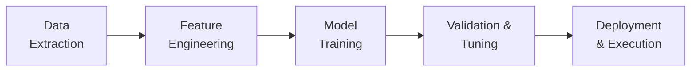

## Introduction

You know that thrill you get when you fiddle with a new puzzle and suddenly the pieces snap into place? Well, that’s how it often feels when leveraging machine learning and algorithmic portfolio optimization in finance. It’s like discovering a powerful new set of tools—ones that can sift through mountains of market data and (hopefully) tease out valuable signals. But let’s be honest, it’s not magic. It’s a meticulous process involving data handling, careful model-building, endless validation, and a healthy dose of caution. If you’ve ever been tempted by claims like, “Our algorithmic strategy doubles returns every month,” well, let’s just say you’ll want to read on and discover how to separate hype from reality.

In this section, we’ll dig into the fundamental concepts of machine learning as applied to portfolio strategy design: supervised vs. unsupervised learning, how data informs algorithmic trading, common pitfalls (like overfitting), and the role of model regularization and hyperparameter tuning. We’ll also chat about backtesting best practices and ethical considerations. By the end, you’ll (hopefully) have a sense of how these fancy algorithms can help shape well-crafted, robust, and ethical portfolio strategies.

## Machine Learning Basics in Finance

Machine learning (ML) is a subset of artificial intelligence that focuses on algorithms learning patterns from data, rather than following explicit programming instructions. For the average portfolio manager exploring advanced quantitative methods, ML is a dynamic toolkit that helps detect non-obvious relationships among securities, risk factors, macroeconomic variables, or even news sentiment. Compared to traditional linear models—like the CAPM expansions you might have seen in Chapter 3—machine learning models can capture complex interactions, non-linearities, and adapt to changing market conditions if used carefully.

### Supervised vs. Unsupervised Learning

• Supervised Learning: The algorithm trains on labeled data. For example, you might use historical stock returns as “labels” and a set of factors—like momentum, value, or even sentiment scores—as “features.” You then “teach” the model to predict future returns or the probability of outperformance. Classic algorithms here include regression models (like linear or Ridge regression), random forests, gradient boosting machines, and neural networks.  
• Unsupervised Learning: In unsupervised learning, the algorithm finds structures or patterns in unlabeled data. You might use clustering techniques to detect groups of securities with similar risk-return characteristics, or to spot structural breaks in correlation matrices (tying nicely to Chapter 2 and 3 on correlation and risk). This can be especially fruitful for factor discovery (which factor combos actually exist beyond the typical “value vs. growth”?).

Anyway, with the swirl of data these days, from real-time prices to textual news, having the right approach to data ingestion and preparation is often more important than which machine learning model you pick. 

## Algorithmic Trading and Large Datasets

Algorithmic trading refers to the systematic execution of trades based on predetermined rules or signals generated by computer programs. Machine learning supercharges these algorithms by detecting subtle patterns in massive datasets. You can incorporate fundamentals, market microstructure signals (from high-frequency data), and macro indicators to create an integrated trading engine.

However, big data can be a blessing and a curse. Sure, it’s a goldmine of market insights—but it’s also rife with noise, outliers, and incomplete entries. In some of my earliest ML experiments with equity data, I found that adding more and more historical factors didn’t necessarily yield better performance—sometimes it just led me astray with spurious correlations. The deeper question is always: “Is there an economically meaningful relationship or is this just random pattern matching?”

To manage the data responsibly, you’ll want:

• A robust data cleaning and validation process.  
• Methods for handling outliers (like winsorizing or capping extreme observations).  
• Clear definitions for all features. (Don’t just say “momentum factor”—be sure exactly how you’re calculating it.)  
• Consistent data frequency (e.g., daily vs. monthly).  

## Typical Optimization Objectives

So you have all this data, and your fancy ML engine is humming along. What are you optimizing for? Several classic objectives:

• Maximize Risk-Adjusted Returns: Strategies like maximizing the Sharpe ratio or an information ratio measure how well you’re compensated per unit of risk.  
• Minimize Drawdown: Target stable returns by setting constraints on maximum drawdown or employing tail-risk measures (see Chapter 2 for various risk measures).  
• Factor Exposures: You might aim for certain factor tilts (value, momentum, low volatility, ESG, etc.) while controlling exposures to other unwanted risk factors.

From a machine learning perspective, you can configure your loss function (the function the model tries to minimize) to align with your real-world objective. For instance, if you dislike large downside surprises, use an asymmetric loss function that penalizes big negative outcomes more severely than equally large positive ones. There’s a direct parallel to the concept of downside deviation in Chapter 2.8.

## Overfitting and the Data Split Approach

Overfitting is one of the biggest gotchas. It happens when your model is too perfectly fitted to noisy or idiosyncratic historical data—so it performs brilliantly in-sample, yet flops in real markets. If you’ve ever gotten unreasonably excited by a backtest with a near-straight-up equity curve and minimal drawdowns (with small sample sizes), you might have succumbed to the siren call of overfitting.

A critical defense is splitting data into:

1. Training Set: Where the model learns patterns.  
2. Validation Set: Used for model selection and hyperparameter tuning.  
3. Test Set: “Held-out” data that the model never sees until final evaluation.

Be firm with yourself: the test set is strictly off-limits during training. This design helps gauge how well your shiny model might respond to new, unseen data. You’ll also want to do multiple runs or cross-validation to ensure your performance isn’t a fluke (random chance or specific to your chosen time period).

## Regularization Techniques

Okay, so you want to fight overfitting. One powerful approach is regularization—basically applying a penalty on larger parameter values to keep the model simpler and discourage it from memorizing noise.

• Lasso (L1 Penalty): Adds an absolute value penalty on coefficients, often driving many coefficients to zero. This is super handy for feature selection, whittling down a large factor set to the truly impactful few.  
• Ridge (L2 Penalty): Adds a squared error penalty, effectively shrinking coefficients toward zero without eliminating them entirely.  
• Elastic Net: A combination of L1 and L2 penalties that can yield a balance of both worlds.

In practice, you might grid search a small set of penalty parameters to see which yields the best out-of-sample performance. We’ll talk more on hyperparameter tuning in a moment, but it’s common to vary the regularization parameter \\(\lambda\\), see which tune is best on your validation set, then confirm it holds up on the test set.

## Hyperparameter Tuning

Hyperparameters are the “knobs and dials” that you, the modeler, control but the algorithm itself doesn’t optimize. Examples: the maximum depth of a decision tree, the number of neurons in a hidden layer, or the learning rate in gradient boosting. 

Common tuning methods:

• Grid Search: Exhaustively tries all combinations of hyperparameter values (fine if your parameter space is small).  
• Random Search: Randomly picks hyperparameter sets, often more efficient if you have many dimensions to explore.  
• Bayesian Optimization: Iteratively narrows down promising hyperparameter regions. This approach uses a probabilistic model to guess which parameter combination might yield the best improvement.

In all these approaches, you’re basically seeking a sweet spot that adequately captures real signal without overfitting. You might use cross-validation to measure consistency of results across multiple folds of training data. 

## Backtesting and Implementation

So your model is tuned and ready: now is the time for backtesting. Backtesting is the process of simulating your strategy with historical market data. This step can be a reality check—and it’s easy to get it wrong. Folks can forget to:

• Account for transaction costs. (Spread, market impact, commissions—these can kill an apparently robust strategy.)  
• Incorporate realistic liquidity constraints. (You can’t always flip large positions in illiquid markets with no slippage.)  
• Avoid look-ahead bias (using future information in your earlier periods).  
• Consider risk of regime shifts (markets can behave differently in bull vs. bear environments).

One helpful practice is “walk-forward analysis,” reminiscent of how you might re-estimate models and constraints at regular intervals in the real world. Overly perfect backtests can lure you into a false sense of security, so always test your strategy under different macro conditions and see how it behaves. You can also compare your results to simpler, more transparent benchmarks such as buy-and-hold or factor-based indexing. 

Below is a simple Python snippet showing how you might build a Ridge regression model to predict daily returns. Note that this is a toy example, and in real practice you’d have more robust data structures, rolling windows, and factor sets:

```python
import pandas as pd
import numpy as np
from sklearn.linear_model import Ridge
from sklearn.model_selection import train_test_split

# forward_return is the next day’s return that we want to predict.

train_df, test_df = train_test_split(df, test_size=0.2, shuffle=False)

X_train = train_df.drop('forward_return', axis=1)
y_train = train_df['forward_return']
X_test  = test_df.drop('forward_return', axis=1)
y_test  = test_df['forward_return']

ridge_model = Ridge(alpha=0.1)
ridge_model.fit(X_train, y_train)

predictions = ridge_model.predict(X_test)

mse = np.mean((predictions - y_test)**2)
corr = np.corrcoef(predictions, y_test)[0,1]
print(f'MSE: {mse}, Corr: {corr}')
```

In advanced scenarios, your pipeline will also incorporate hyperparameter tuning and more thorough cross-validation. Once validated, you’d feed predictions into a portfolio construction layer—maybe weighting positions based on predicted alpha or risk contribution. Then you’d set up robust execution algorithms to handle real-world trading constraints.

## Ethical and Transparency Considerations

Oh boy, the ethics side is crucial. ML can automate investment decisions, but that doesn’t mean you can skip accountability. Clients ultimately rely on you—the portfolio manager—to ensure:

• Fairness: Avoid inadvertently discriminating against certain investment categories or stakeholder groups if that goes against your mandate or any regulatory directives.  
• Transparency: Clients deserve to understand, at least at a high level, how the model works and why certain investments are picked or removed.  
• Validity: If your model has a big data leak or is systematically using inside information (even unknowingly), that’s a violation of the CFA Institute Code of Ethics (and potentially law).  

Moreover, from a fiduciary standpoint, be sure you document your processes so that stakeholders (and regulators) can see how decisions were derived. This fosters trust and often leads to better scrutiny of your inputs and assumptions. 

## Putting It All Together

Bringing machine learning into portfolio management can feel both exhilarating and daunting. The trade-off is always between complexity and interpretability. The more complicated your models become, the more you have to invest in diligence—like thorough out-of-sample testing, robust risk management (see Chapter 6), and ongoing monitoring. Remember that markets evolve, sometimes abruptly. A model that excelled last year could struggle in a new macro regime.

One of the most valuable lessons I learned early on is that no matter how advanced my algorithm or how big my data, I needed solid domain insights: knowledge of factors, fundamental logic, and a sense of how markets truly operate. Machine learning is a helpful complement to your existing toolkit for analyzing fundamentals, technicals, or macro trends. It’s best viewed as an extension, not a replacement, for that good old-fashioned investment intuition.

## Final Exam Tips

• Understand Overfitting: Examiners often test your ability to identify signals of overfitting or how to mitigate it with training/validation splits.  
• Justify Model Complexity: You should be able to explain why you used a certain ML model. “Because it gets a good backtest” might not be sufficient in a constructed response question.  
• Incorporate Production Realities: Show how you account for transaction costs, liquidity demands, and data frequency issues—these are hot points on item set questions.  
• Ethical & Regulatory Compliance: The exam can have scenario-based questions about data usage, front-running, or inadvertently biased algorithms. Always align with the CFA Institute Code and Standards.  
• Provide Clear Explanations: In essay/constructed-response sections, articulate how your portfolio optimization approach lines up with your firm’s IPS or client constraints—link to earlier chapters on the Investment Policy Statement (Chapter 4).  

## Glossary

• Overfitting: A model fitting noise in the historical data, resulting in poor performance on new data.  
• Regularization: Adding penalties (L1 or L2) to discourage overly complex models.  
• Backtesting: Testing a trading strategy on historical data to estimate performance.  
• Hyperparameter Tuning: Optimizing settings that govern how an algorithm learns (learning rate, tree depth, etc.).  
• Supervised Learning: ML approach with labeled data (input-output pairs).  
• Unsupervised Learning: ML approach with unlabeled data, focusing on discovering structure.

## References

• [CFA Institute: “Machine Learning Primer”](https://www.cfainstitute.org/)  
• Hastie, T., Tibshirani, R., & Friedman, J. (2009). The Elements of Statistical Learning. Springer.  
• Lopez de Prado, M. (2018). Advances in Financial Machine Learning. Wiley.  

Below is a small flowchart illustrating a typical workflow in ML-driven portfolio construction:



It might look straightforward, but each step has plenty of nitty-gritty details to get right.

---

## Test Your Knowledge: Machine Learning and Algorithmic Portfolio Optimization



### Which of the following best describes overfitting in machine learning?

- [ ] A model that ignores crucial features in the dataset.  
- [ ] A model that performs equally on both training and test sets.  
- [x] A model that is too closely aligned with historical noise, harming out-of-sample performance.  
- [ ] A model that always predicts negative returns.  

> **Explanation:** Overfitting happens when your model latches on to random fluctuations or noise in past data. It usually shows impressive training performance but flounders on unseen (test) data.

### Which statement best exemplifies a supervised learning approach in financial modeling?

- [x] Training a regression to predict future stock returns using labeled historical returns.  
- [ ] Clustering similar stocks based on fundamental ratios without prior labels.  
- [ ] Creating an unsupervised model that labels data.  
- [ ] Using stop-loss orders in day trading.  

> **Explanation:** Supervised learning explicitly uses labeled data, such as historical returns, to teach the model what “correct answers” look like.

### When attempting to minimize overfitting, which of the following techniques would be most relevant?

- [ ] Using a leveraged buyout model on equity data.  
- [x] Splitting your dataset into training, validation, and test sets.  
- [ ] Only relying on in-sample results.  
- [ ] Training the model once and never retesting.  

> **Explanation:** A robust train-validation-test split is key to detecting when a model overly fits the training data.

### What is a primary purpose of regularization in machine learning?

- [ ] Maximizing returns during volatile market periods.  
- [ ] Eliminating the need for feature engineering.  
- [ ] Improving the speed of the backtest.  
- [x] Preventing the model from becoming too complex and overfit.  

> **Explanation:** By imposing penalties on large coefficient values, regularization discourages complexity that can lead to overfitting.

### Which type of hyperparameter tuning systematically searches a reduced number of random parameter settings?

- [ ] Grid Search.  
- [x] Random Search.  
- [ ] Reinforcement Learning.  
- [ ] Manual Tuning.  

> **Explanation:** Random Search picks hyperparameters at random from a specified distribution and can be more efficient than exhaustive (grid) searches for large parameter spaces.

### In a backtesting environment, looking ahead at future data that would not have been available at the time of a trade decision is known as:

- [ ] Data snooping.  
- [ ] Regime switching.  
- [x] Look-ahead bias.  
- [ ] Hidden Markov modeling.  

> **Explanation:** Look-ahead bias occurs when the model uses information from the future that wouldn’t have been known in real time, artificially boosting performance.

### Suppose you are constructing a machine learning model to select stocks with certain factor exposures. Which best practice should you follow?

- [x] Include transaction cost assumptions in your backtest.  
- [ ] Always assume zero transaction costs for simplicity.  
- [x] Evaluate whether your factor signals are economically sensible.  
- [ ] Only rely on in-sample performance.  

> **Explanation:** Factoring in realistic costs and confirming economic rationale are both critical to robust ML-based strategies. Also, ignoring transaction costs can lead to overly optimistic results.

### Which of the following statements about Bayesian optimization in hyperparameter tuning is correct?

- [x] It uses a probabilistic model to iteratively search for the most promising hyperparameter region.  
- [ ] It cycles through every possible parameter combination exhaustively.  
- [ ] It ignores prior evaluations of hyperparameters.  
- [ ] It is identical to random search.  

> **Explanation:** Bayesian optimization relies on a probabilistic framework for informed exploration of hyperparameters, seeking the best improvement while leveraging past evaluations.

### Your ML model achieves a 90% success rate in predicting daily direction of an illiquid microcap stock. The test set is small, and the stock has significant bid-ask spreads. Which is the most likely explanation?

- [ ] The model discovered a truly reliable signal with zero cost.  
- [x] The model is overfitted; actual net returns could be compromised by high trading costs.  
- [ ] The microcap’s liquidity ensures ample volume for large trades.  
- [ ] The model’s performance is definitely robust once in live trading.  

> **Explanation:** Such high accuracy on a small, illiquid security is typically a red flag for overfitting. High spreads can further erode any potential profit.

### Is transparency in data usage and algorithmic decisions important under the CFA Institute Code and Standards?

- [x] True  
- [ ] False  

> **Explanation:** Yes. The Code and Standards emphasize fiduciary duties and client interests, requiring clarity and honesty in how investment recommendations or trades are generated, including key assumptions in machine-learning-based methods.




