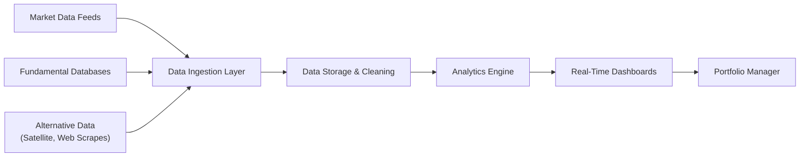

## Overview and Context

I vividly remember the first time I saw a real-time dashboard of an equity portfolio. I was somewhat dazzled by those flickering price charts and rolling news feeds. It felt like stepping into the cockpit of a supersonic jet—it was thrilling, but also a bit intimidating. And this experience taught me one very important lesson: data analytics tools are no longer a “nice to have” but rather a vital piece of the puzzle for effective portfolio monitoring.

In today’s investment world, portfolio managers, risk analysts, and traders need immediate feedback and continuous insights. Data analytics platforms help them measure performance, attribute returns, and detect threats—like an unexploded risk lurking in a corner no one bothered to check. Combined with real-time data feeds and advanced dashboards, these platforms empower us, as practitioners, to play both offense and defense at the same time. Below, we’ll explore some of the key tools, techniques, and best practices you need to know.

## Range of Data Analytics Platforms for Real-Time Portfolio Tracking

Data analytics platforms come in many shapes and sizes, ranging from Python-based open-source solutions to commercial off-the-shelf (COTS) software tailored for investment management. Let’s quickly walk through some common categories:

• Python-Based Dashboards: Tools like Dash (by Plotly) or Streamlit let you build customized, interactive web dashboards. You can pull live pricing data from APIs, run sophisticated calculations in Python, and serve results via a sleek user interface. It’s like having a personal cockpit you design yourself.  
• Specialized Portfolio Analytics Software: This might include Bloomberg Portfolio & Risk Analytics, FactSet, or MSCI’s BarraOne. These enterprise-level platforms typically provide integrated data feeds (equities, fixed income, derivatives, alternative data), robust risk models, and flexible attribution tools.  
• Cloud-Native BI Solutions: Providers such as AWS QuickSight or Microsoft Power BI also enable real-time data refresh, easy-to-use visualization, and enterprise-level security. These solutions are great if your firm uses a broader suite of productivity software and wants everything in one ecosystem.

In practice, many firms combine these approaches. For instance, you might use a specialized system for advanced risk analytics and factor modeling, while leveraging a Python-coded tool for custom scenario analyses. The choice often depends on budget, the desired speed of customization, and your technical expertise.

## Portfolio Analytics: Performance, Attribution, Risk, and Factor Exposures

The next big question is: what do we actually measure once we have real-time analytics running? In a nutshell, you can track almost everything, but let’s focus on the critical areas:

• Performance Measurement: This includes time-weighted returns, money-weighted returns, or other relevant metrics. Real-time monitoring helps you see if the portfolio is moving too far from expected benchmarks.  
• Attribution Analysis: This technique dissects your returns relative to a benchmark to identify whether gains/losses came from security selection or asset allocation—or whether they resulted from sector, style, or currency bets.  
• Risk Metrics: Continuous VaR (value at risk), standard deviation, and tracking error help you keep an eye on the portfolio’s variability. Stress tests and scenario analyses show how the portfolio might behave in extreme conditions.  
• Factor Exposures: For those into factor investing, real-time analytics can track how the portfolio is tilting toward factors like Value, Momentum, or Low Volatility. This helps you remain consistent with your investment thesis.

Monitoring these analytics is like checking your airplane’s altitude, airspeed, and direction in real time. Without live data, you’re flying blind, and that’s a surefire recipe for trouble.

## Automated Alerts and Dashboards to Facilitate Timely Decisions

Gone are the days (mostly) when portfolio managers retrieved data solely from end-of-day reports. Automated alerts and dashboards can notify you—or the entire investment team—when certain thresholds are breached or when anomalies arise.

• Threshold-Based Alerts: If your risk limits for a particular sector or position are exceeded, the system automatically pings you via email, text, or an app notification.  
• Rebalancing Signals: When actual allocations start to drift from target, a well-designed dashboard can trigger a prompt: “Hey, you’re out of alignment—maybe it’s time to rebalance?”  
• Liquidity Alerts: If a large block of shares in a thinly traded stock appears, the dashboard might signal an opportunity to buy or a risk to watch out for if you’re on the other side.

This real-time feedback loop shortens your reaction time so you can move quickly. Let’s be honest: if you wait a week to learn that an individual holding’s risk has ballooned, you might be in for a nasty surprise.

## Integration of Market Data Feeds, Fundamental Databases, and Alternative Data

An analytics engine is only as good as the data fueling it. We belong to a generation that can tap into an ocean of information—everything from standard market quotes to satellite imagery of parking lots. Here’s a closer look:

• Market Data Feeds: These include real-time quotes, trade-level data, order books, and more. The speed, coverage, and reliability matter a lot for time-critical strategies (like intraday trading or high-frequency approaches).  
• Fundamental Databases: Long-horizon investors rely on robust fundamentals: balance sheets, income statements, and macroeconomic indicators. Integrating these helps you see big-picture trends that might not appear in short-term price data.  
• Alternative Data: Sometimes referred to as “the new oil,” alternative data might include foot traffic analytics (via cellphone signals) or shipping volumes gleaned from satellite images. Using such data can provide unique insights—though it can be tricky to handle.  

Below is a simple diagram illustrating how these data sources might integrate into a centralized analytics platform:



In that pipeline, the data ingestion layer is responsible for bringing in various data streams, which then move into the storage layer for cleaning and standardization. The analytics engine then processes it all and presents outcomes in real-time dashboards. Simple in concept—trickier in practice, but definitely doable.

## Advanced Visualization Tools for Identifying Anomalies and Patterns

You can have the best data in the world, but if you can’t interpret it quickly, you’re missing the point. Advanced visualization tools, whether integrated into your Python-based stack or provided in commercial software, help you:

• Spot outliers: Maybe a single position is driving 90% of your daily volatility, or a sub-portfolio is ballooning in size.  
• Discover correlations: Visual heatmaps can reveal hidden relationships between assets, or show how correlation structures shift over time.  
• Monitor factor exposures: Factor “fingerprint” charts can let you see how your style tilts evolve as market conditions change.

If you’re dealing with large sets of time-series data—like trades, historical quotes, or real-time factor movements—visual dashboards are a game-changer. It’s not just about making graphs look pretty; it’s about presenting insights in a way that’s intuitive. That is how you spot a problem (or an opportunity) before it’s too late.

## Data Cleaning, Transformation, and Validation Best Practices

I’ll let you in on a little secret: data problems are surprisingly common. Even large institutional investors sometimes wrestle with mismatched tickers, incomplete corporate actions data, or weird formatting in text fields. To ensure reliable analytics, it’s essential to:

• Standardize Tickers: A single stock might be “AAPL” in one system and “Apple Inc.” in another. Develop a standardized naming convention for all securities.  
• Reconcile Sources: Cross-check positions and trades across multiple systems to detect duplication or omission.  
• Manage Missing Fields: For instance, you might have an interest rate measure missing for a particular bond. Decide how to handle it—estimate, disregard, or fill from another source.  
• Validate Corporate Actions: A sudden share split can cause portfolio weighting anomalies if your system doesn’t handle it correctly.

It might seem mundane, but all the fancy dashboards in the world won’t help if your underlying data is a mess.

## Regulatory Considerations for Data Management and Client Privacy

When building advanced analytics platforms, especially in a multi-jurisdictional context, it’s crucial to address compliance. For example:

• **Data Privacy**: The European Union’s General Data Protection Regulation (GDPR) restricts how you store and process personal data. Many other regions have similarly strict laws.  
• **Cross-Border Transfer**: If you’re operating globally, certain countries have rules defining how data moves in and out.  
• **Client Confidentiality**: If your platform includes custom client data (like portfolio holdings for high-net-worth individuals), you must ensure robust encryption and access controls.  

Stiff penalties can result from mishandling personal or confidential information, not to mention the reputational damage. So, it’s definitely not something you want to ignore.

## Stress Testing and Scenario Analysis in Analytics Platforms

Stress testing is a forward-looking technique meant to see how your portfolio performs under hypothetical but plausible conditions. If you recall the 2008 financial crisis or the more recent global volatility episodes, stress tests can be a serious lifesaver. Data analytics platforms usually incorporate:

• Historical Scenarios: Input data from major crises (e.g., the 2008 meltdown or the COVID-19 crash) to see how your current holdings would fare.  
• Hypothetical Scenarios: Construct “what-if” scenarios, such as an unexpected rate hike, a global pandemic, or a sudden oil-price shock.  
• Monte Carlo Simulations: Generate thousands of possible future market paths to gauge the distribution of outcomes (including tail risk).  

By loading these scenarios into your analytics environment, you can see vulnerabilities. Maybe your short volatility position is riskier than you initially thought, or maybe you’re overconcentrated in a certain sector. Acting on that intelligence ahead of time can help you rebalance or hedge effectively.

## Practical Example with Python Integration

Let’s outline a tiny snippet that demonstrates how you could pull data, perform a quick risk calculation, and visualize the output. This is a super-simplified version of real-world processes, but you’ll get the flavor:

```python
import yfinance as yf
import pandas as pd
import numpy as np
import matplotlib.pyplot as plt

tickers = ['AAPL', 'MSFT','TSLA']
data = yf.download(tickers, period='1y')['Adj Close']

returns = data.pct_change().dropna()

corr_matrix = returns.corr()

plt.imshow(corr_matrix, cmap='viridis', interpolation='nearest')
plt.title('Correlation Heatmap')
plt.colorbar()
plt.xticks(range(len(tickers)), tickers)
plt.yticks(range(len(tickers)), tickers)
plt.show()
```

This snippet fetches historical prices for a set of stocks, calculates returns, and prints out a basic correlation heatmap. Of course, in a full-blown environment, you’d integrate real-time data, store it in a proper database, and incorporate more advanced statistics.

## Final Exam Tips

• Practice Scenario Analysis: In the exam, you might get a scenario-based question requiring you to interpret how a portfolio’s performance or risk metrics evolve under certain conditions. Familiarize yourself with these frameworks so you can quickly identify potential pitfalls.  
• Link Analytics to Decision-Making: The exam often tests how you can turn data insights into actionable steps. Don’t just crunch numbers—explain how that knowledge informs rebalancing or hedging decisions.  
• Know Your Tools: A question might revolve around the pros and cons of a certain analytics framework or software package. Be prepared to outline strengths and weaknesses succinctly.  
• Mind the Ethics: The CFA Program loves to remind us that data privacy and client confidentiality are part of the deal. Expect at least one question that intersects performance analytics with ethical considerations.  
• Time Management: In multi-part item sets, you’ll need to tackle performance, attribution, factor analysis, and risk measures in a short time frame. Practice, practice, practice.

## References

• Fabozzi, F. J. (Ed.). (2018). Institutional Investment Management: Equity and Fixed Income Portfolio Analysis. CFA Institute Research Foundation.  
• PWC. (2020). “Data Analytics in Asset Management: Unlocking the Power of Big Data.”  
• Tufte, E. (2001). The Visual Display of Quantitative Information (2nd ed.). Graphics Press.

## Test Your Knowledge: Data Analytics Tools for Portfolio Monitoring



### Which of the following best describes attribution analysis?

- [ ] Establishing the cost basis of securities in a portfolio.  
- [ ] Tracking the impact of diversification on portfolio returns.  
- [x] Identifying sources of a portfolio’s returns relative to a benchmark.  
- [ ] Evaluating the success rate of short-selling strategies.  

> **Explanation:** Attribution analysis is specifically about understanding how different investment decisions (stock selection, sector allocations, factor tilts) contribute to portfolio performance against a benchmark.

### Which statement best captures why automated alerts are critical in modern portfolio management?

- [ ] They eliminate the need for periodic portfolio reviews.  
- [x] They notify managers instantly when risk or performance measures breach preset thresholds.  
- [ ] They are required by regulatory authorities to track insider trading.  
- [ ] They only apply to equity portfolios.  

> **Explanation:** Automated alerts help managers quickly spot and address deviations from predefined risk or performance boundaries, significantly reducing response times.

### What is the purpose of alternative data in portfolio analytics?

- [ ] To confirm compliance with GDPR and other privacy laws.  
- [x] To provide non-traditional insights that may reveal unique investment opportunities.  
- [ ] To merge client contact information with order data.  
- [ ] To replace the need for fundamental analysis completely.  

> **Explanation:** Alternative data (like satellite imagery or web-scraped data) gives a fresh perspective and can uncover opportunities that standard market and fundamental data might miss.

### When constructing a real-time analytics dashboard, why is data validation so important?

- [x] It ensures accuracy and consistency, preventing erroneous conclusions from faulty data.  
- [ ] It allows full automation of all trading decisions without human oversight.  
- [ ] It only matters if you use more than 20 data sources.  
- [ ] It is optional as systems usually auto-correct errors.  

> **Explanation:** Data validation ensures quality. Without it, even minor errors can distort complex analyses, leading to flawed conclusions and misguided trades.

### An investor wants to compare the actual active risk of a portfolio with its target risk parameters every hour. Which of the following tools or approaches would be most suitable?

- [ ] A monthly rebalanced Excel spreadsheet scenario.  
- [x] A real-time dashboard that integrates data streams and automatically calculates risk metrics.  
- [ ] A physical trading notebook kept by the portfolio manager.  
- [ ] A daily emailed PDF summary from a custodial bank.  

> **Explanation:** Real-time dashboards with streaming data are the best way to measure and compare current risk to target parameters in a timely manner.

### Which of the following is a proper example of best practice in data integration for analytics?

- [x] Consistently using a standard ticker mapping convention for the same securities across all data sources.  
- [ ] Ignoring data discrepancies because small errors do not affect overall portfolio returns.  
- [ ] Storing historical and real-time data in separate, unlinked silos.  
- [ ] Embedding personal client data into public dashboards to increase transparency.  

> **Explanation:** Standardizing tickers, reconciling data, and ensuring consistent naming conventions is crucial for accurate analysis.

### Why might a portfolio manager integrate stress testing capabilities into a data analytics platform?

- [ ] To simplify client reporting on realized returns.  
- [x] To evaluate how the portfolio would behave under extreme but plausible market conditions.  
- [ ] To avoid verifying the accuracy of benchmark returns.  
- [ ] To bypass legal requirements on cross-border data sharing.  

> **Explanation:** Stress testing is designed to simulate crisis or worst-case scenarios to see if the portfolio remains resilient, well-hedged, or if it needs adjustments.

### Which regulatory concern is particularly relevant when using large-scale, cloud-based analytics solutions?

- [x] Data privacy and potential restrictions on where client data can be stored or processed.  
- [ ] The system’s user interface design preferences.  
- [ ] Whether the software is updated daily by developers.  
- [ ] The correlation between client data and market data.  

> **Explanation:** When dealing with sensitive client information, adherence to data privacy laws (e.g., GDPR) and restrictions on cross-border data flows is paramount.

### What is the main advantage of employing advanced visualization tools?

- [ ] They guarantee an automatic increase in portfolio alpha.  
- [ ] They remove the need for risk management staff.  
- [x] They help you quickly identify outliers, trends, and correlations in complex datasets.  
- [ ] They prevent any data from becoming stale over time.  

> **Explanation:** Visualization tools highlight important data patterns and relationships, enabling faster and more informed decision-making.

### Real-time dashboards are most effective when combined with:

- [x] Automated alerts, integrated data feeds, and up-to-date risk models.  
- [ ] Quarterly statements and stale data sources.  
- [ ] Strict manual oversight with no data automation.  
- [ ] Single-factor analysis only.  

> **Explanation:** Real-time dashboards shine when powered by continuous data, integrated risk models, and automated alerts that respond instantly to changing market conditions.


