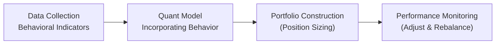

## Introduction

Sometimes, I find it helps to remember that the roots of behavioral finance involve really common human tendencies—like feeling extra pain when you lose money, or letting your own ego run wild after a series of winning trades. It’s, well, kind of amazing how these “little quirks” turn into big forces in the financial markets. That’s why we try to incorporate behavioral insights into quantitative models: to capture, or at least approximate, the psychological and emotional drivers that can lead to big market moves.

In this section, we’ll take a close look at how quantitative frameworks can account for biases such as overconfidence or loss aversion, and how they might incorporate signals from social media sentiment, news analytics, or even crowd psychology. We’ll also talk about the potential pitfalls—like building a complicated trading algorithm on data that can vanish as soon as everyone else starts using it. Let’s walk through the logic of weaving behavioral insights into your models, while making sure you keep a keen eye on risk.

## Integrating Behavioral Finance into Quantitative Models

Quantitative models aim to combine large datasets with statistical or algorithmic techniques to find patterns. But wait—markets aren’t just data streams; they’re people, too. Investors interpret news differently, fear losses more than they crave comparable gains, and can get overconfident after a hot streak. Behavioral finance explores how these biases and sentiments systematically influence decision-making.

Bridging this “people factor” with quant processes involves identifying reliable indicators that proxy for human emotions and behaviors. In practice, such indicators can be aggregated from:

• News analytics (e.g., is the coverage overly bullish or bearish?)  
• Social media sentiment (e.g., how often is a particular asset or theme trending?)  
• Volume shifts and unusual price spikes that hint at herding.  
• Consumer confidence indexes, which can reflect broader risk appetite.

When these metrics align or diverge in certain patterns, they can power strategies like going contrarian when bullish sentiment feels overdone, or riding momentum if the market experiences an exuberant wave (though that can be risky, too).

### Case Study: Social Media Trend Integration

Let’s say we have a colleague who’s convinced that analyzing social media chatter about a fashionable niche (it could be green energy, or even a certain blockchain project) will help predict short-term price movements. The colleague might build a model that scrapes daily tweets, identifies whether the tone is positive or negative, and then recommends a position in that asset. If the chatter is strongly positive, the model might suggest going long for a few days. Of course, there’s no guarantee this will work forever—social media signals can be noisy, and their predictive power might diminish as more people catch on. But it’s a straightforward example of how we might embed “behavioral signals” into a strictly numerical framework.

## Common Behavioral Biases Affecting Models

Quantitative strategies can be warped by behavioral biases if the people designing or using them aren’t mindful of these pitfalls. A few big ones often come up:

**Loss Aversion**  
Investors frequently experience the pain from a loss more severely than the pleasure from an equivalent gain. In a model, this might appear as an asymmetry in how investors exit positions. If your model doesn’t factor this in, you might underappreciate how quickly certain participants exit (or hold on in denial).

**Overconfidence Bias**  
In my early days of building factor models, I felt unstoppable when my backtests showed strong returns. But I got a rude awakening when market conditions shifted. Overconfidence can lead to excessive risk-taking and ignoring contradictory signals. Models themselves can be coded with overconfident assumptions—like unrealistic alpha estimates or ignoring large drawdowns in your stress testing.

**Herding and Groupthink**  
Herding is that “I better join the crowd” inclination, especially visible when markets panic or get greedy all at once. Groupthink leads to ignoring contrarian signals because of social or organizational pressures. Even a robust quant model can break down if the risk managers or the investment committee reflexively dismiss out-of-consensus outputs.

**Confirmation Bias**  
This is the filter we use to only see what confirms our pre-existing beliefs. If you’ve trained a machine learning model with your carefully curated dataset, unaware that you ignored data that contradicted your initial hypothesis, your model might be biased. It’s a subtle but powerful effect.

## Incorporating Sentiment Indicators

Sentiment indicators aim to measure that intangible “collective mood” of the market. There’s growing interest in harnessing large volumes of unstructured data—news articles, social media posts, or even AI-enabled analysis of corporate earnings calls—to gauge market vibe. Let’s discuss some ways to integrate these indicators into quant frameworks:

• **Textual Analysis**: By using natural language processing (NLP), you can parse the positivity or negativity of daily market commentary. Models might generate a “sentiment score” for each security or sector.  
• **Volume-Based Sentiment**: Sudden spikes in trading volume can be an early sign of crowd excitement (or fear). If accompanied by unusual price moves, it might indicate a short-term direction.  
• **Search Trends**: A rise in online search frequency for certain keywords (company names, commodities, or even cryptocurrencies) can indicate growing retail interest, which can push valuations beyond fundamentals.

When these sentiment measures deviate sharply from historical norms, a contrarian approach might be triggered (e.g., shorting a stock that’s gone parabolically high on hype). Alternatively, you might capture short-term momentum by riding that wave.

Below is a conceptual flowchart showing an example pipeline for building a sentiment-driven quantitative model:



## Adaptive Models and Shifting Market Psychology

Markets are dynamic, and investor sentiment can turn on a dime—especially in our era of high-speed information flow. Adaptive models aim to respond to these shifts as quickly as possible without overreacting to random noise. For instance:

• **Time-Varying Parameters**: The coefficient on your sentiment factor might be allowed to change monthly based on recent performance.  
• **Regime-Switching Models**: You can code “rules” for risk-on vs. risk-off regimes, each with different allocations or factor loadings.  
• **Machine Learning Based on Rolling Windows**: Instead of a static model, you retrain with the latest data each quarter, capturing evolving patterns in investor psychology (though watch out for overfitting).

One personal anecdote: I once tried an adaptive approach that used real-time social media data during earnings season. It worked well for about two quarters, but we noticed the signals started lagging after more traders picked up on the same data feed. This underscores the ephemeral nature of certain behavioral signals—once they become widely traded upon, they can vanish.

## Challenges in Quantifying Qualitative Factors

Ok, so you want to measure herd mentality or groupthink. It’s trickier than you might think. Here are common challenges:

• **Data Availability**: Emotions aren’t always captured in numeric form. Converting text or broad market chatter into neatly labeled variables can be messy.  
• **Noise vs. Signal**: Behavioral data can be scattered and contradictory. For instance, not every negative tweet about a company translates into a sell event.  
• **Rapid Shifts**: Sentiment can pivot fast, making your signals stale. This phenomenon is basically a form of regime change.  
• **Overreliance Risk (Quant Myopia)**: If your entire strategy rests on ephemeral sentiment indicators, you might experience “quant myopia,” ignoring fundamentals that remain crucial in the long run.  
• **Groupthink in Model Development**: Sometimes the biggest risk is that the entire quantitative research team is fixated on the same “brilliant” approach, ignoring warning signs.

## Contrarian vs. Momentum Strategies with Behavioral Triggers

Behavioral insights often lead to two broad strategy types:

**Contrarian Strategies**  
They buy assets that are unloved and sell assets that have soared, on the assumption that extreme sentiment eventually reverts. For example, your model might measure when a stock’s sentiment score is at an all-time low relative to fundamentals and recommend a long position, expecting a bounce if negative sentiment is overdone.

**Momentum Strategies**  
They ride the wave of crowd enthusiasm. Behaviorally, strong social proof or herding can create short-term trends. A momentum-based approach might signal a buy when short-term sentiment measures flip from neutral to strongly positive, capitalizing on those bursts of optimism. Of course, if the tide turns abruptly, momentum can reverse painfully.

## Avoiding Data Mining and Ephemeral Signals

A frequent pitfall in any quant approach—especially those involving behavioral data—is data mining (or curve fitting). Here’s how to mitigate that risk:

• **Out-of-Sample Testing**: Always test your model on data not used in its development.  
• **Walk-Forward Analysis**: Sequentially test your strategy as if you were in real-time, regularly re-estimating parameters.  
• **Robust Risk Management**: Use stop-losses, position sizing, and diversification to protect against model failures.  
• **Continuous Monitoring**: If a behavioral signal’s performance breaks down for multiple periods, it may no longer be relevant.

Simply put, the best practice is to keep your eyes open for the possibility that what worked historically may fail abruptly once everyone else sees it too.

## Practical Python Example for Sentiment Analysis

To wrap up the discussion on technical integration, here’s a simplified, hypothetical snippet in Python. It outlines how you might fetch social media data, compute a sentiment score, and incorporate it into a daily trading signal. It’s purely illustrative; in reality, you’d likely need more robust libraries and data feeds:

```python
import pandas as pd
import numpy as np

# We assume we already processed posts into daily aggregated sentiment scores
 # Example structure: sentiment_scores = pd.DataFrame({'date': [...], 'score': [...]})

def generate_signal(sentiment_scores, threshold_upper=0.2, threshold_lower=-0.2):
    # Basic logic: if average daily sentiment > threshold_upper, go long; if < threshold_lower, go short
    signals = []
    for score in sentiment_scores['score']:
        if score > threshold_upper:
            signals.append(1)  # bullish
        elif score < threshold_lower:
            signals.append(-1) # bearish
        else:
            signals.append(0)  # neutral
    sentiment_scores['signal'] = signals
    return sentiment_scores

if __name__ == "__main__":
    # Hypothetical sentiment dataframe
    data = {'date': pd.date_range(start='2025-01-01', periods=5, freq='D'),
            'score': [0.1, 0.25, -0.3, 0.05, 0.18]}
    sentiment_df = pd.DataFrame(data)
    signals_df = generate_signal(sentiment_df)
    print(signals_df)
```

In real-world applications, you might couple this sentiment signal with fundamental factors, factor-based scoring, or risk-based constraints before finalizing a trading decision.

## Exam Tips and Key Takeaways

• **Know the Biases**: Overconfidence, loss aversion, herding—make sure you can define them and tie them to actual market behaviors.  
• **Quantifying the Unquantifiable**: Behavioral signals are powerful but can be fleeting. Thoroughly test out-of-sample to avoid illusions of reliability.  
• **Contrarian vs. Momentum**: Behavioral biases feed both strategies. Understand how sentiment extremes can reverse or persist.  
• **Stay Agile**: Adaptive models that can shift with evolving market psychology might outperform rigid frameworks—just remain aware of overfitting.  
• **Risk Management**: Don’t rely on single signals. You need discipline in position sizing, risk controls, and scenario analysis.  

During the exam, pay special attention to scenario-based questions where you must identify the presence of biases and propose how to incorporate them in a model. Make sure to provide thorough justifications and mention the potential limitations of relying on ephemeral behavioral signals.

## References

- Thaler, R. H. (2015). Misbehaving: The Making of Behavioral Economics. W.W. Norton & Company.  
- Barberis, N., & Thaler, R. (2003). “A Survey of Behavioral Finance.” Handbook of the Economics of Finance.  
- CFA Institute Research Foundation. (2019). Behavioral Finance: A Guide for Practitioners.

---

## Test Your Knowledge: Behavioral Insights in Quantitative Models



### Which statement best describes Quant Myopia in behavioral finance modeling?

- [ ] Relying on advanced machine learning techniques to improve risk estimates.
- [ ] Overfitting a model by including too many traditional factors.
- [x] Overreliance on behavioral signals that may quickly lose predictive power.
- [ ] Using standard deviation instead of VaR modules to measure risk.

> **Explanation:** Quant Myopia refers to the danger of depending on behavioral indicators that are inconsistent or fade away once the data becomes common knowledge.

### A model that systematically buys stocks that have recently been highly discussed on social media is best classified as which type of strategy?

- [ ] Contrarian
- [x] Momentum
- [ ] Mean reversion
- [ ] Pairs trading

> **Explanation:** A model relying on positive social media chatter to buy stocks aligns with a momentum strategy, as it essentially “rides the wave” of market optimism.

### In the context of behavioral biases, what example best illustrates overconfidence?

- [ ] Selling securities too quickly when they increase in value.
- [x] Overestimating the accuracy of one’s information or forecasts.
- [ ] Avoiding trades due to an overwhelming fear of loss.
- [ ] Imitating large institutional trades without verifying fundamentals.

> **Explanation:** Overconfidence typically refers to an investor’s inflated belief in the precision of their knowledge, leading to potentially excessive risk-taking.

### Which of the following is a key challenge when incorporating qualitative behavioral factors into a quantitative model?

- [ ] Availability of daily price data.
- [ ] Excess volatility of large-cap stocks.
- [x] Measuring intangible and fast-changing emotional sentiment.
- [ ] Standardizing corporate financial statements.

> **Explanation:** A significant challenge is quantifying intangible and quickly shifting elements like fear, euphoria, or herd behavior, making it hard to incorporate them reliably into an algorithm.

### In sentiment-based strategies, “walk-forward analysis” is used primarily to:

- [ ] Produce daily alpha signals from a single historical sample.
- [ ] Enhance the reliability of fundamental factor coefficients.
- [x] Test model performance on a rolling basis to reduce overfitting.
- [ ] Collect short-term social media data in real time.

> **Explanation:** Walk-forward analysis allows repeated re-estimation and testing in a time series fashion, which helps confirm whether signals remain robust when used in out-of-sample periods.

### A contrarian strategy might go long a particular security if:

- [x] Sentiment indicators suggest extreme negativity beyond fundamentals.
- [ ] Institutional ownership is at an all-time high.
- [ ] The stock hits a new 52-week high without changes in sentiment.
- [ ] The price pattern strictly follows a random walk.

> **Explanation:** Contrarian strategies involve betting against the market’s sentiment extremes, such as buying when others are irrationally pessimistic.

### Which of the following best describes loss aversion?

- [ ] Overestimating personal competence in trading.
- [ ] Following the herd to avoid being wrong alone.
- [ ] Failing to weigh small outcomes effectively.
- [x] Feeling the pain of losses more heavily than the pleasure of equivalent gains.

> **Explanation:** Loss aversion is the well-documented phenomenon that investors suffer more from losses than they take pleasure from equivalent gains.

### Suppose you create a regime-switching model that toggles between risk-on and risk-off allocations using social media sentiment. Which challenge is most likely to surface?

- [ ] Excess correlation with traditional momentum factors.
- [ ] Too many fundamental factors overshadowing sentiment data.
- [x] The speed at which public opinion shifts can render signals obsolete quickly.
- [ ] A guaranteed improvement in out-of-sample results.

> **Explanation:** Sentiment-driven signals can become unreliable very quickly if markets or social perceptions pivot faster than your model adjusts.

### If a significant portion of your pipeline is dedicated to analyzing daily news volume and tone, what risk do you need to be especially careful about?

- [ ] Overestimation of future inflation rates.
- [ ] Omission of standard risk factors like size or value.
- [x] Establishing spurious correlations from ephemeral news trends.
- [ ] Ignoring the role of short selling in your strategy.

> **Explanation:** Heavy reliance on daily news data can exacerbate the risk of discovering “patterns” that are purely coincidental or short-lived, leading to spurious correlations.

### Behavioral biases can be fully eliminated from a quantitative model. True or False?

- [ ] True
- [x] False

> **Explanation:** While models can be designed to mitigate or partially account for biases, completely eliminating them is unrealistic due to how intertwined human behavior is with markets.


