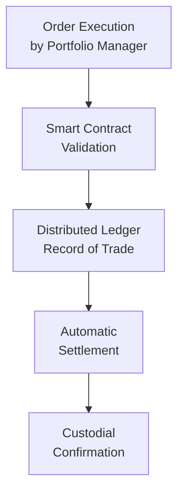

## Introduction

Distributed Ledger Technology (DLT)—the backbone of blockchain platforms—has brought a wave of excitement and a fair share of skepticism to the financial world. Some folks call it revolutionary for portfolio execution, while others view it as an overhyped buzzword. Maybe you’ve felt that moment of confusion: “So, do we really need this ‘blockchain’ stuff for my portfolio trades?” Let’s explore the many ways DLT is being adapted in capital markets, especially how it might improve everything from plain-vanilla equity trades to more complex derivative transactions. We’ll keep things a bit informal, so it feels like a friend is talking you through these future-focused ideas, but rest assured—these concepts are thoroughly tested for a CFA candidate’s professional repertoire.

## Key Elements of DLT in Finance

Before diving into details, let’s clarify a few fundamentals:

• A distributed ledger is basically a shared database replicated across multiple nodes in a network, often with robust cryptography to ensure data integrity and security.  
• Changes to the ledger (like settlement details or corporate actions) require validation by several nodes, which removes the need for a central authority to confirm transactions.  
• While blockchains are a well-known type of DLT, not all distributed ledgers operate identically. Some run on public networks (like Bitcoin or Ethereum), while others are private, permissioned blockchains used by a select group of trusted participants.

## Streamlining Trade Settlement

### How Traditional Settlements Work  
In conventional market structures, when you place a trade (say, buying shares of a company), there’s often a settlement delay—T+2 or T+3 days—before ownership is officially transferred, and money changes hands. This system relies on a web of counterparties, custodians, and clearinghouses. Each entity maintains its own record of ownership, leading to reconciliation delays and the risk of settlement failures.

### How DLT Can Help  
DLT aims to shorten or even eliminate these lags. With a blockchain, when you initiate a trade, you and your counterparty can see it physically get recorded in near real-time. The settlement instructions get automatically executed through consensus, providing:

• Near-instant (or T+0) settlement for certain asset classes.  
• Reduced operational friction because individual parties don’t need to reconcile separate recordkeeping sets.  
• A shared, tamper-resistant “single source of truth” about ownership and transaction history.

It’s a bit like turning a multi-step global supply chain into one giant, transparent spreadsheet—no one’s left waiting for a final update from someone else.

## Tokenization of Assets

One of the most talked-about aspects of DLT is tokenization. It’s essentially the process of creating a digital representation—or token—of a real-world asset, such as a share of stock, a bond, real estate, or even fine art. 

### Fractional Ownership and Instant Transfers
Tokenization can enable fractional ownership. Think of a real estate transaction where you’d normally have to buy the entire property or work through a complex structure to hold a partial stake. With tokenization, you could directly purchase, say, 0.5% of a commercial building. If you ever want to sell your fractional ownership, you simply trade your tokens. It’s pretty nifty and might open the door for smaller investors to dabble in asset classes previously out of reach.

Because all tokens live on a distributed ledger, once you sell them, the settlement can be recorded instantly, lowering friction and cost. In many ways, it’s reminiscent of sending an email—no waiting period; the record is just “there” for everyone to see.

## Implications for Clearing and Custody

### Traditional Approach to Clearing
Clearing is that behind-the-scenes process that matches buy and sell orders, calculates how much each party owes or receives, and manages netting of positions. Custody, meanwhile, ensures that your assets (stocks, bonds, or others) are physically—or electronically—safe in a recognized, regulated institution.

### DLT-Driven Efficiency
Under a DLT-based system, clearing can happen automatically once the network confirms a transaction. Custody could also become more direct: the distributed ledger itself serves as a kind of “custodian of record,” and participants hold cryptographic keys to access or transfer their assets.

In practical terms, large institutional custodians aren’t going away overnight. Instead, many of them might transition into DLT “gateway” providers—facilitating trade confirmations and providing key management services. That said, you might see dramatic cost reductions as duplicative recordkeeping and manual reconciliations become obsolete.

## Smart Contracts and Automated Execution

### What Are Smart Contracts?
Smart contracts are self-executing agreements encoded on the blockchain. They are triggered when certain predefined conditions are met. For instance, let’s say you’re entering a derivative contract where payoff depends on the S&P 500 index level. Using oracles (trusted data sources), a smart contract could automatically pay out when the index crosses a specified threshold.

### Reducing Counterparty Risk
The beauty of smart contracts is that they remove (or at least reduce) the risk associated with waiting on a counterparty to settle a trade. The code enforces settlement. If one side fails to deliver the underlying security, the system can withhold payment. That might sound cold and robotic, but it can make the entire process more efficient and less prone to default risk. 

Here’s a small conceptual diagram of how a blockchain-based portfolio transaction might flow:

In this flow, the order is initiated, validated by a smart contract, recorded on the ledger, and automatically settled, with custodial confirmation happening in near real-time.

## Regulatory Landscape and Compliance Standards

### Evolving Standards
Regulatory bodies worldwide—SEC in the US, ESMA in the EU, MAS in Singapore, etc.—are all grappling with how to supervise digital securities and DLT-based settlement. Some have begun drafting frameworks to ensure investor protection, market integrity, and financial stability. It’s not uniform: while one jurisdiction might allow blockchain-based equity issuance, another might still require paper-based settlement documentation.

### Security Tokens vs. Utility Tokens
A significant concept is differentiating security tokens from utility tokens. Security tokens represent ownership or debt, bringing them under existing securities laws. Meanwhile, utility tokens (like some cryptocurrencies that aren’t intended as investments) often dodge these regulations. Eventually, a unified or more globally consistent framework could emerge, but for now, compliance professionals need to track multiple sets of standards.

### Auditability and Tracking
On the plus side, blockchains can provide an immutable record of transaction history—ideal for audit trails. Regulators, if granted permission, can easily check the ledger for anomalies, high-risk patterns, or insider trading red flags. That might help reduce financial crime, though it also raises privacy concerns if every trade is visible forever.

## Operational Risks and Challenges

Even with all the promise, DLT adoption is not without hurdles:

• Technology Failures: A bug in the consensus mechanism or a hack in smart contract code could freeze transactions or cause massive economic losses.  
• Cybersecurity Threats: Private keys, which control access to tokens, can be stolen if not properly secured.  
• Scalability: Public blockchains sometimes struggle to handle large volumes of transactions quickly, although private/permissioned solutions might mitigate this to some extent.  
• Public vs. Private Blockchains: Public networks are open to everyone, but they often rely on slow, resource-intensive consensus algorithms (like proof-of-work). Private blockchains can be faster but trust is concentrated among a few nodes.

And let’s not forget the learning curve—traders, middle-office staff, and even clients themselves might need training to understand how to use or trust a DLT-based system.

## Real-World Pilot Projects

Financial markets have seen numerous pilot projects:

• Major banks forming consortia to test syndicated loans on DLT platforms, aiming to reduce settlement time from weeks to days.  
• Asset management firms experimenting with tokenized mutual funds, letting investors trade fund shares on blockchain-based secondary markets.  
• Custodians exploring blockchain-based systems for corporate actions—things like dividend announcements, proxy voting, and stock splits.  

In each case, the initial feedback is that DLT reduces operational friction and speeds up the timeline. But the transition is slow, partly because incumbents have to overhaul entire workflows and deal with regulatory uncertainty.

## Transparency and Immutability of Blockchain

A big selling point of blockchains is that once data is recorded, it’s nearly impossible to alter without consensus. That immutability can:

• Enhance investor confidence: Everyone can see the transaction record.  
• Facilitate compliance: Regulators get a robust audit trail.  
• Reduce operational complexity: No more reconciling multiple ledgers with possible “version” mismatches.

However, if you record bad data at the outset—maybe someone inputs an incorrect settlement instruction or a fraudulent transaction—it can’t be easily erased. Some solutions harness “forking” or versioning to correct errors, but that can be complicated and might undermine the idea that the blockchain record is permanent.

## Best Practices and Common Pitfalls

• Start with Low-Complexity Use Cases: Implement DLT for simpler tasks (e.g., corporate actions tracking) to gauge feasibility before diving into large-scale trading solutions.  
• Implement Strong Cybersecurity Measures: Develop robust key management protocols and multi-signature approvals to mitigate hacking risks.  
• Communicate Regulatory Compliance: Work closely with regulators early in the project to obtain clarity on how tokenized securities or DLT-based services will be licensed and supervised.  
• Plan for Interoperability: Ensure your platform can integrate with existing trading and risk management systems.  
• Avoid Over-Engineering: Sometimes, a simpler centralized database might suffice. Be sure DLT’s benefits outweigh its complexity.

## Exam Tips

1. Know the Basics: You should be ready to explain the fundamental concepts of DLT, tokenization, and smart contracts.  
2. Connect to Risk Management: Be prepared to analyze how distributed ledgers can mitigate or exacerbate certain operational risks (e.g., cybersecurity threats).  
3. Regulatory Nuances: Expect scenario-based questions requiring you to evaluate compliance considerations or identify key areas of regulatory friction.  
4. Cross-Asset Applications: You might be asked to outline the benefits of tokenizing alternative assets like real estate or private equity within a case study.  
5. Implementation Challenges: Be clear on real-world obstacles—don’t assume daily trade volumes can shift to a blockchain with the flick of a switch.

## References

• Tapscott, D., & Tapscott, A. (2018). Blockchain Revolution: How the Technology Behind Bitcoin Is Changing Money, Business, and the World. Portfolio Penguin.  
• CFA Institute. (2021). “Blockchain for Finance: An Overview.”  
• BIS. (2017). “Distributed Ledger Technology in Payment, Clearing and Settlement.”

## Glossary

• Distributed Ledger Technology (DLT): A decentralized digital record system maintained by multiple participants that eliminates the need for a central authority.  
• Tokenization: Converting real-world assets into digital tokens on a blockchain, enabling fractional ownership and near-instant transfers.  
• Smart Contracts: Self-executing agreements with the terms directly written into software code, which automatically execute when conditions are met.  
• Custody: The safekeeping and administration of financial assets on behalf of a client or institution.  
• Digital Securities: Financial assets that are issued and transferred using a blockchain-based infrastructure, subject to regulations governing traditional securities.

--------------------------------------------------------------------------------

## Test Your Knowledge: Distributed Ledger Technology in Portfolio Execution



### DLT and Traditional Settlement
- [x] DLT can potentially reduce settlement times from T+2 to real-time (T+0).
- [ ] DLT can only handle settlement for derivatives contracts, not equities.
- [ ] DLT guarantees zero transaction fees.
- [ ] DLT must use proof-of-work consensus mechanisms.

> **Explanation:** One of the major benefits of DLT is expedited settlement times due to the shared, tamper-resistant ledger that all parties can access immediately.

### Tokenization Concept
- [x] Tokenization allows for fractional ownership of traditionally indivisible assets.
- [ ] Tokenization completely eliminates the need for regulation.
- [ ] Tokenization restricts secondary market trading.
- [ ] Tokenization serves only as a method for verifying personal identification.

> **Explanation:** Tokenization transforms physical or intangible assets into digital representations, facilitating fractional ownership and more efficient trading.

### Smart Contracts
- [x] Smart contracts are self-executing agreements stored on a blockchain.
- [ ] Smart contracts expire automatically if not executed within one day.
- [ ] Smart contracts eliminate the need for any legal oversight.
- [ ] Smart contracts rely solely on third-party settlement via custodians.

> **Explanation:** Smart contracts execute based on encoded conditions, removing the need for manual interventions, but they still may operate under legal and regulatory frameworks.

### DLT Operational Risks
- [x] DLT may introduce cybersecurity risks around key management.
- [ ] DLT is immune to all forms of hacking due to cryptography.
- [ ] Operational risk disappears entirely if a ledger is distributed.
- [ ] Private blockchains always have more hacking vulnerabilities than public blockchains.

> **Explanation:** While DLT can improve transparency, it also creates new vulnerabilities, such as the theft of private keys. No system is entirely hack-proof.

### Custody in a DLT Environment
- [x] DLT can change the role of custodians, turning them into key or node managers.
- [ ] DLT means no custody service will ever be required again.
- [x] DLT might allow investors to maintain direct ownership on the blockchain.
- [ ] The use of DLT always shortens day-to-day transaction times to zero.

> **Explanation:** Custodians still play a role in a DLT environment, often focusing on services like private key management and regulatory compliance.

### Public vs. Private Blockchains
- [x] Public blockchains are open to anyone, while private ones restrict access to specific entities.
- [ ] Public blockchains are always faster.
- [ ] Private blockchains are never used by financial institutions.
- [ ] Both are identical in terms of governance and consensus mechanisms.

> **Explanation:** A key distinction in blockchain design is who is permitted to validate transactions and maintain the ledger, leading to trade-offs in speed, trust, and governance.

### Liquidity in Tokenized Markets
- [x] Tokenization could enhance liquidity by enabling fractional ownership.
- [ ] Liquidity always disappears if we fractionalize assets.
- [x] Smaller investors may gain access to previously exclusive asset classes.
- [ ] Tokenization only works for very liquid securities like Treasuries.

> **Explanation:** Fractional ownership might improve market liquidity by expanding the range of eligible buyers, although actual liquidity will still depend on investor demand and regulatory conditions.

### Settlement Advantages of DLT
- [x] DLT can reduce manual reconciliation between multiple systems.
- [ ] DLT eliminates the possibility of any transaction errors.
- [ ] DLT requires an intermediary to verify the trade post-execution.
- [ ] DLT necessitates a T+5 settlement cycle.

> **Explanation:** One of the main advantages is streamlined reconciliation, as everyone shares the same immutable record. However, errors can still be introduced at data-entry points.

### Regulatory Considerations
- [x] Many jurisdictions are actively exploring how to regulate digital securities.
- [ ] There is a single global regulatory standard for tokenized assets.
- [ ] DLT transactions are untraceable for regulators.
- [ ] Jurisdictions cannot regulate blockchain because it’s decentralized.

> **Explanation:** Regulatory authorities worldwide debate and implement different approaches to DLT, but there's no uniform standard yet.

### True or False: Auditability
- [x] True
- [ ] False

> **Explanation:** Blockchains generally keep an immutable and transparent history, potentially improving audit trails and oversight—provided you have permission to view the chain.


