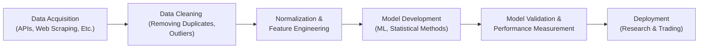

## Introduction
Big Data might sound like just another buzzword, but consider this: every time you check a social media post, shop online, listen to streaming music, or even just carry your smartphone, data is being generated—tons of it, continuously. The investment world, keen to spot profitable signals, is pulling out all the stops to harness this massive flow of information. And if you’ve ever wondered how portfolio managers might anticipate earnings surprises before they hit the news cycle, or how they figure out changing consumer behavior long before official numbers come out, Big Data is often at the heart of it.

In this section, we’ll explore how Big Data is revolutionizing security selection, from gathering alternative datasets to using advanced analytics. We’ll talk about real-world applications, highlight a few cautionary tales, and maybe share a personal anecdote or two. By the end, you’ll see how Big Data tools can combine with traditional fundamental research to give you that extra edge in portfolio decisions.

## Defining Big Data in Finance
When we talk about Big Data, we’re generally referring to data that has at least one of what are often called the “Three Vs”:

• Volume: The sheer amount of data being generated.  
• Variety: Data arriving in all kinds of formats—spreadsheets, images, social media posts, website logs, and more.  
• Velocity of Data: The speed at which data is created, moved, and analyzed.  

In investment management, Big Data can come from client transactions, geolocation data, satellite imagery, web scraping, and more. The objective is to transform these raw bits of information into insightful signals about asset prices, company fundamentals, or market segments. 

### Alternative Data for Security Selection
The term “alternative data” describes non-traditional information sources that can provide unique insights into company or economic performance. These might include:  
• Consumer credit card transaction data that reveals purchasing trends.  
• Real-time web traffic that shows how a company’s site is performing.  
• Social media sentiment gleaned from posts, likes, and shares.  
• Satellite images of parking lots or farmland, which can serve as proxies for production, consumption, or supply chain activity.  

You know how sometimes you see a line around the block for the newest gadget in town? Now imagine you’re analyzing something similar but at a very large scale, using geolocation data to check how often people are visiting store locations or how shipping routes are shifting. That’s alternative data in action.

## The Big Data Pipeline
Collecting novel datasets is only the first step. The real magic happens once you’ve organized, cleaned, enriched, and tested your data. I remember once working with a small team that desperately wanted to mine foot traffic data around big department stores to predict holiday sales. Well, guess what? Half of the location signals were incomplete, duplicated, or filled with odd outliers like someone apparently “standing” in the middle of a river for 11 hours. Without proper data cleansing, the end results were a mess.

Below is an overview of a typical Big Data pipeline:

### Data Cleaning
Data cleaning means removing or fixing incomplete or corrupted entries. This can be labor-intensive, especially for unstructured data (e.g., text from social media or images from satellites). The more complex the data, the more crucial it is to have robust protocols to identify issues—like missing values or anomalies—before they make their way into the investment model.

### Normalization
Normalization is the process of bringing data into a consistent and comparable format. For example, if your data source provides monthly sales numbers but another source only has quarterly data, you need some alignment. Or maybe you need to convert units (e.g., from miles to kilometers), or adjust for differences in time zones. Normalization ensures that your data inputs match up properly.

### Feature Engineering
Feature engineering involves creating meaningful predictors (“features”) from raw data to improve model accuracy. For instance, if you have daily transaction data for a retailer, you might transform that into weekly growth rates or footfall metrics that account for seasonality. The key is to identify a pattern that the machine learning algorithm or statistical model can pick up on and relate to future asset price movements or earnings results.

## Advanced Analytics: NLP and Machine Learning
Once you have a clean, normalized dataset with good features, you can apply more advanced tools:

### Natural Language Processing (NLP)
NLP methods might parse corporate earnings transcripts, social media sentiment, or even patent filings. An NLP engine can sift through millions of words to gauge overall sentiment, detect common themes, or even pick up clues around intangible factors like consumer trust. Suppose you're analyzing thousands of product reviews for a listed company—NLP can cluster these reviews by sentiment score and highlight potential red flags, like a surge in complaints about product defects in a certain region.

### Machine Learning (ML)
Machine learning algorithms can uncover hidden relationships and patterns that might be too subtle—or too complex—for standard linear regression. For instance, random forests or gradient boosting methods can find non-linear relationships between diverse data inputs, such as weather patterns, shipping data, and store location info, to forecast the revenue of a home improvement retailer. 

However, keep in mind that the “garbage in, garbage out” principle is alive and well. The best model in the world can’t fix poorly curated data or features with little bearing on actual performance.

#### Practical Example: Predicting Earnings Surprises
In finance, an “earnings surprise” occurs when a company’s actual earnings deviate from consensus analyst forecasts. By combining real-time consumer sentiment from social media, credit card transaction metrics, and website traffic data, a machine learning model might spot early signs that a tech company is experiencing stronger-than-expected sales. This signal can then inform a trading decision, possibly generating alpha in the days leading up to the official earnings release.

## Risk Management and Data Bias
Harnessing Big Data for security selection is not without risks. Data bias can lurk in many forms:

• Sampling bias: When the dataset used for training doesn’t represent the overall population (e.g., only affluent urban consumers).  
• Survivorship bias: Ignoring companies or data points that have dropped out of the dataset (like bankrupt entities).  
• Overfitting: A model might latch onto peculiarities in the training set that don’t generalize to real-world scenarios.  

Moreover, even the most robust data pipelines can struggle if the source changes. For example, if a social media platform updates its privacy settings or usage levels shift drastically, your historical data patterns may no longer hold. 

### Putting Controls in Place
Because these challenges can lead to substantial investment losses (or “model misfires”), strong risk management controls are imperative:

• Ongoing Data Quality Checks: Regularly validate that the data is still consistent and reliable.  
• Model Validation: Test the model on new data or alternative samples.  
• Governance Framework: Ensure compliance with local regulations and internal policies, especially for data that might contain personally identifiable information.  

## Real-World Use Cases
Let’s look at a few examples where Big Data analytics have sharpened security selection processes:

1. Online Retail Predictions: One asset manager used daily shipping data from major logistics providers combined with geolocation info around distribution centers. By applying machine learning models to track increases in shipping velocities (yes, even shipping has “velocity!”), they timed buy/sell decisions for e-commerce stocks ahead of major seasonal announcements.  
2. Restaurant Chain Analysis: Satellite imagery of parking lots showed consistent traffic patterns at certain regional restaurant chains. Cross-checking those patterns with social media sentiment and credit card transaction data gave analysts a leading indicator of quarterly revenue.  
3. Mining Social Media for ESG Signals: Another firm scoured social media to track environmental, social, and governance controversies. Patterns of negative sentiment around labor practices, for example, flagged potential reputational risks.  

## Data Privacy and Ethical Considerations
It’s no secret that personal data is becoming increasingly sensitive. Harvesting data from consumer devices or monitoring social media posts raises obvious concerns around privacy and consent. In finance, where the stakes are high, it’s essential to implement ethical data collection and usage standards. 

For instance, if you’re using geolocation data, have you ensured that all tracking is anonymized? Do you have robust security protocols to protect data from unauthorized access? In many jurisdictions, failing to comply with data protection regulations like the GDPR (in the EU) or similar laws can lead to hefty fines and reputational damage.

### Balancing Insight with Confidentiality
One of the coolest aspects of Big Data—finding hyper-targeted leads—can also be its Achilles’ heel if you’re not careful. Using advanced analytics might enable you to zero in on specific individuals, but that can easily cross ethical or legal boundaries. Always ensure that your data sources and usage comply with relevant privacy regulations.

## Combining Big Data with Traditional Fundamental Research
However fancy your data science setup, there’s no substitute for solid fundamental analysis. Think of Big Data as a powerful supplement to more classical methods:

• Traditional Research: Analyst scours the company’s income statement, checks corporate announcements, interviews management, and compares the business model to industry peers.  
• Big Data Insights: Machine learning on consumer sentiment or foot traffic data either confirms or contradicts the fundamental story.  

Integrating these approaches can give you a more robust investment thesis. Big Data might flag a potential risk or highlight a growth driver that fundamental analysis alone missed. In a sense, it’s like having an extra set of eyes (or thousands) scanning the horizon for anomalies.

## Best Practices and Common Pitfalls
Although Big Data is a potent tool, it can fail spectacularly if not handled correctly:

• Don’t Chase All Data: More is not always better. Zero in on datasets that are relevant to your investment question.  
• Keep It Explainable: Black-box models can be tricky to validate. Regulators and stakeholders increasingly demand interpretability.  
• Watch for “Data Snooping”: Using the same data to develop, test, and confirm a hypothesis can lead to overblown confidence in your model.

A friend of mine—let’s call him Dave—once spent months building a monster of a data pipeline that harvested every single tweet mentioning a certain consumer electronics brand. He used sophisticated algorithms, but never normalized for the fact that 90% of the tweets were marketing posts from the brand itself. The end result? A lopsided positivity bias that led him to hold on to a stock just before it tanked on real negative news. So, yeah, be careful with the data you think is gold. It might just be fool’s gold.

## Exam Tips
For the CFA exam, especially if you find scenario-based questions around Big Data, keep these key points in mind:

• Identify how data flows from source to actionable insight.  
• Discuss risk management frameworks that address data errors or bias.  
• Understand the ethical and privacy issues.  
• Relate advanced analytics to fundamental principles like earnings forecasts or valuation.  
• Describe how to integrate Big Data approaches into an Investment Policy Statement (IPS) or overall risk controls.

Examiners often ask about the impact of technology on portfolio management. Make sure you are comfortable illustrating how alternative data and machine learning models not only supplement but also challenge traditional methods.

## Conclusion
Big Data in security selection offers an unprecedented opportunity to capture signals that might otherwise go unnoticed. From alternative data sources like geolocation patterns and social media sentiment to advanced methods such as natural language processing and machine learning, portfolio managers today have a powerful arsenal at their disposal. Of course, with great power comes great responsibility: ignoring data privacy, ethics, and risk management can easily backfire, either through flawed analytics or legal repercussions.

Yet when done right—combining rigorous data processes with the wisdom of fundamental research—Big Data can be a game-changer. It can uncover hidden drivers of a stock’s performance, spot red flags earlier, and refine the very nature of how we think about investment research. And hey, maybe it’ll help you make more confident decisions when the next wave of tweets or satellite images inevitably floods the market.

## References
• Provost, F., & Fawcett, T. (2013). Data Science for Business. O’Reilly Media.  
• Deloitte Insights. (2020). “Big Data in Investment Management.”  
• Schonberger, V. M., & Cukier, K. (2013). Big Data: A Revolution That Will Transform How We Live, Work, and Think. Houghton Mifflin Harcourt.

-----

## Test Your Knowledge: Big Data Security Selection Quiz



### Which of the following best describes “Big Data” in the context of security selection?

- [x] Large, fast-moving, and varied data sets that can be converted into predictive insights.  
- [ ] Exclusively credit card transaction data used to predict consumer trends.  
- [ ] Information limited to official government statistics.  
- [ ] Slow-moving, unstructured data stored in outdated databases.  

> **Explanation:** Big Data in the finance context focuses on high volume, velocity, and variety (the “Three Vs”), which can include anything from social media to geolocation data.

### Data cleaning is essential in Big Data analytics primarily because:

- [x] Raw data often contains missing values, outliers, or duplicates that can distort model results.  
- [ ] It allows analysts to remove only positive observations for a favorable outcome.  
- [ ] Regulators mandate that 50% of all data must be discarded.  
- [ ] Clean data always guarantees high returns.  

> **Explanation:** Data cleaning ensures data integrity by handling errors, duplicates, and outliers, which if unchecked, can lead to faulty analyses.

### Which of the following is an example of “Alternative Data”?

- [ ] Quarterly earnings published by a company’s investor relations department.  
- [x] Satellite imagery measuring store parking lot traffic for a retail chain.  
- [ ] Historical price charts from a country’s stock exchange.  
- [ ] Notes from an official government budget hearing.  

> **Explanation:** Alternative data refers to non-traditional data sources that can yield unique insights, such as satellite photos of store parking lots indicating consumer activity.

### Feature engineering can best be described as:

- [x] Transforming raw data into structured variables that improve predictive accuracy in models.  
- [ ] Tweaking the model’s outcome until it fits the desired result.  
- [ ] Eliminating unexpected results by discarding outlier data.  
- [ ] Calculating monthly returns only for large-cap stocks.  

> **Explanation:** Feature engineering involves extracting and refining variables (“features”) from raw data so that algorithms can more effectively detect patterns and relationships.

### Machine learning models in the context of security analysis are particularly useful for:

- [x] Identifying complex patterns in large datasets that may be missed by traditional methods.  
- [ ] Guaranteeing a 100% success rate on earnings predictions.  
- [x] Handling non-linear relationships among diverse data features.  
- [ ] Simplifying data to only linear relationships.  

> **Explanation:** ML can uncover hidden, non-linear patterns in vast datasets. While it doesn’t guarantee success, it often outperforms simple traditional methods in identifying complex signals.

### Data bias is a critical concern because:

- [x] It can systematically skew findings and lead to incorrect investment decisions.  
- [ ] It only affects historical data and not live data.  
- [ ] It is insignificant when using structured data.  
- [ ] It is easily fixed by simply adding more data.  

> **Explanation:** Bias in data leads to misleading signals and flawed conclusions. More data doesn’t necessarily solve bias if the underlying data sources remain unrepresentative.

### Which risk management technique can best address changes in data sources?

- [x] Ongoing monitoring and validation of the data pipeline.  
- [ ] Running the same model without updates for consistency.  
- [x] Maintaining governance with fallback models or alternative data sets.  
- [ ] Ignoring the changes, as they will not affect the algorithms.  

> **Explanation:** Continuous monitoring, validation, and strong governance are needed to detect and adapt to shifts in data sources, ensuring the accuracy of models over time.

### Integrating Big Data with fundamental research can:

- [x] Provide a more holistic view of a company’s prospects by merging quantitative signals with qualitative assessments.  
- [ ] Render fundamental analysis obsolete.  
- [ ] Always confirm that analysts’ traditional forecasts are correct.  
- [ ] Avoid the need for any human supervision.  

> **Explanation:** Combining big data with fundamental research offers broader insights. It enriches, rather than replaces, traditional methods.

### Why might regulators have interest in how investment firms use Big Data?

- [x] Personal data privacy and market fairness issues require oversight.  
- [ ] Regulators only prefer manual calculations done on paper.  
- [ ] Firms are prohibited from using advanced analytics.  
- [ ] Big Data is too small in scope to warrant regulatory concern.  

> **Explanation:** Regulators focus on protective measures around personal data, transparency, and ensuring that advanced analytics do not harm market fairness or violate ethics.

### True or False: The presence of large amounts of data automatically translates into better investment decisions.

- [x] True  
- [ ] False  

> **Explanation:** This is a trick: In theory, more data can be beneficial, but only if it’s high-quality and analyzed properly. Large volumes of poor or irrelevant data can lead to confusion or misleading results.


