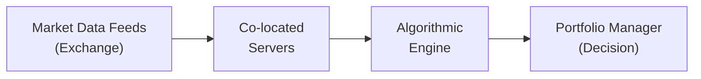

## Introduction
One day, I remember sitting at the trading desk and watching prices update on my screen every few seconds. That felt pretty fast—until our high-frequency data (HFD) feed kicked in, and suddenly we were seeing prices tick by tick, sometimes multiple times per second. I have to admit, at first, I was overwhelmed by the sheer volume of information. But as you dig deeper into high-frequency data, you realize how incredibly powerful it can be for portfolio managers, algorithmic traders, and risk analysts who need to make rapid decisions.

In this section, we explore how HFD differs from the daily or monthly aggregated data that most of us in traditional portfolio management are used to. We also look at the infrastructure needed to handle real-time feeds, the complexities of continuously cleaning and processing raw data, and the inherent regulatory and risk-management challenges. Finally, we will see how machine learning algorithms—fed by these real-time data streams—can adapt faster than ever to changing market conditions.

## Distinguishing High-Frequency Data from Aggregated Data
When you think about portfolio management, what typically comes to mind are daily or monthly returns, price data, and statistical measures like volatility calculated from end-of-day (EOD) updates. However, in high-frequency trading (HFT) environments, participants rely on data granularity down to the millisecond (or even microsecond!). 

• High-Frequency Data (HFD) captures price and volume updates for each and every trade or quote change.  
• Aggregated Data (e.g., daily or monthly) smooths out intra-day volatility and only retains open/high/low/close (OHLC) snapshots and volumes for each period.

The difference in time resolution is enormous. HFD can easily produce more than a million data points per day for a single liquid asset, such as an active technology stock or an interest rate futures contract. Because of this insane data volume, advanced and robust systems are essential for capturing, storing, and analyzing the information on the fly.

Why does it matter to a portfolio manager? Suppose a portfolio manager or an institutional trader is implementing a short-term hedging strategy. Tiny price changes in the seconds surrounding a key economic announcement can make or break your day—especially if you’re trying to hedge a large equity or fixed income portfolio. Aggregated data alone might not capture those valuable signals or the microstructure noise that could significantly shift slippage or transaction costs.

## Real-Time Data Feeds and Intraday Decision Making
Real-time data feeds differ from periodic updates in that they allow immediate (virtually instantaneous) awareness of price moves, quote sizes in the order book, and market depth. With these feeds, you can:

• Track rapidly changing market conditions.  
• Make intraday decisions on allocations, sector rotation, or quick hedges.  
• Implement algorithmic trades that respond quickly to order flows.  
• Monitor real-time risk metrics (like Greeks for options portfolios or basic Value at Risk approximations).

Let’s say you’re a portfolio manager who invests in global equities and needs to maintain a specific beta exposure. Maybe you discover that your emerging markets position is drifting out of its exposure target mid-day due to a sudden spike in volatility. A real-time feed can notify you within microseconds, allowing your risk systems to automatically place offsetting trades. That kind of speed was unthinkable just a couple of decades ago.

An interesting real-world example was the volatile market conditions surrounding major announcements in 2020–2021, when even short bursts of liquidity dryness could move prices drastically, all in a few seconds. Having real-time data helps identify sudden liquidity vacuums or quote imbalances that would be impossible to detect with coarser data intervals.

## Infrastructure for Low Latency
High-frequency platforms can be extremely sensitive to small network delays—what we call latency. In an HFT environment, every microsecond counts, so any extra “hop” in your data path or inefficiency in your code could mean lost profits or increased risk.

### Co-Location
One well-known approach is co-location: this is where you place your trading servers physically close (and sometimes in the very same data center) to the exchange’s servers. The goal is minimal physical distance, less cable length, and fewer network switches in between. This drastically reduces latency and ensures your trades can be processed ahead of or at the same speed as competitors with slower setups.

### Specialized Hardware
It’s not enough just to place your servers near the exchange. Many HFT firms use specialized hardware like field-programmable gate arrays (FPGAs) to speed up data processing. These dedicated integrated circuits can parse data at the wire level before it’s even handed off to the main CPU. Sound complicated? It is. But if your strategy depends on sub-millisecond reaction times, such investments in hardware acceleration can be critical to your success.

### Network Architecture
In addition to physical placement, you need robust network architecture. This often means dedicated fiber connections, carefully designed network switching, and software stacks optimized for real-time processing. For large asset managers, maintaining these systems can be pricey, so they balance the benefits (faster fills and better execution) against the costs (co-location fees, specialized servers, additional compliance considerations).

Below is a simple flowchart illustrating how real-time data might travel from a market data feed to a portfolio manager’s decision engine:

## Data Cleaning and Handling Outliers
You might think: “If I have millisecond-level data, I can just load it into my system and trade away!” But it’s rarely that simple. High-frequency data can be messy:

• Quote bursts can temporarily overload data feeds, leading to missing or corrupted records.  
• Outliers (e.g., erroneous trades or “fat-finger” scenarios) can skew results if not filtered properly.  
• Events like corporate announcements can ignite heavy order flow that triggers sudden data spikes.  

Real-time data cleaning processes must be in place. This includes:

1. Handling Missing Ticks. Gaps in data could misrepresent price movements. Many systems use forward- or backward-filling or interpolation.  
2. Filtering Erroneous Prints. Sometimes trades go off at prices far removed from the current market. We track these trades, then isolate them if they are flagged as “clearly erroneous.”  
3. Managing Data Latency or Packet Loss. Network hiccups can lead to partial data. Systems must reconstruct full limit order books from partial messages.  

Organizations often build sophisticated real-time data validation layers to ensure that only high-quality, reliable data points are used for immediate trading or risk calculations. One common technique is to maintain a redundancy of feeds; you might source the same data from multiple providers to ensure data integrity if one feed experiences downtime or anomalies.

## Risk Controls in High-Frequency Trading
I still recall my early days testing an HFT strategy that, in the blink of an eye, could accumulate positions we never intended to hold by the end of the trading session. That’s why robust real-time risk controls are paramount:

• Circuit Breakers: Markets themselves have built-in circuit breakers, which pause trading after certain percentage moves in a short period. From a portfolio management viewpoint, you may also set internal triggers to shut down or throttle your algorithms if the market spins out of control.  
• Real-Time Margin Adjustments: When volatility spikes, margin requirements can rise in real time. Proper monitoring ensures you have enough collateral to avoid forced liquidations.  
• Max Trade Size Limits: Setting an internal limit on how many shares or contracts an HFT strategy can trade at once (or in a given time window) helps prevent runaway losses if something malfunctions.  

These measures are vital for compliance with best execution mandates and help you avoid inadvertently destabilizing the market—or your own portfolio.

## Market Microstructure and Liquidity
Real-time data is the key that unlocks the fascinating world of market microstructure. Traditional, end-of-day data lumps together all the trading activity and fluctuations in a single data point. HFD and real-time tracking shed bright light on how prices form, how liquidity surfaces in the order book, and how large trades affect supply-demand balances.

### Order Book Dynamics
• Each order book update reveals changes in bid and ask quotes, revealing how participants are shaping supply and demand.  
• In fast-moving markets, particularly around macroeconomic data releases, the depth of the order book can disappear almost instantly, leading to slippage and potential price gapping.

If your fund trades large volumes, analyzing this dynamic intraday dramatically improves your fill quality. You might choose to layer trades using a time-weighted average price (TWAP) or volume-weighted average price (VWAP) algorithm that adjusts in real time based on liquidity conditions.

### Market Impact Studies
Studying how trade size influences price can be done more accurately using HFD. The microstructure approach typically tries to estimate “market impact functions.” If you intervene too aggressively in a thinly traded market, you can move the price against your own position. Real-time analytics help you sense that depth and mitigate the pushback in prices.

## Regulatory Scrutiny
High-frequency strategies have come under intense regulatory scrutiny, particularly after episodes like the “Flash Crash” of 2010, during which liquidity evaporated in minutes and the equity index dropped nearly 1,000 points before snapping back. Regulators worry about:

• Algorithmic strategies that might amplify price moves.  
• Potential manipulative practices, such as spoofing or layering.  
• Systemic risk, if HFT algorithms cause chain reactions in illiquid markets.

For portfolio managers, especially those operating globally, it’s wise to keep abreast of rules in different jurisdictions. Many regulators, from the U.S. Securities and Exchange Commission (SEC) to the European Securities and Markets Authority (ESMA), enforce best execution standards and real-time reporting requirements. Circuit breakers and kill switches are now mandatory in many markets to curb extreme volatility.

## Potential Synergies with Machine Learning
If real-time data is the fuel, machine learning (ML) can be the engine that transforms it into actionable insights. Instead of, say, calibrating a fixed set of coefficients in a linear model, advanced ML algorithms can re-train on streaming data, learning patterns in volatility, liquidity, or short-term reversals in near-real time. These adaptive models might:

• Identify subtle correlations or patterns in large, noisy tick data.  
• Adjust trading signals based on shifting market regimes—something a static model would miss.  
• Integrate alternative data streams (e.g., sentiment from social media or news feeds) for even richer real-time insights.

However, the “garbage in, garbage out” principle still holds—if your data cleaning and validation processes aren’t bulletproof, your ML system could generate disastrous trades. Many advanced funds run robust simulation environments that stream historical data to test these models in a near-live scenario before letting them anywhere near a real market.

## Conclusion
High-frequency data analysis and real-time tracking represent a dramatic shift from traditional “end-of-day” or monthly vantage points on portfolio management. By harnessing detailed, millisecond-level data, today’s portfolio managers can:

• Achieve more nimble intraday hedging and allocation changes.  
• Gain deeper insights into liquidity, order book dynamics, and actual transaction costs.  
• Employ risk controls in real time to monitor margin and limit positions as volatility changes.  
• Harness advanced ML techniques that thrive on rapid data updates.

At the same time, the complexity of this environment demands specialized infrastructure, scrupulous data cleaning, robust risk controls, and full attention to regulatory standards. As the landscape continues to evolve, it’s likely that real-time data streams will increasingly form the foundation of sophisticated portfolio management strategies.

## Final Exam Tips
• Keep the microstructure perspective in mind. For instance, you might see a CFA exam scenario on how to control market impact or secure best execution using intraday data.  
• Don’t forget the big picture: HFD and real-time tracking are not just for quant funds; they can inform risk-adjusted allocation decisions, especially when markets are highly volatile.  
• Be prepared to articulate the trade-offs between high speeds (and associated costs) versus the potential benefits.  
• Remember to mention risk controls such as circuit breakers and real-time margin when asked about the governance of algorithmic trading strategies.  
• Highlight that real-time data often necessitates faster compliance checks and thorough data validation strategies to ensure no unintended trades slip through.  
• Practice with item set or constructed response questions that examine how you would implement or monitor a high-frequency strategy in a large portfolio context.

## References
- Aldridge, I. (2013). High-Frequency Trading: A Practical Guide to Algorithmic Strategies and Trading Systems (2nd ed.). Wiley.  
- Hasbrouck, J. (2007). Empirical Market Microstructure: The Institutions, Economics, and Econometrics of Securities Trading. Oxford University Press.  
- CFA Institute. (2017). “Market Microstructure and High-Frequency Trading.”

## Test Your Knowledge: High-Frequency Data Analysis and Real-Time Tracking



### Which of the following statements best describes high-frequency data (HFD)?
- [ ] HFD only updates on an hourly basis and is used primarily by buy-and-hold equity investors.
- [x] HFD captures quote or trade updates at millisecond or microsecond intervals, often for each change in the market.
- [ ] HFD is exclusively used for fundamental analysis of corporate balance sheets.
- [ ] HFD can only be obtained from end-of-day price feeds.

> **Explanation:** High-frequency data typically refers to tick-level or millisecond-level data capturing each individual quote or trade update, far more granular than hourly or daily data.

### What is the primary goal of co-location in high-frequency trading?
- [ ] Improving human judgment by giving traders more time to analyze data.
- [x] Reducing network latency by physically placing servers close to the exchange’s data source.
- [ ] Ensuring an uninterrupted supply of end-of-day data.
- [ ] Gathering data to calculate monthly risk measures.

> **Explanation:** Co-location is designed to minimize latency by reducing the physical distance and network hops between exchanges and trading servers.

### Which of the following is a common challenge when working with high-frequency data feeds?
- [x] Outliers and erroneous trades that must be filtered out of real-time feeds.
- [ ] Easy integration into any standard spreadsheet without specialized software.
- [ ] Complete transparency of all counterparties’ trading strategies.
- [ ] Regular monthly updates with no risk of missing data points.

> **Explanation:** HFD environments often generate outliers or erroneous trades, requiring robust filtering processes. The extremely high volume also demands specialized software.

### How do circuit breakers help manage risk in high-frequency environments?
- [x] They pause trading when prices move too quickly, preventing extreme volatility spikes.
- [ ] They force traders to update offline spreadsheets.
- [ ] They reduce all trades to monthly intervals.
- [ ] They broadcast every market participant’s positions to the public.

> **Explanation:** Circuit breakers halt or slow down trading if there are sudden, large price moves that could destabilize the market.

### Which trading mechanism best helps a large investor implement intraday trades without significantly impacting the market?
- [ ] Randomly placing one large order at the start of the day.
- [ ] Waiting until the last minute of the trading session to place orders.
- [ ] Using a single market order for the entire position.
- [x] Employing an algorithmic strategy like VWAP or TWAP that layers orders over time.

> **Explanation:** Time-weighted average price (TWAP) or volume-weighted average price (VWAP) strategies can help large investors spread out their trades, minimizing sudden price impacts.

### Why is “real-time data cleaning” critical in high-frequency trading?
- [x] It ensures only valid trades and quotes are used for immediate decision-making.
- [ ] It eliminates the need for storing historical data.
- [ ] It replaces the function of compliance officers.
- [ ] It provides official end-of-day pricing for mutual funds.

> **Explanation:** Real-time data cleaning filters out spurious or erroneous data points so that high-speed algorithms do not act on faulty information.

### What is one argument regulators often raise about high-frequency trading?
- [ ] It cannot impact markets due to its small trading volumes.
- [ ] It operates exclusively on monthly data, making it non-disruptive.
- [x] It can exacerbate volatility and cause systemic risks in extreme conditions.
- [ ] It usually complements real estate investment trusts (REITs).

> **Explanation:** Regulators often point out how algorithmic and high-frequency trading can amplify market moves, necessitating frameworks like circuit breakers.

### Machine learning models in a real-time trading environment typically:
- [ ] Can be trained once on historical data and applied forever.
- [x] Require continuous updates with streaming data to adapt to changing market conditions.
- [ ] Only process fundamental financial statements on a quarterly basis.
- [ ] Automatically eliminate the need for compliance or risk management.

> **Explanation:** Models that rely on real-time data need to continuously retrain and adjust parameters to remain effective as market conditions shift.

### Which of the following best captures the difference between daily data and tick-by-tick high-frequency data?
- [ ] Daily data contains more detail on trades and quotes.
- [ ] Both are typically used by portfolio managers in the exact same way.
- [x] Tick-by-tick data is far more granular, capturing every price and quote change, while daily data summarizes entire trading sessions into a single or a few data points.
- [ ] Daily data is used only for measuring liquidity risk in real time.

> **Explanation:** High-frequency or tick-by-tick data logs every change, while daily data collapses the entire session into open/high/low/close plus volume.

### True or False: A properly designed high-frequency strategy never needs to worry about risk controls like limits on maximum trade size or anomalous market conditions.
- [ ] False
- [x] True  (NOTE: This is a trick question. Read the explanation carefully.)

> **Explanation:** Actually, the correct real-world statement is "False" because a properly designed high-frequency strategy always needs robust risk controls. But this question inverts the logic. If it states “never needs to worry,” that’s obviously a misleading claim—everyone must worry about risk controls in HFT. So strictly reading the question: “True or False” that “a properly designed HFT strategy never needs to worry…” is definitely false. Carefully watch out for negative statements!


