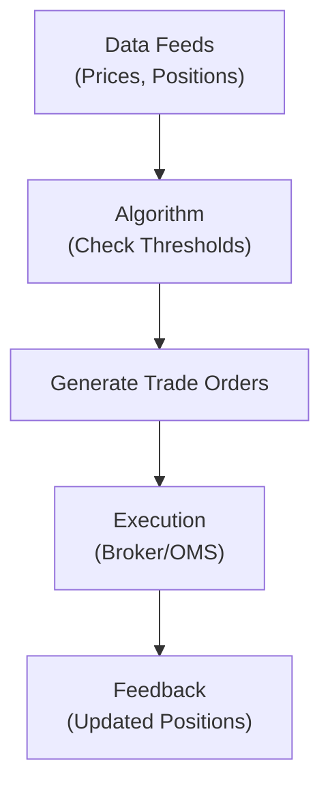

## Introduction

If you’ve ever spent hours trying to figure out when to rebalance your portfolio and how much to trade in each asset, you’re definitely not alone. I remember back in the day, I tried to rebalance a personal retirement account with a battered Excel spreadsheet, inputting (and often messing up) the computations for what needed trimming and what needed adding. It felt like patchwork. And, well, patchwork is not exactly best practice in portfolio management. Enter automated rebalancing algorithms—systems designed to handle all this behind the scenes in (nearly) real time.

In this section, we explore how automated rebalancing differs from manual or periodic approaches. We’ll talk about triggers, thresholds, transaction cost minimization, factor exposures, and all the good stuff that helps keep your portfolio aligned with its strategic goals—all without tethering you to a spreadsheet.

## What Is Automated Rebalancing?

Automated rebalancing is a process that uses technology—like algorithmic execution engines—to monitor a portfolio continuously and make swift, rule-based adjustments when certain conditions are breached. Traditional rebalancing often follows a calendar-based approach (e.g., monthly or quarterly) or a purely threshold-based approach—say, if any asset in your portfolio drifts 5% beyond its target weight. Automated rebalancing takes these ideas a step further by monitoring positions throughout the trading day and triggering modifications in real time or near real time. 

In essence, we’re giving the portfolio a set of instructions, or “if-then” statements, telling it when and how to nudge allocations back in line. Rather than waiting for the next scheduled date or noticing something’s off, the algorithm does that for you—sometimes triggered by a set measure of volatility, transaction cost constraints, or unusual market conditions. 

## Key Differences from Manual Periodic Rebalancing

• Frequency: Manual processes typically stick to a fixed schedule (monthly, quarterly, or semiannually). By contrast, automated systems can rebalance daily, weekly, or even intraday if desired.  
• Precision: Automated models track portfolio weights at a granular level, often capturing intraday price movements.  
• Consistency: Since trades are handled by pre-defined rules, there’s less risk of behavioral biases—like hesitating to sell a winning position or “doubling down just in case.”  
• Time and Resource Savings: No more sifting through endless spreadsheets. Automated rebalancing frees up professionals for more value-added tasks.  

## Triggers and Thresholds

The heart of automated rebalancing lies in its triggers. You can set these triggers in various ways:

- Deviation from Target Weight (Rebalancing Threshold): This is where each asset is assigned a standard weight, such as 60% equity and 40% fixed income. If an equity position grows to 66% of the portfolio (exceeding the 60% target by a 5% threshold), the algorithm automatically rebalances.  
- Volatility-Based Triggers: Sometimes the trigger is not so much about weight drift but changes in market volatility. When volatility spikes above a threshold (or ironically when it falls below a certain level), a rebalance gets prompted.  
- Factor Exposure Triggers: If your portfolio aims to maintain a specific factor tilt (e.g., a certain beta, value factor exposure, or momentum factor weighting), you can set triggers that respond to factor drift.  

### Small Example

Let’s imagine a $1 million portfolio with a 60/40 split between stocks and bonds. Your threshold for rebalancing might be ±5%. If stocks rally and bring the portfolio to 65% stocks (worth $650,000) and 35% bonds (worth $350,000), the system automatically files trades to bring both asset classes back to 60/40, or some near approximation.

## Real-Time Monitoring and Execution

Modern portfolio platforms integrate with data feeds and execution management systems so that every time an asset’s price changes, the platform recalculates each position’s weighting in your portfolio. Sounds fancy, right? Essentially, it’s a continuous loop:



1. Data Feeds: The system receives price updates and calculates current portfolio weights.  
2. Algorithm Checks: The system quickly evaluates if the current weights exceed trigger thresholds.  
3. Trade Orders: If triggers are breached, trades are automatically entered.  
4. Execution: Trade orders are routed to brokers or an Order Management System (OMS).  
5. Feedback: Confirmed fills and new positions flow back into the platform, resetting the cycle.

This automation helps reduce human error. For instance, if you have multiple portfolios with similar strategies, an automated platform can monitor each one concurrently, ensuring none accidentally drifts outside your risk tolerance. 

## Minimizing Transaction Costs and Market Impact

Even the smartest algorithm doesn’t help if transaction costs and market impact devour your returns. With automated rebalancing, you can code in constraints:

- **Trade-Size Limits:** Reduce the daily trading volume of a position to mitigate slippage or alert the algorithm to break up a trade into smaller segments over time.  
- **Algorithmic Execution:** By employing advanced trading algorithms—like VWAP (Volume-Weighted Average Price) or TWAP (Time-Weighted Average Price)—the system can minimize market impact.  
- **Cost Thresholds:** Sometimes the platform monitors transaction cost estimates and only executes trades if it believes the cost is below a specified limit.  

## Handling Tax Implications

In many jurisdictions, capital gains tax can weigh on your rebalancing decisions. Automated rebalancing platforms often incorporate:

- **Tax Lot Strategies:** The system identifies which lots to sell in order to minimize taxes, e.g., first-in-first-out (FIFO), last-in-first-out (LIFO), or specific-lot identification.  
- **Tax-Sensitive Overlay:** Some systems skip rebalancing trades that would incur short-term gains in favor of less costly alternatives (like using derivatives to adjust exposure).

It’s easy to overdo it, though. Aggressive automated rebalancing can trigger frequent capital gains, so you need to weigh the benefit of perfect alignment against the tax hit.

## Advanced Optimization Techniques

One of the neat developments in automated rebalancing is the use of advanced optimization algorithms that evaluate portfolio correlation and factor exposures in real time. Some solutions:

- **Dynamic Mean-Variance Optimization:** Using near real-time estimates of variance-covariance matrices, a system can decide exactly how to rebalance in a way that seeks an optimal risk-return trade-off. This approach can be quite data-intensive and requires robust, error-free data pipelines.  
- **Multi-Factor Models:** If your strategy relies on factor tilts, the system can calibrate which assets to buy or sell to maintain exposure to, say, value and momentum factors.  
- **Regime Shifts:** Some professional platforms incorporate macroeconomic triggers—for instance, if the system detects a probable regime change in interest rates or a shift in global equity market volatility, it can adapt the rebalancing strategy accordingly.

Often, these methods require partial synthetic rebalancing using derivatives. For example, instead of selling a large portion of your equity portfolio to reduce market exposure, you might purchase equity index put options or sell futures to bring your exposure in line. Automated rebalancing systems can handle these trades automatically, though you need robust compliance checks to ensure you don’t violate your policy guidelines.

## Integrating Cash Flows Seamlessly

Let’s say an institutional client wires in an additional $5 million. The system will promptly detect the liquidity injection and readjust all holdings in real time. The irony is that many manual managers wait until a certain day of the month or quarter to deploy the inflows. Meanwhile, an automated approach invests that capital right away in proportion to target allocations—or uses it to correct any existing drift in the portfolio.  

Conversely, in the event of outflows or redemptions, the automated approach knows precisely which positions to liquidate. It might also coordinate partial trades across multiple accounts if you manage parallel pools of capital.

## Churning Warning: The Dangers of Over-Rebalancing

It’s surprisingly easy to go from no rebalancing discipline to a scenario where you’re rebalancing way too often. Over-rebalancing, or churning, can eat away at returns through constant transaction costs and, in jurisdictions with capital gains taxes, incremental tax liabilities.

One solution: implement a “rebalancing band” so that you only rebalance if the asset’s weight deviates from its target by a certain threshold. Another is to set a maximum frequency—like no more than one rebalance per day or per week—unless extreme volatility triggers an override.

## Operational and Compliance Considerations

### System Reliability

No matter how fancy or user-friendly, your system can glitch. Automated trades rely on data feeds, stable software, hardware, and connectivity. A glitch could mean trades are triggered at the wrong threshold—or not triggered at all. That’s why implementing a robust fail-safe or “circuit breaker” is essential.

### Audits and Overrides

For many portfolio managers, especially in regulated industries, it’s critical to have a clear audit trail. Automated systems log every trade, the rationale (threshold breach, volatility spike, etc.), and the exact timing. Compliance teams typically review these logs, verifying the system adheres to the client’s Investment Policy Statement (IPS) requirements.

Additionally, conscientious managers should have a manual override feature. If something in the market is highly unusual—perhaps a sudden systemic shock—managers can pause or customize the rebalancing rules to avoid mechanical overreactions.

### Data Security

As with all technology solutions, cybersecurity is a top-of-mind concern. Automated rebalancing systems handle real-time trade instructions and client data. Unauthorized access could lead to malicious trades, data theft, or compliance failures. Encryption, multi-factor authentication, and intrusion detection systems are all standard in enterprise setups.

## Practical Example with Python Snippet

Here’s a tiny snippet to illustrate a very basic approach to automated rebalancing. This example is too simplistic for real life, so use it to understand the concept, not as production-ready code:

```python
import pandas as pd

# E.g., 60% stock, 40% bond 
targets = {'STOCK': 0.60, 'BOND': 0.40}

# "STOCK": current_value 
portfolio_values = {'STOCK': 650000, 'BOND': 350000}

portfolio_total = sum(portfolio_values.values())

threshold = 0.05  # 5% deviation allowed

def check_rebalance(targets, portfolio_values, threshold):
    orders = {}
    total = sum(portfolio_values.values())
    for asset, current_val in portfolio_values.items():
        target_share = targets[asset]
        current_weight = current_val / total
        if abs(current_weight - target_share) > threshold:
            # Calculate how much we want in that asset
            ideal_value = target_share * total
            difference = ideal_value - current_val
            orders[asset] = difference
    return orders

orders_to_execute = check_rebalance(targets, portfolio_values, threshold)
print("Orders to execute:", orders_to_execute)
```

In the snippet, we have a very simplified version of threshold-based rebalancing. Real systems factor in transaction costs, taxes, bid-ask spreads, partial share constraints, etc.

## Glossary

• **Rebalancing Threshold**: A predetermined deviation (in percentage terms) from target asset allocation that triggers realignment.  
• **Market Impact**: The effect of a trade on the price of the security being traded—often increases if the trade size is large relative to market liquidity.  
• **Tax Lot Strategies**: Methods to minimize capital gain taxes by choosing which specific lots to sell or maintain.  
• **Strategy Drift**: The unintended deviation of a portfolio from its initial risk or style profile over time, often due to market fluctuations.  
• **Algorithmic Execution**: Automated processes that route and execute trades according to predefined instructions, such as VWAP or TWAP strategies.

## Conclusion and Exam Focus

Automated rebalancing algorithms can dramatically streamline portfolio management and help maintain a consistent risk profile. They’re particularly powerful for complex multi-asset portfolios, or when you face significant inflows and outflows on a regular basis. Remember, though, one size never fits all. An overly aggressive rebalancing system might generate more taxes and fees than expected. A well-designed approach includes well-researched thresholds, cost and tax constraints, robust compliance controls, and the flexibility to handle outlier market events.

For exam purposes, focus on the mechanics of threshold triggers, the tradeoff between under- and over-rebalancing, and how technology can be integrated with risk management frameworks. You might see scenario-based questions in which you have to identify the best rebalancing strategy or calculate a portfolio’s post-trade positions. Watch out for edge cases related to liquidity constraints.

And perhaps the biggest tip of all: ensure you understand how to apply compliance best practices and incorporate the code and standards that the CFA Institute emphasizes, particularly around fiduciary duty and risk controls, to automated processes.

## References

- D’Acosta, J. (2020). “Automated Portfolio Rebalancing Trends,” Journal of Digital Finance.  
- Sharpe, W. F. (2010). “Fundamentals of Investments.” CFA Institute Insights.  
- Bernstein, W. (2002). The Four Pillars of Investing: Lessons for Building a Winning Portfolio. McGraw-Hill.  

---

## Test Your Knowledge: Automated Rebalancing Algorithms Quiz



### Which statement best describes a rebalancing threshold?

- [ ] A yearly mandatory sale of all assets in a portfolio  
- [x] A set percentage deviation from target allocations that prompts trading  
- [ ] A mandatory re-calculation of a portfolio’s risk level every quarter  
- [ ] A special mechanism used only by central banks  

> **Explanation:** A rebalancing threshold is defined by a percentage deviation from the target allocation that triggers a rebalancing trade.

### What is one of the main advantages of automated rebalancing?

- [x] It can correct portfolio drift in near real time without continuous human intervention  
- [ ] It removes the need to monitor any market data  
- [ ] It always reduces transaction costs compared to manual rebalancing  
- [ ] It is primarily useful for very small, single-asset portfolios  

> **Explanation:** Automated rebalancing helps adjust positions in near real time once specific triggers are met.

### Which factor would most likely reduce the frequency of automated rebalancing?

- [ ] Real-time price feeds  
- [ ] Low transaction costs  
- [x] Wide rebalancing thresholds  
- [ ] High portfolio turnover  

> **Explanation:** The wider the rebalancing band, the lower the rebalancing frequency. More deviation must occur before trades are triggered.

### Which of the following is a risk of excessive rebalancing?

- [x] Increased transaction costs and tax liabilities  
- [ ] Reduced cost basis on all securities  
- [ ] No compliance documentation  
- [ ] Guaranteed higher returns versus less frequent rebalancing  

> **Explanation:** Overly frequent rebalancing may cause higher costs and taxes, undermining net returns.

### Which is a valid method for minimizing taxes in an automated rebalancing system?

- [x] Employing tax lot strategies such as specific-lot identification  
- [ ] Only selling assets at a loss  
- [x] Avoiding short-term capital gains by adjusting which lots to sell  
- [ ] Never trading during market hours  

> **Explanation:** Automated systems can select specific lots to reduce tax burdens; they also avoid short-term gains where possible.

### Which best describes a volatility-based trigger?

- [x] A rebalancing rule that initiates trades when market volatility crosses a specified threshold  
- [ ] A requirement that all trades occur only during market close  
- [ ] A system that hedges all volatility risk using derivatives  
- [ ] A purely discretionary approach with no predetermined rules  

> **Explanation:** Volatility-based triggers step in when measured volatility surpasses a preset limit.

### Which of the following helps reduce market impact in automated rebalancing?

- [x] Splitting large trades into smaller orders  
- [ ] Always trading all positions at once  
- [x] Using algorithmic execution (e.g. VWAP/TWAP)  
- [ ] Heavily concentrating trades in one illiquid security  

> **Explanation:** Splitting large trades and using algorithmic execution strategies can help mitigate market impact.

### What is the main function of a “fail-safe” or “circuit breaker” in automated rebalancing?

- [x] To pause trading if conditions deviate drastically or a system malfunction occurs  
- [ ] To automatically double the trade volumes under any circumstance  
- [ ] To forcibly lock the portfolio so no changes can ever be made  
- [ ] To broadcast trades to all market participants  

> **Explanation:** A circuit breaker allows you to pause or limit trading under abnormal conditions or system errors.

### Which best illustrates strategy drift in an automated environment?

- [x] When equities rise in value so much that the portfolio moves away from its originally intended risk profile  
- [ ] When the algorithm rebalances daily, as instructed  
- [ ] When there are no changes in prices at all  
- [ ] When you intentionally alter the portfolio’s target for a new opportunity  

> **Explanation:** Strategy drift occurs when changes in asset values cause the portfolio to deviate from its planned style or risk profile over time, without explicit managerial intent.

### Automated rebalancing systems can incorporate dynamic mean-variance optimization to adjust positions in near real time.

- [x] True  
- [ ] False  

> **Explanation:** Some advanced algorithms do implement dynamic mean-variance optimization, factoring in correlations and factor exposures for timely rebalancing.


