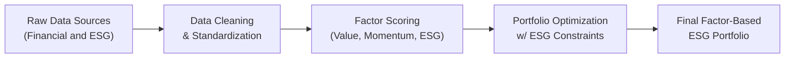

## Background and Motivations

I remember first hearing about Environmental, Social, and Governance (ESG) factors when I was chatting with a friend at a crowded finance conference. She said, “You know, it’s not just about picking undervalued stocks anymore—clients want to invest in companies that don’t pollute the rivers they fish in.” That statement stuck with me. ESG used to seem like a niche consideration for philanthropic funds, but nowadays, it’s practically mainstream, shaping the way many of us approach investments. Factor investing—targeting measurable characteristics or “factors” such as Value, Momentum, and Low Volatility—has also been mainstream in modern portfolio theory for some time. The natural next step is to integrate ESG metrics into factors to address reputational, regulatory, and stakeholder risks while potentially capturing outperformance (or alpha).

So, if we’re going to talk about integrating ESG and factor investing, we should consider the underlying motivations:

• Increased Investor Demand: Many investors want portfolios that reflect their values and also reduce exposure to companies with poor ESG practices, which often face regulatory or reputational problems.  
• Potential for Alpha Generation and Risk Mitigation: Beyond ethics, there’s a view that well-governed, socially responsible firms with sound environmental practices might be more resilient long-term.  
• Regulatory Shifts: Various jurisdictions have started introducing guidelines or mandatory ESG reporting, so ignoring ESG might become riskier.  

At its core, ESG is about measuring corporate behavior—not just outcomes for shareholders, but for stakeholders like employees, communities, and the environment. That broader scope provides a new vantage point for factor strategies, which historically zeroed in solely on financial metrics.  

## Overview of Factor Investing

Before diving into the details of integrating ESG into factor strategies, it’s good to revisit what factor investing means in practice. Factor investing is all about systematically choosing securities that exhibit certain attributes—“factors”—that, over time, have helped generate returns above a market-cap–weighted benchmark. Commonly recognized factors include:

• Value: Stocks with low price multiples relative to fundamentals (e.g., price-to-book).  
• Momentum: Stocks that have performed relatively well in recent history.  
• Low Volatility: Stocks with historically lower return variance.  
• Quality: Firms with strong balance sheets, stable earnings, and good governance.  
• Size: Tendency for smaller-capitalization stocks to outperform large caps over the long run.  

Now, imagine you layer an **ESG (Environmental, Social, Governance)** component on top. You might systematically tilt your portfolio toward companies that have high ESG scores or strong governance practices. Alternatively, you might exclude the worst polluters, or overweight activity in green technology. 

## Approaches to ESG Integration in Factor Investing

### Negative (Exclusionary) Screening

Negative or exclusionary screening is the simplest method. You remove companies that fail to meet certain ethical or sustainability standards (e.g., tobacco, firearms, or very high carbon emitters). Let’s say you have a global equity factor portfolio focusing on Value. You could still look for undervalued companies, but you’d exclude those from controversial industries or with the worst ESG ratings.

Advantages of negative screening:  
• Straightforward risk reduction (e.g., reputational, regulatory).  
• Quick implementation using publicly available exclusion lists.  
• Aligned with investor values: easy to communicate to clients who want to avoid specific industries.  

However, you might end up with a narrower investment universe, which may reduce diversification or factor intensity.

### Positive (Best-in-Class) Screening

In positive or best-in-class screening, you look for the “best” ESG performers within each sector or industry. You don’t necessarily exclude entire sectors—say, utilities or heavy industrials—but you select companies with comparatively better ESG scores and potentially overweight them. This approach keeps your factor tilts intact while nudging you toward more sustainable or responsible industry leaders.

For instance, you might combine a **Quality** factor approach—preferring companies with strong financials—and incorporate a best-in-class ESG overlay that leads you to overweight the top ESG quintile in each relevant industry. This method can preserve diversification and still align with sustainability goals.

### Thematic Integration

Some investors choose **thematic integration**, where they target particular ESG issues. For example, if an investor is passionate about renewable energy, they might integrate that theme by overweighting companies developing cutting-edge solar or wind technology. It’s a narrower scope but can be combined with factor strategies—like searching for “value” within a universe of green energy firms. 

Thematic funds often address pressing global concerns and can satisfy investor appetite for aligning capital with personal or institutional missions. This approach can also be dynamic; for instance, an investor might rotate among different ESG themes (clean water, gender diversity, sustainable forestry) as opportunities arise. 

### Full ESG Integration

In **full integration**, ESG metrics become a core part of your factor model. Instead of just a screen or a tilt, you treat ESG data as fundamentally on par with traditional financial metrics. One example could be:


\text{Combined Factor Score}_i = w_v \times \text{Value}_i + w_m \times \text{Momentum}_i + w_{esg} \times \text{ESG}_i,


where \\( w_v, w_m, \\) and \\( w_{esg} \\) are weights allocated to the Value, Momentum, and ESG factors respectively for stock \\( i \\). In practice, you might refine the ESG factor further into subfactors—like environment, social, and governance—and treat each dimension with its own weight. 

## Addressing ESG Data Quality Issues

With factor strategies, the old saying “garbage in, garbage out” definitely applies. If your ESG data is questionable, your factor-based decisions may be suboptimal or even misleading. Well, ESG data can vary significantly depending on the rating agency: one firm might give a top ESG rating to a company that another rates as mediocre. This variability stems from different methodologies, weightings, and definitions of “good” governance or “sustainable” environmental policies.

### Inconsistent Methodologies and Subjectivity

Agencies such as MSCI, Sustainalytics, and FTSE Russell may emphasize different components. Some weigh governance heavily, while others zero in on carbon footprint. As a result, the same company can receive widely different ESG scores. It’s important to:

• Understand each data provider’s methodology.  
• Consider combining multiple providers or refining the data using your own proprietary adjustments.  
• Remain aware of potential subjectivity (e.g., companies with slick marketing might appear better than they actually are).

### Coverage Gaps

Not all companies disclose the same level of detail, and smaller companies may not report extensive ESG metrics at all. This coverage gap can be problematic, especially in a **Size** factor strategy that includes small-caps. A few strategies to address coverage gaps include:

• Building in-house estimates or proxies for smaller firms.  
• Applying industry averages or penalizing companies lacking data.  
• Using alternative data sources (e.g., satellite imaging for pollution) to create custom indicators.

### Proprietary ESG Factors

Creating a **proprietary ESG factor** can help address data inconsistency. For instance, you might combine multiple data vendors, weigh them based on historical accuracy, and incorporate your own fundamental analysis. If you measure something like “employee retention rates” or “patent portfolio in clean technologies,” that can be an ESG metric with predictive power but might not appear in third-party data.  

This approach requires significant resources—data scientists, sustainability experts, and robust risk modeling—but can give your portfolio a unique edge, especially in an increasingly crowded space.

## Portfolio Construction and Optimization Considerations

From a portfolio construction standpoint, integrating ESG with factor investing can be done in multiple ways. One typical method is to optimize a portfolio subject to ESG constraints or targets. For instance, you might impose a “maximum carbon footprint” or require that the portfolio meets a minimum average ESG rating. 

The optimization might look something like this in pseudo-form:

• Maximize Factor Exposure: e.g., a combined exposure to Value and Momentum.  
• Subject to ESG Constraints: “Portfolio carbon intensity ≤ X,” or “Minimum average ESG rating ≥ Y.”  
• Subject to Risk Constraints: “Tracking error ≤ Z,” or “Beta around 1.0 relative to a broad index.”  

Below is a simple Mermaid.js diagram that illustrates how ESG data and factor scores might flow into a portfolio optimization process:



### Balancing Performance Goals with Corporate Governance

Sometimes, you might notice that strong governance correlates with lower volatility or higher profitability—both relevant to factor-based investing. On the other hand, emphasizing certain ESG issues (like a major shift away from fossil fuels) could introduce sector biases. The key is finding a balance between meeting your long-term performance targets and embedding your ESG beliefs. 

## Real-World Case Studies

Let’s say you have a pension fund that’s historically used a Quality factor tilt. Over the past decade, they realized that many strong-ESG companies also display hallmarks of high Quality—such as less litigation, lower regulatory fines, and stable stakeholder relationships. By integrating an ESG factor overlay, they discovered that they improved the portfolio’s risk-adjusted returns, arguably because well-governed and environmentally sound firms faced fewer negative surprises.

Another anecdote: a sovereign wealth fund integrated carbon footprint constraints into their existing Value and Momentum program. This forced them to drop or underweight coal-heavy utilities and some petroleum companies with poor environmental track records. Over a multi-year horizon, the resulting portfolio was less volatile whenever fuel prices or carbon regulations were in the news. The fund viewed this as a double advantage: risk mitigation plus alignment with national sustainability policies.

## Practical Implementation Tips

• Start Simple: If you’re new to ESG integration, consider a negative screen or best-in-class approach that keeps factor exposures intact.  
• Combine Data Providers: Use multiple ESG rating agencies to reduce bias and coverage gaps, or at least thoroughly understand each data provider’s methodology.  
• Integrate Thoroughly: Over time, consider adding a dedicated ESG factor or subfactors to your existing factor suite. This helps retain a systematic approach and can add genuine diversification benefits.  
• Monitor Regulatory Changes: ESG disclosure rules, carbon regulation, and stakeholder activism can change quickly, so keep an eye on new laws or reporting standards.  

## Python Code Snippet: Merging ESG Data with Factor Scores

Sometimes it helps to see how one might handle the data. The following Python snippet (simplified for illustration) merges a factor score dataset with ESG ratings and creates a combined factor score.

```python
import pandas as pd

# Both have a 'ticker' column

# Example esg_ratings columns: ['ticker', 'esg_score']

combined_df = pd.merge(factor_scores, esg_ratings, on='ticker', how='inner')

w_value = 0.4
w_momentum = 0.4
w_esg = 0.2

combined_df['combined_factor_score'] = (w_value * combined_df['value_score'] +
                                        w_momentum * combined_df['momentum_score'] +
                                        w_esg * combined_df['esg_score'])

top_assets = combined_df.nlargest(int(len(combined_df)*0.1), 'combined_factor_score')

print(top_assets[['ticker', 'combined_factor_score']])
```

This snippet demonstrates how you can incorporate a basic ESG weighting into your existing factor model. Of course, real implementations might be more advanced, but the principle is the same—systematically adding ESG into your factor scoring system.

## Exam Tips and Key Takeaways

When preparing for exams (and real-world scenarios), keep these points in mind:  

• Understand the differences among ESG approaches. You might see questions about negative (exclusionary) vs. positive (best-in-class) screening, or the detail-oriented full integration.  
• Watch for data pitfalls: coverage gaps, inconsistent methodologies, or “greenwashing” can appear in integrated case studies.  
• Connect ESG to alpha and risk: exam questions often ask about how ESG might reduce downside risk or generate stable returns.  
• Keep an eye on the broader portfolio context: be prepared to discuss how implementing an ESG tilt might affect risk/return characteristics.  

In the short term, ESG integration may create small tracking error vs. more conventional factor portfolios. However, in the long term, many practitioners argue that robust ESG profiles can reduce unforeseen liabilities and lead to more stable, attractive performance.

## References and Further Reading

- CFA Institute Research Foundation. (Year). “Integrating ESG into Factor Investing.”  
- Eccles, R. and Krzus, M. (2010). “One Report: Integrated Reporting for a Sustainable Strategy.”  
- PRI (Principles for Responsible Investment). “Guide to ESG Integration in Equities.” Available at:  
  https://www.unpri.org  

------------------------------

## Test Your Knowledge: ESG and Factor Integration Essentials



### Which of the following best describes a main Driver for Combining ESG with Factor Investing?

- [ ] Reducing portfolio diversification by focusing on narrow themes
- [x] Meeting investor demand for sustainable, values-aligned portfolios and mitigating reputational risk
- [ ] Elimination of all sector exposures
- [ ] Increasing portfolio turnover via frequent ESG rebalancing

> **Explanation:** Integrating ESG with factor investing is often motivated by the desire to align with investor values, control reputational/regulatory risk, and potentially enhance long-term performance.

### In a best-in-class screening approach, portfolio managers typically:

- [ ] Exclude entire sectors that are considered “unethical.”
- [ ] Overweight all poor ESG performers.
- [x] Select the top ESG performers within each industry or sector.
- [ ] Hard-code the portfolio to replicate a standard benchmark without changes.

> **Explanation:** Best-in-class screening means that within a sector or industry, you choose the companies that excel in ESG performance rather than excluding the entire sector.

### Which of the following is a key challenge when integrating ESG Scores into factor strategies?

- [ ] All ESG data vendors have identical scoring metrics.
- [ ] Regulatory authorities enforce only one universal ESG scale.
- [x] Inconsistent ESG methodologies and coverage gaps across vendors.
- [ ] ESG data is always more accurate than financial data.

> **Explanation:** A major challenge is that each ESG rating agency uses different methodologies and coverage levels, leading to inconsistent scoring across companies.

### In full ESG Integration, ESG factors are treated:

- [ ] As optional data points that do not influence final weights.
- [x] On par with traditional financial metrics, forming an integral part of factor models.
- [ ] As an afterthought once other factors are set.
- [ ] Exclusively for negative screening.

> **Explanation:** Full ESG integration means ESG metrics are incorporated directly into the factor model, weighted alongside traditional factors like Value or Momentum.

### What is one common advantage of implementing negative screening?

- [ ] Unlimited diversification across all industries.
- [ ] Immediate improvement in market timing capability.
- [ ] Guaranteed outperformance of the benchmark.
- [x] Straightforward exclusion of specific controversial industries or firms.

> **Explanation:** Negative screening simply removes companies that don’t meet certain ESG criteria from the investable universe, making it a straightforward strategy.

### An investor wants to overweight high-governance rated stocks within a Factor Momentum portfolio. This approach is considered:

- [x] A positive screening method.
- [ ] A negative screening method.
- [ ] A purely thematic approach.
- [ ] A full divestment strategy.

> **Explanation:** Overweighting high-governance rated stocks is an example of best-in-class or positive screening, focusing on improving governance profiles within an existing strategy.

### Coverage gaps in ESG data most frequently pose challenges for:

- [ ] Large-cap blue-chip equities with extensive data coverage.
- [x] Small-cap or less-regulated international companies.
- [ ] Government bond markets only.
- [ ] All companies uniformly.

> **Explanation:** Smaller or international firms often have less robust ESG disclosures, so coverage gaps are more likely.

### The use of a proprietary ESG scoring framework typically helps a portfolio manager:

- [x] Reduce reliance on third-party data and potential biases.
- [ ] Avoid any additional resource costs in data analysis.
- [ ] Eliminate the need to monitor any ESG trends.
- [ ] Comply with government ESG mandates directly.

> **Explanation:** Proprietary ESG scoring can address limitations from external rating agencies, although it often requires more resources to develop and maintain.

### When a portfolio manager sets a maximum “carbon footprint” constraint during optimization:

- [ ] All holdings must come from the Energy sector.
- [ ] The portfolio can invest only in emerging markets.
- [ ] There is no limit to the portfolio's carbon intensity.
- [x] The portfolio aims to meet a specified emission target or threshold.

> **Explanation:** Imposing a maximum carbon footprint constraint is a way to ensure the portfolio does not exceed a set level of carbon emissions.

### True or False: ESG considerations can serve as a factor in multi-factor models, weighted alongside attributes like Value or Momentum.

- [x] True
- [ ] False

> **Explanation:** ESG can be treated as an additional factor in a multi-factor model and allocated an appropriate weight, just like Value, Momentum, and other standard factors.


