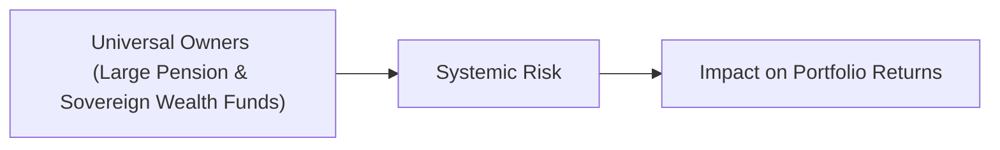

## Introduction

Large institutional investors—think of global pension funds or sovereign wealth funds—often hold a vast array of stocks, bonds, and alternative assets worldwide. Because their holdings are so comprehensive, their portfolios essentially mirror the markets, economies, and communities where they operate. This phenomenon has led to the concept of “universal owners.” By their nature, universal owners have a strong incentive to ensure stable markets and mitigate systemic threats, such as environmental crises or financial contagion.

In many ways, universal owners are on the front lines of advocating against harmful corporate practices. The reason is simple: if a company in their portfolio contributes to major market externalities—heavy carbon emissions, for example—everyone eventually pays a price, including the universal owner itself. So from a high-level perspective, universal owners can’t easily sidestep systemic risk through mere portfolio reallocation. They must address systemic issues at the source.  

Below, we’ll explore how the universal ownership structure gives rise to unique sets of responsibilities, challenges, and potential solutions. We’ll also highlight collective initiatives (e.g., Climate Action 100+) and describe how multi-trillion-dollar pools of capital have become engines of global behavior change. Finally, we’ll examine how fiduciary duties and stewardship goals can conflict—and how best to navigate that tension.  

## Understanding Universal Owners

The term “universal owner” refers to an institutional investor with large, globally diversified holdings that essentially represent a slice of the global economy. This slice may comprise hundreds or even thousands of public companies, spanning multiple sectors and regions. Pension plans, sovereign wealth funds (SWFs), and certain insurance companies often fit this description.  

A classic example is a national pension plan that invests contributions from millions of workers. Because it must pay out benefits well into the future, it cannot simply exit broad swaths of the capital markets. Selling all carbon-producing companies or other “undesirable” investments is complicated, and doing so doesn’t necessarily solve the underlying problem if those companies continue operating in ways that harm the market’s broader stability.  

As universal owners, these large funds face unavoidable exposure to systemic risk. In a perfect world, they’d prefer each investee company to remain profitable, pay dividends, and grow responsibly without creating long-term costs to society. But that’s rarely how markets behave.  

## The Systemic Risk Dimension

Systemic risk is about those large-scale exposures that no single investment decision can fully avoid. Even if an investor tries to diversify, events such as a worldwide financial meltdown, severe environmental degradation, or a geopolitical crisis can cause correlated losses across the entire market.  

For universal owners, systemic risk becomes especially relevant:

• Broad Exposure: They own so many different assets (equities, bonds, alternatives) that a large systemic disruption will almost certainly ripple through their entire portfolio.  
• Long Horizons: With enormous capital bases and long investment horizons, they anticipate future liabilities that span decades. If the market falters or entire industries become unviable, they can’t easily sell everything overnight.  
• Fiduciary Duty: They must protect beneficiaries’ best interests, balancing near-term returns against an array of longer-term threats.  

### Visualizing Universal Ownership

Below is a simple Mermaid diagram to illustrate how universal owners, systemic risk, and portfolio returns connect:



The diagram highlights how universal owners are directly impacted by systemic risk, which in turn influences their overall portfolio performance.

## The Stakes: Externalities and the Search for Stability

Externalities are the side effects—positive or negative—that economic transactions impose on third parties who did not choose to incur them. A coal-fired power plant that emits pollutants exemplifies a negative externality. While the power plant may record profits, the broader society bears health risks, environmental degradation, and often the financial burden of cleanup efforts.  

For a universal owner, it makes little sense for one of its portfolio companies to gain from externalities if those costs then ripple back into the broader economy and ultimately harm other parts of the portfolio. In other words, if a sovereign wealth fund’s oil producer is highly lucrative but simultaneously contributes to climate change, the resulting natural disasters or economic instabilities could erode the returns of the fund’s real estate investments, infrastructure holdings, or consumer goods portfolios.  

### Spotting the Broader Effects

Consider the water usage of an over-irrigated region. Excessive agricultural water consumption might help local farms in the short term but could worsen drought conditions, spark migration, or damage infrastructure. All these impacts could depress property values—and, if you’re a universal owner investing in local bonds or real estate, you’ll feel those losses.  

This interconnectivity is why universal owners often promote corporate policies that account for environmental and social externalities—because ignoring them ends up introducing hidden, longer-term cost structures across the entire portfolio.

## Pushing for Change: Collaborative Initiatives

One prominent illustration of universal owners wielding collective influence is the Climate Action 100+ initiative. This coalition comprises some of the world’s largest institutional investors, representing trillions of dollars in assets under management. Their goal is to engage companies responsible for a substantial proportion of global emissions, pushing them to reduce carbon footprints, improve climate disclosures, and implement sustainable business practices.  

### Climate Action 100+: How It Works

• Identification of Major Emitters: The initiative targets the largest greenhouse gas emitters, typically focusing on around 100 to 160 companies.  
• Engagement and Dialogue: Investors collectively request better emissions reporting, greenhouse gas reduction targets, and governance structures that address climate risk.  
• Accountability: The initiative measures progress, publicly recognizes improvements, and signals further steps if companies fail to meet engagement objectives.  

Why does this matter to universal owners? When you control such large pools of capital, a lot of doors open. CEOs and boards cannot ignore the voice of a consortium that collectively manages multi-trillion-dollar portfolios. By holding these corporations accountable to climate goals, universal owners are also protecting the long-term returns of the entire market ecosystem they have a stake in.

## The Challenge: Fiduciary Responsibility vs. Broad ESG Goals

Right, so this all sounds great, but there’s a big question: how do universal owners reconcile their fiduciary responsibility with the pursuit of such comprehensive ESG objectives?  

A fiduciary typically must prioritize financial returns for the ultimate beneficiaries of the fund (e.g., retirees, citizens, or policyholders). But if dirty industries yield high short-term returns, is it a breach of duty to limit investment in them or demand that they adopt sustainable practices that might cut into quarterly profits?  

### Balancing Financial and Social Outcomes

Over the years, major investors have begun to argue that the creation of sustainable, long-term returns requires attention to social and environmental factors. Adopting a strict ESG stance doesn’t necessarily conflict with fiduciary duty, especially if ignoring climate change or social upheavals leads to negative outcomes for the portfolio in the future.  

In fact, a growing body of research suggests that negative externalities eventually manifest as tangible financial costs—through lawsuits, regulatory fines, reputational damage, and physical damages from climate-related events. We can think of short-term profit as “borrowing” from the well-being of future markets. A universal owner’s job is partly to manage that “debt” in a way that avoids major liabilities down the road.

## Implementation: Aligning Ownership With Impact

Aligning universal ownership structures with the pursuit of broad stewardship goals is easier said than done. Here are some of the biggest challenges:

• Diverse Stakeholders: A sovereign wealth fund might serve broader national interests, whereas pension funds must cater to current and future retirees. Aligning internal stakeholders can be complicated.  
• Data and Metrics: Evaluating the impact of externalities often requires extensive data gathering. If a company doesn’t publicly disclose its carbon footprint, it’s difficult to measure or benchmark.  
• Conflicting Investment Mandates: Some beneficiary groups or political figures might demand immediate returns, even if that means ignoring externalities.  

### Addressing These Hurdles

1. Enhanced Disclosures: Universal owners often advocate for better environmental and social disclosures. This helps them measure risk and engage meaningfully with corporate boards.  
2. Collaborative Platforms: Beyond Climate Action 100+, there are multiple investor network organizations (e.g., the UN-backed Principles for Responsible Investment) where issues like net-zero transitions are discussed, and engagement strategies are aligned.  
3. Proxy Voting and Board Representation: Some large funds use proxy voting to influence board compositions and corporate goals.  
4. Policy and Regulatory Advocacy: Universal owners sometimes encourage governments to implement policies that price in externalities, such as carbon taxes, so that the broader market can shift more efficiently.

## A Quick Numerical Example

Let’s imagine a sovereign wealth fund that invests in 20 major multinational companies. Assume each company has a market capitalization that heavily depends on stable global supply chains and moderate climate conditions.

• Expected Annual Return for the Entire Portfolio (E[R_p]): 7%  
• Probability of a Severe Climate Crisis in the Next 10 Years that Affects Global Markets (p_crisis): 15%  
• Loss in Annual Returns if Crisis Occurs (L): 3% (meaning returns drop from 7% to 4%).

We could do a simplified expected return calculation incorporating crisis risk:


\text{Expected Return with Crisis Probability} = (1 - p_\text{crisis}) \times 0.07 + (p_\text{crisis}) \times (0.07 - 0.03).


Plugging in numbers:


= 0.85 \times 0.07 + 0.15 \times 0.04 = 0.0595 + 0.006 = 0.0655 = 6.55\%.


Now, if this universal owner believes that pressing for better climate practices reduces the probability of crisis from 15% down to, say, 10%, the expected return calculation changes, and the portfolio’s risk-adjusted profile could improve significantly. This is an extremely simplified illustration, but it shows how even a modest shift in systemic risk probabilities can impact overall returns in a big portfolio.

## Personal Reflections

I once chatted with a manager from a multi-billion-dollar pension fund who said, “Honestly, there’s nowhere to hide when you’re the size of an economy.” They felt that any short-term attempt to maximize returns at the expense of climate or social stability was akin to “shooting themselves in the foot” in the long run.  

Sometimes, the trickiest part is persuading stakeholders who only see the next quarterly return. But the bigger the fund, the more crucial it is to think several decades down the line. After all, a pension’s entire mandate is inherently long-term, right? And if their beneficiaries’ quality of life declines due to economic or environmental crises, no short-term return spike can offset that cost.

## Best Practices and Common Pitfalls

Below are strategies that universal owners can use to manage systemic risk more effectively, as well as pitfalls that can derail their efforts.

### Best Practices

• Integrate ESG into Corporate Engagement: Don’t just talk about it—vote proxies, attend shareholder meetings, and push for robust disclosures.  
• Form Coalitions: Partner with other large funds to amplify your voice in corporate boardrooms and regulatory halls.  
• Think in Systems: Encourage product life-cycle assessments so that externalities are accounted for at each stage of development.  
• Innovate Engagement Metrics: Develop standardized metrics for climate exposures, water usage, or social equity measures.

### Common Pitfalls

• Overemphasis on Immediate Returns: Some managers may appease vocal constituents or political leaders at the expense of long-term risk management.  
• Insufficient Resources for Stewardship: Effective engagement requires time, expertise, and money. Without enough staff or specialized knowledge, efforts may fall flat.  
• Underestimating Political and Regulatory Risks: Legislation can drastically change an industry’s externality costs overnight (e.g., carbon taxes or emissions regulations).  
• Fragmented Approaches: If internal teams (equity, fixed income, alternatives) don’t coordinate on ESG objectives, corporate engagement can become inconsistent.

## Tools and Python Example for Correlation Analysis

When universal owners evaluate market-wide exposures, they often measure correlations among various assets and factors to understand how systemic shocks might propagate. Here’s a tiny Python snippet that demonstrates how one might calculate correlation between two sets of returns—one for the fund’s equity portfolio and one for the broader market. Although simplistic, it illustrates how universal owners might gather evidence to guide their engagement strategies:

```python
import numpy as np

fund_returns = np.random.normal(0.06, 0.02, 100)  # mean=6%, std dev=2%
market_returns = np.random.normal(0.05, 0.02, 100)

correlation_matrix = np.corrcoef(fund_returns, market_returns)
correlation = correlation_matrix[0, 1]

print("Correlation with market:", correlation)
```

In reality, universal owners often run far more complex models spanning multiple asset classes and stress-testing them for different systemic events. But the core idea remains: a strong correlation with broad market factors indicates a higher vulnerability to systemic shocks.

## A Brief Look at Stewardship Goals

Stewardship is about actively overseeing investee companies to ensure that they manage risks appropriately and pursue sustainable practices aligned with longer-term portfolio success. For universal owners:

• Stewardship Goals may include reducing carbon footprints, improving labor standards, or enhancing the diversity of boards.  
• The underlying rationale is that these improvements promote stability and improve risk-adjusted returns.  
• Campaigns like Climate Action 100+ exemplify how stewardship can scale across many industries.

## Regulatory and Policy Alignments

Powerful institutional investors frequently collaborate with regulators to internalize externalities. For instance, the introduction of carbon pricing or mandated climate-disclosure rules can align private sector interests with broader sustainability objectives. Universal owners often provide testimony in legislative forums, produce white papers for policymakers, or serve on advisory boards to influence policy in these areas.

## Potential Future Developments

It’s possible that over the next decade, the universal owner approach will continue to accelerate. Here are some likely trends:

• More Use of Big Data: Tools that scrape real-time supply chain or satellite data to monitor environmental footprints.  
• Increased Emphasis on Social Factors: As social inequality intensifies in certain regions, universal owners may demand better corporate practices around fair wages and equitable treatment of communities.  
• New Investment Products: Market-based mechanisms to insure, hedge, or commoditize certain aspects of climate or social risks, possibly with the help of government or multi-lateral organizations.  

## Exam Tips: Navigating Systemic Risk as a Universal Owner

From a CFA Level III perspective, you might encounter exam scenarios where you are asked to recommend policy actions or engagement strategies for a large fund exposed to system-wide threats. Key points to remember:

• Emphasize Long-Term Horizons: Stress the alignment of ESG considerations with beneficiary interests.  
• Engage, Don’t Abandon: Demonstrate why engagement might be more effective than simple divestment in mitigating systemic risks.  
• Apply Multi-Asset Perspectives: Show how equity, fixed income, and alternative assets face correlated risks during systemic events.  
• Identify Key Governance Considerations: The exam might test your ability to articulate roles of boards, committees, or specialized ESG teams.  
• Global Collaboration: Expect questions on how universal owners can collaborate with other funds or institutions, using real-world initiatives such as Climate Action 100+ as examples.

## References and Further Reading

- UNEP FI. “The Principles for Responsible Banking & Investing.”  
- CFA Institute. “Systemic Risk and Large Institutional Investors.”  
- Ang, A. (2014). “Asset Management: A Systematic Approach to Factor Investing.”  
- Climate Action 100+: climateaction100.org  

  
## Test Your Knowledge: Universal Owners and Systemic Risk Quiz



### Which of the following best describes a universal owner?  
- [ ] A small private equity firm that invests in high-yield bonds exclusively.  
- [ ] A hedge fund that focuses on short-term trades in a single industry.  
- [x] A large institutional investor with a diversified portfolio covering the majority of the market.  
- [ ] An individual investor holding a mix of domestic and foreign stocks in a personal account.  

> **Explanation:** Universal owners typically hold broad slices of the market, often encompassing many sectors and regions.  

### Which term refers to costs or benefits not reflected in market prices, such as pollution or social impact?  
- [ ] Fiduciary Responsibility  
- [ ] Systemic Risk  
- [ ] Stewardship Goals  
- [x] Externalities  

> **Explanation:** Externalities are impacts (often environmental or social) that affect parties outside the immediate transaction.  

### Why do universal owners place a high priority on stable markets and sustainable business practices?  
- [ ] They require short holding periods to maximize arbitrage opportunities.  
- [ ] They can easily offload positions to avoid exposure to systemic risks.  
- [x] They hold diversified, long-term positions that are inherently vulnerable to market-wide disruptions.  
- [ ] They seek to reduce diversification and concentrate on stable assets only.  

> **Explanation:** By holding diversified stakes across multiple industries, universal owners cannot escape negative externalities or systemic risks—hence, they strive to stabilize markets.  

### What is a primary goal of the Climate Action 100+ initiative?  
- [ ] To lobby for the elimination of sovereign wealth funds.  
- [ ] To lower interest rates for highly indebted corporations.  
- [x] To engage with the world’s largest greenhouse gas emitters on climate disclosures and emissions reductions.  
- [ ] To exclusively short-sell fossil fuel companies in global markets.  

> **Explanation:** Climate Action 100+ focuses on collaborative engagement with major GHG emitters to promote sustainability and responsible reporting.  

### Which of the following is NOT typically viewed as a best practice for universal owners in mitigating systemic risk?  
- [ ] Using coordinated shareholder votes to influence boards.  
- [ ] Advocating for better disclosures of environmental impacts.  
- [ ] Collaborating with other large investors on engagement efforts.  
- [x] Abandoning all carbon-intensive sectors to avoid any climate-related exposure.  

> **Explanation:** Simply divesting from an entire sector doesn’t necessarily mitigate systemic risk and can neglect opportunities for engagement-driven change.  

### Which statement best reflects the tension between fiduciary duty and ESG objectives for universal owners?  
- [x] There may be a perceived short-term conflict, but both objectives align over the long run.  
- [ ] Fiduciary duty never conflicts with ESG objectives in any circumstance.  
- [ ] ESG objectives must always be sacrificed for immediate returns.  
- [ ] Long-term returns have no connection to ESG considerations or externalities.  

> **Explanation:** While short-term returns might appear to conflict with ESG, ignoring externalities can harm long-term performance, so both goals tend to align over a suitably long horizon.  

### In practice, universal owners often prefer engagement over blanket divestment because:  
- [x] Engagement can influence corporate policies, addressing systemic risk at its source.  
- [ ] Divestment is always prohibited by regulatory bodies.  
- [ ] Divestment yields the same results as engagement but takes longer.  
- [ ] Engagement rarely produces meaningful change in corporate governance.  

> **Explanation:** Engagement strategies give large investors leverage to demand improved corporate conduct, thereby tackling negative externalities and aligning with long-term portfolio stability.  

### Why is systemic risk particularly challenging for universal owners?  
- [ ] They can purchase comprehensive insurance against all systemic events.  
- [x] Their broad exposure means they cannot easily escape widespread market disruptions.  
- [ ] They have short investment horizons, so they can time the market effectively.  
- [ ] They remain unaffected by macroeconomic shocks.  

> **Explanation:** Because universal owners invest in so many parts of the market, they’re inherently susceptible to broad-based shocks.  

### Which of the following strategies helps universal owners in measuring the impacts of externalities?  
- [x] Advocating for better disclosures and standardized reporting on ESG dimensions.  
- [ ] Restricting the use of proxy voting and board engagement.  
- [ ] Avoiding collaboration with investor networks.  
- [ ] Outsourcing all risk analyses to retail investors.  

> **Explanation:** Accurate disclosures enable universal owners to assess and engage on ESG-related risks and externalities effectively.  

### True or False: Climate Action 100+ focuses exclusively on short-term profit maximization for investors in heavy-emitting industries.  
- [ ] True  
- [x] False  

> **Explanation:** Climate Action 100+ is an investor-led initiative aimed at curbing emissions and encouraging responsible corporate behavior, not short-term profit maximization.  


