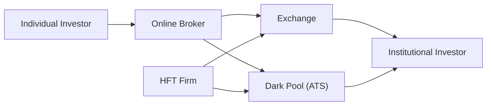

## The Changing Nature of Market Microstructure

Market microstructure, in a nutshell, deals with how securities are traded, how market participants reach consensus on prices, and how trades actually get executed. It’s that behind-the-scenes machinery you might not think about daily—until something goes wrong. I once had a friend who tried to execute a fairly large order right at market open, thinking it would be no big deal. She was shocked when the fill price came back quite different from her initial expectation. Turns out, she was dealing with a thin market and early-morning volatility. This is just one tiny example of how the structure of a market and the timing of trades can affect execution quality and pricing outcomes.

Anyway, over the last decade, the pace of change in market microstructure has been stunning. We’ve got high-frequency trading (HFT) algorithms that zip along at milliseconds or even microseconds, dark pools that allow institutions to quietly shift large volumes of shares, and alternative trading systems (ATS) popping up to challenge traditional exchanges. This ecosystem is further complicated by new players such as blockchain-based exchanges, peer-to-peer (P2P) trading protocols, and digital platforms that promise zero commissions to retail investors. But wait, it’s not all about shiny tech—there are real issues with best execution, fairness, and market fragmentation that keep regulators up at night.

## Growth of High-Frequency Trading

High-Frequency Trading (HFT) typically refers to applying super-fast, algorithmic strategies seeking short-term inefficiencies—sometimes measured in mere microseconds. These firms use co-location (situating their servers physically close to the exchange matching engine) and advanced hardware to minimize latency. That’s because every split second can count when you’re trying to exploit fleeting price differentials.

While HFT strategies can add liquidity to the market and tighten bid–ask spreads, there are also concerns that they might increase instability or amplify flash crashes. The infamous “Flash Crash” of 2010, during which the Dow Jones Industrial Average briefly plunged nearly 1,000 points, is often cited as a cautionary tale. Even though no single HFT firm was exclusively responsible, the structural vulnerabilities in the system became glaringly evident.

For a simple hypothetical example, suppose an HFT algorithm spots that a stock trades at $10.00 on one exchange, while the same stock trades at $10.01 on another. The algorithm might buy the lower-priced share and instantly sell on the higher-priced market. These tiny arbitrages, repeated thousands of times a session, can yield significant daily profits. But if you and I cling to old-school methods—like calling a broker and waiting a minute or two to place an order—our experience becomes drastically different. HFT is here to stay, so the challenge is determining how it can be best integrated and regulated to maintain a fair playing field.

## Emergence of Dark Pools and Alternative Trading Systems

Dark pools are private exchanges or trading venues that let investors—particularly large institutions—trade anonymously. Market participants might enter big orders with minimal risk of exposing their intentions or moving the market price too much. It’s kind of like slipping into a quiet shop on a busy street to do your transaction without passersby noticing.

Alternative Trading Systems (ATS) are a broader category that includes dark pools and other non-traditional execution venues. They match buyers and sellers outside the purview of formal exchanges. For large institutional investors, ATS can reduce market impact costs. On the other hand, critics argue that dark pools reduce transparency and might fragment the market, complicating the search for best execution. In theory, if too much volume moves into these pools, price discovery on public exchanges might be impaired.

A typical scenario in a dark pool might look like this: A mutual fund manager wants to sell 500,000 shares of a mid-cap stock. Placing that order on an open exchange might drive the price down given the sheer size of the order. By placing the order in a dark pool, the manager reduces the risk of spooking the market. However, there’s still the possibility of interacting with opportunistic traders in that venue if it’s not carefully structured, which emphasizes the importance of selecting the right execution strategy.

## Blockchain-Based Exchanges and Peer-to-Peer Trading

We’re also seeing the rise of blockchain-based exchanges and P2P trading platforms. These are typically decentralized marketplaces enabling traders to circumvent traditional intermediaries. While many of these are in earlier stages, they promise faster settlement times (sometimes almost instantaneous), reduced transaction fees, and improved transparency. Think of blockchain-based exchanges as attempts to re-engineer the entire clearing and settlement system, which usually takes a couple of days (T+2 in many markets) to finalize trades. On a blockchain network, the settlement can occur in near real time, significantly shrinking counterparty risk.

Yet, this technology is still evolving—regulatory clarity, scalability, and user adoption remain big question marks. For instance, a platform might provide easy peer-to-peer trading for cryptographic tokens that represent shares in a company. In some pilot programs, these tokens could settle in seconds. But if the platform is not recognized by regulators or doesn’t have enough liquidity, it might not be a great alternative for mainstream institutional traders just yet. Over time, though, as more regulators warm up to distributed ledger technologies, we might see entire markets shift to these new rails.

## Market Fragmentation and Best Execution

One of the biggest byproducts of having so many competing venues—from major national exchanges, to dark pools, to ATS, to P2P networks—is market fragmentation. Picture someone searching for tickets to a concert across multiple reseller sites, plus the official box office, plus social media groups, plus a friend-of-a-friend. Great—there might be more opportunities, but it becomes trickier to find the best price. That’s exactly the challenge in finance: if liquidity is scattered, you might have to connect to multiple platforms to access the best quotes.

In a fragmented market, the concept of best execution takes center stage. Brokers have a fiduciary (or at least professional) responsibility to ensure orders are executed on the most advantageous terms available across multiple venues. This can involve looking for the best price, the lowest transaction cost, and the highest likelihood of completion. It’s why advanced order routing systems become so critical, scanning different platforms in a fraction of a second. Without a robust system, it’s easy to suffer from poor fills or partial executions.

However, best execution is about more than just the best price. Factors like speed of execution, reliability of order settlement, and cost (including implicit and explicit fees) should be evaluated. A slow fill at a slightly better quote might not be optimal if prices move before your order’s completed. For high-touch trades—like large block orders—brokers may design nuanced strategies that break trades into smaller slices, potentially crossing some in dark pools, some on the primary exchange, and so forth.

## Regulatory Perspectives

Regulators around the world recognize these trends. The European Union introduced MiFID II (Markets in Financial Instruments Directive II) to enhance transparency and investor protection. Among many provisions, it sets standards for market operators, demands pre- and post-trade transparency (with some waivers for large trades), and compels investment firms to achieve best execution on behalf of their clients. MiFID II also addresses issues around how research is paid for, which changes the economics of broker relationships.

In the United States, Regulation NMS (National Market System) stands as a key piece of legislation that mandates quotes be honored at the best available price across exchanges. Meanwhile, other jurisdictions have introduced or are in the process of introducing similar frameworks aiming to reduce the negative consequences of fragmentation and dark markets. That said, regulation often lags behind innovation. As blockchain-based trading or direct retail-access platforms grow, expect new rules to crop up around settlement, investor protection, and anti-money laundering (AML) compliance.

At times, these approaches differ by region, creating complexity for global market participants. Large institutional players must navigate a patchwork of testing and compliance across multiple geographies. This interplay of regulation, technology, and market behavior has been an ongoing theme for years, and it’s here to stay.

## The Rise of Digital Platforms for Retail Investors

In an era where you can do almost everything on your phone—order groceries, pay your bills, binge your favorite shows—it’s no surprise that trading has become equally accessible. Platforms like Robinhood in the US or Revolut in Europe have popularized commission-free or low-fee trading for retail investors. The speed and convenience is a huge draw. It’s not uncommon to see a wave of new retail investors jumping into the markets—sometimes armed with a smartphone, an app, and a few hundred dollars.

Now, these platforms leverage payment for order flow (PFOF) and sophisticated order routing. While you might pay zero direct commissions, the broker might be getting paid by market makers to send orders their way. This arrangement raises questions about conflict of interest and best execution. Some retail traders might not realize that zero-commission doesn’t necessarily mean zero cost. Indeed, these new models are forcing regulators to revisit how fairness and transparency should be safeguarded, especially for smaller investors who may not fully grasp market-structure complexities.

Nonetheless, the expansion of retail trading also fosters greater market participation and narrower bid–ask spreads, up to a point. A more inclusive market benefits everyone, as liquidity deepens. The key is ensuring proper protection for those less-experienced investors, so they’re not your proverbial “fish in the shark tank,” left vulnerable to more sophisticated players.

## Diagram: Simplified Market Structure

Below is a mermaid diagram illustrating a simplified layout of how different participants and venues might interact. This is just a stylized depiction to highlight the multiple paths an order might take:



From the individual investor’s perspective, the broker can route orders to either the primary exchange, a dark pool, or possibly other platforms—often using advanced routing logic. Meanwhile, institutional investors and high-frequency trading (HFT) firms interact directly (or via brokers) with both exchanges and dark pools.

## Practical Example: Measuring Execution Quality

Traders, especially portfolio managers who deal with large institutional orders, often rely on transaction cost analysis (TCA) to measure execution quality. TCA compares the actual execution price of a trade against relevant benchmarks, such as:

• Opening or closing price of the day.  
• Volume-weighted average price (VWAP).  
• Time-weighted average price (TWAP).  

For instance, if a large block order of 200,000 shares was executed at an average price of $51.20, while the VWAP for that period was $51.00, the trade might have underperformed by $0.20 per share. That difference, multiplied by the total trade size, equals a $40,000 shortfall. Part of your job, as a manager or broker, is to minimize that shortfall. Different trading venues and tactics—using dark pools for partial execution, employing specialized algorithms—are all levers you can pull.

## Best Practices and Common Pitfalls

• Comprehensive Order Routing: Don’t rely on only one or two venues. Advanced algorithms that scan multiple platforms can lead to better fills.  
• Regulatory Compliance: Stay updated on rules like MiFID II or Reg NMS; ignoring them can lead to hefty fines or forced changes in process.  
• Beware of Overfragmentation: Splitting liquidity across 20 venues might complicate monitoring. Too many slices can lead to partial fills and higher complexity.  
• Understand Dark Pool Mechanisms: Not all dark pools are the same; each has different rules about matching, fee structures, and participant types. Due diligence is essential.  
• Technology Risks: HFT and algorithmic trading are heavily reliant on technology. Latency spikes or system crashes can cause significant losses in short-lived markets.  
• Conflicts of Interest: Payment for order flow or certain fee arrangements can prioritize broker profit over client outcomes. It pays to ask tough questions about order routing.

## Collaboration with Other Portfolio Management Topics

This discussion on market microstructure dovetails with several themes spelled out in other chapters. For instance, when building multi-asset portfolios (see Chapter 14), considering liquidity conditions and how trades are executed across global markets can influence your approach to rebalancing. Similarly, from a risk management viewpoint (Chapter 6), understanding how rapidly you can unwind positions in different venues can be vital if you’re hedging or adjusting exposures under stress. The synergy between a well-planned asset allocation strategy and an effective execution framework often separates top-tier portfolio managers from the rest.

## A Quick Python Example for Trade Data Analysis

Below is a simplistic Python snippet that demonstrates how you might download and analyze a stock’s intraday trade data to measure slippage from your intended price—just a small taste of the possibilities.

```python
import pandas as pd
import yfinance as yf

ticker = "AAPL"
data = yf.download(ticker, period="1d", interval="1m")

intended_price = 150.00

data['slippage'] = data['Close'] - intended_price

print(data['slippage'].describe())
```

While the snippet above is simplistic—and real high-frequency analysis might require specialized APIs and raw tick data—it’s still valuable to see how quickly trades can deviate from a reference price in intraday trading.

## Final Thoughts for Exam Preparation

• Integrative Perspective: You might see exam questions tying together these market microstructure concepts with broader portfolio management scenarios—like evaluating trade costs under different rebalancing strategies or analyzing the risk implications of partial fills.  
• Focus on Regulation: Key regulations like MiFID II and Reg NMS often appear in questions about best execution and transparency. Be prepared to articulate their core objectives and impact thoroughly.  
• Highlight Impacts on Market Participants: Everyone from HFT firms to mainstream retirement-oriented investors can be affected by these structural shifts. Understanding the perspective of each stakeholder can help address scenario-based questions.  
• Ethical Dimensions: Keep the CFA Institute Code of Ethics in mind. For instance, how might dark pools or payment for order flow conflict with or align with best execution responsibilities?  
• Time Management on Answers: As with all Level I material, you’ll likely see multiple-choice or item-set questions that test your knowledge of definitions, pros/cons, and regulatory frameworks. Practice summarizing dense info quickly so you don’t run out of time.  

## References

• Madhavan, A. (2000). “Market Microstructure: A Practitioner’s Guide.”  
• CFA Institute. “Dark Pools, HFT, and Fragmentation in Equity Markets.”  
• Gomber, P., Arndt, B., & Lutat, M. (2011). “High-Frequency Trading.”  
• CFA Institute Code and Standards.  
• Various national regulations, including MiFID II (EU) and Reg NMS (US).  

## Test Your Knowledge: Future of Trading Platforms and Market Microstructure



### Which statement best defines market microstructure?

- [x] It explores how trades are executed, how market participants interact, and how prices are formed.
- [ ] It deals exclusively with high-frequency trading and dark pools.
- [ ] It only examines the role of technology in market volatility.
- [ ] It focuses on the behavioral biases of individual traders.

> **Explanation:** Market microstructure is not limited to just HFT or technology; it encompasses the full scope of how orders are handled, prices are discovered, and participants interface on trading venues.

### What is one major concern often associated with high-frequency trading?

- [ ] It always guarantees lower market volatility.
- [x] It may amplify sudden price movements, as seen in flash crashes.
- [ ] It eliminates the need for dark pools.
- [ ] It increases the time it takes to settle trades.

> **Explanation:** While HFT can improve liquidity and reduce spreads, it has also been tied to instances of rapid, destabilizing price movements (flash crashes).

### Which description best characterizes a dark pool?

- [x] A private exchange allowing investors to trade large blocks anonymously.
- [ ] A platform operated only by high-frequency traders.
- [ ] A regulated national exchange with full pre-trade transparency.
- [ ] A legalized money-laundering marketplace.

> **Explanation:** Dark pools are private and allow for large orders to be filled with minimal market impact, lacking the full pre-trade transparency of public exchanges.

### Why are blockchain-based exchanges anticipated to transform the trading landscape?

- [x] They offer the potential for faster settlement and reduced transaction costs.
- [ ] They make markets completely immune to price volatility.
- [ ] They prohibit any form of institutional trading.
- [ ] They operate under no regulatory oversight.

> **Explanation:** Blockchain exchanges can reduce settlement times significantly, which in turn lowers counterparty risk. However, they still face regulatory hurdles and scalability questions.

### How does market fragmentation affect finding best execution?

- [ ] It simplifies the process by limiting the potential trading venues.
- [x] It complicates order routing because liquidity is dispersed across multiple platforms.
- [ ] It eliminates the need for broker-dealers.
- [ ] It guarantees lower transaction costs in every instance.

> **Explanation:** With so many venues, order flow is scattered, forcing traders to coordinate across multiple platforms to secure the best price and fullest liquidity.

### What is a core goal of MiFID II in Europe?

- [ ] To abolish stock exchanges entirely.
- [x] To increase transparency and protect investors by ensuring best execution.
- [ ] To regulate only peer-to-peer lending platforms.
- [ ] To promote blockchain technology over all other trading venues.

> **Explanation:** MiFID II targets greater market transparency and a level playing field for investors, extensively covering best execution obligations and pre-/post-trade reporting.

### Which factor is commonly used in Transaction Cost Analysis (TCA)?

- [ ] The margin interest rate.
- [ ] Exchange membership dues.
- [x] Volume-weighted average price (VWAP).
- [ ] The broker’s annual client satisfaction score.

> **Explanation:** VWAP is a standard benchmark in TCA, helping traders measure the cost or benefit of their actual execution price relative to an average over the trading window.

### How can payment for order flow (PFOF) impact retail trading?

- [x] It may create conflicts of interest, as brokers receive compensation for routing orders.
- [ ] It guarantees that the investor always obtains the best market price.
- [ ] It is illegal across all major jurisdictions.
- [ ] It is a form of peer-to-peer networking for large block trades.

> **Explanation:** PFOF can cause potential conflicts between brokers’ monetary incentives and their duty to achieve best execution for the client.

### What is one possible drawback of overusing dark pools?

- [x] It reduces pre-trade transparency in the broader market.
- [ ] It ensures every trade is made public in real time.
- [ ] It eliminates the need for best execution considerations.
- [ ] It improves price discovery on public exchanges.

> **Explanation:** When too many trades happen in dark pools, less information is available on the public tape, potentially harming price discovery.

### True or False: A regulatory framework like Reg NMS in the United States ensures that quotes are honored at the best available price across exchanges.

- [x] True
- [ ] False

> **Explanation:** Reg NMS helps create a unified national market system where participants are obligated to route orders to the best price, thus fostering best execution.


