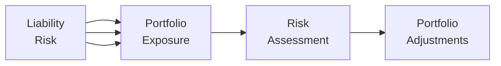

## Introduction
I remember the first time a client asked me about the looming impact of climate change on their portfolio. It sort of caught me off guard because, traditionally, portfolio discussions revolved around market risk, credit risk, interest rates, you name it—just not the weather or carbon emissions. But now, as the world becomes more aware of climate change and the potential financial consequences, climate risk has stepped onto the stage. And it’s not just about being green or socially conscious; it’s about real money, real valuations, and real long-term stability.

From a portfolio management standpoint, climate risk can show up in surprising ways. Some companies face operational setbacks from storm damage, while others might lose profitability if regulation suddenly requires them to pay hefty carbon taxes or transition to cleaner energy sources. The question becomes: how do we measure these risks and make sure our long-term portfolios are prepared for any storms—both figurative and literal—that lurk on the horizon?

In this section, we’ll explore the multifaceted nature of climate risk, examine carbon footprint measurement techniques, and dive into scenario analysis. We’ll also look at emerging tools like implied temperature rise metrics and climate value-at-risk (Climate VaR), and discuss how frameworks such as the TCFD (Task Force on Climate-related Financial Disclosures) help keep us informed. Let’s roll up our sleeves and get into the details.

## The Multifaceted Nature of Climate Risk

Well, climate risk is definitely not one-dimensional. In fact, many investment professionals break it down into three main categories—physical, transition, and liability risks—to keep an organized view of everything. Each comes at us from a slightly different angle, which is why a comprehensive measurement strategy should consider all of them.

### Physical Risk
Physical risk refers to the financial losses or operational disruptions caused by tangible climate-related events. Think hurricanes, floods, wildfires, heatwaves, and rising sea levels. Companies operating in coastal areas, for example, might see property damage from rising sea levels, while an agricultural portfolio might face reduced yields due to more frequent droughts. These events can lead to direct damage costs, increased insurance premiums, or supply chain disruptions.

### Transition Risk
Transition risk shows up when economies shift toward cleaner, low-carbon energy sources. The big question is: which companies will adapt—perhaps by investing in solar or wind power—and which will be stuck with outdated, emission-heavy equipment that’s too costly to refit? The possibility of new laws, carbon taxes, or regulations aimed at reducing greenhouse gas emissions can erode profit margins and make entire industries less attractive.

### Liability Risk
Liability risk arises when individuals, organizations, or governments seek compensation for damage attributed to climate change. We’ve already begun seeing lawsuits against energy producers or utilities for contributing to climate-related damages. Though it’s still evolving, this area can lead to unexpected financial penalties and legal expenses, especially for large emitters.

Below is a simple diagram illustrating how these three categories affect portfolio exposure:



In practice, an investor might try to forecast the intensity of storms, the direction of regulatory changes, or the likelihood of litigation. Although it’s impossible to predict perfectly, modeling and scenario analysis can help shape more resilient strategies.

## Measuring the Carbon Footprint of a Portfolio
One of the most straightforward ways to start integrating climate considerations into portfolio management is by measuring carbon footprints. Carbon footprint metrics aim to quantify greenhouse gas emissions—particularly CO₂—that companies within a portfolio emit.

Common carbon footprint metrics include:

• Weighted Average Carbon Intensity (WACI): This measures the portfolio’s exposure to carbon-intensive companies, calculated as the weighted average of each holding’s emissions intensity (e.g., CO₂ per unit of revenue).  
• Total Carbon Emissions: An absolute sum of carbon emissions financed by the portfolio.  
• Emissions per Million Invested: This answers how many tons of CO₂ are emitted per million dollars invested.

Here’s a quick Python snippet showing an example of computing a simple weighted average carbon intensity:

```python
import pandas as pd

data = {
    'Asset': ['Company A', 'Company B', 'Company C'],
    'CarbonIntensity': [200, 150, 300],  # e.g. CO2 per $ million revenue
    'Weight': [0.4, 0.3, 0.3]
}

df = pd.DataFrame(data)
weighted_carbon_intensity = (df['CarbonIntensity'] * df['Weight']).sum()
print("Weighted Average Carbon Intensity:", weighted_carbon_intensity)
```

We often start by establishing a baseline carbon footprint. Then we watch it over time to see if our portfolio is “cleaning up” or becoming more carbon-intensive. Many asset managers talk about setting decarbonization objectives—think of it like planning for your personal fitness goals, but instead, your “workouts” involve adjusting the portfolio to lean away from big polluters.

## Setting Decarbonization Objectives
Decarbonization objectives are targets to reduce the portfolio’s carbon intensity over time. Some managers aim for “net zero” by a certain year, meaning the overall reduction in emissions within the portfolio is aligned with science-based targets to reduce global warming. If you set a decarbonization objective, you might:

• Tilt away from companies with high emissions.  
• Invest more in renewables and clean tech.  
• Engage with companies to improve their energy efficiency and reduce carbon output.  

It’s not just about feeling good; it’s also about safeguarding the portfolio against abrupt transition risks. Some institutional investors even set interim milestones (e.g., 20% reduction in 5 years) to keep their decarbonization plan on track.

## Scenario Analysis: Testing Different Temperature Rise Assumptions
Now, you know how scenario analysis is used in standard risk-management exercises (see Chapter 6 on Introduction to Risk Management for more on stress testing). Climate scenario analysis follows a similar approach but focuses on how various warming pathways—1.5°C, 2°C, or 3°C increases above pre-industrial levels—could hit companies’ cash flows.

Instead of just saying “What if interest rates rise 1%?” we might ask, “What if global temperature rises by 3°C, spurring severe regulatory crackdowns and physical damages?” Each scenario is typically associated with:

• Emission-reduction trajectories or timelines for different industries.  
• Possible carbon pricing (e.g., $75 per ton of CO₂).  
• Physical risk intensities (like the frequency of hurricanes or droughts).  
• Technology shifts (e.g., rapid adoption of electric vehicles, phasing out of fossil fuels).

Here’s a little example table showing how different temperature-rise scenarios might be translated into financial impacts for a hypothetical portfolio:

| Scenario            | Temperature Rise | Regulatory Impact               | Physical Impact                       | Estimated Portfolio Impact (5-Year) |
|---------------------|------------------|---------------------------------|---------------------------------------|--------------------------------------|
| Low-Emissions Path  | 1.5°C           | Strict carbon taxes; high R&D    | Moderate storms                       | -0.5% annual return drag (mitigated) |
| Intermediate Path   | 2°C             | Gradual policy increments        | Increased regional floods & wildfires | -1% annual return drag               |
| High-Emissions Path | 3°C             | Sporadic taxes, delayed action   | Severe storms, higher sea levels      | -2% annual return drag or more       |

Nobody has a crystal ball to say which scenario is certain, so scenario analysis helps you figure out how robust—or vulnerable—your portfolio might be across several possible futures.

## Emerging Tools: Implied Temperature Rise, Climate VaR, and Stress Testing
A number of specialized tools and metrics have emerged to quantify climate risk more precisely:

• Implied temperature rise: This metric attempts to answer, “If every company’s carbon-removal trends matched those of this portfolio, how many degrees of warming would occur?” It’s a futuristic concept but gives an immediate sense of alignment with global climate targets.  
• Climate Value-at-Risk (Climate VaR): This forward-looking measure estimates how much value a portfolio stands to lose from climate change under specific probabilities. Think of it like the VaR from Chapter 6, but with climate-related factors baked in.  
• Climate stress testing: Similar to scenario analysis, but with an additional emphasis on systematically “stressing” certain parameters (e.g., faster-than-expected carbon tax introduction or a sudden policy shock) to see if the portfolio’s risk exposures become unmanageable.

These tools can be quite technical. They often combine scientific climate models with economic forecasting and company-level emissions data. Anyone who’s tried to implement a standard financial model knows data can be messy—just imagine adding temperature and policy uncertainty into the mix. But folks are developing more robust frameworks every day, often in collaboration with organizations like the Network for Greening the Financial System (NGFS).

## TCFD Disclosures and the Role of Transparency
Now, there’s a big push for companies to disclose their climate-related risks and strategies in a standardized way. That’s where the Task Force on Climate-related Financial Disclosures (TCFD) steps in. The TCFD framework guides companies and asset managers to provide:

• Governance of climate-related risks.  
• Actual and potential impacts of climate risks on the business.  
• How the company identifies, assesses, and manages these risks.  
• Metrics and targets used to measure performance.

Investors can then use TCFD disclosures to gauge how well a company is preparing for climate-related challenges. It isn’t just a matter of ethics. It influences our forward-looking estimates of cash flows, capital expenditures, and potential cost burdens from future regulation or weather extremes. Many regulators and exchanges worldwide are starting to encourage—if not mandate—TCFD-aligned reporting.

## Key Terms (Glossary)
Below are a few important terms that broadly define the climate risk discussion:

• Physical Risk: The possibility of severe weather events or climatic changes impacting operations, assets, and supply chains.  
• Transition Risk: Economic and financial risks associated with shifts toward a low-carbon economy.  
• Carbon Footprint: The total greenhouse gas emissions caused directly or indirectly by an entity or portfolio.  
• TCFD (Task Force on Climate-related Financial Disclosures): A framework for corporate climate risk disclosure.  
• Climate Value-at-Risk (Climate VaR): A forward-looking measure of potential financial losses from climate change.  
• Decarbonization Objectives: Targets to reduce a portfolio’s carbon intensity over time.  
• Scenario Analysis: Modeling technique that simulates asset returns under various macroeconomic or climate-related conditions.  
• Stranded Assets: Assets that suffer from unanticipated or premature write-downs because of climate change or policy shifts.

## Implementation and Best Practices
• Collect robust data: High-quality and consistent emissions data at the company level is crucial. Without reliable emissions info, metrics like WACI or implied temperature rise can be misleading.  
• Use multiple data sources: Sometimes, using a single data provider or carbon-intensity metric can limit your perspective. Combining providers or applying multiple metrics can give a more holistic view.  
• Engage with companies: Active ownership—like talking to management about their transition plan—can encourage better disclosure and help you measure risk more accurately.  
• Blend quantitative and qualitative insights: Don’t rely exclusively on climate models. Sometimes, anecdotal evidence (for instance, a client or company literally losing inventory to a flood) can provide an equally valuable forward-looking signal.

## Potential Pitfalls
• Overreliance on single metrics: No single number will capture the whole picture.  
• Data inconsistency: Industry classification or emissions calculation can differ widely.  
• Short-term focus: Climate risk typically plays out over longer horizons, but many portfolios are managed with short-term performance targets in mind.  
• Misalignment with client objectives: Some clients prioritize strict “green” portfolios; others are more flexible. Clarify expectations from the start.

## Conclusion and Final Exam Tips
Measuring climate risk in long-term portfolios is an evolving discipline. From physical risks of storms to transition risks of decarbonizing industries, today’s portfolio managers must address how climate will—and already does—affect returns and risk.

For the exam, remember that climate risk measurements are grounded in the familiar principles of risk management you’ve seen through the curriculum (see Chapters 2, 6, and 9). The big difference here is that we are layering in climate scenarios, regulatory assumptions, and more complex modeling. Be prepared to analyze hypothetical portfolio scenarios—for instance, “Company X sees a carbon tax double in 2 years under a 1.5°C scenario. How does that influence your stock valuation?”

Pitfalls to watch for in essay questions include:

• Ignoring the link between climate change and asset valuations.  
• Forgetting that scenario analysis for climate can differ from standard macro scenario analysis.  
• Overlooking TCFD or forgetting the potential significance of liability risks.

When tackling exam questions, try to articulate the multi-step logic: measure emissions → interpret scenario results → incorporate them into strategic asset allocation or security selection. Good luck!

## References and Further Reading
- TCFD. “Recommendations of the Task Force on Climate-related Financial Disclosures.”  
- MSCI. “Climate Risk: Measuring Real-World Heat in Portfolios.”  
- Network for Greening the Financial System (NGFS). “Climate Scenarios for Central Banks and Supervisors.”

## Test Your Knowledge: Climate Risk Measurement Quiz



### Which of the following best describes physical risk in the context of climate change?
- [ ] The risk that companies pay taxes on carbon emissions only.
- [ ] The risk that lawsuits are brought against energy-intensive firms for damages.
- [x] The risk that extreme weather events impact operations, assets, and supply chains.
- [ ] The risk that new technologies disrupt fossil-fuel-dependent industries.

> **Explanation:** Physical risk explicitly refers to the risk that extreme weather or environmental changes disrupt normal business operations.

### Which metric provides a forward-looking measure of the potential financial losses from climate change?
- [ ] Net Zero Emissions Ratio (NZER)
- [x] Climate Value-at-Risk (Climate VaR)
- [ ] Implied Global Warming Metric (IGWM)
- [ ] Weighted Average Carbon Intensity (WACI)

> **Explanation:** Climate VaR is specifically designed to measure how much value a portfolio could lose due to climate factors.

### When setting decarbonization objectives for a portfolio, which action is most likely included?
- [x] Gradually divesting from high-emission industries.
- [ ] Discontinuing any form of ESG analysis in equity research.
- [ ] Focusing only on a single climate scenario (1.5°C).
- [ ] Ignoring engagement with portfolio companies.

> **Explanation:** Decarbonization typically involves reducing exposure to carbon-intensive industries, among other actions, while also engaging with companies to help them transition.

### Under a climate scenario analysis, what does a 3°C warming scenario typically indicate compared with a 1.5°C scenario?
- [ ] Stricter carbon regulation and minimal physical damages.
- [ ] Lower transition risk but higher short-term returns for fossil fuels.
- [ ] Reduced frequency of extreme weather events.
- [x] More severe physical risks and impacts on returns.

> **Explanation:** Higher temperature scenarios (e.g., 3°C) are generally associated with more intense physical damages and higher risk of valuation downturns.

### Which of the following best describes the Task Force on Climate-related Financial Disclosures (TCFD)?
- [ ] A government body that polices emissions through fines.
- [x] A framework guiding companies in reporting climate-related financial risks.
- [ ] A technology-focused group that sets mandates for carbon-trading blockchain networks.
- [ ] An investment standard focusing solely on net present value calculations.

> **Explanation:** The TCFD provides a voluntary framework for companies and investors to consistently report exposure to climate-related risks and opportunities.

### In measuring a portfolio’s carbon footprint, the Weighted Average Carbon Intensity (WACI) metric is best described as:
- [x] A measure of each holding’s emissions intensity weighted by its position size in the portfolio.
- [ ] A measure of the absolute carbon emissions caused by the oil and gas sector only.
- [ ] A backward-looking metric covering solely historical data in prior decades.
- [ ] A method for calculating climate VaR using insurance premium data.

> **Explanation:** WACI looks at carbon emissions intensity at each portfolio holding, weighting by the holding’s share in the portfolio.

### Which statement best illustrates the concept of liability risk from climate change?
- [x] Companies facing lawsuits for damages caused by greenhouse gas emissions.
- [ ] The financial risk of carbon taxes increasing corporate expenses.
- [ ] The risk of coastal real estate flooding due to higher sea levels.
- [ ] The uncertainty in asset prices with rising global temperatures.

> **Explanation:** Liability risk arises when entities are taken to court for contributing to environmental harm.

### A portfolio manager wants to stress-test the impact of a sudden carbon tax in a climate model. This approach focuses on:
- [ ] Liability risk only.
- [x] Transition risk under an extreme policy scenario.
- [ ] Physical risk under moderate temperature assumptions.
- [ ] Reducing overall portfolio exposure to intangible assets.

> **Explanation:** A sudden carbon tax is a transition-related shock, and stress testing it helps reveal potential vulnerabilities in the portfolio.

### How would an implied temperature rise metric typically be interpreted?
- [x] It estimates the global temperature increase if all entities behaved like the portfolio in terms of emissions pathways.
- [ ] It measures the probability of class action lawsuits against fossil-fuel companies.
- [ ] It indicates a portfolio manager’s personal view on climate change.
- [ ] It projects actual temperature changes for a specific region with monthly updates.

> **Explanation:** Implied temperature rise attempts to approximate global warming if everyone matched the portfolio’s carbon emission trends.

### Climate scenario analysis in portfolio management is essentially:
- [x] True
- [ ] False

> **Explanation:** True. It is a process that evaluates how various changes in regulations, physical climate factors, and market behaviors could affect portfolio returns.


