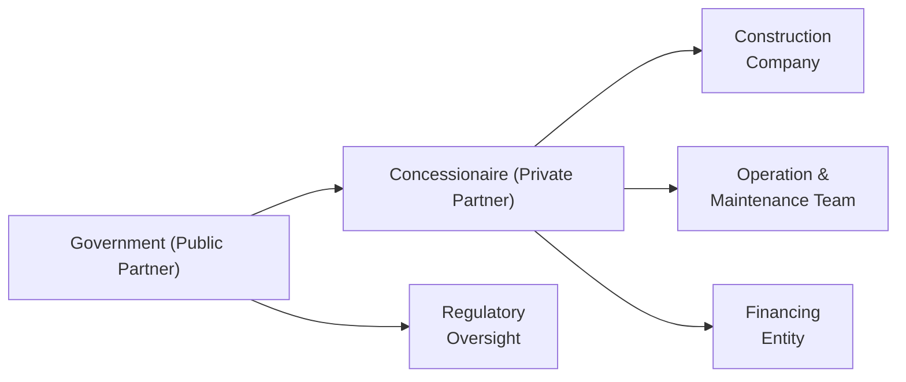
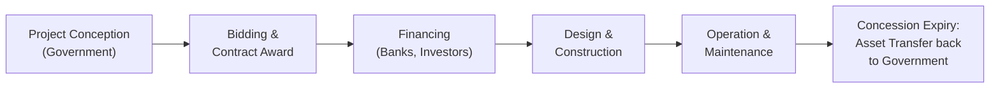

## Introduction and Context

Public-Private Partnerships (PPPs) are a fascinating way for governments and private-sector entities to team up and tackle projects that might otherwise prove too large, expensive, or complex for a single player to manage. Think of large-scale infrastructure—the kind that demands hundreds of millions or even billions of dollars to set up—like highways, mass transit systems, hospitals, and educational facilities. The idea is straightforward but powerful: invite private capital, expertise, and innovation into traditionally public domains, with both sides sharing responsibilities, risks, and rewards. 

I still recall the first time I realized what this actually meant in practice. I was sitting in traffic on a new toll road in my hometown. The sign read, “Operated by XYZ Concessionaire.” I found it mind-boggling that a private company was involved in building government infrastructure. Over time, I learned that the private sector—in exchange for financing, constructing, or operating a segment of public infrastructure—gets compensated through tolls, user fees, or a government availability payment. The experience is not just about riding on a new road; it highlights a shift in how governments address large infrastructure challenges, sometimes harnessing the efficiency and specialization of private partners to get things done faster (and hopefully better).

In this section, we explore how PPPs operate, how they distribute risk, the expectations and obligations built into these contracts, and how the concept of environmental, social, and governance (ESG) integration is becoming essential to many of these arrangements. Finally, we’ll look at some real experiences—both successes and stumbles—to reveal lessons about structuring these partnerships in a way that benefits all stakeholders.

## Key Ideas Behind Public-Private Partnerships

Public-Private Partnerships (PPPs) are formal contractual agreements in which a governmental body (federal, state, or local) teams with a private firm to finance, build, operate, or maintain a public project. These arrangements often involve:

• A Concession Agreement granting the private party (often called the Concessionaire) carefully defined rights—like running a toll road or a power plant—for a specific duration.  
• A Revenue Model describing how expenses will be recouped: via direct user fees (e.g., tolls) or through government-backed payments (availability payments).  
• Risk Transfer aligning specific project risks—such as construction delays, performance shortfalls, or demand fluctuations—to whoever can handle them best.  
• Contractual Oversight to ensure each party performs as promised: the government sets quality standards, while the private side ensures those standards are met.  

These partnerships help spread out the up-front capital requirements among multiple stakeholders, potentially lowering the burden on taxpayers. In many cases, PPPs support “Social Infrastructure” too—like the building of schools, universities, and hospitals—where the investment payoff may be partially intangible but critical to a thriving society.

## Navigating Various PPP Structures

Not all PPPs follow the same template. In practice, each partnership is uniquely shaped by local regulations, project size, and the specialized skill sets of the parties involved. Below are a few models commonly seen in the PPP universe:

• Build-Operate-Transfer (BOT). The private entity constructs and operates the asset for a set term. Ownership transfers back to the government at the end of the concession’s life.  
• Design-Build-Finance-Maintain (DBFM). The private sector not only handles design and construction but finances the project, then maintains it for an agreed period, often receiving availability-based payments from the government.  
• Build-Own-Operate (BOO). The private party owns the infrastructure and is responsible for operating it indefinitely, though the government will regulate or oversee services delivered to the public.  

In each arrangement, it’s expected that the private partner excels at cost savings, advanced engineering, or better project management to create value. Meanwhile, the public sector typically exercises core regulatory and oversight duties, ensuring that standards around safety, functionality, and affordability are maintained.

## Risk-Sharing Mechanisms and Practical Implications

One especially tricky aspect of PPPs is risk allocation. And for these partnerships to thrive, the question usually is: who is responsible for what risk?  

• Construction Risk. Issues such as cost overruns, delayed timelines, or defects. Typically, the private side is better at managing these because they can control construction scheduling, procurement, and on-site processes.  
• Demand or Revenue Risk. What if fewer cars than expected use a toll road? Or fewer patients than projected come to a privately operated clinic? Often, it’s the private concessionaire that shoulders this risk if the contract is structured on a user-pay model. On the other hand, if it’s an availability payment structure, the government might shoulder demand risk.  
• Operational Risk. Maintenance and day-to-day performance—like ensuring smooth traffic flow and timely repairs. Usually, the concessionaire handles operational risk, though in certain PPP models the government partially retains it.  

A widely cited principle in PPPs is that risk should lie with whoever can control it best. If every risk is dumped on the private side, the cost of financing may skyrocket, as investors build risk premiums into their returns. That, ironically, can make the project financially unfeasible. On the other hand, if the government holds too much risk, it betrays the primary purpose of having a private partner in the first place.

Below is a simplified flowchart illustrating a PPP arrangement with assigned responsibilities:

In this diagram:  
• The Government (A) grants the Concessionaire (B) the right to build and operate the infrastructure.  
• The Concessionaire coordinates with construction (C) and operation/maintenance (D) teams.  
• Regulatory oversight (E) ensures adherence to public standards.  
• Financing (F) is arranged or guaranteed by the private partner, though the nature and terms can vary.

## The Role of Performance-Based Incentives

In a successful PPP, both sides are motivated by a well-defined set of incentives. In many contracts, the government ties the concessionaire’s compensation to specific performance measures—call them “service levels” or “KPIs.” If the private side meets or exceeds these standards, they may receive bonus payments or be allowed to keep a larger slice of revenue. Fall short, and they risk penalties. 

It’s similar to so many real-life scenarios: if you want your kids to clean their rooms regularly, you might set up a weekly reward system. Of course, PPPs are far more sophisticated than chore charts, but the principle stands. These performance-based setups can encourage the private side to maintain high quality across the project’s entire life cycle.

## Revenue Models: Tolls, User Fees, and Beyond

Once upon a time, it might have seemed odd to pay a toll to drive on a road that was partially owned by a private company. But in many places now, motorists have grown used to electronic tolling. The revenue model is one of the most critical components of any PPP. Common variants include:

• User-Pay Model: The private partner charges tolls or fees directly to project users. This is standard in highways, bridges, or tunnels.  
• Availability Payment Model: Governments pay the private partner a regular fee, contingent on making the infrastructure “available” in good working order (e.g., a hospital with maintained facilities).  
• Mixed Revenue Model: Some PPPs blend both user fees and government-backed payments, working as a hybrid solution for projects with partial cost recovery from users and partial from the taxpayer budget.  

Matching the right revenue model to the project helps ensure fair risk sharing and a feasible return on investment (ROI). If the highway is in a low-traffic zone, a pure user-pay approach could be too risky for the private side, so the government might shift part of the demand risk onto itself to ensure the project is even built.

## ESG Integration in PPP Projects

As environmental, social, and governance (ESG) factors have become top-of-mind for major investors (see Chapter 7.3 on “ESG Integration and Sustainable Investing Trends”), PPPs increasingly incorporate sustainability targets into their design:

• Environmental: Minimizing the carbon footprint of a new airport terminal or adopting renewable energy solutions in public spaces.  
• Social: Ensuring that local communities benefit—like guaranteeing job creation or building schools and recreational facilities around new infrastructure.  
• Governance: Strengthening transparency and accountability measures with open bidding processes, active stakeholder engagement, and robust disclosure of project performance.  

One example might be a city route expansion that not only focuses on traffic capacity but also includes green corridors, electric tramlines, and an advanced waste management system. If structured well, these improvements can help the city’s broader transition to a cleaner and more sustainable environment, while still generating stable, risk-adjusted returns for investors.

## Real-World Example: Highway Expansion Program

Consider a multi-lane highway expansion project. The government is tight on funds but needs to alleviate congestion. It decides to request proposals from private consortia, which includes construction companies, operators, and financiers. The winning bidder draws up a concession agreement for 30 years, invests the capital to widen the highway and install advanced traffic monitoring systems, and recoups costs via toll collections.

In addition, the consortium must meet specific targets: lane availability, minimal potholes, quick incident response, and a set maximum traffic downtime due to maintenance. If these targets are met, the toll setting authority might allow incremental toll rate adjustments or offer partial subsidies.

### Lessons Learned
• Align risk with the appropriate parties: the private sector was best equipped to handle construction, technology, and maintenance complexities.  
• Set clear performance standards: the government enforced measures that improved safety and user satisfaction.  
• Offering a stable revenue stream: the toll mechanism plus an optional “availability payment” approach helped reduce revenue risk for the private entity.

## Potential Pitfalls: Oversight and Accountability 

While PPPs can be a win-win, there are some big “gotchas” if oversight is neglected or accountability is unclear:

• Political Risk. Changes in political leadership could lead to contract renegotiations, repricing, or even abrupt cancellations.  
• Hidden Liabilities. Governments might use PPPs to move large capital expenditures off the balance sheet, but the long-term obligations remain. This can create future budgetary stress if the project fails to generate sufficient revenue.  
• Social Opposition. Unpopular user fees—for instance, a toll on a previously free public road—may incite public pushback and damage the sponsor’s reputation.  
• Asymmetric Information. If private partners have more technical expertise than government officials, poor drafting can produce contract loopholes that the private side exploits, potentially harming public interests.  

Where oversight is lax or nonexistent, the private side might underspend on long-term maintenance or prioritize short-term gains over environmental or social considerations. Therefore, it’s crucial that governments structure transparent processes and embed robust checks and balances to deter unethical or suboptimal behavior.

## Portfolio Management Perspectives

Large institutional investors—pension funds, sovereign wealth funds, insurance companies—view PPPs as a category within Infrastructure Investing. The stable cash flows from user fees or publicly backed availability payments can be quite attractive, especially for matching long-dated liabilities in a pension or insurance portfolio.  

Nevertheless, from a portfolio management perspective, approach PPP opportunities with a clear due diligence framework in mind:

1. Legal and Regulatory Clarity. Evaluate the concession contract details and laws that govern them, ensuring a stable environment.  
2. Political and Macro Environment. Assess projected economic growth, user demand, and public appetite for the project.  
3. Partner Reputation. Investigate the track record of the private partners—construction companies, facility operators, and even lenders.  
4. ESG Considerations. If the partnership aims to integrate environmental or social objectives, review the specific metrics for compliance and performance.  
5. Liquidity and Exit. PPPs can be illiquid investments. Understand the secondary markets for such assets, in case an exit is needed (sometimes by selling a stake in the concession vehicle to another investor).

Balancing these factors can help portfolio managers identify the right PPP opportunities that fit their long-term strategy. 

## Looking to the Future

Public-private collaborations are evolving rapidly. Some governments are exploring innovative structures, like partial privatizations or new forms of blended finance, which combine philanthropic capital with commercial investment to reduce perceived risks. With ESG concerns at the forefront, next-generation PPPs may incorporate transformative social objectives, such as integrated healthcare networks or climate-resilient infrastructure.

Technology is also opening new pathways. Imagine a “smart city” PPP with integrated data platforms that manage water distribution, traffic flows, and energy consumption in real time, financed by a consortium of tech companies, infrastructure operators, and global investors. The key question for the future is how to ensure these advanced capabilities remain equitable, accessible, and beneficial for the broader public.

## Best Practices and Common Pitfalls

Below is a quick summary of best practices and watch-outs:

• Best Practices:
  - Conduct thorough feasibility studies, ensuring the project is financially and socially viable.  
  - Draft clear, balanced contracts, distributing risks properly.  
  - Employ robust project governance with frequent performance audits.  
  - Integrate ESG considerations early to mitigate negative externalities.  

• Common Pitfalls:
  - Overly optimistic demand projections, causing revenue shortfalls.  
  - Political meddling that undermines private investment confidence.  
  - Complex, poorly structured contracts that fail to address unexpected operational challenges.  
  - Insufficient stakeholder engagement, leading to public distrust and resistance.

## Diagram: Typical PPP Concession Lifecycle

To visualize how a project typically unfolds:

At each phase, responsibilities and risks shift between public and private partners. For instance, the private side leads financing, design, and construction, while the government monitors compliance and ensures public interests are protected.

## Exam Tips for CFA Candidates

• Relate PPP concepts to your broader knowledge of risk management and Asset Allocation (see Chapter 6 and Chapter 14). Highlight that PPP investments often function as part of a larger alternative or real-asset allocation strategy.  
• Understand key legal and contractual terms—like concession agreement, risk transfer, or availability payments—since they may appear in scenario-based questions.  
• Be ready to analyze a sample PPP project, break down the revenue model, and identify potential pitfalls or conflicts of interest.  
• Bring ESG thinking into the discussion. For instance, a CFA exam essay question might ask how to incorporate sustainability metrics into a toll road PPP.  

Wrapping up, PPPs highlight a modern approach to bridging the gap between public needs and private capital. They present unique advantages—like operational efficiencies and diversified funding—while requiring careful contracting and oversight. By understanding how to structure, evaluate, and manage these partnerships, financial professionals can spot the opportunities and the red flags that come with major infrastructure plays.

## References and Further Reading

• The World Bank. “Public-Private Partnerships Legal Resource Center.”  
• OECD. “Infrastructure Financing Instruments and Incentives.”  
• EPEC (European PPP Expertise Centre). “PPP Motivations and Challenges.”  

----------------------

## Test Your Knowledge: Partnerships Between Public and Private Entities



### Which of the following best describes a Public-Private Partnership (PPP)?

- [ ] A one-time contract for short-term advisory services.  
- [ ] An equity joint venture between two household corporations.  
- [x] A long-term contractual arrangement between a government and private sector to finance, build, and operate public projects.  
- [ ] A publicly traded entity that issues bonds for infrastructure.  

> **Explanation:** PPPs are long-term partnerships where both parties share responsibilities and risks to deliver public infrastructure or public services.

### In a toll-road PPP with user-pay revenue, which party typically bears demand risk?

- [x] The private concessionaire.  
- [ ] The government.  
- [ ] The construction contractor.  
- [ ] The central bank.  

> **Explanation:** In a user-pay model, the concessionaire relies on traffic volume for toll revenue, thus assuming demand risk if usage is lower than expected.

### What is a key advantage of performance-based incentives in PPP contracts?

- [x] Encouraging the private partner to maintain high standards throughout the project.  
- [ ] Eliminating all government oversight requirements.  
- [ ] Ensuring tolls are always higher than normal.  
- [ ] Reducing transparency requirements for private partners.  

> **Explanation:** Tying payments to service level targets motivates the private party to deliver quality and efficiency.

### Which of the following could be a major potential pitfall in a PPP project?

- [ ] Strong government oversight.  
- [x] Unclear contract terms leading to disputes over responsibilities.  
- [ ] Alignment of risk and reward.  
- [ ] Balanced revenue sharing.  

> **Explanation:** If contract terms are murky regarding roles, responsibilities, or profit allocations, disputes and inefficiencies often arise.

### In an availability payment model, how does the private partner receive compensation?

- [x] From periodic government payments based on project availability and performance.  
- [ ] Entirely from direct user fees.  
- [ ] From local municipal bonds issued to individual citizens.  
- [ ] By selling its stake shortly after construction.  

> **Explanation:** Under an availability payment model, the public entity compensates the private partner at regular intervals if the service meets predefined standards.

### Which of the following is often included in the government’s role in a PPP?

- [ ] Taking full responsibility for construction risk.  
- [x] Establishing legal and regulatory frameworks and performing oversight.  
- [ ] Offering unconditional guarantees of profit to the private side.  
- [ ] Eliminating reporting obligations for the private partner.  

> **Explanation:** The government usually provides the enabling environment and ensures that the concessionaire meets agreed-upon standards.

### When discussing ESG integration in PPPs, what is one common environmental goal?

- [x] Reducing the carbon footprint of the infrastructure.  
- [ ] Eliminating all performance incentives.  
- [ ] Transferring 100% of the demand risk to the private sector.  
- [ ] Securing indefinite private ownership rights.  

> **Explanation:** ESG integration often involves sustainable practices, like minimizing emissions or waste and promoting environmental stewardship.

### If a PPP project’s projected revenue relies entirely on user fees, what is the main risk faced by the concessionaire?

- [x] Variability in traffic or user demand.  
- [ ] Inability to find a construction contractor.  
- [ ] The government refusing to sign a contract.  
- [ ] Having to meet performance targets.  

> **Explanation:** If revenue is generated from direct users, any shortfall in actual usage creates financial risk for the concessionaire.

### What is a key reason that large institutional investors might be attracted to PPP investments?

- [ ] Easy liquidity and short-term returns.  
- [x] Stable, long-term cash flows that can match long-dated liabilities like pensions.  
- [ ] Complete immunity from political risk.  
- [ ] Guaranteed double-digit returns regardless of demand.  

> **Explanation:** Institutional investors see PPPs as a way to diversify and acquire extended, relatively predictable revenue streams, aligning well with their long-term obligations.

### True or False: In PPP contracts, risk is typically allocated to the party best able to manage that risk.

- [x] True  
- [ ] False  

> **Explanation:** A core principle of PPP contracts is to place distinct risks with whichever party (public or private) can handle them most effectively and cost-efficiently.


