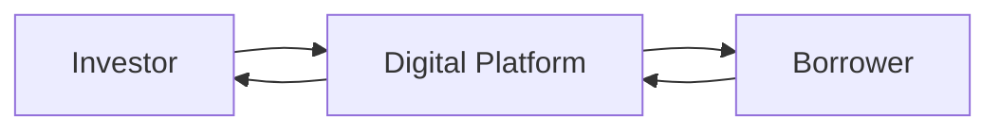

## Introduction and Key Concepts

Banking disintermediation refers to the process by which traditional banks, once the primary gatekeepers of loans and deposits, are bypassed by borrowers and lenders who connect directly—often via digital platforms. Think of it like your local farmer’s market, but instead of farm-fresh veggies, we’re talking about loans, investments, and credit. It’s a big shift from the conventional scenario where banks accept deposits, pay you interest on your savings, and then lend that money out to businesses or individuals at higher rates.

Cue the rapid digital transformation that has propelled new platforms—peer-to-peer (P2P) lending, crowdfunding, marketplace lending, and more—into mainstream finance. I remember the first time I heard of someone receiving a personal loan through a website (not from a bank). It sounded so futuristic and risky at first. But hey, that’s now a legitimate piece of the modern credit landscape, fueled by lower overhead costs, technological prowess, and a desire from both borrowers and investors to find alternatives.

For quick reference:

- Banking Disintermediation: Parties bypass traditional banks to deal with each other directly.  
- Peer-to-Peer (P2P) Lending: Online platforms linking individual borrowers and lenders.  
- Crowdfunding: Raising small amounts of money from a large pool of investors for a project or venture.  
- Marketplace Lending: A digital marketplace connecting borrowers with institutional or retail investors.  
- Fintech: The broad ecosystem of technology-driven financial services (payments, lending, robo-advice, etc.).  
- Micro-Loans: Small, short-term loans often provided to those with limited credit history.  
- Systemic Risk: Potential for an entire financial system or market to collapse.  
- Super App: A multi-functional mobile app offering a host of financial and non-financial services.

Below, we’ll explore how technology rapidly transforms the lending world, how this might expand investor opportunities, and the hidden pitfalls we should watch out for—especially in the context of risk management, regulatory oversight, and systemic stability.

## The Evolution of P2P Lending, Crowdfunding, and Marketplace Lending

### A Break from Traditional Intermediation

Traditionally, if you needed a loan, you walked into a bank (or maybe a credit union) and applied. The bank analyzed your credit profile, set the interest rate, and—if approved—issued the funds. Today, though, you might submit a request on a digital platform. An algorithm churns out a risk assessment in seconds. Then, multiple investors—ranging from your neighbor to a global asset manager—could bid to fund your loan. This direct match between borrowers and lenders cuts out certain layers of banking infrastructure.

### Growth Drivers

1. Technological Efficiency: Automated underwriting, machine learning, and data analytics reduce operating costs, enabling attractive interest rates for both borrowers and lenders.  
2. Access to Underserved Markets: P2P lending and crowdfunding can cater to small businesses or demographics that lack conventional credit histories.  
3. Investor Appetite for Yield: The persistent quest for higher returns in a low-interest-rate environment (particularly relevant in the years following the 2008 crisis) often pushes investors toward alternative credit.  

### Platforms and Structures

Most P2P or marketplace lending platforms have a similar operating structure:

• Platforms assess borrower credit risk (sometimes collaborating with external scoring services).  
• Approved borrowers list their loan requests.  
• Investors purchase notes or fractional interests in these loans, receiving principal and interest when borrowers repay.  
• The platform earns fees (origination fees from borrowers and/or servicing fees from investors).

In more centralized marketplace lending, one large institution (often a hedge fund or asset manager) can commit significant funding, while the platform simply facilitates the transaction.

Below is a Mermaid diagram illustrating a simple structure for a P2P lending flow:

In this diagram, the Digital Platform acts as a conduit, matching the Investor’s funds and the Borrower’s capital needs. Repayments flow back to the Investor through the platform.

## Technology Firms Encroaching on Traditional Banking

### Payment Platforms and Beyond

Technology giants have taken the notion of mobile wallets, e-commerce, and digital payments several steps further. Instead of just enabling payments, many have begun offering micro-loans, insurance, and short-term credit lines. A “super app” might combine social networking, ride-sharing, e-commerce, and financial services—all in one location. This comprehensive approach can lock in a robust user base and generate a goldmine of data on consumer habits, creditworthiness, and financial behavior.

### Big Tech: Risks and Rewards

On the one hand, big tech’s entry into finance can foster inclusion. People in remote areas who don’t have easy access to a bank can secure micro-loans from their smartphones. On the other hand, the concentration of data and power in a few large platforms raises concerns about privacy, competition, and systemic risk. If one platform becomes too big to fail, the entire financial sector might be threatened by an operational or cybersecurity meltdown on that single app.

## Emergent Systemic Risks and Regulatory Oversight

### Non-Bank Financial Institutions

Non-bank financial institutions—fintech firms, monoline lenders, insurance companies, and so on—complement or compete with banks in certain market niches but historically have faced less regulatory scrutiny. When disintermediation is no longer a small piece of the lending market but a hefty chunk, entire economic cycles begin to hinge on these institutions’ stability.

Imagine a scenario in which a cluster of large marketplace lending platforms finances a vast swath of small business loans. A sudden economic downturn unfolds—borrowers default in droves, the platforms face liquidity crises, and there’s no central bank safety net. If these platforms go under, smaller businesses can’t refinance their debts, employees lose jobs, and the overall economy suffers.

### Regulatory Lag

Often, regulations struggle to keep pace with the speed of digital innovation. Platforms may operate outside or on the fringes of banking regulation. Lack of consistent consumer protections and different underwriting standards can pose serious consumer and systemic risks. Policy discussions increasingly revolve around how to bring these emerging channels under a more unified regulatory framework without suffocating innovation.

## Potential Benefits for Investors

### Higher Yields and Portfolio Diversification

Many alternative lending products promise enticing yields that might be uncorrelated with more traditional asset classes. For instance, a marketplace loan to a niche small business might generate higher returns, partly because it’s riskier or less liquid. If you’re an investor looking to diversify beyond stocks and bonds, these loans can serve as a slice of your portfolio to capture incremental yield. This phenomenon aligns with the broader alternative investment strategies discussed in Chapter 13, where real estate, hedge funds, and private equity also provide diversification potential.

### Direct Ownership and Transparency

Unlike a conventional bank deposit, investors in P2P or marketplace lending can see more granular data (credit scores, business plans, borrower backgrounds). That direct line of sight might offer more control—though it also places greater responsibility on the investor to assess the risks thoroughly. If you’re comfortable with credit analysis and risk-based pricing, these platforms might feel refreshingly transparent.

### Flexibility in Allocation

With digital platforms, you can often pick and choose the loans you lend to, targeting different debtor profiles or industries. That can be quite empowering for those who want a “build-your-own-credit-portfolio” approach. It’s reminiscent of how equity investors might target specific sectors or factor exposures (e.g., “value,” “growth”) as described in Chapter 12.

## Risks and Challenges

### Credit Risk

Without a bank’s internal risk management processes, the burden often shifts to investors or platform-based underwriting models. If a platform’s underwriting model is flawed or if economic conditions deteriorate rapidly, default rates can spike.

A simplified measure of expected credit loss (ECL) is:


\text{ECL} = \text{PD} \times \text{LGD} \times \text{EAD}


where:  
• PD is Probability of Default,  
• LGD is Loss Given Default,  
• EAD is Exposure At Default.

These variables can shift unexpectedly, especially for unsecured lending. It’s great if you’re earning 9% in a stable economy, but if the default rates exceed expectations, you might suffer steep losses.

### Liquidity Concerns

Unlike a bank deposit (which is typically considered highly liquid, or at least secured by deposit insurance up to certain limits), marketplace lending positions can be illiquid. Secondary trading exists for some digital loans, but often at discounts or limited volumes. This is a major risk factor if you suddenly need to exit your position.

### Operational and Platform Risk

If the platform faces solvency issues or becomes entangled in regulatory investigations, your investments might be stuck in limbo. Additionally, cybersecurity threats and data breaches present escalating hazards for digital financial transactions. Humans often underestimate operational risk—until something big happens.

### Systemic Risk

As these channels expand in scale, a crisis in marketplace lending could catalyze broader financial instability. The ramifications might be akin to a mini-bank-run scenario: confidence in the platforms plunges, investors pull back funding, and borrowers can’t refinance due loans.

## Practical Examples and Case Studies

• Crowdfunding for Startups: We’ve all heard of small businesses or budding entrepreneurs raising initial seed money via crowdfunding platforms. What seems like a grassroots approach can swiftly turn into multi-million-dollar campaigns. When done responsibly, it’s a fantastic way to launch new products. But a wave of product failures could lead to outsized losses for unsuspecting investors.

• Peer-to-Peer Consumer Lending: Picture an online marketplace that directly matches transplanted college students (borrowers seeking credit) with investors looking for moderate, steady returns. The platform uses a proprietary credit scoring method. If those scores are inaccurate, the entire portfolio might be riskier than advertised.

• Institutional Marketplace Lending: Large asset managers increasingly collaborate with fintech platforms to allocate capital to mid-sized companies. The deals often resemble syndicated loans, but with fewer intermediaries. This arrangement can be more efficient but also shifts underwriting responsibility to platform algorithms.

## Best Practices and Mitigating Strategies

• Due Diligence: Just as with any investment, thoroughly analyze platform track records, default rates, and transparency.  
• Diversification: Avoid concentration in a single loan, borrower profile, or platform. Spread your capital across many small stakes to reduce idiosyncratic risk.  
• Monitor Performance: These instruments aren’t purely “set and forget.” Check repayment patterns, delinquency trends, and platform-level developments periodically.  
• Keep an Eye on Regulation: Stay informed on regulatory updates. Eventually, formal frameworks may require changes to how these platforms operate and how investor protections are enforced.  
• Stress Testing: Conduct scenario analyses (see Chapter 6 on Introduction to Risk Management) to estimate how your portfolio would fare in an economic downturn.

## Future Outlook

It might feel like we’re living in a sci-fi future with these all-in-one super apps, but the truth is that digital transformation in finance is accelerating even faster than expected. Banking disintermediation is likely to remain front and center. If history is any guide, some innovations will prove to be groundbreaking, while others—perhaps launched with too much hype—will fade. Understanding the evolving landscape, the risk-return trade-off, and the regulatory underpinnings will be crucial for any portfolio manager.

## Final Exam Tips

• Watch for scenario-based questions where you must evaluate the pros and cons of investing in P2P or marketplace lending.  
• Show depth by explaining how you’d incorporate these assets into a broader portfolio. For example, mention correlation benefits, but also highlight volatility and default risk.  
• When answering constructed-response questions, articulate how to manage liquidity and credit risk. Provide an approach that demonstrates mastery of risk budgeting (Chapter 4) and enterprise risk management concepts (Chapter 6).  
• Link your discussion to broader themes: how big tech’s move into finance ties back to systemic risk and governance (Chapter 1.10 and Chapter 7.7).  

## References and Further Reading

- Bank for International Settlements (BIS). “Fintech and Market Structure in Financial Services.”  
- McKinsey. “Global Banking Annual Review.”  
- Accenture. “The Rise of Digital Lending Platforms.”  

## Test Your Mastery: Banking Disintermediation & Digital Transformation



### In digital lending, "banking disintermediation" primarily refers to:
- [ ] The increasing dependence on traditional bank deposits for loans.
- [x] The reduced reliance on traditional banks by connecting borrowers and lenders directly.
- [ ] Introducing bank branches in remote locations.
- [ ] The takeover of smaller banks by larger banks.

> **Explanation:** Banking disintermediation occurs when borrowers and lenders transact directly, bypassing the necessity for traditional banks.

### Which of the following is a potential advantage of investing in P2P lending platforms?
- [ ] Guaranteed liquidity and capital protection.
- [x] Potentially higher yields compared to traditional bank deposits.
- [ ] Free government-backed insurance up to $250,000.
- [ ] Complete immunity to default risk.

> **Explanation:** P2P lending platforms can offer investors higher returns. They do not guarantee liquidity or immunity to default risk.

### A mobile application that combines social networking, food delivery, ride-sharing, and financial transactions is commonly referred to as:
- [ ] A micro-lending app.
- [ ] A marketplace lender.
- [ ] An ETF aggregator.
- [x] A super app.

> **Explanation:** “Super apps” are platforms that bundle multiple services, often including financial components such as payments or lending.

### In marketplace lending, which party is primarily responsible for underwriting the borrower?
- [ ] The government regulator.
- [ ] The individual investor always determines risk grades.
- [x] The lending platform, often via data-driven credit models.
- [ ] The borrower’s employer.

> **Explanation:** Marketplace lending platforms usually underwrite borrowers using proprietary algorithms, credit data, and potentially external scoring providers.

### Which of the following best explains a significant concern regarding systemic risk and digital lending?
- [ ] High levels of deposit insurance coverage in digital platforms.
- [ ] Inability of digital platforms to scale consumer loans.
- [x] The possibility that large-scale defaults or platform failures could destabilize multiple economic sectors.
- [ ] Minimal growth of lending due to poor internet access.

> **Explanation:** If a significant share of lending is done through non-bank platforms—especially large ones—a high default rate or platform collapse can spill over and create systemic disruptions.

### Which factor primarily motivates investors to consider P2P or marketplace lending in their portfolios?
- [ ] Unlimited regulatory protection from loss.
- [ ] The ability to resell all loans at face value on demand.
- [x] Potential diversification and higher yields than traditional savings accounts.
- [ ] Guaranteed credit enhancements from government agencies.

> **Explanation:** Investors often look to marketplace lending for higher yields and diversification benefits—though these investments come with substantial risks.

### Which statement accurately depicts credit risk in P2P lending?
- [ ] All loans are automatically guaranteed by the platform.
- [x] Investors face potential default if the borrower fails to make payments.
- [ ] Low interest rates always indicate higher credit quality.
- [ ] Government agencies reimburse all investor losses.

> **Explanation:** Loans in P2P lending are typically unsecured; investors bear the underlying credit risk of borrower default.

### An investor wants to quickly liquidate a marketplace loan position. Which of the following is true?
- [x] Secondary markets for these loans can be illiquid, possibly requiring a discount sale price.
- [ ] They can redeem the loan at face value with no penalty.
- [ ] There’s no restriction on liquidity; loans are as liquid as checking accounts.
- [ ] Regulatory authorities will buy back the loans immediately.

> **Explanation:** Marketplace loans generally aren’t guaranteed liquid instruments, and secondary buyers might require discounts.

### In evaluating the impact of disintermediation, a key regulatory challenge is:
- [ ] Ensuring micro-loans are only disbursed to established corporations.
- [x] Keeping pace with emerging platforms that operate outside traditional banking oversight.
- [ ] Limiting the usage of technology in lending decisions.
- [ ] Mandating that fintechs and banks adopt identical technologies.

> **Explanation:** Regulatory authorities often face a lag in addressing the risks posed by rapidly innovating fintech platforms that operate with fewer regulations than established banks.

### Fintech's potential to offer broad-based financial inclusion can be hindered by:
- [x] Inadequate internet infrastructure and digital literacy in certain regions.
- [ ] Excessive presence of traditional banks in rural areas.
- [ ] Falling smartphone adoption rates globally.
- [ ] Loan rates that are fixed and universal.

> **Explanation:** While fintech can drive financial inclusion, it relies heavily on robust internet access and user familiarity with digital tools, which can be limited in certain areas.


